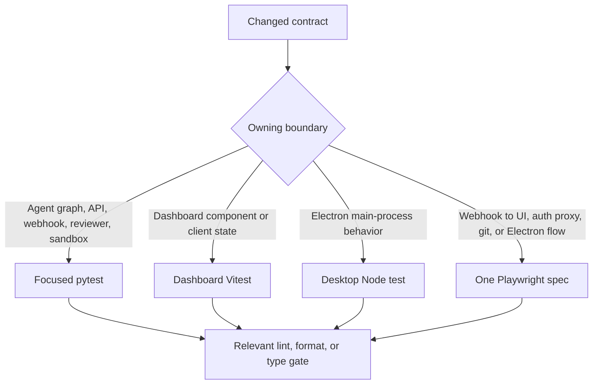
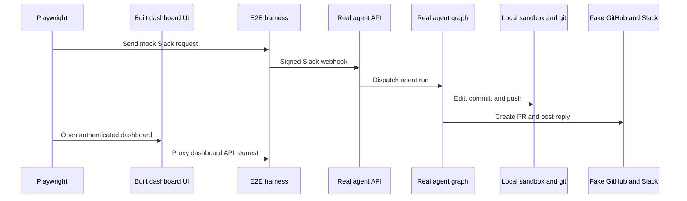

# Testing and focused validation

**Do not run the full test suite locally.** Select the narrowest quiet validation that proves the changed behavior, then preserve complete failure output. A Python implementation change normally needs one focused pytest file or test; a browser-visible cross-service change may additionally need one Playwright spec. The fact that plain `pytest` and `make test` can collect `tests/` is a collection behavior, not a recommendation for local iteration.

## Choose validation by the changed boundary



This routing identifies the lowest layer that directly owns an observable contract. A change that crosses a boundary needs both: retain the focused contract test and add the narrow E2E proof that would detect a wiring, proxy, session, or integration failure.

| Changed boundary | Start with | Add cross-boundary coverage when |
| --- | --- | --- |
| Agent composition, prompts as rendered behavior, tools, middleware, dispatch, or graph configuration | A matching test under `tests/agent/` | The change must travel through a webhook, dashboard, or local desktop flow. |
| Sandbox provider, recovery, proxy, filesystem, or reconnect state | `tests/sandbox/` | The behavior includes a real local sandbox/git execution path. |
| Dashboard route authorization, thread API, OAuth/session, environment, or PR data | `tests/dashboard/` | SSR, the built UI proxy, or browser session behavior is at risk. |
| Review lifecycle, findings, publishing, watch/reconciliation, or review API | `tests/reviewer/` | A GitHub-facing result must be demonstrated end to end. |
| Completion, Slack, GitHub, or Linear delivery semantics | `tests/webhooks/`, `tests/slack/`, or `tests/github/` | A signed delivery and user-visible result must be exercised together. |
| React component, client query/state, or browser-only rendering behavior | The relevant `ui/` Vitest test | It depends on Nitro SSR, the dashboard API proxy, or a real signed session. |
| Desktop main-process code | `desktop/test/*.test.cjs` | IPC, the local-agent graph, filesystem edit, or PR outcome changes. |

## Python tests: contracts and isolation

Pytest collects from `tests/` and asyncio auto mode awaits async tests and fixtures without a per-test asyncio marker. Test areas are organized by production responsibility, including agent, dashboard, reviewer, sandbox, webhooks, Slack, GitHub, middleware, models, tools, auth, and analyzer behavior. `tests/e2e/` contains the separate Playwright harness despite living below `tests/`.

Shared fixtures make isolated unit and integration-style tests behave like the production boundary where it matters:

- `fake_store` redirects `agent.store` to an in-memory store but keeps the production serialization round trip. Seed it rather than bypassing store behavior when persisted state matters.
- An autouse TTL-cache reset surrounds every test, preventing cached team settings from leaking into another case.
- An autouse auto-review stub makes repositories enabled because no live Store supplies the dashboard opt-in list. A test of the opt-in gate must replace that stub with its own stricter behavior.

### High-value focused suites

**Agent graph assembly.** `tests/agent/test_agent_assembly_context.py` is the targeted guard for construction and authorization decisions. It verifies that the agent receives an initialized sandbox-backed composite backend—necessary for deepagents context eviction and summarization—and protects source-dependent skills, middleware, and parent-only tool boundaries. Use it for backend wiring, source context, tool availability, or middleware-stack changes instead of attempting to infer assembly correctness from a full agent run.

**Sandbox lifecycle.** `tests/sandbox/test_sandbox_state.py` protects the lazy backend proxy at its difficult edges: it stays `BaseSandbox`-compatible for capture offload, delegates an offload-capable backend or safely falls back, coalesces reconnects, survives cancellation of one waiter, retries a failed startup, and can recover an ID from live thread metadata. Provider/recovery changes should begin with the closest sandbox test, not an E2E flow.

**Dashboard server contracts.** Use the thread API tests for command validation, visibility, status/activity, authorization, terminal/recovery, and lifecycle changes. Keep CSRF tests focused on cookie-authenticated mutation defenses: configured deployments accept only allowed origins or referers (including the desktop origin), reject malformed and bypass origins, and reject non-JSON command payloads; reads do not take the mutation-origin path. Activity tests separately establish that completed runs refresh/mark a thread viewed while running threads do not.

**Reviewer and completion failure behavior.** Reviewer tests cover review-specific creation, analysis, publication, reconciliation, and tools independently of a normal coding run. For example, reconciliation cancels only stale pending runs and continues sweeping after one thread fails. Completion-webhook tests preserve distinct failure outcomes: an errored Slack run posts its failure reply, while an errored reviewer run settles its tracked GitHub check with a neutral result unless a pending result must be retained.

## Commands and local quality gates

Install Python development dependencies once:

```bash
make install
```

`make install` runs `uv sync --extra dev`. The dev extra supplies pytest, pytest-asyncio, Ruff, `ty`, and Pygments.

Run a **specific** Python test file or node while iterating:

```bash
make test TEST_FILE=tests/dashboard/test_dashboard_thread_api.py
uv run pytest -vvv tests/dashboard/test_dashboard_thread_api.py::test_name
make test TEST_FILE=tests/sandbox/test_sandbox_state.py
make lint
make typecheck
```

`make test` and `make tests` execute `uv run pytest -vvv $(TEST_FILE)` when the target exists; `TEST_FILE` defaults to `tests/`, and a missing target prints a skip message instead of failing. Use that default only in automation or an intentionally broad environment, not as the local default. `make lint` runs Ruff checking plus a format diff, `make format` applies Ruff formatting and fixes, and `make typecheck` runs `ty check agent tests`.

For JavaScript and desktop unit coverage:

```bash
pnpm install --frozen-lockfile
pnpm --filter open-swe-dashboard run test
pnpm --dir desktop run test
pnpm test
```

The dashboard command is `vitest run`. Its test configuration keeps Node as the default environment, allows per-file jsdom docblocks, supplies a non-opaque jsdom URL, and retains the TanStack Start plugin so client-side server-function calls resolve through fetch rather than the server variant. Desktop builds its main bundle before `node --test test/*.test.cjs`; root `pnpm test` delegates workspace test tasks to Turbo.

## Playwright: real paths with controlled seams

Use browser E2E only for a user-visible path that crosses boundaries. Install Chromium before the first run, then run the one relevant spec against the locally reusable server where possible:

```bash
pnpm run test:e2e:install
pnpm run test:e2e
pnpm run test:e2e:desktop
pnpm exec playwright test tests/full_flow.spec.ts
```



The diagram shows the browser harness topology: production webhook, graph, sandbox, git, dashboard, and proxy paths run while LLM and external SaaS seams are controlled.

The harness mounts fake GitHub/Slack HTTP endpoints, mock UIs, and control endpoints on the real agent app; it signs simulated Slack Events API requests before delivering them to the real webhook route. The fake stores are what mock UIs render, while a seeded local bare repository provides real clone/push behavior. The scripted `BaseChatModel`, SaaS endpoints, external credentials, and snapshot service are substituted; agent code, tools, middleware, prompts, local sandbox, webhook processing, and git remain real. Thus the full-flow test can prove that a Slack request produces a local implementation, branch/PR, and reply in the same thread.

Browser configuration is intentionally serial: one worker, no desktop spec, a 90-second test timeout, and one retry only in CI. Desktop selects `desktop.spec.ts`, uses a 180-second test timeout and 120-second expectation timeout, and writes separate outputs. Browser specs cover more than the happy path, including dashboard continuation, plan approval, environments, Slack dedupe/queueing, SSR, thread tools, transcript/workspace behavior, and PR views. Choose the spec named for the changed interaction rather than invoking all of them.

### Dashboard proxy and authenticated UI

Global setup builds the real `ui/` application if needed, with an empty client API base so browser `/dashboard/api/*` requests stay same-origin and must pass through the Nitro proxy; `DASHBOARD_API_URL` and `E2E_HARNESS` point server-side work at the harness. It starts the built server on `E2E_UI_PORT` (default `3100`) and waits for `/login`. Playwright drives that UI origin, not the harness origin, specifically so a broken deployed-style proxy cannot be hidden. The harness-issued signed `osw_session` exercises SSR, session redirects, hydration, and authorization. Set `E2E_FORCE_UI_BUILD=1` after a UI or port change; otherwise the existing build is reused.

The Electron spec has its own real local-agent proof: it resets harness state, clones the seeded local remote into a temporary project, injects a harness-issued session cookie, verifies the local file edit and fake-GitHub PR fields, and cleans up unless `E2E_KEEP_TMP` is set.

## Diagnostics

Browser failures retain screenshots and retain trace/video on failure locally or on the first retry in CI. Set `E2E_ARTIFACTS=1` to record trace and video for every attempt. Outputs are under `test-results/` and `playwright-report/`; inspect those before increasing a timeout or weakening an assertion.

```bash
pnpm exec playwright show-report
pnpm exec playwright show-trace test-results/<test>/trace.zip
SLOW_MO=700 pnpm exec playwright test --headed
```

Desktop disables automatic Playwright artifacts because its spec explicitly records an Electron trace and attaches screenshots of the unified and completed local-agent views.

## Related pages

- [Agent graph](/openwiki/architecture/agent-graph.md)
- [Sandbox lifecycle](/openwiki/architecture/sandbox-lifecycle.md)
- [Dashboard UI](/openwiki/integrations/dashboard-ui.md)
- [Quickstart](/openwiki/quickstart.md)
- [PR review](/openwiki/workflows/pr-review.md)
