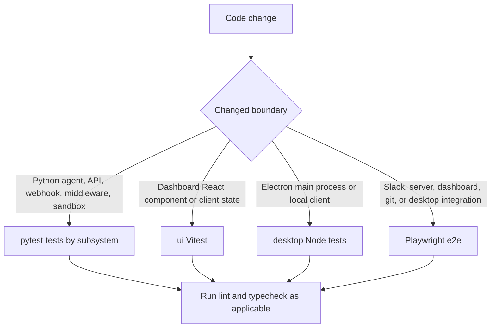
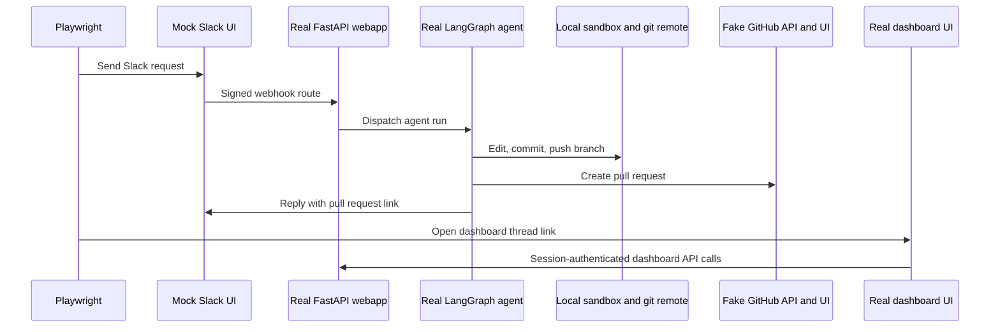

# Testing Guide

Open SWE has four complementary validation layers:

- **Python pytest** tests in `tests/` are the default behavioral suite for the agent, dashboard API, webhooks, middleware, sandbox lifecycle, reviewer, and tools.
- **Dashboard UI unit tests** live beside the React code in `ui/` and run with Vitest.
- **Desktop unit tests** exercise Electron main-process and supporting code with Node's test runner.
- **Playwright e2e** runs a real LangGraph development server, real agent and dashboard/desktop code, and a local sandbox/git remote while replacing remote services and the model with deterministic boundaries.

Use the narrowest layer that proves the change, then add cross-boundary e2e coverage when a user-visible integration must remain intact. Python tests and e2e are not substitutes: the former isolate contracts cheaply; the latter proves wiring, server rendering, browser/Electron behavior, and the webhook-to-agent path.

## Test routing



This routes a change to its fastest meaningful test layer; e2e is reserved for behavior that crosses a real runtime boundary.

### Python subsystem map

`tests/` is collected as the Python suite. Select a directory by the production owner rather than by a symptom:

| Change area | Focused pytest location |
|---|---|
| Agent factory, dispatch, input attribution, plan/review, schedules, baby-sit, skills, usage | `tests/agent/` |
| Dashboard OAuth/auth, repository/profile/team settings, thread API, terminal and environments | `tests/dashboard/` and `tests/auth/` |
| GitHub PR creation, webhook/comment/CI handling, prompts and repository normalization | `tests/github/` |
| Model fallback/selection and provider request behavior | `tests/models/` |
| Agent middleware, including queued messages, dynamic tools, timeouts, fallback, sanitization, and ordering | `tests/middleware/` |
| Reviewer graph, findings, publishing, reconciliation, watches, review chat and auto-review | `tests/reviewer/` |
| Sandbox state, recovery/recreation/reset, provider integration, gateway/proxy auth, and git identity | `tests/sandbox/` |
| Slack APIs, context, events, interactivity, code channels and thread replies | `tests/slack/` |
| Curated tool behavior, including HTTP safety, threads, schedules, sandbox URLs, MCP and observability | `tests/tools/` |
| Completion and Linear webhook behavior | `tests/webhooks/` |
| Cross-cutting title, tool-output, and response-replay behavior | top-level `tests/test_*.py` files |

The `tests/e2e/` subtree is a separate TypeScript/Python Playwright harness, not part of pytest collection.

## Python test environment and shared invariants

Pytest collects from `tests/` and runs in asyncio auto mode. Write async tests and fixtures directly; they do not need a per-test asyncio marker. Install the development toolchain with `make install`, which provisions pytest, pytest-asyncio, ruff, basedpyright, and Pygments through the `dev` extra.

`tests/conftest.py` establishes isolation that test authors should preserve:

- `fake_store` redirects `agent.store` access to an in-memory `FakeStore`, but deliberately uses the real store serialization/deserialization path. Seed it when a test needs persisted state instead of bypassing application storage behavior.
- Autouse cache cleanup clears the process-wide TTL cache both before and after every test, preventing cached team settings from contaminating another case.
- Autouse auto-review enablement makes the no-live-store default usable. A test of the opt-in gate must replace that stub with the intended restrictive behavior.

### Dashboard thread API: high-value contract coverage

`tests/dashboard/test_dashboard_thread_api.py` is a concentrated unit-contract suite for the dashboard's thread proxy. It exercises behavior that should not be left solely to browser tests:

- image input rejects text-only models while allowing vision-capable models; request model choices override profile choices, which override team defaults, and deprecated model IDs migrate;
- a new `run.start` creates/stamps dashboard thread metadata, normalizes repository and sender configuration, creates a run-preparation ID, and removes dashboard-only creation hints before the agent receives configuration;
- thread summaries expose PR/diff/sandbox/resolution state while hiding the in-progress sandbox sentinel and protecting source URLs according to repository privacy;
- Slack-to-web continuation inserts an explicit handoff message, preserves sender attribution, updates the Slack trace reply, and records run/TTFT state;
- the proxy rejects malformed bodies and threads not surfaced to the dashboard; organization members can read surfaced threads, while admin-thread writes require a configured admin.

When changing dashboard thread behavior, pair the targeted API test with a UI unit test for client state/rendering, and use e2e for session, SSR, or actual dashboard-to-server wiring.

## Commands and local gates

### Python

```bash
make install
make test
make test TEST_FILE=tests/dashboard/test_dashboard_thread_api.py
uv run pytest -vvv tests/dashboard/test_dashboard_thread_api.py::test_name
make lint
make typecheck
```

`make test` and `make tests` execute `uv run pytest -vvv $(TEST_FILE)`, with `TEST_FILE` defaulting to `tests/`. The make target checks that the requested path exists first; a missing path prints a skip message rather than failing. `make lint` runs Ruff checking plus a formatting diff, `make format` fixes formatting and lint findings in place, and `make typecheck` runs basedpyright on `agent` and `tests`.

`make integration_tests` is safe to invoke but only runs `tests/integration_tests/` when that path exists; in the current checkout it prints a skip message. Do not describe ordinary `tests/` coverage as a distinct integration suite.

### Dashboard and desktop unit suites

```bash
pnpm install --frozen-lockfile
pnpm --filter open-swe-dashboard run test
pnpm --dir desktop run test
pnpm test
```

The dashboard package's `test` script is `vitest run`. The desktop package builds its Electron main bundle and then runs `node --test test/*.test.cjs`; its `check` script combines desktop type checking, those tests, and a dashboard build. At the workspace root, `pnpm test` delegates to Turbo's `test` task, which runs package test scripts in the workspace. Use the package-specific command while iterating to avoid unrelated work.

### Prompt tests

A prompt test must establish a behavioral contract—rendering, composition, precedence, or what reaches the model—not merely restate static prompt text. The GitHub comment prompt tests demonstrate the preferred shape by binding a capturing model and inspecting the model input.

## Browser and Electron end-to-end harness

Run Playwright from the repository root:

```bash
pnpm install --frozen-lockfile
pnpm run test:e2e:install
pnpm run test:e2e
pnpm run test:e2e:desktop
```

The installation command downloads Chromium with `playwright install --with-deps chromium` and is needed before the first browser run. `test:e2e` runs the Chromium configuration; `test:e2e:desktop` switches to the Electron-only configuration. Browser execution is intentionally serial (`workers: 1`) against a single real `langgraph dev` server, with a 90-second test timeout; the desktop configuration raises those limits to 180 and 120 seconds for test and expectation timeouts.



The browser harness drives the real Slack webhook, agent graph, deepagents loop, tools, middleware, prompt, local sandbox, git push, and PR/reply tools. It uses a throwaway local-sandbox root and a local bare git repository. The scripted fake model supplies deterministic tool calls; monkeypatches redirect GitHub and Slack APIs, token minting/identity lookup, OAuth credential storage, and snapshot service calls to local fakes. The in-memory Slack and PR stores back the mock UIs, so Playwright observes the actual output of the real agent code.

The dashboard is also real: global setup builds `ui/` with API bases aimed at the harness, starts its Nitro server, and the harness proxies page requests to it. Thus e2e covers server rendering, login/session redirect/hydration, and same-origin `/dashboard/api/*` calls using a genuine signed session cookie. Rebuild the dashboard for e2e with `E2E_FORCE_UI_BUILD=1`, such as after UI or port changes.

The desktop e2e test launches the real Electron app in development mode with isolated home/config state and a cloned local project. It injects the harness session cookie, verifies cloud/local thread source switching, submits a local-agent request, and verifies both the local working-tree change and the fake-GitHub PR. Its graph/model and fake GitHub state are shared with the harness, so it covers Electron, IPC/local execution, and the desktop-to-agent boundary rather than a mocked desktop client.

## E2E scope and diagnostics

The e2e spec set is broader than the basic happy path: it includes dashboard/web handoff and workspace views, SSR, dispatched-run events, environment operations, plan review, output iframe behavior, ownerless threads, sandbox IDs, thread tools, and Slack code-channel, debounce, deduplication, untagged-reply, move-thread, and usage-footer cases. Add a focused e2e spec only when a change crosses those real boundaries; keep deterministic behavior in fakes rather than replacing the component under test.

Browser runs capture trace and video locally and take screenshots on failure. In CI, trace/video are captured on the first retry to reduce first-pass cost. Reports and artifacts are written under `test-results/` and `playwright-report/`; inspect them with:

```bash
pnpm exec playwright show-report
pnpm exec playwright show-trace test-results/<test>/trace.zip
```

The desktop configuration disables Playwright's automatic trace/video/screenshot settings, but `desktop.spec.ts` explicitly records an Electron trace and attaches screenshots for its key views. Keep `E2E_KEEP_TMP=1` only when retaining the otherwise-cleaned temporary desktop state is useful for diagnosis. For interactive browser debugging, use `SLOW_MO=700 pnpm exec playwright test --headed`.

## Change-oriented validation checklist

1. Run the focused Python, Vitest, or desktop test that owns the changed contract.
2. Run Python lint/type checks for Python changes; use package type/check scripts for frontend or desktop changes as appropriate.
3. Extend dashboard thread API tests for authorization, metadata, request normalization, or proxy semantics; do not hide those contracts only in e2e.
4. Add/extend Playwright coverage when the change depends on real webhook dispatch, session/SSR behavior, local git/sandbox behavior, a mock SaaS boundary, or Electron integration.
5. On e2e failure, inspect the trace/report before widening timeouts or weakening assertions.

## Related pages

- [Agent graph](/openwiki/architecture/agent-graph.md)
- [Middleware stack](/openwiki/architecture/middleware-stack.md)
- [Sandbox lifecycle](/openwiki/architecture/sandbox-lifecycle.md)
- [Dashboard UI](/openwiki/integrations/dashboard-ui.md)
- [Invocation workflow](/openwiki/workflows/invocation.md)
- [PR review workflow](/openwiki/workflows/pr-review.md)
- [Scheduling and baby-sit](/openwiki/workflows/scheduling-and-baby-sit.md)
