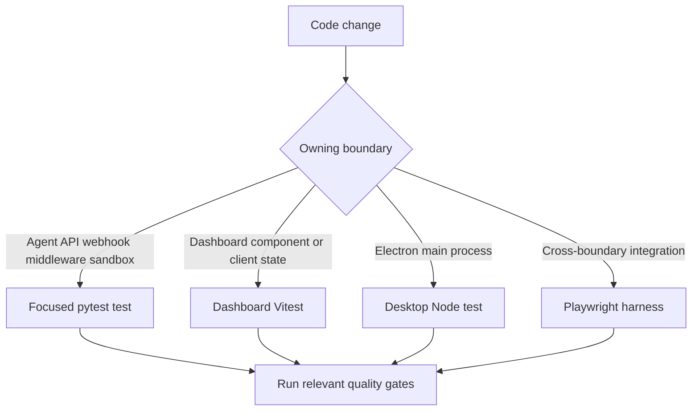

# Testing Guide

Choose the lowest-cost layer that owns the changed contract. Put agent assembly, API, webhook, middleware, and sandbox behavior in focused Python tests; dashboard component or client state in Vitest; and Electron main-process behavior in desktop Node tests. Use Playwright when the contract crosses real webhook, authenticated dashboard, local git/sandbox, or Electron boundaries—not as a substitute for focused coverage.

## Test routing



This routes a change to the layer that directly owns its observable behavior; one change can need a focused contract test and an e2e proof when it crosses a boundary.

## Python contracts and isolation

Pytest collects from `tests/` and uses asyncio auto mode, so async tests and fixtures need no per-test asyncio marker. The suite is organized by production owner, with agent, dashboard, sandbox, Slack, webhook, middleware, tool, reviewer, and GitHub areas under `tests/`. `tests/e2e/` is Playwright infrastructure even though it is below that directory.

Keep common isolation fixtures unless the test deliberately replaces their boundary:

- `fake_store` routes `agent.store` through an in-memory `FakeStore`, preserving the production `model_dump`/`model_validate` round trip. Seed it when stored state matters.
- The autouse TTL-cache reset prevents cached team settings from leaking between cases.
- The autouse auto-review stub treats every repository as enabled because the no-live-store environment otherwise has an empty opt-in list. Override it when testing the opt-in gate.

### Focused contracts worth preserving

**Agent assembly.** `tests/agent/test_agent_assembly_context.py` guards graph construction rather than an agent run: the main agent must receive an initialized sandbox-backed composite backend, which enables deepagents' context eviction and summarization behavior. It also covers concurrent sandbox startup while settings load, source-sensitive skills and Slack tools, parent-only thread/settings tools, middleware ordering, and the read-only stop-summary mode. Change these wiring decisions with their assembly tests, not a broad e2e test.

**Dashboard thread API.** Treat `tests/dashboard/test_dashboard_thread_api.py` and `test_dashboard_thread_api_activity.py` as the server-side contract inventory:

| Contract | What focused tests protect |
| --- | --- |
| Input and run preparation | Image capability validation; request, profile, and team model precedence; trusted configurable values; dashboard metadata; sender attribution; and Slack-to-web handoff/trace updates. |
| List and read visibility | Only surfaced sources are discoverable/readable; authenticated teammates can read surfaced threads, and finished runs refresh status and are marked viewed while running threads are not. |
| Posting and cancellation authority | Non-admins cannot write admin or automation threads; admins retain those writes; non-owner messages retain their sender identity; activity that cannot be determined fails rather than sending. |
| Pins and project discovery | A readable thread can be pinned by a non-owner, unreadable or missing threads cannot, and pinned listings retain only readable summaries. |
| Terminal, diff, and recovery access | Terminal access requires an existing sandbox; the creating sentinel is hidden/unusable. Recovery patches require a sandbox and reject empty or over-limit output; working/branch diffs retain repository and safe-branch constraints. |
| Thread lifecycle | Only `run.start` can lazily create a missing thread; resolve/unresolve is persisted, and a new run clears resolution. |

Keep route-validation tests separate from authentication defenses. `tests/dashboard/test_dashboard_csrf.py` verifies that configured cookie-authenticated mutations require an allowed `Origin` or `Referer` (including the desktop origin), reject malformed, null, missing, and prefix-bypass origins, and reject non-JSON command bodies. Reads are exempt from the mutation origin check. This is a security boundary, not UI validation.

**Sandbox state.** `tests/sandbox/test_sandbox_state.py` protects the lazy sandbox proxy. It must remain `BaseSandbox`-compatible for capture offload, delegate to an offload-capable backend or safely execute normally, coalesce concurrent reconnects, survive cancellation of a waiter, retry failed startup, and recover a sandbox ID from live thread metadata.

## Commands and quality gates

```bash
make install
make test
make test TEST_FILE=tests/dashboard/test_dashboard_thread_api.py
uv run pytest -vvv tests/dashboard/test_dashboard_thread_api.py::test_name
make lint
make typecheck
```

`make install` runs `uv sync --extra dev`. `make test` (also `make tests`) runs `uv run pytest -vvv $(TEST_FILE)` with `TEST_FILE` defaulting to `tests/`; a missing target prints a skip message rather than failing. Linting, formatting, and typing are separate checks: `make lint` runs Ruff checking plus a format diff, `make format` fixes both, and `make typecheck` runs basedpyright over `agent` and `tests`.

For workspace packages:

```bash
pnpm install --frozen-lockfile
pnpm --filter open-swe-dashboard run test
pnpm --dir desktop run test
pnpm test
```

The dashboard command is `vitest run`. Desktop builds its main bundle and then runs `node --test test/*.test.cjs`; root `pnpm test` delegates workspace test tasks to Turbo.

## Playwright cross-boundary harness

```bash
pnpm install --frozen-lockfile
pnpm run test:e2e:install
pnpm run test:e2e
pnpm run test:e2e:desktop
```

Install Chromium before the first run. Browser Playwright uses one worker, excludes `desktop.spec.ts`, has a 90-second test timeout, and starts real `langgraph dev` with `tests/e2e/langgraph.e2e.json`. The desktop configuration selects only `desktop.spec.ts`, raises the test timeout to 180 seconds and the expectation timeout to 120 seconds, and writes separate results and reports.


The harness keeps the production paths real while controlling its external seams.

### Real paths, controlled seams

The harness overlays the real agent API with fake GitHub and Slack HTTP endpoints, mock UIs, and control endpoints, and signs simulated Slack Events API deliveries before posting them to the real webhook route. The fake stores are the shared source of truth rendered by the mock UIs. Git is real: runs use seeded local bare remotes, and PR file lists are calculated from pushed branches.

Only the LLM and external SaaS or credential boundaries are replaced. `fake_llm.py` is a scripted `BaseChatModel`; real agent graph, prompts, middleware, tools, local sandbox, webhook, and git paths run unchanged. The core scenario therefore proves that a Slack mention creates an implementation in a temporary local sandbox, pushes a branch, opens a PR, and replies with its link in the same Slack thread. Browser coverage additionally exercises Slack-to-web continuation, plan approval, environment authorization and propagation, Slack redelivery and busy-thread queueing, raw SSR authentication, PR health presentation, and thread-tool changes reflected in the dashboard.

### Real dashboard and Electron flows

The dashboard is not mocked. Global setup builds `ui/` with `VITE_DASHBOARD_API_BASE_URL` and `DASHBOARD_API_URL` directed to the harness, starts its Nitro server on `E2E_UI_PORT` (default `3100`), and waits for `/login`. The harness proxies page requests to that server. A signed `osw_session` issued by `/control/login` therefore exercises server rendering, session gating and redirects, hydration, and same-origin `/dashboard/api/*` calls. Set `E2E_FORCE_UI_BUILD=1` after UI or port changes; otherwise setup reuses the existing build.

The Electron scenario resets shared harness state, clones the seeded local bare remote into an isolated temporary project, injects a harness-issued `osw_session` cookie, and runs a local-agent request. It verifies both the project edit and the fake-GitHub PR title, branches, draft flag, and changed file. It also records its own Electron trace and screenshots, then removes temporary desktop state unless `E2E_KEEP_TMP` is set.

## Diagnostics and operations

Browser traces and videos are retained on failure locally and on the first retry in CI; screenshots are failure-only. Set `E2E_ARTIFACTS=1` to capture trace and video for every attempt. Artifacts are under `test-results/<test>/` and `playwright-report/`. The desktop configuration disables automatic Playwright artifacts because its spec explicitly records an Electron trace and attaches screenshots of the unified and completed local-agent views.

```bash
pnpm exec playwright show-report
pnpm exec playwright show-trace test-results/<test>/trace.zip
SLOW_MO=700 pnpm exec playwright test --headed
pnpm exec playwright test tests/full_flow.spec.ts
```

Prefer a warm server and a single relevant spec while iterating. Inspect the trace, screenshot, and fake-boundary state before raising timeouts or weakening an assertion.

## Related pages

- [Agent graph](/openwiki/architecture/agent-graph.md)
- [Authentication and security](/openwiki/concepts/auth-and-security.md)
- [Dashboard UI](/openwiki/integrations/dashboard-ui.md)
- [Deployment](/openwiki/operations/deployment.md)
- [Quickstart](/openwiki/quickstart.md)
- [PR creation](/openwiki/workflows/pr-creation.md)
