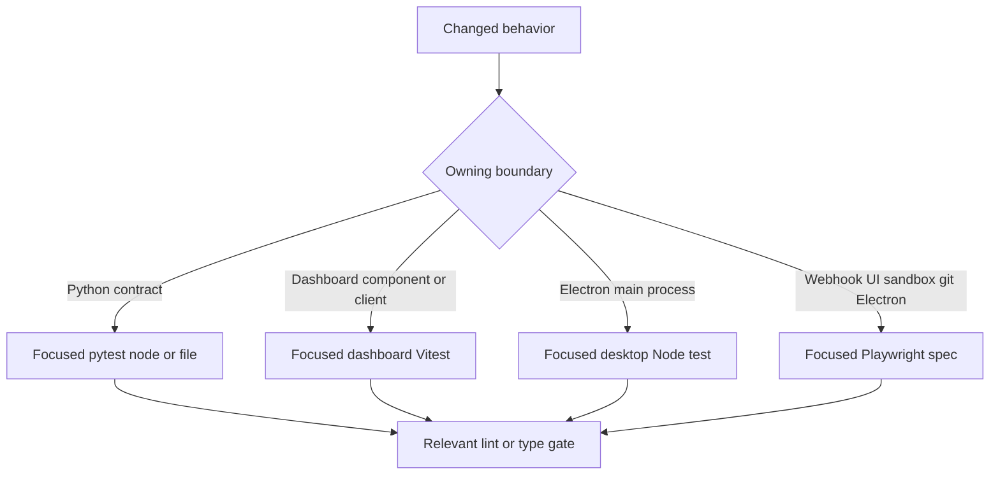
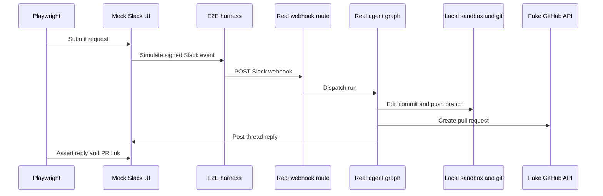

# Testing Strategy and Harnesses

Run the narrowest test that owns the observable change—never the full suite locally. Python tests protect agent, reviewer, sandbox, webhook, persistence, and API contracts with controlled dependencies. Dashboard and desktop workspace tests cover their own code. Playwright is reserved for contracts that cross the real webhook, authenticated UI, local sandbox/git, or Electron boundary.



This is a test-selection map: E2E complements focused tests; it is not a replacement for them.

## Focused Python tests

Pytest collects `tests/` and runs in asyncio auto mode, so async test functions and fixtures need no individual asyncio marker. Test directories follow system ownership. In particular, use `tests/agent/` for graph assembly, `tests/reviewer/` for review state, `tests/sandbox/` for sandbox behavior, and `tests/webhooks/` for terminal delivery behavior.

Tests should protect observable behavior rather than static prompt text, constant mappings, or incidental internal call order. The agent assembly tests are a representative wiring boundary: they capture the arguments to `create_deep_agent` and assert the initialized sandbox-backed `CompositeBackend` that enables deepagents context eviction and summarization. They also cover source and visibility-sensitive skills/tools, model-routing middleware, and the distinction between parent and subagent tools. Use that family when changing agent construction, middleware, skills, backend selection, or source authorization.

### Shared fixtures and database boundary

`tests/conftest.py` makes ordinary tests deterministic without starting production services:

- `fake_store` redirects `agent.store` through an in-memory SDK-shaped store, but retains production `model_dump`/`model_validate` round trips. Seed it only when stored data belongs to the behavior under test.
- `DASHBOARD_STATIC_DIR` is autouse-set to a missing temporary path, preventing a developer's `ui/.output` from affecting Python results. TTL and sandbox registries are reset before and after each test so cached settings or a live sandbox handle cannot bleed into another test.
- The default auto-review fixture enables every repository because the dashboard opt-in list is empty without a live Store. A test of the opt-in gate must replace that stub with its intended policy.
- `registry_db` is the explicit persistence boundary. If `TEST_ANALYTICS_POSTGRES_URI` is configured, it creates a unique schema, migrates it through the real PostgreSQL engine/session code, then drops it. Without that environment variable it skips database regressions; `registry_db_if_available` instead lets a test cover both configured and degraded behavior.

### Representative regression families

| Change area | Focused regression contract |
| --- | --- |
| Agent assembly | `tests/agent/test_agent_assembly_context.py` guards initialized sandbox backends, deepagents eviction/summarization support, read-only skill routes, source-specific tools, and middleware boundaries. |
| Reviewer findings and outcomes | `tests/reviewer/test_reviewer_findings.py` exercises finding schema, filtering, migration/backfill, and PostgreSQL persistence/idempotency. `test_reviewer_outcomes.py` maps resolved/dismissed states and GitHub/Slack feedback to outcomes, and makes unavailable credentials or repo context a no-op. |
| Sandbox state | `tests/sandbox/test_sandbox_state.py` requires the proxy to remain `BaseSandbox`-compatible for capture offload, delegate or safely fall back, share reconnect work among concurrent callers, survive waiter cancellation, retry failed startup, and recover an ID from live thread metadata. |
| Completion webhook | `tests/webhooks/test_completion_webhook.py` protects terminal error handling: Slack-context failures get a deduplicated thread reply and run record; reviewer failures settle a tracked check only with complete metadata and token; cleanup failure must not suppress the Slack reply. |

## Local commands and independent gates

Install Python development dependencies with `make install`, which runs `uv sync --extra dev`. The development extra includes pytest, pytest-asyncio, Ruff, and ty. `make test`/`make tests` runs `uv run pytest -vvv $(TEST_FILE)` only if `TEST_FILE` is an existing file or directory; otherwise it prints a skip message. Since a `file.py::test_name` node ID is not a path, invoke pytest directly for a single test.

```bash
make install
make test TEST_FILE=tests/sandbox/test_sandbox_state.py
uv run pytest -vvv tests/sandbox/test_sandbox_state.py::test_sandbox_proxy_retries_failed_startup
make lint
make typecheck
```

Lint, formatting, and typing are separate checks: `make lint` runs Ruff checking and a format diff, `make format` applies both formatter and fixes, and `make typecheck` runs `ty check agent tests`.

For TypeScript changes, do not default to root `pnpm test`: it delegates workspace test tasks to Turbo. Target the owning workspace instead.

```bash
pnpm --filter open-swe-dashboard run test
pnpm --dir desktop run test
```

The dashboard workspace uses `vitest run`. The desktop workspace builds its main bundle and runs `node --test test/*.test.cjs`.

## Playwright E2E: real path, controlled seams

The E2E harness runs the real agent with `langgraph dev`, real webhook routes, deepagents/tools/middleware, a real local sandbox, and real git against a seeded local bare remote. It fakes the scripted LLM and external SaaS HTTP/credential seams: GitHub and Slack APIs, app-token/installation lookup, OAuth-token storage, and the snapshot service. The fake GitHub and Slack stores are the source rendered by mock UIs, so Playwright assertions see the effects written by real agent code.



The browser happy path crosses the real delivery, graph, sandbox, and git paths while the harness controls unavailable external services.

`harness.py` overlays the real `agent.webapp` app with fake API endpoints, mock UIs, and test control endpoints. It signs simulated Slack Events API deliveries before posting to the real `/webhooks/slack` route; control routes similarly deliver signed GitHub webhooks to the real GitHub route. Resetting harness state also resets fakes and durable PR state that would otherwise collide with restarted in-memory PR numbering.

The dashboard is also real, not a mock: global setup builds `ui/`, starts its Nitro server, and points its server-side API/proxy configuration at the harness. The browser drives that UI-server origin, exercising server rendering, session redirects and cookie authorization, hydration, and the same-origin `/dashboard/api/*` proxy. Set `E2E_FORCE_UI_BUILD=1` after a UI or port change to force a rebuild.

`full_flow.spec.ts` covers the canonical Slack mention to local implementation, pull request, and same-thread reply. Other browser specs isolate dashboard, SSR, workspace, sandbox-ID, review, or Slack redelivery behavior; select the one that owns a changed flow. Browser configuration runs serially with one worker, ignores `desktop.spec.ts`, uses a 90-second test timeout, and reuses a warm server outside CI.

```bash
pnpm install --frozen-lockfile
pnpm run test:e2e:install
pnpm exec playwright test tests/full_flow.spec.ts
pnpm run test:e2e:desktop
```

Install Chromium with `test:e2e:install` before the first browser run. The E2E backend needs `POSTGRES_URI`; CI supplies it, while local E2E runs must export it before `langgraph dev` starts.

## Desktop E2E and diagnostics

The desktop configuration runs only `desktop.spec.ts` with a 180-second test timeout and a longer expectation timeout. Its test resets shared harness state, clones the seeded bare remote into an isolated temporary project, mints and injects an `osw_session` cookie, launches Electron against the local backend, submits a local-agent request, and checks both the filesystem edit and fake-GitHub PR fields. It explicitly creates an Electron trace and attaches screenshots; temporary desktop state is deleted unless `E2E_KEEP_TMP` is set.

For browser tests, screenshots are retained on failure. Trace and video are retained on failure locally and on the first retry in CI; `E2E_ARTIFACTS=1` records both for every attempt in `test-results/` and `playwright-report/`.

```bash
pnpm exec playwright show-report
pnpm exec playwright show-trace test-results/<test>/trace.zip
SLOW_MO=700 pnpm exec playwright test --headed
```

Inspect the trace, screenshots, and harness state before raising a timeout or weakening an assertion.

## Related pages

- [Agent graph](/openwiki/architecture/agent-graph.md)
- [Sandbox lifecycle](/openwiki/architecture/sandbox-lifecycle.md)
- [Quickstart](/openwiki/quickstart.md)
- [Invocation workflow](/openwiki/workflows/invocation.md)
