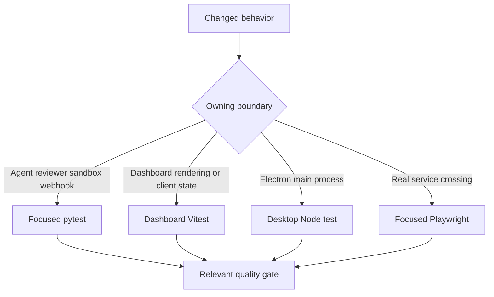
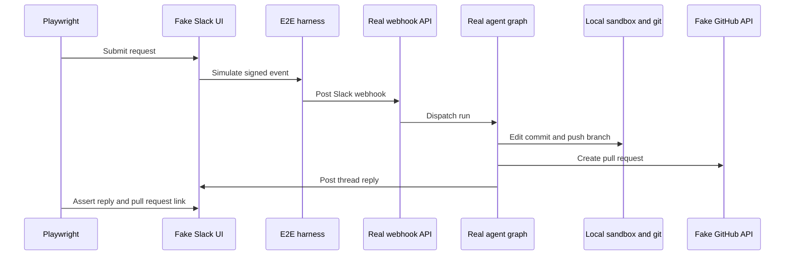

# Testing Strategy and Focused Validation

Validate at the lowest layer that owns the changed observable contract. Use focused pytest for Python graph, reviewer, sandbox, webhook, API, and tool behavior; use dashboard Vitest for React rendering and client state; use desktop Node tests for Electron main-process code. Escalate to Playwright when the contract crosses the real webhook, authenticated dashboard, local git/sandbox, or Electron boundary. Start with the owning file or node, then broaden only when the change crosses another seam.



This routing keeps feedback narrow while reserving end-to-end execution for independently stateful or deployed boundaries.

## Python: behavior and assembly contracts

Pytest collects `tests/` and runs in asyncio auto mode, so asynchronous test functions and fixtures need no per-test asyncio marker. The suite is organized by owner—among others `agent`, `reviewer`, `sandbox`, `webhooks`, `dashboard`, `github`, `slack`, `middleware`, and `tools`—rather than by a single generic integration tier.

Prefer a test of rendered configuration, composition, state transition, or externally visible result over a snapshot of static prompt text. `tests/agent/test_agent_assembly_context.py` captures the arguments passed to `create_deep_agent`; it protects the initialized sandbox-backed composite backend that enables deepagents context eviction and summarization, as well as source- and visibility-sensitive skills and tools, middleware placement, and parent-versus-subagent tool boundaries. It is the focused seam for graph wiring, backend, skill, middleware, or authorization changes.

### Shared test isolation

`tests/conftest.py` makes ordinary tests independent of a running Store, local dashboard build, and process-global state:

- `fake_store` routes `agent.store` through an in-memory `FakeStore`, but retains the production `model_dump`/`model_validate` round trip. Seed it only when persisted state is part of the behavior under test.
- The autouse dashboard fixture sets `DASHBOARD_STATIC_DIR` to a missing temporary path, so a developer's `ui/.output` cannot change Python behavior.
- TTL cache and both sandbox registries are cleared before and after each case; cached workspace settings or a leaked sandbox handle therefore cannot answer for a later test.
- Workspace-store import is treated as completed and automatic review is enabled by default. Tests of fail-closed workspace routing or the review opt-in gate must deliberately replace those defaults.

### Which Python family protects which failure

| Change | Focused location and protected behavior |
| --- | --- |
| Main-agent construction, source-specific tools, skills, middleware, or sandbox backend | `tests/agent/test_agent_assembly_context.py`; assembly and context-management seams. |
| Reviewer findings, publish/reconcile behavior, check runs, approval settings, or learning outcomes | `tests/reviewer/`; `test_reviewer_outcomes.py` maps resolved/dismissed status and GitHub/Slack feedback to true/false-positive outcomes, while missing credentials or repo configuration is a no-op. |
| Sandbox proxy reconnect, capture offload, or identity recovery | `tests/sandbox/test_sandbox_state.py`; the proxy remains `BaseSandbox` compatible, delegates or safely falls back from offload, shares one reconnect, survives waiter cancellation, retries failed startup, and can recover an ID from thread metadata. |
| Completion notifications and reviewer cleanup after terminal failures | `tests/webhooks/test_completion_webhook.py`; Slack-context failures post and record a failure reply, reviewer failures settle a tracked GitHub check only when metadata and token exist, and failed cleanup cannot suppress the Slack reply. |

## Commands and independent gates

Install Python development tooling with `make install`, which runs `uv sync --extra dev`. The `dev` extra supplies `pytest`, `pytest-asyncio`, `Ruff`, and `ty`; Pygments is a normal runtime dependency. `make test` (also `make tests`) runs `uv run pytest -vvv $(TEST_FILE)` only when `TEST_FILE` is an existing file or directory; otherwise it prints a skip message. Use direct pytest for a node ID, because `file.py::test_name` is not a filesystem path.

```bash
make install
make test TEST_FILE=tests/sandbox/test_sandbox_state.py
uv run pytest -vvv tests/sandbox/test_sandbox_state.py::test_sandbox_proxy_retries_failed_startup
make lint
make typecheck
```

Tests are not a substitute for quality gates: `make lint` runs Ruff checking plus a format diff, `make format` fixes formatting and lint issues in place, and `make typecheck` runs `ty check agent tests`.

For frontend changes, target the owning workspace before root `pnpm test`, which delegates workspace test tasks to Turbo:

```bash
pnpm --filter open-swe-dashboard run test
pnpm --dir desktop run test
```

The dashboard command is `vitest run`, for components and client utilities. The desktop command builds its main bundle, then runs `node --test test/*.test.cjs`; use it for main-process behavior before invoking Electron E2E.

## Playwright: real paths with controlled SaaS seams

The E2E harness proves the production integration without live SaaS. It runs the real graph through `langgraph dev`, webhook routes, tools, middleware, workspace/store behavior, a local temp-directory sandbox, and git against a seeded local bare remote. It replaces the LLM with a scripted `BaseChatModel` and supplies fake Slack/GitHub HTTP services, credential paths, and snapshot service. The fake Slack and GitHub stores are the single source of truth rendered by their mock UIs, so assertions see the result the real agent wrote.



The browser happy path uses the real signed webhook, graph, sandbox, and git paths while controlling model and SaaS responses.

`full_flow.spec.ts` protects the user-visible Slack request → implementation → PR → same-thread reply path. The harness overlays the real `agent.webapp` with fake APIs, mock UIs, and control endpoints, including signed simulated Slack Events API delivery to the real webhook route.

The dashboard is also real, not a mock. Global setup builds the `ui/` app with the harness as its server-side API target, then runs the app's Nitro server. Browser tests drive that server origin, exercising SSR, session gating/redirects, hydration, same-origin `/dashboard/api/*` proxying, and a genuine signed session cookie. Set `E2E_FORCE_UI_BUILD=1` after UI or port changes to force a rebuild.

```bash
pnpm install --frozen-lockfile
pnpm run test:e2e:install
pnpm exec playwright test tests/full_flow.spec.ts
pnpm run test:e2e:desktop
```

Install Chromium before the first browser run. The browser configuration is serial with one worker, excludes `desktop.spec.ts`, uses a 90-second test timeout, and reuses an existing server outside CI. The desktop configuration selects only `desktop.spec.ts`, raises test and expectation timeouts, and uses separate outputs.

### Desktop E2E

The Electron spec resets harness state, clones the seeded bare remote into an isolated temporary project, obtains and injects a harness-issued `osw_session` cookie, and runs a local-agent request. It verifies both the actual project edit and the fake-GitHub PR title, branch, draft state, and changed file. It explicitly records the Electron context trace, attaches screenshots for unified and completed local-agent views, and removes temporary desktop state unless `E2E_KEEP_TMP` is set.

## Diagnostics and operating requirements

The browser suite retains screenshots on failure and keeps trace/video on failed local attempts or the first CI retry. `E2E_ARTIFACTS=1` records trace and video for every attempt under `test-results/` and `playwright-report/`. The desktop configuration disables Playwright's automatic media because the spec records and attaches its own Electron trace and screenshots.

The E2E backend requires PostgreSQL: set `POSTGRES_URI` before running the suite (CI provides a service). For a failure, inspect the trace, screenshot, and fake-boundary state before increasing a timeout or weakening an assertion.

```bash
pnpm exec playwright show-report
pnpm exec playwright show-trace test-results/<test>/trace.zip
SLOW_MO=700 pnpm exec playwright test --headed
```

## Related pages

- [Agent graph](/openwiki/architecture/agent-graph.md)
- [Sandbox lifecycle](/openwiki/architecture/sandbox-lifecycle.md)
- [Dashboard UI](/openwiki/integrations/dashboard-ui.md)
- [Quickstart](/openwiki/quickstart.md)
- [PR review workflow](/openwiki/workflows/pr-review.md)
