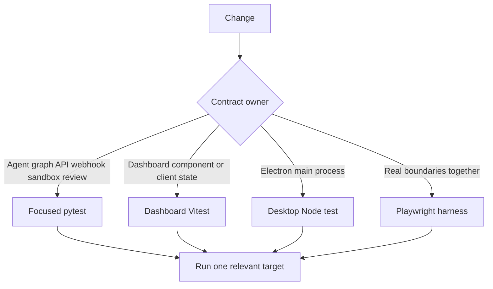
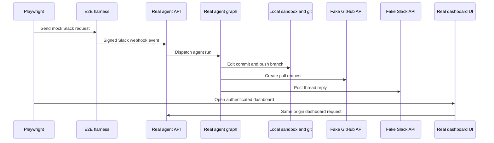

# Focused Validation Strategy

Never run the full suite locally. Start with the narrowest test that directly owns the changed observable contract, then add a cross-boundary proof only when the change crosses a real integration boundary. Python tests own graph assembly, webhook/API behavior, reviewer/analyzer logic, and sandbox lifecycle; Vitest owns dashboard client behavior; desktop Node tests own the Electron main bundle; Playwright owns the real-agent, authenticated-dashboard, and Electron flows.

## Select the validation seam



The routing rule is to test the production owner of the behavior before testing its consumers. A webhook validation change belongs in `tests/webhooks/`; a dashboard authorization or thread-route change belongs in `tests/dashboard/`; a backend reconnection change belongs in `tests/sandbox/`. Add Playwright when a regression could occur in the handoff between those components, not merely because a UI is involved.

## Python test baseline

Pytest collects `tests/` and runs in asyncio auto mode, so async tests and fixtures do not need per-test asyncio markers. `make install` installs the dev extra, including pytest, pytest-asyncio, Ruff, ty, and Pygments.

The shared fixtures are intentional isolation rather than incidental convenience:

- `fake_store` directs `agent.store` calls to an in-memory `FakeStore`, while retaining the production model serialization round trip. Seed it for tests whose behavior depends on stored records.
- The autouse TTL-cache fixture clears cached team settings on both sides of every case.
- The autouse auto-review fixture makes repositories enabled because there is no live Store. Tests of opt-in behavior must replace that stub with their stricter predicate.

### What the focused Python seams protect

**Agent graph and dispatch.** Use `tests/agent/` for configuration precedence, inputs, prompts, tool eligibility, run accounting, scheduling, retries, plans, and agent assembly. In particular, `test_agent_assembly_context.py` protects construction invariants: the main graph gets an initialized `CompositeBackend` with a `SandboxBackendProxy`, preserving Deep Agents filesystem eviction and summarization. It also tests concurrent sandbox start while settings load, read-only skill routes, source-dependent tools, middleware, and parent-only thread/settings tools. This is the correct seam for wiring changes, rather than exercising an expensive agent run.

**Dashboard server contracts.** Use `tests/dashboard/test_dashboard_thread_api.py` for thread route inputs, source handoff, run-start creation, visibility, activity, pinning, terminal and recovery-patch access, project/diff constraints, and posting/cancellation authority. `test_dashboard_thread_api_activity.py` specifically distinguishes a completed run, which is refreshed and marked viewed on read, from a running run, which is not marked viewed; surfaced Slack threads may be marked viewed by an authenticated user. Keep cookie-origin security changes in `test_dashboard_csrf.py`: configured mutations require an allowed Origin or Referer, accept the desktop origin, reject malformed or bypass forms and non-JSON commands, while reads do not perform the mutation-origin check.

**Webhook and completion outcomes.** `tests/webhooks/` covers completion delivery and Linear webhook attribution/trace behavior. Completion tests preserve two important failure paths: an error for a Slack-sourced run posts a failure reply with the Open SWE Web link and records the run ID to prevent duplicate replies; an errored reviewer run settles its tracked GitHub check as neutral unless a pending review result already supplies the conclusion.

**Sandbox lifecycle.** `tests/sandbox/` covers provider-specific integrations plus gateway, proxy authentication, recreation/recovery, reset, retry, publish ordering, path, and timeout behavior. `test_sandbox_state.py` protects the lazy proxy contract: it remains `BaseSandbox`-compatible for capture offload, delegates offload when possible and safely falls back otherwise, coalesces reconnects, survives cancellation of a waiter, retries a failed startup, and can recover the sandbox ID from live thread metadata. These behaviors prevent duplicate reconnect work and loss of a usable backend after a transient failure.

**Reviewer and analyzer.** `tests/reviewer/` owns PR-trigger/reconcile behavior, diff and finding processing, tool and trace context, check/review outcomes, comments, publish rendering, watch behavior, and style synchronization. For example, publish tests isolate GitHub effects while checking review markers and inline, resolution, status, and summary rendering. `tests/analyzer/test_analyzer_cron.py` protects continual-learning scheduling: creating a missing cron stores its ID and supplies the analyzer assistant, continual mode, explicit thread ID, and learning skill; creation is idempotent and removal clears the stored ID. The daily schedule is stable per repository and falls in its intended time window.

## Targeted commands

```bash
make install
make test TEST_FILE=tests/dashboard/test_dashboard_thread_api.py
uv run pytest -vvv tests/sandbox/test_sandbox_state.py::test_sandbox_proxy_retries_failed_startup
make lint
make typecheck
```

`make test` and `make tests` execute `uv run pytest -vvv $(TEST_FILE)`. `TEST_FILE` defaults to `tests/`, so always override it locally with a relevant file; the make target skips, rather than fails, when that path does not exist. `make lint` runs Ruff checking and a formatting diff; `make format` fixes both; `make typecheck` runs `ty check agent tests`. These are separate gates from behavioral tests.

For a dashboard client or Electron-main change, use the package-local target rather than the root workspace sweep:

```bash
pnpm --filter open-swe-dashboard run test
pnpm --dir desktop run test
```

The dashboard target is `vitest run`. Its dedicated Vitest config retains TanStack Start's client rewrites but avoids Nitro's server module runner; Node is the default environment and files can opt into jsdom, whose URL is set to `http://localhost:3000`. The desktop target builds the main bundle and runs `node --test test/*.test.cjs`. Root `pnpm test` delegates the workspace test task through Turbo and is not the focused iteration command.

## Playwright: cross-boundary proof

Use Playwright for a changed Slack/web/dashboard/git path, for real authenticated SSR/proxy behavior, or for the local Electron agent flow. Install Chromium before the first run and select an individual spec while iterating:

```bash
pnpm install --frozen-lockfile
pnpm run test:e2e:install
pnpm exec playwright test tests/full_flow.spec.ts
pnpm run test:e2e:desktop
```



This is the system path exercised by the harness: a Slack mention reaches the real webhook and graph through `langgraph dev`; the agent edits a temporary local-provider sandbox, pushes to a seeded local bare remote, opens a PR using fake GitHub, and replies to the same fake Slack thread. The LLM, SaaS HTTP endpoints, credential minting, and snapshot service are controlled seams; agent code, middleware, tools, webhook routes, git, environment/store behavior, and the fake stores rendered by the mock UIs remain on the production path. The harness signs the simulated Slack event before it reaches the real webhook route.

The browser configuration runs one worker, excludes `desktop.spec.ts`, uses a 90-second test timeout, and starts the real LangGraph dev server. The desktop configuration selects only `desktop.spec.ts`, sets a 180-second test timeout and 120-second expectation timeout, and uses separate result/report directories. Browser specs cover the base Slack-to-PR path plus Slack-to-web continuation, plan approval, environments, redelivery and busy-thread queueing, SSR authentication, PR health, and dashboard reflection of thread-tool changes.

### Dashboard and Electron realism

The browser does not drive a mock dashboard. Global setup builds the actual `ui/` package with its server API directed to the harness, starts the Nitro output on `E2E_UI_PORT` (default `3100`), and waits for `/login`. The browser talks to that app-server origin, so same-origin `/dashboard/api/*` calls traverse the production proxy instead of bypassing it. A harness-issued signed `osw_session` cookie therefore tests SSR session gating, redirects, hydration, and authorization. Set `E2E_FORCE_UI_BUILD=1` after changing UI build inputs or ports.

The Electron spec resets harness state, clones the seeded bare remote into an isolated temporary project, injects the harness-issued session cookie, and sends a local-agent request. It asserts the local project edit plus fake-GitHub PR properties. It records its Electron trace and screenshots itself and cleans its temporary state unless `E2E_KEEP_TMP` is set.

## Diagnostics

Browser tests retain screenshot artifacts on failure and retain trace/video on local failures or the first CI retry. `E2E_ARTIFACTS=1` records trace and video for every attempt under `test-results/` and `playwright-report/`. The desktop configuration disables automatic Playwright recording because its spec explicitly captures the Electron trace and view screenshots.

```bash
pnpm exec playwright show-report
pnpm exec playwright show-trace test-results/<test>/trace.zip
SLOW_MO=700 pnpm exec playwright test --headed
```

Inspect the trace, screenshot, and fake-boundary state before increasing a timeout or weakening an assertion. Prefer a warm server and one relevant spec over a broad rerun.

## Related pages

- [Agent graph](/openwiki/architecture/agent-graph.md)
- [Sandbox lifecycle](/openwiki/architecture/sandbox-lifecycle.md)
- [Dashboard UI](/openwiki/integrations/dashboard-ui.md)
- [Quickstart](/openwiki/quickstart.md)
- [PR review workflow](/openwiki/workflows/pr-review.md)
