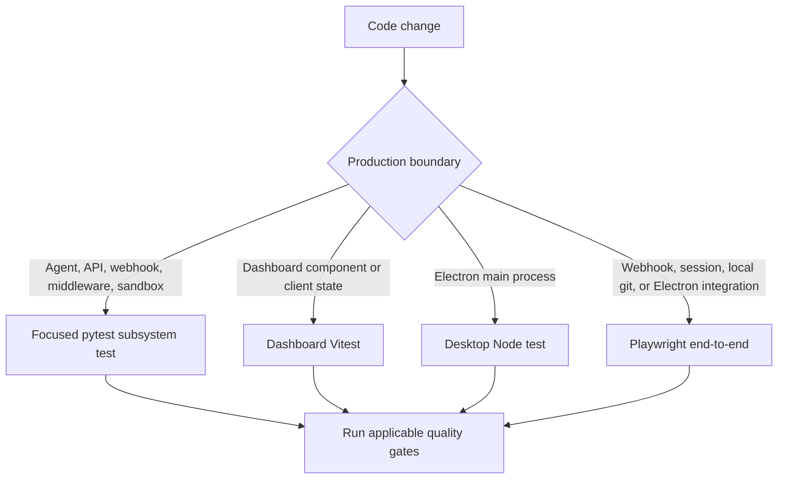
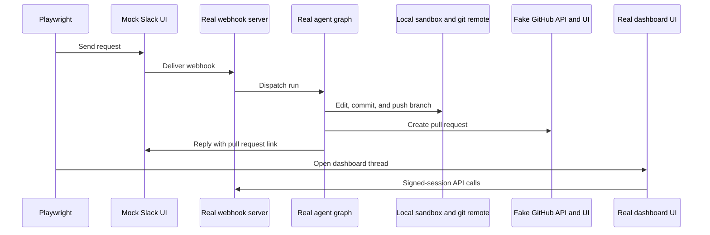

# Testing Guide

Open SWE uses complementary layers, selected by the **production owner** of the changed contract:

- Python behavior in the agent, dashboard API, webhook, middleware, and sandbox belongs in `tests/` under its owning subsystem.
- React client behavior belongs in the dashboard's Vitest suite; Electron main-process behavior belongs in the desktop Node test suite.
- Playwright proves an integration that genuinely crosses the webhook/server, signed-session dashboard, local git/sandbox, or Electron boundary. It is intentionally not a replacement for the focused contract test.

## Test routing



This routes changes to the cheapest layer that owns their behavior, reserving e2e for real cross-boundary wiring.

### Python ownership map

Pytest collects `tests/`. Route by the code that owns the contract, not the UI symptom:

| Production area | Focused location |
|---|---|
| Agent graph, dispatch, planning, reviews, schedules, skills, usage | `tests/agent/` |
| Dashboard authentication, settings, thread proxy, terminal, environments | `tests/dashboard/` and `tests/auth/` |
| GitHub PRs, comments, webhook handling, repository normalization, prompts | `tests/github/` |
| Provider/model behavior | `tests/models/` |
| Queueing, dynamic tools, timeout/fallback, sanitization, ordering | `tests/middleware/` |
| Reviewer graph, findings, publishing, watches, auto-review | `tests/reviewer/` |
| Sandbox state, recovery, provider behavior, proxy and git identity | `tests/sandbox/` |
| Slack events, context, interactivity, code channels, replies | `tests/slack/` |
| Curated tools, MCP, HTTP safety, observability | `tests/tools/` |
| Completion and Linear webhooks | `tests/webhooks/` |

`tests/e2e/` is a separate Playwright harness, even though it is below `tests/`.

## Python environment and isolation

Pytest discovery is rooted at `tests/` and asyncio auto mode awaits async tests and fixtures without per-test markers. Install its development dependencies with `make install`.

`tests/conftest.py` supplies isolation that focused tests should keep using:

- `fake_store` replaces the store client with an in-memory store while retaining the real `agent.store` serialization round trip. Seed it rather than bypassing storage when persisted state matters.
- An autouse fixture clears the process-global TTL cache before and after each test, so cached team settings cannot cross test cases.
- Another autouse fixture makes auto-review enabled in the no-live-store test environment. A test of the opt-in gate must override that stub.

### Dashboard thread proxy contracts

`tests/dashboard/test_dashboard_thread_api.py` protects server-side behavior that browser tests should not be the sole owners of:

- model resolution gives explicit request choices precedence over profile and team defaults; image input is rejected for text-only models and can select the vision fallback;
- `run.start` creation stamps dashboard origin, participant, title, repository, resolved model, and preparation metadata, converts repository shape, attributes the human message, and removes dashboard-only hints before dispatch;
- summaries map PR and diff metadata, hide the `__creating__` sandbox sentinel, and expose Slack source links only for private repositories;
- a continuation from a Slack thread adds a dashboard-handoff system message before the web message while preserving sender attribution;
- terminal and recovery-patch paths reject unavailable sandboxes; recovery patches reject empty output and enforce the size limit.

Pair changes here with Vitest when client rendering/state changes. Add Playwright only where session/SSR or dashboard-to-server wiring is part of the contract.

### Sandbox proxy contracts

`tests/sandbox/test_sandbox_state.py` focuses on resilience at the backend boundary. The proxy remains a `BaseSandbox` so capture-at-source can use offload when supported, delegates offload to a live backend, and falls back to ordinary execution for protocol-only backends. Concurrent first operations share one metadata- or callback-based reconnect; a cancelled waiter does not cancel startup, while a failed startup can be retried. Sandbox-ID lookup falls back to live thread metadata when request configuration lacks it.

## Commands and quality gates

```bash
make install
make test
make test TEST_FILE=tests/dashboard/test_dashboard_thread_api.py
uv run pytest -vvv tests/dashboard/test_dashboard_thread_api.py::test_name
make lint
make typecheck
```

`make test` (also `make tests`) runs `uv run pytest -vvv $(TEST_FILE)` and defaults `TEST_FILE` to `tests/`; it prints a skip message rather than failing if the supplied path does not exist. `make lint` performs Ruff checking and a formatting diff, `make format` fixes both, and `make typecheck` runs basedpyright over `agent` and `tests`.

For workspace code:

```bash
pnpm install --frozen-lockfile
pnpm --filter open-swe-dashboard run test
pnpm --dir desktop run test
pnpm test
```

The dashboard `test` script is `vitest run`. Desktop builds its main bundle before `node --test test/*.test.cjs`; the root `pnpm test` delegates workspace test tasks to Turbo. Prefer the package command while iterating.

## Browser and Electron end-to-end harness

```bash
pnpm install --frozen-lockfile
pnpm run test:e2e:install
pnpm run test:e2e
pnpm run test:e2e:desktop
```

The install command downloads Chromium. The browser configuration runs serially (`workers: 1`) against real `langgraph dev`, ignores `desktop.spec.ts`, and uses a 90-second test timeout. The desktop configuration selects only `desktop.spec.ts` and raises test and expectation timeouts to 180 and 120 seconds.



The browser flow and its observable integration boundaries: a Slack request reaches the real webhook and agent graph, the agent edits a local temporary sandbox and pushes to a local bare remote, the real PR and Slack tools target in-process fakes, and the mock UIs render the fake stores that those tools updated. The scripted model and external SaaS/token/snapshot boundaries are faked; agent code, git, and the local sandbox are not.

Global setup builds the actual dashboard with both API bases aimed at the harness, starts its server, and waits for `/login`. Consequently the suite covers server rendering, session gate/redirect/hydration, and same-origin `/dashboard/api/*` calls with a signed harness cookie. Set `E2E_FORCE_UI_BUILD=1` after dashboard or port changes.

### Current Electron scenario

The desktop spec proves the local-client path against the same harness fakes:

1. It resets harness state, clones the seeded local bare remote into a temporary project, and launches the real Electron executable in development mode.
2. Per-run `HOME`, XDG/AppData, Git configuration, Python path, uv cache, and desktop project registry isolate application and local-agent state. The temporary state is removed unless `E2E_KEEP_TMP` is set.
3. The test obtains a signed `osw_session` from `/control/login` and injects it as an HTTP-only Electron session cookie before navigating to `open-swe://app/agents`.
4. It verifies the local project controls, submits a local request, then asserts the local route and completion, `greet.py` content in the cloned project, and the created fake-GitHub PR's title, branch, base, draft state, and changed file.

This is a local execution and IPC/client integration test, not a mocked desktop UI test.

## Diagnostics

Browser runs record trace and video locally and take a screenshot on failure; CI records trace/video on first retry. Reports and artifacts are written beneath `test-results/` and `playwright-report/`.

```bash
pnpm exec playwright show-report
pnpm exec playwright show-trace test-results/<test>/trace.zip
```

The desktop config disables Playwright's automatic artifacts, but the spec explicitly creates an Electron trace and attaches screenshots for the unified and completed local-agent views. Inspect these artifacts before increasing timeouts or weakening assertions. For interactive browser debugging, use `SLOW_MO=700 pnpm exec playwright test --headed`.

## Related pages

- [Agent graph](/openwiki/architecture/agent-graph.md)
- [Middleware stack](/openwiki/architecture/middleware-stack.md)
- [Sandbox lifecycle](/openwiki/architecture/sandbox-lifecycle.md)
- [Dashboard UI](/openwiki/integrations/dashboard-ui.md)
- [Invocation workflow](/openwiki/workflows/invocation.md)
- [PR creation](/openwiki/workflows/pr-creation.md)
