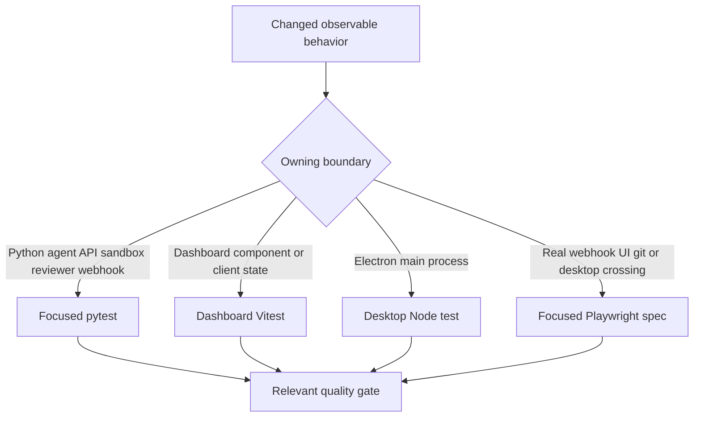
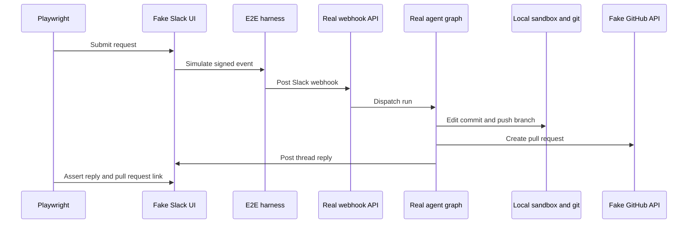

# Testing Strategy and Focused Test Suites

Run the smallest test that owns the changed **observable behavior**, then run the relevant quality gate. Contributors should **not run the full test suite locally**: begin with one test or focused file and widen only when the change crosses a boundary. Prefer deterministic assertions about results, authorization, persistence, error handling, or user-visible output. Do not lock down incidental call order, prompt text, constants, or private structure merely because it is easy to assert.



This selection flow keeps feedback fast while reserving an end-to-end proof for behavior that genuinely crosses independently stateful systems.

## Python: focused unit and integration coverage

Pytest collects `tests/` and runs in asyncio auto mode, so async tests and fixtures do not need a per-test asyncio marker. Test families are arranged around system ownership: `tests/agent/`, `tests/dashboard/`, `tests/github/`, `tests/slack/`, `tests/sandbox/`, `tests/reviewer/`, and `tests/webhooks/`. Pick the family that owns the contract rather than exercising it indirectly through a broader suite.

- **Agent graph assembly:** `tests/agent/test_agent_assembly_context.py` captures the arguments passed to `create_deep_agent`. It protects the initialized sandbox-backed composite backend that enables deepagents context eviction and summarization, as well as source-sensitive skills and tools, middleware, and the boundary between parent and subagent tools. Use it for graph construction, backend, skills, middleware, or tool-exposure changes.
- **Dashboard backend routes:** `tests/dashboard/` tests the Python dashboard API at its authorization, validation, settings-precedence, and thread-state boundaries. For example, thread API tests cover model/input validation and cross-module route bindings; they are the appropriate scope for a `/dashboard/api` contract change, rather than a browser test.
- **Sandbox lifecycle:** `tests/sandbox/test_sandbox_state.py` specifies the resilient proxy behavior: it remains `BaseSandbox` compatible for capture offload, delegates offload when available and safely falls back when not, shares a reconnect among concurrent callers, tolerates waiter cancellation, retries failed startup, and can recover an ID from live thread metadata.
- **GitHub, Slack, reviewer, and completion behavior:** use their corresponding directories to test the precise protocol or outcome. Reviewer outcome tests map resolved/dismissed findings and GitHub/Slack feedback to true/false-positive labels, and deliberately no-op when credentials or repository context are absent. Completion-webhook tests protect failure handling: Slack-originated failures reply in the thread and record the run; reviewer failures settle a tracked GitHub check only when the required metadata and token exist; cleanup failure must not suppress the Slack failure reply.

### Shared fixtures and external-boundary fakes

`tests/conftest.py` makes ordinary Python tests independent of running infrastructure while retaining meaningful production paths:

- `fake_store` redirects `agent.store` to an in-memory `FakeStore`. Values still pass through the real store serialization round trip, so tests can seed persisted state without a LangGraph Store.
- Autouse fixtures clear the process-global TTL cache and sandbox registries before and after each case, preventing settings and sandbox handles from leaking across tests.
- The default dashboard-static-dir fixture points `DASHBOARD_STATIC_DIR` at a nonexistent temporary path, so a local `ui/.output` cannot accidentally affect a Python result.
- The auto-review fixture enables every repository because the dashboard opt-in list is empty without a live Store. A test of the opt-in policy must override that stub with the policy it intends to prove.
- Database-dependent regressions can use `registry_db`: it creates and migrates a unique PostgreSQL schema, then drops it. It skips unless `TEST_ANALYTICS_POSTGRES_URI` is configured; `registry_db_if_available` permits one test to cover the configured and unconfigured paths.

These are fakes of boundaries and state owners, not substitutes for the behavior under test. Keep real parsing, serialization, authorization, and error paths where possible.

## Commands and independent gates

Install the Python development environment with `make install`, which runs `uv sync --extra dev`. The `dev` extra supplies `ty`, pytest, pytest-asyncio, and Ruff; Pygments is a regular project dependency. `make test` (also `make tests`) runs `uv run pytest -vvv $(TEST_FILE)` when `TEST_FILE` is an existing file or directory, and prints a skip message otherwise. Since its existence guard does not accept a pytest node id, invoke pytest directly for one test.

```bash
make install
make test TEST_FILE=tests/sandbox/test_sandbox_state.py
uv run pytest -vvv tests/sandbox/test_sandbox_state.py::test_sandbox_proxy_retries_failed_startup
make lint
make typecheck
```

Tests are separate from static gates: `make lint` runs Ruff checking and a formatting diff, `make format` formats and applies Ruff fixes, and `make typecheck` runs `ty check agent tests`.

For frontend changes, target the workspace that owns the change rather than root `pnpm test`, which delegates workspace test tasks through Turbo:

```bash
pnpm --filter open-swe-dashboard run test
pnpm --dir desktop run test
```

The dashboard command is `vitest run` for component and client behavior. The desktop command builds the main bundle, then runs `node --test test/*.test.cjs`. Use these before Playwright for rendering, client state, Electron main-process, or IPC-adjacent behavior that does not require a running product stack.

## Playwright: real paths, controlled SaaS seams

The E2E harness drives the full Slack-to-PR path while keeping it repeatable. It mounts fake GitHub and Slack APIs, mock UIs, and control endpoints on the real `agent.webapp`; it signs simulated Slack Events API delivery before posting to the real webhook route. The real agent runs through `langgraph dev`, including its graph, tools, middleware, local temporary-directory sandbox, and git against a seeded local bare remote. The fake LLM is scripted, and external SaaS HTTP, token, and snapshot boundaries are patched. Fake Slack and GitHub stores are the single source of truth rendered by the mock UIs, so browser assertions see the effects actually written by real agent code.



The sequence is the browser happy path: real webhook, graph, sandbox, and git behavior meet controlled LLM and SaaS boundaries.

`full_flow.spec.ts` verifies that a Slack request causes an implementation, an open PR with its changed file, and a link back in the same thread. Choose a narrower browser spec for dashboard/thread interactions, approvals, redelivery/debouncing, SSR, sandbox identity, or workspace behavior when one of those is the changed contract.

The dashboard in this suite is the real built `ui/` app, not a mock. Global setup builds and runs its Nitro server with the harness as the server-side API target; browser requests use that UI origin, preserving SSR, the session gate, hydration, and same-origin `/dashboard/api/*` proxy calls. `/control/login` issues a genuine signed session cookie. `E2E_FORCE_UI_BUILD=1` forces a rebuild after UI or port changes.

The Electron spec is a separate product boundary: it resets harness state, clones the seeded remote into an isolated temporary project, injects a harness-issued `osw_session` cookie, executes a local-agent request, and verifies the project edit and fake-GitHub PR fields. It also records an Electron trace, attaches screenshots for the unified and completed views, and removes temporary state unless `E2E_KEEP_TMP` is set.

```bash
pnpm install --frozen-lockfile
pnpm run test:e2e:install
pnpm exec playwright test tests/full_flow.spec.ts
pnpm run test:e2e:desktop
```

`test:e2e:install` installs Chromium and must precede the first browser run. The browser configuration runs serially against real `langgraph dev`, excludes `desktop.spec.ts`, and has a 90-second test timeout. The desktop configuration selects only `desktop.spec.ts` and raises the test timeout to 180 seconds. The E2E backend also requires `POSTGRES_URI`.

## Failure diagnostics

Browser runs retain screenshots on failure. They retain trace and video on failed attempts locally and on the first retry in CI; `E2E_ARTIFACTS=1` records both for every attempt under `test-results/` and `playwright-report/`. Desktop turns off automatic Playwright media because its spec records the Electron trace and attachments explicitly.

```bash
pnpm exec playwright show-report
pnpm exec playwright show-trace test-results/<test>/trace.zip
SLOW_MO=700 pnpm exec playwright test --headed
```

Inspect the trace, screenshot, and fake-boundary state before increasing timeouts or weakening assertions.

## Related pages

- [Agent graph](/openwiki/architecture/agent-graph.md)
- [Sandbox lifecycle](/openwiki/architecture/sandbox-lifecycle.md)
- [Quickstart](/openwiki/quickstart.md)
- [Invocation workflow](/openwiki/workflows/invocation.md)
