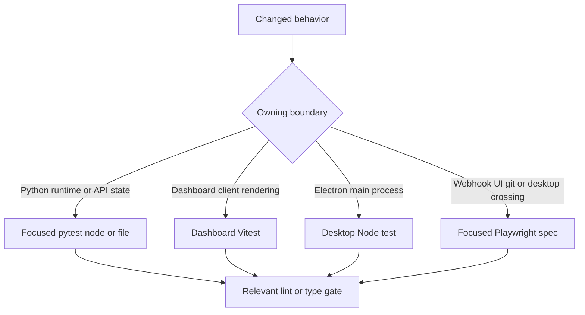
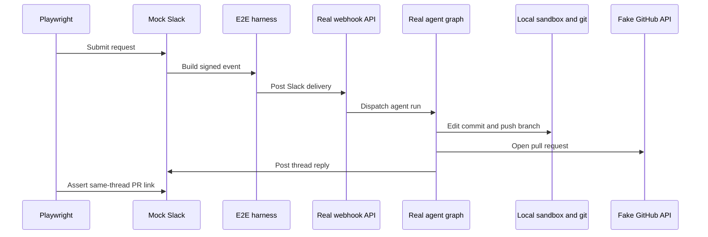

# Testing Strategy and Focused Validation

Run the smallest test that owns the observable behavior you changed—never the full local suite. Extend an existing behavioral regression when possible. Prefer assertions on authorization, persistence, externally visible output, and state transitions over prompt wording, call order, static structure, or mock interactions that do not establish a result. Escalate from a focused Python test to Vitest, Node, or Playwright only when the changed contract crosses that boundary.


```mermaid
flowchart TD
    Change["Changed behavior"] --> Owner{"Owning boundary"}
    Owner -->|"Python runtime or API state"| Pytest["Focused pytest node or file"]
    Owner -->|"Dashboard client rendering"| Vitest["Dashboard Vitest"]
    Owner -->|"Electron main process"| Node["Desktop Node test"]
    Owner -->|"Webhook UI git or desktop crossing"| E2E["Focused Playwright spec"]
    Pytest --> Gates["Relevant lint or type gate"]
    Vitest --> Gates
    Node --> Gates
    E2E --> Gates
```

This is a validation-routing guide, not an instruction to duplicate one behavior across layers.

## Python suites and isolation

Pytest collects `tests/` and runs in asyncio auto mode, so async tests and fixtures require no per-test asyncio marker. The suite is organized by behavioral owner: agent construction, dashboard and thread APIs, MCP, reviewer, sandbox, tasks, webhooks, database, provider integrations, and tools.

`tests/conftest.py` supplies isolation that focused tests should reuse rather than recreate:

- `fake_store` replaces the LangGraph Store behind `openswe.store`, but values still pass through the production model serialization and validation path. Seed it only when persisted state is part of the behavior.
- Autouse fixtures use a nonexistent `DASHBOARD_STATIC_DIR`, set a predictable GitHub-login allowlist, clear TTL and LangGraph in-process caches before and after each test, and clear sandbox backend and connection registries. Local builds and process-global state therefore cannot silently change another test.
- The default auto-review fixture treats repositories as opted in because the ordinary test environment has no live Store. A test of the opt-in gate must replace that stub with the policy it intends to exercise.
- `registry_db` is deliberately opt-in: it skips without `TEST_ANALYTICS_POSTGRES_URI`; when configured, it clones a migrated PostgreSQL template into a fresh database and drops it afterward. Use it for real schema, transaction, uniqueness, or persistence behavior—not for logic that can be isolated without PostgreSQL.

### State and policy regressions worth protecting

| Change area | Focused test family | High-value behavior |
| --- | --- | --- |
| Agent assembly, middleware, skills, tool visibility, task controls | `tests/agent/test_agent_assembly_context.py` | The deep agent receives the initialized sandbox-backed composite backend needed for deepagents offload middleware; visibility and credential scope affect skills, MCPs, and tools. Existing tasks retain their controls after opt-out, while new coordination tools remain disabled unless actually available. |
| Dashboard thread API | `tests/dashboard/test_dashboard_thread_api.py` | New runs stamp the repository's workspace and resolve workspace model defaults; server-side creation also enforces admin and visibility rules. Use adjacent dashboard files for the owning endpoint rather than broad browser validation. |
| Sandboxes | `tests/sandbox/test_sandbox_state.py` | A proxy reconstructs a missing sandbox from current thread metadata, shares one concurrent connection attempt, survives a cancelled waiter, retries a failed startup, and delegates once ready. |
| Task coordination | `tests/test_task_threads.py` | Delegation is opt-in and credential-safe; a worker cannot create siblings or control another task. PostgreSQL-backed cases protect idempotent/concurrent worker creation, retry after a lost launch response, cancellation cleanup, and queued follow-up delivery. |
| Managed MCP | `tests/mcp/test_managed_mcps.py` | Managed gateway calls use the private owner's token and are unavailable for public threads or another user. Credential connection resumes once after every required service is connected, while a gateway outage must not remove unrelated workspace MCP tools. |
| Reviewer outcomes and lifecycle | `tests/reviewer/` | `test_reviewer_outcomes.py` protects creation of an outcome payload and conflict-to-update behavior; use review, publish, reconciliation, and approval tests for their corresponding PR semantics. |
| Completion and webhook errors | `tests/webhooks/test_completion_webhook.py` | Reviewer errors settle a pending check when metadata and a token are available; cleanup failure cannot suppress a Slack failure reply. Completion handling also guards per-run reply deduplication and when queued follow-ups may be picked up. |

For agent changes, do not snapshot prompt text. Capture a rendered decision, tool composition, model/configuration precedence, authorization boundary, or resulting state. For a bug fix, add the narrow regression only when it describes a concrete failure that existing coverage misses.

## Commands and quality gates

Install Python development dependencies with `make install` (`uv sync --extra dev`). `pytest`, `pytest-asyncio`, `pytest-xdist`, Ruff, and `ty` are dev dependencies; Pygments is a runtime dependency. `make test` and `make tests` run `uv run pytest -vvv $(PYTEST_ARGS) $(TEST_FILE)` only when `TEST_FILE` is an existing path, otherwise they print a skip message. Use direct pytest for an individual node id.

```bash
make install
make test TEST_FILE=tests/sandbox/test_sandbox_state.py
uv run pytest -vvv tests/sandbox/test_sandbox_state.py::test_sandbox_proxy_retries_failed_startup
uv run pytest -vvv tests/test_task_threads.py::test_concurrent_first_spawns_and_replay_share_one_task
make lint
make typecheck
```

`make lint` runs Ruff checking plus a format diff; `make format` applies Ruff formatting and fixes; `make typecheck` runs `ty check openswe tests`. These are independent gates, not substitutes for a behavioral test.

For frontend-local work, target the owning workspace instead of root `pnpm test`, which delegates workspace test tasks through Turbo:

```bash
pnpm --filter open-swe-dashboard run test
pnpm --dir desktop run test
```

The dashboard uses `vitest run`. The desktop `test` script builds the main bundle before `node --test test/*.test.cjs`. Use these suites for client rendering/state and Electron main-process behavior respectively.

## Browser and desktop E2E: real execution with controlled seams

The E2E harness is the proof for a path that actually crosses webhook handling, authenticated SSR/dashboard proxying, agent execution, local git, or Electron. It mounts fake GitHub and Slack APIs, mock UIs, and control endpoints on the real `openswe.webapp`; it signs simulated Slack deliveries before posting to the real webhook route. The graph, tools, middleware, local temp-directory sandbox, and git operations are real. The scripted LLM, external GitHub/Slack HTTP, credentials, and snapshot service are controlled seams. In-memory fake Slack/GitHub state is what mock UIs render, so browser assertions see the observable result produced by real agent code.


```mermaid
sequenceDiagram
    participant Browser as Playwright
    participant Slack as Mock Slack
    participant Harness as E2E harness
    participant Webhook as Real webhook API
    participant Graph as Real agent graph
    participant Git as Local sandbox and git
    participant GitHub as Fake GitHub API
    Browser->>Slack: Submit request
    Slack->>Harness: Build signed event
    Harness->>Webhook: Post Slack delivery
    Webhook->>Graph: Dispatch agent run
    Graph->>Git: Edit commit and push branch
    Graph->>GitHub: Open pull request
    Graph->>Slack: Post thread reply
    Browser->>Slack: Assert same-thread PR link
```

The browser configuration runs serially against `langgraph dev`, ignores `desktop.spec.ts`, and uses a 90-second test timeout. Desktop selects only `desktop.spec.ts` with a 180-second test timeout. The complete happy-path spec starts with a mock Slack request and verifies a local sandbox implementation, a fake-GitHub PR, and a reply in the same Slack thread. The Electron spec resets harness state, clones the seeded local remote to isolated temporary state, injects a harness-issued `osw_session` cookie, drives a This Mac request through the bridge, and checks both the local edit and fake-GitHub PR fields.

The dashboard is not mocked. Global setup builds the real `ui/` app with its server API target and E2E proxy aimed at the harness, runs its Nitro server, and drives that server origin. This retains SSR, session gating, hydration, and same-origin `/dashboard/api/*` proxy behavior. `E2E_FORCE_UI_BUILD=1` forces a rebuild after UI or port changes.

```bash
pnpm install --frozen-lockfile
pnpm run test:e2e:install
pnpm exec playwright test tests/full_flow.spec.ts
pnpm run test:e2e:desktop
```

Chromium installation precedes the first browser run, and the E2E backend requires `POSTGRES_URI`. Prefer one warm-server spec while iterating; the normal browser configuration reuses an existing server outside CI.

## Diagnostics

Browser runs capture screenshots on failure and retain traces/videos on failed attempts locally or the first retry in CI. Set `E2E_ARTIFACTS=1` to record trace and video for every attempt under `test-results/` and `playwright-report/`. The desktop configuration disables automatic media because its spec explicitly records the Electron trace and attaches screenshots; it removes temporary state unless `E2E_KEEP_TMP` is set.

```bash
pnpm exec playwright show-report
pnpm exec playwright show-trace test-results/<test>/trace.zip
SLOW_MO=700 pnpm exec playwright test --headed
```

Inspect trace, screenshot, and fake-boundary state before increasing timeouts or weakening an assertion.

## Related pages

- [Agent graph](/openwiki/architecture/agent-graph.md)
- [Sandbox lifecycle](/openwiki/architecture/sandbox-lifecycle.md)
- [Quickstart](/openwiki/quickstart.md)
- [Collaborative tasks](/openwiki/workflows/collaborative-tasks.md)
- [PR review workflow](/openwiki/workflows/pr-review.md)
