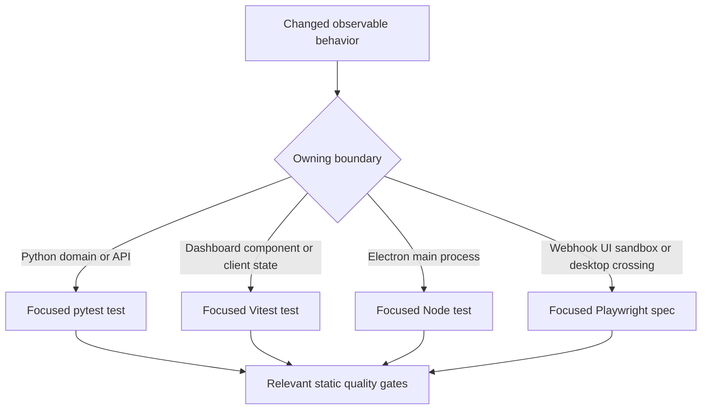
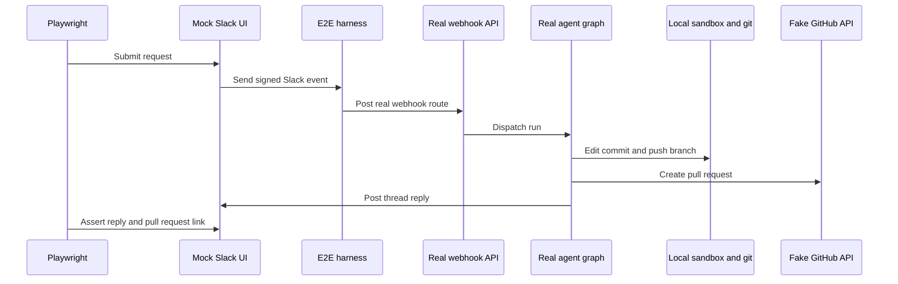

# Testing strategy and focused validation

Validate at the lowest layer that owns the changed observable contract. Start with an existing behavioral test in the owning Python package, dashboard Vitest suite, or desktop Node suite; run a Playwright spec only when the contract crosses a real webhook, authenticated UI/proxy, local git/sandbox, or Electron boundary. Do **not** run the full suite locally.

Add a test only for a concrete regression that current coverage misses. A bug fix should normally receive a focused test that fails before the fix. Security, authorization, data integrity, and tricky state transitions merit targeted coverage; prompt wording, constants, mechanical refactors, snapshots, and mock call order generally do not. Prefer extending the existing behavioral test over creating fixtures, files, or a mock-heavy harness.


```mermaid
flowchart TD
    Change["Changed observable behavior"] --> Owner{"Owning boundary"}
    Owner -->|"Python domain or API"| Pytest["Focused pytest test"]
    Owner -->|"Dashboard component or client state"| Vitest["Focused Vitest test"]
    Owner -->|"Electron main process"| Node["Focused Node test"]
    Owner -->|"Webhook UI sandbox or desktop crossing"| E2E["Focused Playwright spec"]
    Pytest --> Gates["Relevant static quality gates"]
    Vitest --> Gates
    Node --> Gates
    E2E --> Gates
```

This selection flow favors a fast behavioral proof, while retaining an E2E proof for contracts that only exist between independently running or stateful components.

## Python: isolated behavior and real boundaries

Pytest collects `tests/` and uses `asyncio_mode = "auto"`, so async tests and fixtures are awaited without per-test asyncio markers. Test directories follow owning domains—such as `tests/agent/`, `tests/auth/`, `tests/dashboard/`, `tests/github/`, `tests/reviewer/`, `tests/sandbox/`, `tests/slack/`, `tests/tools/`, and `tests/webhooks/`—rather than a separate unit-test taxonomy.

`tests/conftest.py` makes ordinary tests deterministic and offline:

- `fake_store` routes `openswe.store` through an in-memory SDK-shaped store, but leaves the production `model_dump`/`model_validate` serialization route in play. Seed it only where persisted state is the contract.
- `user_records` replaces `UserRecords` persistence with an in-memory table keyed using the production login normalization. `grant_tool_access` is available to explicitly grant a tested tool capability.
- Autouse fixtures refuse network requests outside local fakes (and a developer's configured LangGraph server), point `DASHBOARD_STATIC_DIR` to a missing temporary location, provide a default GitHub-login allowlist, and clear TTL and in-process LangGraph caches before and after each test. Sandbox backend and connection registries are likewise cleared on both sides of a test.
- The default auto-review fixture returns enabled because there is no live Store backing dashboard opt-in settings. A test of that gate must replace it with the stricter policy it intends to verify.

### Stateful integration without shared data

Some contracts need a real database or protocol implementation rather than a mock. `registry_db` requires `TEST_ANALYTICS_POSTGRES_URI`; it creates a per-test PostgreSQL database cloned from one migrated template, redirects the real database engine and schema to that clone, then closes and drops it. Tests that must also prove unconfigured behavior can use `registry_db_if_available`, which instead removes `POSTGRES_URI` when the test database is absent. This keeps database regressions isolated without turning all focused tests into a PostgreSQL prerequisite.

The support helpers are deliberately boundary-specific: `mock_github_sdk` runs the real GitHub SDK over `httpx.MockTransport`, and `slack_api` runs a local HTTP server and points the real Slack client at it. Prefer these to patching internal callers when the behavior under change is request formation or response handling.

### Choose the owning behavioral suite

| Change | Focused test family and behavior to preserve |
| --- | --- |
| Agent assembly, skills, tool availability, middleware, or sandbox backend wiring | Extend `tests/agent/test_agent_assembly_context.py`. It captures `create_deep_agent` inputs to protect thread-scoped blob offload, sandbox-backed backend wiring, scope-sensitive skills and tools, and middleware/subagent boundaries. |
| Sandbox reconnect and lazy startup | Extend `tests/sandbox/test_sandbox_state.py`. It verifies one reconnect for concurrent calls, metadata-based sandbox-ID recovery, cancelled waiters not cancelling shared startup, retry after a failed startup, and delegation after lazy connection. |
| Reviewer feedback learning/outcomes | Extend `tests/reviewer/`; `test_reviewer_outcomes.py` verifies the outcome payload and the create-conflict-to-update path. Cover an absent credential or repository configuration only when changing its no-op behavior. |
| Completion errors, retry/deduplication, Slack failures, or reviewer cleanup | Extend `tests/webhooks/test_completion_webhook.py`. It protects settling a pending reviewer check, preserving a Slack failure reply when cleanup fails, and recording failure replies by run ID. |

Keep assertions on externally meaningful results: persisted state, returned HTTP response, generated tool set, or a user-visible message. Do not add a second test layer for the same behavior merely because a lower-level test already proves it.

## Focused commands and independent gates

Install Python development dependencies with `make install`, which runs `uv sync --extra dev`. The dev extra includes `pytest`, `pytest-asyncio`, `pytest-xdist`, `ruff`, and `ty`. `Pygments` is a runtime dependency, not a dev-extra test tool.

```bash
make install
make test TEST_FILE=tests/sandbox/test_sandbox_state.py
uv run pytest -vvv tests/sandbox/test_sandbox_state.py::test_sandbox_proxy_retries_failed_startup
make lint
make typecheck
```

`make test` (also `make tests`) runs `uv run pytest -vvv $(PYTEST_ARGS) $(TEST_FILE)` only if `TEST_FILE` names an existing file or directory; otherwise it prints a skip message. Use direct `uv run pytest` for a `file.py::test_name` node ID, since that is not a filesystem path. `make integration_tests` similarly targets `tests/integration_tests/` only if it exists.

Tests and static checks are independent. `make lint` runs `ruff check` and a Ruff-format diff; `make format` fixes with Ruff; `make typecheck` runs `ty check openswe tests`. Run only the relevant gate after the focused behavioral test.

For JavaScript, root `pnpm test` delegates workspace `test` tasks to Turbo, and Turbo makes those tasks depend on upstream builds. Avoid it for local iteration when one package owns the change:

```bash
pnpm --filter open-swe-dashboard run test
pnpm --dir desktop run test
```

The dashboard runs `vitest run` for component and client behavior. The desktop `test` script first builds its main bundle, then runs `node --test test/*.test.cjs`. Use these suites for rendering, client state, API-client transformations, or Electron main-process behavior before escalating to a browser or Electron E2E run.

## Playwright: real execution with controlled external seams

The E2E harness runs the real Open SWE application under `langgraph dev` and layers fake GitHub/Slack HTTP endpoints, mock external-service UIs, and test control endpoints around it. A control endpoint signs and delivers simulated GitHub events to the real webhook route; the Slack mock similarly sends signed Slack delivery to the real application route. The harness resets fake state, cancels inflight runs, clears durable PR state, and clears cached repository settings between scenarios so a serial run does not mistake prior state for current behavior.

Only the LLM and external SaaS/credential boundaries are faked by default. The scripted `BaseChatModel` drives the real deep-agent tool loop; patches direct real GitHub and Slack client code to the harness and stub token/identity lookup. The local sandbox provider, tools, middleware, webhook processing, git clone/commit/push, and a seeded local bare remote all execute for real. In-memory fake GitHub and Slack stores are shared by their HTTP APIs and mock UIs, making browser assertions observe what the real agent wrote rather than an assertion-only mock.


```mermaid
sequenceDiagram
    participant PW as Playwright
    participant Slack as Mock Slack UI
    participant Harness as E2E harness
    participant API as Real webhook API
    participant Agent as Real agent graph
    participant Git as Local sandbox and git
    participant Hub as Fake GitHub API
    PW->>Slack: Submit request
    Slack->>Harness: Send signed Slack event
    Harness->>API: Post real webhook route
    API->>Agent: Dispatch run
    Agent->>Git: Edit commit and push branch
    Agent->>Hub: Create pull request
    Agent->>Slack: Post thread reply
    PW->>Slack: Assert reply and pull request link
```

The sequence is the full-flow contract: external services and the model are controlled, while webhook dispatch, agent execution, git, pull-request creation, and Slack reply remain real paths.

### Browser dashboard and focused flows

Browser E2E drives the real built `ui/` application, not a mock dashboard. Global setup builds the UI with the harness as the server-side API target and starts its Nitro server. Playwright uses that UI-server origin, so real SSR, the session gate and redirect, hydration, and the same-origin `/dashboard/api/*` proxy are exercised. `/control/login` mints a genuine signed session cookie; OAuth-token storage remains a fake external credential. `E2E_FORCE_UI_BUILD=1` forces a rebuild after UI or port changes; otherwise the built server is reused.

`full_flow.spec.ts` is the smallest Slack-to-implementation-to-PR-to-same-thread-reply proof. Select another existing spec when the change belongs to its behavior—for example SSR, dashboard threads, optimistic updates, Slack event deduplication, plan review, workspace settings, review chat, or sandbox identity—rather than extending full flow indiscriminately.

```bash
pnpm install --frozen-lockfile
pnpm run test:e2e:install
pnpm exec playwright test tests/full_flow.spec.ts
pnpm run test:e2e:desktop
```

Install Chromium before the first browser run. Browser Playwright is serial (`workers: 1`), excludes `desktop.spec.ts`, retries once only in CI, and has a 90-second test timeout. Its `langgraph dev` server is reused outside CI. The E2E backend requires PostgreSQL, so set `POSTGRES_URI` before running it; CI supplies a job-service database.

### Desktop path and diagnostics

The desktop config selects only `desktop.spec.ts`, has 180-second test and 120-second expectation timeouts, and uses separate result/report directories. The spec resets the harness, clones the seeded bare remote into a temporary project, gets an `osw_session` from the harness, injects it into Electron, and sends a local-agent request. It verifies both the local checkout edit and the fake-GitHub pull request, exercising the Electron bridge and local project boundary.

Browser failures retain a screenshot and retain trace/video on failure locally or on the first CI retry. Set `E2E_ARTIFACTS=1` to capture trace and video for every attempt under `test-results/` and `playwright-report/`. Desktop disables automatic Playwright media because its spec explicitly records an Electron trace and attaches screenshots; it removes temporary desktop state unless `E2E_KEEP_TMP` is set.

```bash
pnpm exec playwright show-report
pnpm exec playwright show-trace test-results/<test>/trace.zip
SLOW_MO=700 pnpm exec playwright test --headed
```

Inspect the trace, screenshot, and harness/fake-boundary state before increasing a timeout or weakening an assertion.

## Related pages

- [Agent graph](/openwiki/architecture/agent-graph.md)
- [Sandbox lifecycle](/openwiki/architecture/sandbox-lifecycle.md)
- [Quickstart](/openwiki/quickstart.md)
- [PR review workflow](/openwiki/workflows/pr-review.md)
