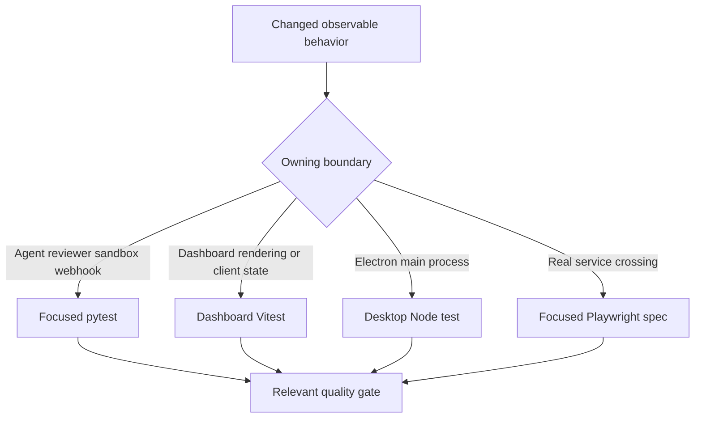
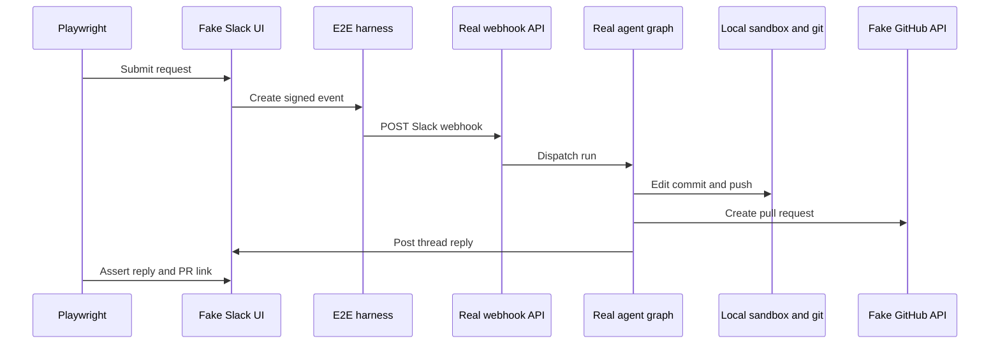

# Focused Testing Strategy and Harnesses

Validate at the lowest layer that owns the changed observable contract. Start with one existing behavioral test, one test node, or a focused manual check; do **not** run the full local suite. A new test is justified only by a concrete regression that current coverage would miss. Prefer a deterministic outcome over prompt snapshots, implementation-order assertions, or mocks that only prove themselves.


```mermaid
flowchart TD
    Change["Changed observable behavior"] --> Owner{"Owning boundary"}
    Owner -->|"Agent reviewer sandbox webhook"| Pytest["Focused pytest"]
    Owner -->|"Dashboard rendering or client state"| Vitest["Dashboard Vitest"]
    Owner -->|"Electron main process"| Node["Desktop Node test"]
    Owner -->|"Real service crossing"| Playwright["Focused Playwright spec"]
    Pytest --> Gate["Relevant quality gate"]
    Vitest --> Gate
    Node --> Gate
    Playwright --> Gate
```

This decision path routes a change to its narrowest useful proof, then adds an integration harness only when independently stateful or deployed pieces meet.

## Python: behavioral contracts and isolation

Pytest collects from `tests/` and uses asyncio auto mode, so asynchronous tests and fixtures need no per-test asyncio marker. Test families are organized by their owning concern; use the existing focused file instead of broad collection whenever possible.

`tests/conftest.py` makes ordinary Python tests independent of a live LangGraph Store and of an incidental local UI build:

- `fake_store` redirects `agent.store` access to an in-memory `FakeStore`, while preserving the real `model_dump`/`model_validate` serialization path. Seed it only when persisted state is the behavior under test.
- An autouse dashboard fixture points `DASHBOARD_STATIC_DIR` at a missing temporary path, so `ui/.output` cannot affect backend tests.
- The autouse cache reset clears both the local TTL cache and, where applicable, the in-process LangGraph cache before and after each test. The sandbox registries are also cleared around every test.
- The autouse auto-review stub returns enabled for every repository because the dashboard opt-in list is empty without a live Store. Replace that stub when testing an opt-in denial or repository policy.

### Select the owner that carries the failure semantics

| Change | Narrow proof and the behavior it protects |
| --- | --- |
| Main graph assembly, source-specific tools, skills, middleware, or backend wiring | `tests/agent/test_agent_assembly_context.py`. It captures `create_deep_agent` assembly: a sandbox-backed composite backend enables deepagents filesystem eviction and summarization; it also exercises source/visibility tool and skill boundaries. |
| Sandbox reconnection or asynchronous file/command operations | `tests/sandbox/test_sandbox_state.py`. It verifies one concurrent reconnect from live thread metadata, ignores stale run-config metadata, shields startup from waiter cancellation, retries a failed start, and delegates operations after lazy startup. |
| Reviewer learning/outcome persistence | `tests/reviewer/test_reviewer_outcomes.py` verifies the finding-level payload and the create-then-update path. The implementation maps resolved findings to true positives and dismissed findings to false positives; writes are best-effort and no-op without credentials. |
| Completion handling after an error or timeout | `tests/webhooks/test_completion_webhook.py`. It protects Slack failure replies and per-run deduplication, reviewer check settlement when check metadata and a token exist, and continued notification if reviewer cleanup fails. |

For a prompt change, do not assert raw wording. Test a rendered result, configuration precedence, available tool boundary, or user-observable behavior only if it represents a plausible regression.

## Focused Python commands and independent gates

Install the Python development environment with `make install`, which runs `uv sync --extra dev`. The `dev` extra supplies `ty`, pytest, pytest-asyncio, pytest-xdist, and Ruff; Pygments is a runtime dependency. `make test` and `make tests` run `uv run pytest -vvv $(PYTEST_ARGS) $(TEST_FILE)` only if `TEST_FILE` is an existing path. A pytest node ID is not a path, so invoke pytest directly for one test.

```bash
make install
make test TEST_FILE=tests/sandbox/test_sandbox_state.py
uv run pytest -vvv tests/sandbox/test_sandbox_state.py::test_sandbox_proxy_retries_failed_startup
make lint
make typecheck
```

Use `PYTEST_ARGS` for a focused pytest option with a file target. The Make target prints a skip message rather than failing for a nonexistent path; do not mistake that for a passing test.

Tests are not a substitute for the other Python gates: `make lint` runs Ruff checking and a format diff, `make format` applies both formatter and Ruff fixes, and `make typecheck` runs `ty check agent tests`. Run only the gate relevant to the changed surface when iterating; do not expand a local check into the full suite.

## Dashboard and desktop unit harnesses

The root `pnpm test` delegates workspace `test` tasks to Turbo, so it is broader than a focused change requires. Target the owner workspace instead:

```bash
pnpm --filter open-swe-dashboard run test
pnpm --dir desktop run test
```

The dashboard test command is `vitest run`; use its component/client tests for rendering, optimistic state, stream transformation, terminal state, or API-client behavior. The desktop command builds the Electron main bundle and then runs `node --test test/*.test.cjs`. Escalate from either only when the behavior depends on a real browser/server proxy, webhook, local-agent, or Electron integration boundary.

## Playwright: real paths with controlled external seams

The E2E harness is an integration system, not a UI mock. It mounts fake GitHub and Slack endpoints, mock Slack/GitHub pages, and control endpoints alongside the real agent API; its fake stores are the single state rendered in the mock pages. A simulated Slack delivery is signed and sent to the real webhook route. The real graph, tools, middleware, local temporary-directory sandbox, and git interactions execute; the sandbox pushes to a seeded local bare remote.

The scripted `BaseChatModel`, external SaaS HTTP APIs, App/OAuth credential boundaries, and snapshot boundary are substituted. This makes the agent's sequence deterministic without replacing the agent logic. `full_flow.spec.ts` proves the principal Slack request through implementation, branch/PR creation, and a link posted back to the same thread.


```mermaid
sequenceDiagram
    participant PW as Playwright
    participant Slack as Fake Slack UI
    participant Harness as E2E harness
    participant API as Real webhook API
    participant Agent as Real agent graph
    participant Git as Local sandbox and git
    participant Hub as Fake GitHub API
    PW->>Slack: Submit request
    Slack->>Harness: Create signed event
    Harness->>API: POST Slack webhook
    API->>Agent: Dispatch run
    Agent->>Git: Edit commit and push
    Agent->>Hub: Create pull request
    Agent->>Slack: Post thread reply
    PW->>Slack: Assert reply and PR link
```

The sequence shows the browser happy path: SaaS seams are controlled, while the webhook, graph, sandbox, git, and production tool paths remain real.

### Browser dashboard path

Browser E2E builds and starts the real `ui/` app rather than a dashboard mock. Global setup directs its server-side dashboard API and E2E proxy at the harness, then Playwright drives the UI server origin. That specifically covers server rendering, the session gate and redirect, hydration, same-origin `/dashboard/api/*` proxying, and a genuine signed session cookie. `E2E_FORCE_UI_BUILD=1` rebuilds the UI after UI or port changes. The browser configuration runs serially with one worker, excludes `desktop.spec.ts`, and has a 90-second test timeout.

Use the narrowest spec in `tests/e2e/tests/`; the directory includes flows for SSR, dashboard/thread state, approval/review behavior, Slack redelivery, sandbox identity, and workspaces. E2E needs PostgreSQL for the backend, so configure `POSTGRES_URI` before starting it.

```bash
pnpm install --frozen-lockfile
pnpm run test:e2e:install
pnpm exec playwright test tests/full_flow.spec.ts
```

Install Chromium with `test:e2e:install` before the first run. Prefer the single-spec command, which can reuse the warm `langgraph dev` server locally, over `pnpm run test:e2e`.

### Desktop end to end

`pnpm run test:e2e:desktop` selects only `desktop.spec.ts` and raises test and expectation timeouts to 180 and 120 seconds. The spec resets shared harness state, clones the seeded bare remote into an isolated temporary project, obtains a harness-issued `osw_session` cookie, and launches Electron against the shared fake boundaries. It verifies the local project edit and the fake-GitHub PR fields, rather than only an Electron UI response.

The desktop spec explicitly records an Electron trace and attaches screenshots for unified and completed local-agent views. It removes temporary desktop state unless `E2E_KEEP_TMP` is set; unlike browser E2E, the desktop Playwright configuration disables automatic trace, video, and screenshot capture.

## Failure diagnostics

Browser runs capture screenshots on failure and retain trace/video on failed attempts locally or the first retry in CI. Set `E2E_ARTIFACTS=1` to retain trace and video for every attempt, under `test-results/` and `playwright-report/`.

```bash
pnpm exec playwright show-report
pnpm exec playwright show-trace test-results/<test>/trace.zip
SLOW_MO=700 pnpm exec playwright test --headed
```

Inspect the trace, screenshot, server logs, and fake-boundary state before increasing a timeout or weakening an assertion. A focused manual check is preferable when it directly proves a UI detail without requiring a new broad or brittle test.

## Related pages

- [Agent graph](/openwiki/architecture/agent-graph.md)
- [Sandbox lifecycle](/openwiki/architecture/sandbox-lifecycle.md)
- [Quickstart](/openwiki/quickstart.md)
- [Invocation workflow](/openwiki/workflows/invocation.md)
