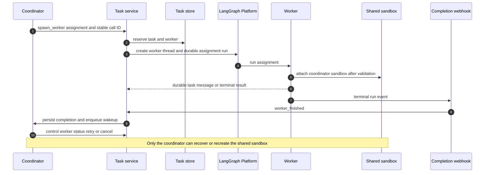

# Coordinator and Worker Task Collaboration

Task coordination lets one **coordinator** thread delegate bounded work to worker
threads without giving each worker an independent checkout or an unconstrained
ability to delegate again. A task is a durable database relationship, not merely
a collection of thread metadata: it has one coordinator, one workspace, role
memberships, and per-worker delegation records. Workers use the coordinator's
existing sandbox after the runtime validates that the task and security context
match.

The feature is currently opt-in-gated and `task_coordination_enabled` returns
`False` in this repository, so normal deployments reject delegation unless that
gate is implemented or overridden. Even when enabled, a one-shot CLI bridge is
unsupported because it closes when its coordinator run finishes; a desktop bridge
is the supported bridge exception. The coordinator must already have an attached
sandbox and the deployment must have a completion webhook before it can delegate.

Related: [Coding Agent Assembly and Execution](../architecture/agent-graph.md),
[Sandbox and Local Execution Lifecycle](../architecture/sandbox-lifecycle.md),
[Threads and state](../concepts/threads-and-state.md), and [Follow-ups, Interrupts,
and Stop Control](follow-up-messages.md).

## Roles, persistent records, and the lifecycle

The first `spawn_worker` call reserves a `Task` and inserts the coordinator
membership. Each worker reservation inserts a worker membership and a
`TaskDelegation` containing the stable worker ID, assignment, selected model and
effort, launch error, and cancellation state. Reservation is serialized with a
Postgres advisory lock keyed by coordinator thread ID. The worker ID is a UUIDv5
derived from coordinator thread ID and the tool-call ID, so replaying the same
tool call finds the same reservation rather than creating a duplicate worker.

A worker is deliberately a leaf: only a coordinator can call `spawn_worker`.
A worker can message only its permanent coordinator; a coordinator must name an
explicit worker belonging to its own task. The coordinator alone can inspect,
retry, or cancel one of its delegations. This creates a star rather than a
recursive delegation tree.

*Coordinator delegation reserves durable state before launch; workers attach to
the shared sandbox and return messages or terminal outcomes through durable
delivery.*

## Launching a reserved worker

`spawn_worker` resolves the authenticated actor, confirms owner, read, and post
access to the coordinator thread, checks the coordination gate, resolves the
task workspace, and validates the requested model/effort against workspace
choices. With no explicit request, it inherits a valid coordinator model and
effort or uses the workspace agent default. It rejects a sandbox guest, a
coordinator with no `sandbox_id`, empty instructions or missing stable tool-call
ID, and a deployment without `COMPLETION_WEBHOOK_URL`.

`launch_worker` creates the worker thread idempotently and records its initial
assignment as a durable task message before requesting an enqueued agent run.
Worker metadata copies the coordinator's owner identity, visibility,
administrative status, repository context, sandbox binding, proxy configuration,
and GitHub repository scope. It then pins task ID, coordinator host ID, workspace,
and explicit resolved model/effort. The persisted worker metadata is re-read and
checked for identity, workspace, task, host, visibility, admin, and repository
scope conflicts before its assignment is recorded. Source context is not copied.

Reservation and launch are intentionally separate. A transport error after the
platform accepts a run can leave a worker reservation and pending launch with a
recorded `launch_error`. `WorkerLaunchError` marks authorization and validation
failures non-retryable, while other launch failures can be retried through
`control_worker(action="retry")`. Retry resets attempts for the initial durable
message and repeats idempotent thread creation/launch; it never makes a new
worker identity for the same delegation.

## The shared-sandbox boundary

A task worker never creates, replaces, or independently recovers a sandbox.
When `ensure_sandbox_for_thread` sees worker `task_id` metadata, it takes the
shared-attachment path instead of the normal get-or-create path. That path
requires all of the following:

- the caller has a worker membership for the metadata task, and its
  `sandbox_host_thread_id` equals that task's coordinator;
- the host has coordinator membership in that same task;
- worker and host resolve to the same owner, task workspace, admin setting, and
  visibility, and neither metadata binding itself indicates another task host;
- the worker's requested/token scope cannot be narrower than the host sandbox's
  repository scope in a way that would expose a repository outside the worker's
  authorization; and
- the coordinator has an already existing, healthy sandbox. Attachment uses
  `require_existing=True`, so it fails rather than creating a box if the host
  has not attached or must recover first.

After attachment, the worker records the host sandbox ID and proxy configuration
in its own metadata and publishes a thread-local handle to that same backend.
It may reconcile its own background tasks, but it does not own the environment.
`recreate_sandbox_for_thread` explicitly rejects task-worker metadata: **only
the coordinator can recover or recreate the shared sandbox**. This avoids an
empty replacement silently discarding the shared checkout and uncommitted work.

## Messaging and event delivery

`message_task_thread` records communication, not just an in-memory prompt. It
uses a stable delivery ID based on sender thread and tool-call ID. Coordinator
messages target an explicit owned worker; worker messages target the task's
coordinator. `record_event` rechecks recipient ownership/postability, task
membership, workspace equality, and cancellation while holding the recipient's
advisory delivery lock, then writes a `TaskMessage`.

A `TaskMessage` stores its task, recipient thread, delivery ID, text, recipient
run configuration, optional display metadata, delivery attempts, and checkpoint
state. Its deterministic UUIDv5 and the database uniqueness on `(thread_id,
delivery_id)` make duplicate sends idempotent. Messages remain owed until their
recipient checkpoints an injected `event-match:<message-id>` input; middleware
then marks those IDs delivered and returns the remaining messages ordered by
match time and ID. Delivered rows are retained for seven days, while owed work
is not pruned merely because it is old.

Delivery creates a durable `agent` run with `multitask_strategy="enqueue"` and
all owed messages. It uses a per-recipient advisory lock, refuses cancelled
workers, does not wake a busy thread when enqueueing, and caps delivery attempts
at three. If dispatch fails after persistence, the message stays owed for a
later attempt. `TaskCoordinationMiddleware` adds role instructions and task
context before model calls; it injects owed messages before a model call and,
for workers, best-effort refreshes the coordinator-associated GitHub proxy.

Task-event display metadata distinguishes `message` from `completion`; only a
completion carries one of `success`, `error`, `timeout`, or `interrupted`.
Task text is delivered via structured input envelopes, with worker output and
worker-originated messages treated as untrusted content rather than trusted
instructions.

## Completion, follow-up, and cancellation

The general completion webhook calls `worker_finished` for terminal worker runs.
For a success it prefers the completed payload's final answer; otherwise it
looks up history by invocation ID (or run ID) so a newer run's answer is not
misreported. Failures produce a bounded failure description. The result is
persisted as a completion event for the coordinator using
`finished:<worker-thread-id>:<run-id>`, then delivered as an enqueued wakeup.
If result extraction fails, the coordinator still receives a notice to inspect
the worker thread.

A non-cancelled worker that finishes normally is eligible for its own pending
messages and event subscriptions to be delivered afterwards. A cancelled worker
suppresses any outcome except its `interrupted` result, and never restarts owed
work. Cancellation is a durable control operation: it marks the delegation
cancelled under the delivery lock, removes event subscriptions, interrupts all
pending/running worker runs, removes task messages, interrupts transcript turns,
and cancels scheduled wakeups. A cancelled worker cannot be retried or receive
further task messages; create a new worker instead.

`task_status` reports task details plus each worker's assignment, selected
model/effort, launch/cancellation state, thread status, and latest platform run.
This is operational inspection rather than an inferred lifecycle state: launch
can be incomplete even when its durable reservation already exists.

## Access and workspace invariants

The constraints below should be retained when extending the tools or changing
launch metadata:

1. **Owner identity is durable.** Operations require an authenticated Open SWE
   account and verify that the actor is the thread owner, not merely a user able
   to view a public thread. Missing `owner_user_id` is backfilled; checks use the
   resolved user identity so a reassigned login cannot inherit the old owner's
   task privileges.
2. **Thread permissions still apply.** Both sender and recipient operations
   enforce GitHub login gating plus normal readable/postable checks. Administrative
   threads are not a way around their access policy.
3. **One task, one workspace.** Creation resolves a real workspace row; task
   contexts, recipients, and workers must continue to match its workspace.
   Workspace deletion cascades to task, membership, delegation, and task-message
   rows.
4. **No privilege expansion via the worker.** The launch metadata and shared
   attachment validation preserve owner, visibility, admin flag, and GitHub
   repository restrictions. A worker cannot ask for sibling workers or attach a
   sandbox hosted by another task.
5. **The model is constrained by the workspace.** Inherited and explicit model
   choices must be available in the task workspace, and effort must be supported
   by that model. Worker launch writes the selected pair explicitly so later
   wakeups reproduce it.

## Focused verification

`tests/test_task_threads.py` exercises default-off gating, bridge eligibility,
owner identity and admin checks, model inheritance/validation, rejection of
worker-to-worker delegation, idempotent and concurrent reservations, lost launch
responses and retry, cancellation, follow-up to a completed worker, and
coordinator receipt of multiple worker reports. `tests/test_task_events.py`
checks completion-answer selection, failure handoff, structured untrusted-output
boundaries, persistence behavior, cancellation races, duplicate durable results,
retention/deduplication, and checkpoint acknowledgement of owed messages.
