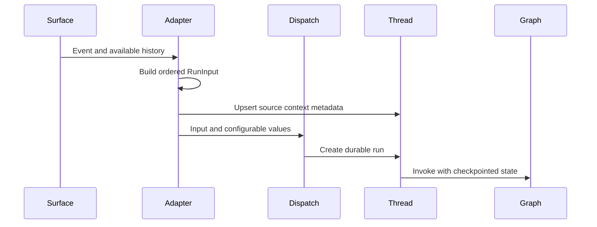
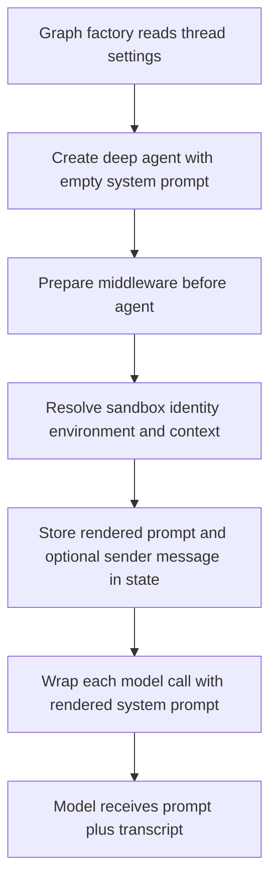

# Context Engineering and Prompt Preparation

Open SWE does not send an incoming webhook body directly to a model. It separates **run input**—an ordered, attributed transcript—from **thread metadata** that records routing provenance, and from **prepared prompt context** that is recomputed for a model invocation. This keeps external content structurally identifiable, preserves durable integration state, and allows credentials, workspaces, instructions, and review material to be refreshed without rewriting prior conversation.

See [Invocation](invocation.md) for durable-run semantics, [Agent graph](../architecture/agent-graph.md) for graph construction, [Reviewer and analyzer](../architecture/reviewer-and-analyzer.md) for their roles, and [Models, profiles, and instructions](../concepts/models-profiles-instructions.md) for settings ownership.

## From trigger to grounded graph input

`dispatch_agent_run` is the common boundary for a main-agent run. An adapter either supplies a deliberately constructed `RunInput`, or supplies content and lets dispatch derive a surface, sender, and optional Slack channel from `RunConfig`. It rejects ambiguous calls that combine a prebuilt input with content or identity parameters. The resulting durable run uses synchronous checkpoints, interrupt-by-default multitasking, resumable v3 event streaming, and configured completion webhook handling.

*Caption: surface-specific code creates grounded input and provenance before the graph begins; dispatch is the durable-run boundary.*

### Transcript envelopes and trust boundaries

`agent/input_messages.py` serializes authored text as an escaped `<input-message>` XML envelope. Each envelope carries a namespaced sender identifier, surface, kind (`human` or `system`), optional channel, and structured data. Text blocks of multimodal content are enveloped while non-text blocks retain their position. Invalid entity IDs and invalid structured-data element names fail construction; parsing helpers instead ignore malformed XML when attempting to recover a sender or context hash.

Before the authored message, builders can introduce people, channels, and systems as `<dynamic-context>` messages. The introduction has a SHA-256 hash of its canonical XML, allowing callers to suppress an already-injected identity. Slack channel `topic` and `purpose` are explicitly labeled `trust="untrusted"`: they are descriptive context, not instructions.

The visible-context rule matters after conversation compaction. `visible_dynamic_context_hashes` considers only messages at or after the deepagents summarization cutoff. An identity that remains in stored state but is no longer visible to the model must be introduced again. The main-agent prepare middleware uses the same mechanism for sender-specific context.

### Adapter-owned ordering and attribution

Surface adapters use prebuilt input where generic single-message inference would lose history or authorship:

- **Slack** begins with channel context, serializes earlier thread messages in order with separate human, Open SWE, and third-party-bot identities, adds operational system context, and appends the triggering request. Explicit trigger-user fallback prevents edits and approval-button actions from being attributed to the bot or to no one.
- **Linear** represents the issue description as system context with issue metadata, then adds selected comments as human messages with author introductions and comment IDs. It starts at the triggering comment when it can identify one; otherwise it selects recent non-bot context. Text and retrieved images remain multimodal blocks.
- **GitHub issue handling** stores issue provenance, uses only the new comment or update for an existing thread, and builds initial issue context with fetched comments for a new thread. Message data includes issue and event metadata.

The generic fallback gives Slack a triggering user/channel identity when present, otherwise prefers GitHub login, then Linear email, and finally uses a synthetic system sender. This is a fallback for simple dispatch callers, not a replacement for adapter-owned ordered history.

## Durable source provenance

`SourceContext` is thread metadata, not a prompt transcript. It records Slack-thread, Linear-issue, GitHub-issue, and PR references so integrations and lifecycle code can answer where a run originated. Slack, Linear, and GitHub adapters construct it and pass it to their thread-metadata upsert paths before dispatching the run.

The model is deliberately forward-compatible and fail-soft. It permits unknown keys, and `dump()` excludes unset defaults so a read–enrich–write operation retains fields written by newer integrations. `parse()` accepts mappings, returns an empty context for other shapes or validation failures, and logs a warning for validation failures. Consequently, malformed historical metadata loses optional routing context rather than failing the run.

## Prepare phase: fresh context without history mutation

Graphs are created with an empty system prompt and install a `BasePrepareRunMiddleware` subclass. Before the agent executes, the middleware prepares a workspace and renders context into state. Its latch is a hash of the latest message plus middleware-specific configuration: a resume after its checkpoint skips already-completed setup, while a later invocation with a different message or configuration prepares again. Every preparation operation must therefore be idempotent; an attempt that fails before checkpointing may repeat it.

For the main agent, preparation resolves the sandbox and working directory, environment, default repository, current sender identity and personal instructions, and participant identities. It records operational run metadata on a best-effort basis and schedules thread-title work. A sandbox-unreachable error posts an explanatory notification and is re-raised; it does not construct a prompt that pretends a workspace exists.

Sender context is appended as a separate structured system message only when a human input envelope supplies a sender ID. It is bound to that sender, includes the current turn's collaboration and draft-PR data, and is content-hashed as dynamic context. This deliberately avoids splicing volatile data into cached historical user messages.

*Caption: system material is computed during the checkpointed prepare phase and applied immediately before each model call, while the transcript remains distinct state.*

`awrap_model_call` combines `rendered_system_prompt` with an existing system message immediately before calling the model. Main-agent `construct_system_prompt` selects source guidance, workspace and repository setup, plan-mode guidance and active-plan material, configured default repository, custom repository instructions, environment instructions, and administrative context. The installed plan-mode middleware is state-aware, so plan restrictions also apply if the agent enters plan mode during a run.

### Instruction scope and precedence

The main prompt tells the agent to read root `AGENTS.md` after repository setup. Its conflict rule is intentional: `AGENTS.md` overrides repository-custom, environment, and sender-level instructions; repository-custom instructions override environment and sender instructions. Sender instructions are turn-local context rather than a mechanism to change repository policy.

`SubdirAgentsReadMiddleware` adds runtime scope discovery. After a successful string-result `read_file` call for an absolute path, it reads unread ancestor `AGENTS.md` files through the sandbox backend and appends a `<system-reminder>` to that tool result. Candidates are root-to-leaf, and the reminder says deeper rules take precedence. A direct `AGENTS.md` read is only marked as loaded. It bounds reads to 1,000 lines and 64 KiB, truncates oversized usable text, and quietly skips missing backends, errors, non-UTF-8 content, and unusable candidates without breaking the original file read.

## Reviewer-specific context

Reviewer preparation also derives a working directory and deterministically prepares a checkout. It fetches the PR diff and valid changed-line set, PR overview, existing review threads, organization review guidelines, a learned repository style prompt, and API standards. The rendered reviewer prompt receives the applicable material, while the diff state lets finding tools validate locations at creation time.

Repository conventions are fetched from GitHub Contents at the PR **base SHA**, not the untrusted head. Root loading prefers `AGENTS.md` and tries `CLAUDE.md` only after a 404; request errors, other status codes, and documents over 64 KiB produce no root context rather than a potentially misleading fallback. Changed paths yield normalized ancestor candidates. Scoped fetches run concurrently under a limit of eight, skip each failing or oversized path independently, and return shallow-to-deep order so the prompt can apply narrower rules last. Both root and scoped reviewer conventions may use `CLAUDE.md` as the 404 fallback.

Reviewer conventions are mandatory for in-diff findings, but scope remains limited: a nested document applies only below its directory, and pre-existing violations outside the diff are not findings. PR title and body are author-controlled and are rendered as an escaped untrusted-data block before inclusion.

## Skills as readable, routed context

Skills are `SKILL.md` virtual files advertised to deepagents, rather than instruction bodies copied wholesale into every prompt. The main agent's `CompositeBackend` leaves the sandbox/project backend as default and routes skill prefixes to read-only backends. Hosted runs always expose bundled skills and organization skills; they add credential-scoped user skills when a private credential is available. Desktop runs expose user skills from state plus bundled skills and use separate artifact routes to avoid writing scratch files into the project. The source order gives user skills priority when present.

The reviewer materializes trusted skills from the base reference after its checkout is ready, then uses `SkillsMiddleware` to append advertised locations, metadata, and load warnings to its prepared prompt. This makes review skill discovery base-branch controlled rather than PR-head controlled.

The review-style analyzer is separate from the reviewer. Its bootstrap and continual launchers place both bundled analyzer playbooks in the run input `files` channel using prefix-stripped paths. Its `CompositeBackend` maps `/skills/` to a `StateBackend`, so the analyzer reads `/skills/<name>/SKILL.md` without writing playbooks into its sandbox. The prepare middleware chooses `bootstrap-repo-analysis` or `continual-learning`, renders that path and repository/sample context, and the analyzer prompt directs the agent to follow the selected playbook.

## Safe changes and focused checks

When changing this pipeline, preserve these boundaries: external text must remain escaped and attributed; channel fields and PR descriptions must not become trusted instructions; source provenance must not be substituted for the model transcript; and current sender context must not rewrite prior messages. Any new prepare action must be safe on retry before the checkpoint is written.

Useful focused tests are:

- `tests/agent/test_input_messages.py` for escaping, multimodal ordering, identity deduplication, and reintroduction after summarization;
- `tests/agent/test_source_context.py` for forward-compatible round trips and malformed metadata;
- `tests/agent/test_dispatch.py` for the prebuilt-input contract and durable run configuration;
- `tests/middleware/test_subdir_agents_middleware.py` and `tests/agent/test_agents_md.py` for scoped injection and GitHub convention-fetch fallbacks; and
- `tests/agent/test_skills.py` for virtual skill routes and source behavior.
