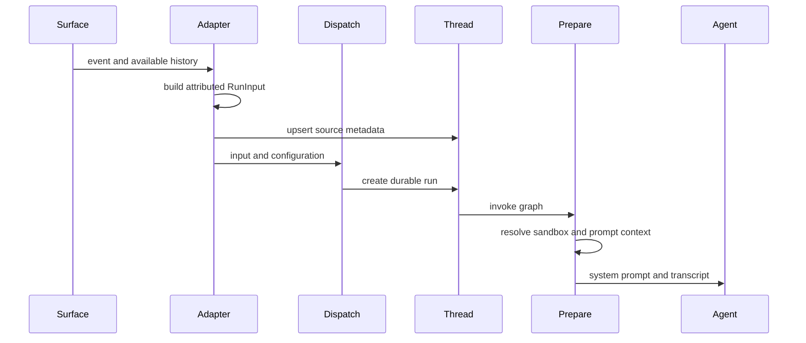
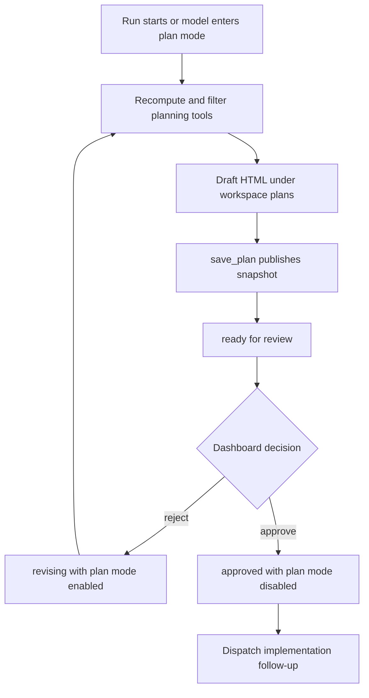

# Context Engineering and Plans

Open SWE does not pass a webhook body directly to a model. It separates four concerns: an ordered, attributed `RunInput` transcript; durable thread metadata that identifies the originating surface; per-invocation system and sender context; and capabilities supplied to the model. This separation is important for both correctness across long-lived threads and for treating surface content as data rather than as privileged instruction.

This flow shows that event normalization happens before durable dispatch, while fresh credentials, workspace facts, and sender context are prepared at execution time. See [Invocation](invocation.md) for the durable-run contract and [Agent graph](../architecture/agent-graph.md) for graph composition.

## Normalized input and identity context

`agent/input_messages.py` is the serialization boundary for application-owned input. A human or system message becomes an escaped `<input-message>` envelope with a namespaced sender, surface, kind, optional channel, structured `<data>`, and content. For multimodal input, text blocks are enveloped while non-text blocks remain intact. Invalid sender or entity identifiers are rejected, and parsers ignore malformed XML instead of accepting it as authoritative.

Introductions for people, channels, and systems are separate `<dynamic-context>` user messages placed before the authored input. Their canonical XML is SHA-256 hashed. Slack channel `topic` and `purpose` are explicitly labelled `trust="untrusted"`: they are useful routing context, not instructions.

### Dispatch defaults and surface history

`dispatch_agent_run` is the common boundary for Slack, Linear, GitHub, dashboard, and other agent triggers. Callers either provide a complete `RunInput`—needed for a multi-participant historical transcript—or provide content and optional identity data. It rejects mixing the two forms, generates fallback identities from `RunConfig` when necessary, and creates the run with the platform's durable streaming defaults.

The fallback dispatcher attributes a Slack trigger to its configured user and channel; otherwise it uses a GitHub login, then a Linear email, then a synthetic `system:<source>` sender. Adapters provide richer, source-specific context:

- **Slack** constructs channel and participant introductions, preserves thread-message order, distinguishes Open SWE and third-party bots from people, supplies operational context, and attributes the triggering request even when an edit or interaction lacks an ordinary message author.
- **Linear** serializes the issue description as a system message with issue metadata and comments as attributed human messages. It starts at the triggering comment when present, otherwise chooses recent non-bot comments; description and selected-comment images remain multimodal blocks.
- **GitHub** stores issue or PR provenance and sends structured issue/comment metadata. A first issue-thread run fetches and orders issue comments for initial context; an existing thread receives only the new follow-up or update.

### Context survives summarization without needless repetition

The thread records hashes of injected dynamic context. `build_input_messages` omits an introduction already injected during that construction, while execution compares introductions with contexts still visible to the model. Deepagents summarization replaces messages before its cutoff with a summary, so identities before the cutoff must be reintroduced even though they remain in state. This prevents a visible later message from losing the identity that explains its sender.

## Durable provenance is distinct from model input

`SourceContext` is stored under `source_context` in thread metadata and records a Slack thread, Linear issue, GitHub issue, and/or PR number. Webhook paths upsert it alongside source, repository, and identity metadata. It is a durable pointer for replies, authorization, and lifecycle behavior—not a substitute for the current `RunInput` transcript.

The models deliberately tolerate distributed and historical writers: declared models allow extras, `dump()` excludes unset defaults, and `parse()` returns an empty context after invalid metadata rather than failing a run. Consequently, a read-enrich-write caller does not discard fields introduced by another integration.

## Prompt assembly and instruction boundaries

The graph is created with an empty base system prompt. `PrepareAgentRunMiddleware` performs setup before the agent: it resolves the sandbox and work directory, GitHub token, default repository, environment, sender identity and standing instructions, schedules title work, and records run metadata. It renders the system prompt with source guidance, repository scope, plan guidance, repository custom instructions, environment instructions, and shared tool guidance.

Preparation is checkpointed by a SHA-256 fingerprint of the latest message, middleware class, and configuration-specific inputs. A resumed attempt with the same fingerprint skips completed setup; a later invocation prepares again, so preparation operations must be idempotent. Sandbox unreachability is reported and re-raised rather than allowing an agent to continue without a workspace. Immediately before each model call, the middleware combines `rendered_system_prompt` with any existing system message.

Sender context is deliberately added as a separate, structured system-attributed input message. It says that it applies only to the current sender turn and supplies commit identity, PR drafting preference, participant identities, collaboration details, user instructions, and workspace-admin status. It is not spliced into historical human input, which would mutate a cached thread transcript and misattribute later participants.

Prompt templates are packaged resources: `load_prompt` permits only relative `.md` names beneath the prompt root and rejects absolute or traversal paths; `render_prompt` applies `string.Template` substitutions. Tool descriptions are optional per-tool prompt resources, so a missing description leaves the tool unchanged.

## Repository instructions and skills

The main prompt requires reading root `AGENTS.md` after repository setup and gives it precedence over custom, environment, and sender instructions. `SubdirAgentsReadMiddleware` adds scoped behavior: after a successful text `read_file`, it loads unread ancestor `AGENTS.md` files from the sandbox in shallow-to-deep order and appends a `<system-reminder>` saying deeper instructions win. Direct reads mark a file as loaded. Candidate failures—including absent backends, read errors, non-UTF-8 data, and empty content—never turn a successful requested read into a failure; content is limited to 1,000 lines and 64 KiB.

The reviewer has no need to clone just to obtain conventions. It fetches root `AGENTS.md` at the PR reference from GitHub Contents, falling back to `CLAUDE.md` only after a 404. Any other status, fetch failure, or file over 64 KiB yields no root convention. It independently derives changed-file ancestor paths and concurrently fetches scoped `AGENTS.md` or `CLAUDE.md` documents; successful results retain shallow-to-deep ordering so nested rules can override parent rules.

Skills are read-only virtual `SKILL.md` files rather than prompt text copied wholesale. The main graph uses `CompositeBackend` to route `/bundled-skills/`, `/organization-skills/`, and, for logged-in hosted runs, `/skills/` to read-only backends; `create_deep_agent(skills=...)` advertises those sources. Desktop runs instead expose user skills from a read-only state backend and put artifact routes outside the project checkout. The review-style analyzer separately seeds its playbook files in the input `files` channel and mounts a `StateBackend` at `/skills/`; the composite route strips that prefix before lookup.

## Plan mode and approval-gated implementation

Plan mode is a per-run capability restriction backed by both configuration/state and thread metadata. It can start from `configurable["plan_mode"]`, including a review rejection re-dispatch, or begin mid-run when the model calls `enter_plan_mode`. That tool persists `planning` and `plan_mode=True` when possible and returns a state update plus an instruction to research, create an HTML artifact under `/workspace/plans/`, publish it, and wait for approval.

`PlanModeMiddleware` is installed even for non-planning runs. Its `before_agent` reset prevents a stale state value left by an earlier run from silently restricting an approved implementation run. For every model request it recalculates whether plan mode is active and removes excluded tools. The exclusion set blocks delegation (`task`), MCP tools, PR and background actions, external mutation-capable `http_request`, Slack thread-moving/creation, environment and automation management, and other external mutators. File editing remains available to draft the plan outside the checkout. This is intentionally not a complete filesystem or shell sandbox: `execute` remains available and the prohibition on mutating shell commands and repository files is prompt-enforced.

This flow shows the artifact publication and state transitions that gate implementation; the model's changing tool list is recomputed on every turn.

A plan has two representations: a self-contained HTML file in the thread sandbox and a published LangGraph-store snapshot for the dashboard. `save_plan` accepts only a nonempty UTF-8 `.html` file directly under `/workspace/plans/`, caps it at 20,000 lines, wraps it as an HTML artifact, and publishes `ready` in plan mode or `shared` outside it. Published content tracks `planning`, `ready`, `shared`, `revising`, `approved`, or `cancelled`; status and `plan_mode` are mirrored to thread metadata. Re-publishing a revised plan clears old comments best-effort, whereas a manual dashboard edit preserves them and mirrors the edited plan back to the sandbox best-effort.

Dashboard plan routes require same-origin mutation protection and session-based readable/promptable-thread authorization. Comments are stored per thread, ordered oldest first, and only their author may delete them. Approval serializes decisions per thread with an in-process lock, requires both metadata and stored content to be `ready`, records the approver, disables plan mode, and dispatches a new follow-up containing the reviewed artifact and formatted comments. If dispatch fails, it restores `ready` and plan mode. Rejection requires a ready plan, switches to `revising`, and can re-dispatch a planning follow-up with review feedback. Shared artifacts are explicitly not implementation plans.

## Safe changes and focused verification

Preserve the distinctions between untrusted source content, attributed input, durable provenance, rendered system instructions, and tool availability. In particular, do not elevate channel topic or purpose to trusted instructions; do not edit cached history to attach fresh sender context; and do not treat dynamic context before a summarization cutoff as visible. When modifying plan mode, test both activation paths, stale-state reset, and per-model-call tool filtering—not just the initial tool list. When modifying approval, test authorization, ready-state checks, store failures, failed re-dispatch rollback, and the fact that comments reach the next run.

Focused coverage includes input-message and source-context tests, dispatch tests, scoped and reviewer convention tests, skills-routing tests, `test_plan_mode.py`, and `test_plan_review.py`; end-to-end plan review coverage is in `e2e/tests/plan_review.spec.ts`.
