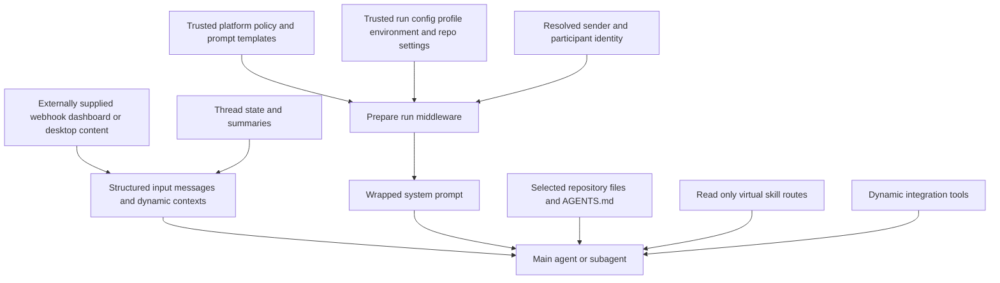

# Context engineering

Context engineering is the run-time assembly process that gives an agent sufficient, attributable context without treating every string as policy. A run starts with a webhook, dashboard, or desktop input; structured messages preserve who said what and on which surface. Before the first model call, run preparation resolves trusted configuration, creates or reconnects the sandbox, renders the system prompt, and may append a separate trusted sender-context message. Repository conventions and skills are then available through bounded, read-only or sandbox-backed file paths rather than copied indiscriminately into every prompt.

See also [Invocation](invocation.md), [Follow-up messages](follow-up-messages.md), [Agent graph](../architecture/agent-graph.md), [Reviewer and analyzer](../architecture/reviewer-and-analyzer.md), and [Models, profiles, and instructions](../concepts/models-profiles-instructions.md).

## Trust and data flow

*Trusted configuration is assembled by platform code; externally supplied event content and repository material retain a distinct, attributable route into the model context.*

The diagram is a trust boundary, not a claim that repository files or user messages are harmless. The system prompt explicitly identifies external GitHub comments from outside the organization as untrusted context, and the message serializer marks Slack channel `topic` and `purpose` fields as `trust="untrusted"`. Models must not elevate those strings into instructions merely because they appear next to trusted configuration. The repository-scope policy likewise rejects repository hints found only in channel metadata, quoted text, or other untrusted contextual content as authorization to modify an outside organization.

## Entrypoints and durable provenance

Slack, Linear, and GitHub webhook handlers create a deterministic thread identity, build a `RunInput`, persist thread metadata, and dispatch a LangGraph run. `SourceContext` is the durable, typed pointer to the originating Slack thread, Linear issue, GitHub issue, or PR number. It is stored under `source_context` in thread metadata and is also carried by the baby-sit watch record, enabling response and lifecycle code to identify the originating surface without reconstructing it from prompt text.

`SourceContext` is intentionally tolerant of evolution and bad historical metadata:

- Its models allow extra keys and `dump()` excludes unset fields, preserving additions made by other writers rather than materializing defaults during a read-modify-write cycle.
- `parse()` returns an empty context for a non-mapping or validation failure and logs the validation failure. A malformed provenance field therefore does not prevent the run from executing.
- Metadata upsert preserves a nonempty existing origin: subsequent messages on the same thread cannot repoint it. It enriches Slack context with a permalink when possible, while metadata persistence failures are logged rather than made fatal to dispatch.

### History is supplied, not rediscovered

For an initial Linear issue run, the webhook fetches issue details and selects comments from the triggering comment onward; when it cannot locate that comment, it uses the recent relevant tail and filters recognizable previous bot replies. It serializes each included human comment, along with the issue description and optional image blocks, into the initial input. GitHub issue setup similarly constructs a system event plus an attributable description/comment history; follow-ups become a new attributable human message. This front-loads the relevant conversational record, avoiding an agent-side history fetch as a prerequisite for understanding the request.

## Attributable input envelopes and thread memory

`input_messages.py` is the serialization boundary for application-owned model inputs. A human or system text block is emitted as an `<input-message>` envelope containing a namespaced sender, surface, kind, optional channel, structured data, and escaped content. Text blocks in multimodal content are wrapped while non-text blocks pass through. Entity introductions are separate `<dynamic-context>` messages for people, channels, and systems, so a message can refer to a stable sender identifier without repeatedly embedding the entire identity.

Entity IDs must be nonempty namespaced identifiers and cannot contain whitespace or XML-breaking characters; structured data field names are also validated. These checks, escaping, and explicit role metadata preserve structure but do not make the authored text trusted. In particular, only the platform-generated `system:sender-context` is trusted metadata about a sender; it applies to the turn that produced it and must not be carried to another participant.

Dynamic contexts are canonicalized and SHA-256 hashed. A hash is emitted once per visible thread context, with the injected-hash metadata preventing duplication across invocations. Summarization is a special case: it replaces messages before its cutoff with a summary. `visible_dynamic_context_hashes` therefore only counts contexts at or after that cutoff, allowing an identity introduction that the model can no longer see to be sent again.

## Preparation: fresh context for each invocation

`BasePrepareRunMiddleware` provides checkpointed `before_agent` setup. It hashes the middleware class, latest message, and preparation configuration. A checkpointed matching fingerprint skips repeated setup during a resume, but a later invocation on the same thread has a new fingerprint and rebuilds ephemeral prompt, token, and diff-dependent context. `_prepare` implementations must consequently be idempotent: a failure before the checkpoint can cause setup to run again.

The main `PrepareAgentRunMiddleware` resolves the sandbox and work directory, environment, default repository, GitHub identity, sender instructions, and participant identities. It renders the full system prompt into `rendered_system_prompt`; the base middleware prepends that rendered text to any existing system message and wraps it in `<system-instructions format="open-swe-v1">`. The wrapper includes a system identity introduction and serializes additions as system input messages, avoiding duplicate additions on an already-wrapped prompt. If the sandbox is unreachable, preparation posts a user-facing notification and re-raises rather than continuing without a working backend.

Sender context is appended as its own system message after the run input rather than spliced into historical user text. It is keyed to the latest attributable human sender and given a content hash; if its dynamic introduction remains visible after summarization, it is not injected again. This preserves cached historical input bytes and ensures that sender-specific instructions and commit identity apply only to the most recent sender.

### Instruction precedence and repository scope

The static prompt is trusted platform policy. It includes repository modification boundaries based on `ALLOWED_GITHUB_ORGS`, run mechanics, and operating constraints. Workspace-admin repository-specific instructions and environment instructions are mandatory prompt additions; the sender's saved instructions are per-turn. `AGENTS.md` has higher precedence than those additions when they conflict. The main agent must synchronize or clone first, then read root `AGENTS.md` in full before other work; its content is mandatory and overrides defaults.

This ordering is operationally important: configuration controls the agent's system behavior and authority, while a selected repository provides scoped engineering conventions. A user cannot override the outside-organization modification rule by requesting an instruction override, and contextual repository references alone do not grant the full-URL exception.

## Repository instructions at review and read time

The reviewer does not depend on a model clone to discover root conventions. It fetches `AGENTS.md` at the PR base SHA through the GitHub Contents API, with `CLAUDE.md` as a legacy fallback. It falls through only after a 404; a transport failure, another response status, or content over 64 KiB returns no document, avoiding a stale fallback or prompt bloat. Review preparation runs this fetch concurrently with diff, overview, guidelines, style, and trace work.

Reviewer scope is finer grained for a diff. Ancestor `AGENTS.md` candidates are derived from changed paths, normalized to reject absolute and parent-traversal paths, ordered shallowest-to-deepest, and fetched concurrently with a semaphore. Each candidate can fail independently. This makes nested instructions available for the changed subtree while allowing later, deeper paths to take precedence.

The main graph supplements the required root-file read through `SubdirAgentsReadMiddleware`. After a successful string result from `read_file`, it finds ancestor `AGENTS.md` paths in the run's sandbox backend and appends newly loaded files inside a `<system-reminder>`. The reminder names the read file and says deeper scopes win. It does not alter non-`read_file` calls, error results, or non-string results. It tracks loaded paths per thread (a direct `AGENTS.md` read counts as loaded), caps reads at 1,000 lines and 64 KiB, truncates oversized text with `[truncated]`, skips non-UTF-8 data, and swallows individual candidate-read failures. Therefore, a missing convention file cannot make an ordinary file read fail.

## Skills: progressive disclosure through virtual files

Skills are reusable `SKILL.md` playbooks advertised to deepagents through the `skills` route list and read with ordinary `read_file` only when relevant. The main graph constructs a `CompositeBackend`: its ordinary sandbox or project backend remains the default, while route prefixes delegate to skill backends with the prefix removed. This separates read-only reusable guidance from writable project and scratch state.

Hosted runs mount:

- `/bundled-skills/`, a read-only virtual `FilesystemBackend` rooted at `agent/bundled_skills/`. The bundled `baby-sit` and `html-artifacts` skills are always available.
- `/organization-skills/`, a read-only `StoreBackend` under the organization namespace.
- `/skills/`, when a profile login exists, a read-only per-user store namespace. This route is first in the advertised source order, ahead of organization and bundled sources.

Desktop runs instead carry user skills in state through a read-only `StateBackend`, omit organization skills, and add dedicated artifact routes so scratch artifacts do not write into the local project default backend. Skills persisted by the dashboard are virtual `/<name>/SKILL.md` files with YAML `name` and `description` frontmatter followed by a complete instruction body. The store validates lowercase hyphenated names, limits descriptions to 1 KiB and instructions to 20 KiB, and caps organization skills at 1,000. User skill tools resolve the triggering GitHub login and cannot target another user or bundled skill; organization skill tools require an administrator because their content reaches all users. Updates replace the full body, not a patch.

The style analyzer uses the same mechanism independently: it mounts a state backend at `/skills/`, seeds prefix-stripped files from `agent/skills/`, and advertises the `bootstrap-repo-analysis` or `continual-learning` playbook according to mode. It never writes those playbooks into the analyzer sandbox.

## Dynamic integrations and safe extension points

The graph's static tools are known during construction. Optional observability, Currents, Notion, Browser, and Corridor capabilities are grouped behind `DynamicToolMiddleware`; integration loading can therefore be deferred until the agent needs it. Corridor has an explicit static catalog and delays its MCP handshake. This is an extension point for tools, not a prompt-text injection path: dynamic tools are registered with reserved deep-agent and static names excluded from collisions.

To extend context safely, prefer one of these boundaries:

1. Add a typed field or backward-compatible extra to `SourceContext`, then preserve it through metadata upsert and make rendering explicit.
2. Use `build_input_messages` for new event sources so origin, identity, and authored content remain separable; label externally supplied metadata as untrusted where appropriate.
3. Add trusted system policy through prompt construction or preparation, whose fingerprint and lifecycle semantics are understood, rather than rewriting saved message history.
4. Expose reusable instructions as a bounded, read-only skill route, with validation and authorization appropriate to its audience.
5. For repository-local rules, preserve the base-SHA and scoped-read behavior; do not substitute a mutable default-branch fetch.

Focused regression coverage belongs around envelope escaping/validation and dynamic-context deduplication after summarization, malformed and multi-writer `SourceContext` metadata, preparation resume versus new-invocation behavior, scoped `AGENTS.md` fetch failures and precedence, middleware non-interference with failed reads, and skill routing/authorization. These are the boundaries where an apparently small context change can otherwise become a policy, privacy, or reliability regression.
