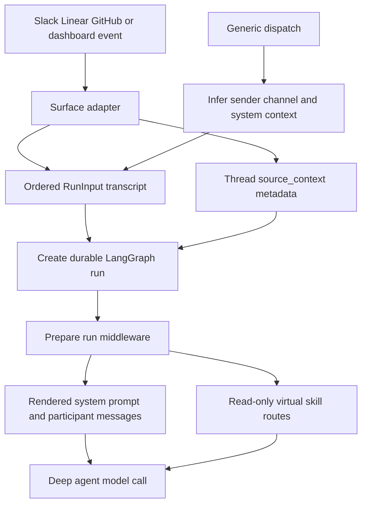

# Context Construction

Context construction separates three concerns that should not be conflated: an **attributed transcript** for the model, **durable source provenance** for the thread, and **fresh execution context** such as workspace instructions and a sandbox path. Surface adapters may build a complete ordered `RunInput` when they know the history; otherwise dispatch supplies a single normalized envelope and inferred identity. The graph then prepares prompt material for this invocation without rewriting past turns.

See [Inbound Invocation to Durable Run](invocation.md) for admission and durable-run creation, [Agent graph](../architecture/agent-graph.md) for graph assembly, and [Models, Profiles, and Instruction Resolution](../concepts/models-profiles-instructions.md) for instruction authority and model selection.

*Caption: source-specific code constructs a transcript and records routing provenance before the run; preparation supplies the invocation-specific prompt and skill filesystem immediately before model execution.*

## Structured input is a transcript, not a prompt string

`RunInput` contains `messages` and can also carry virtual `files`. `human_input` and `system_input` serialize authored text as escaped `<input-message>` envelopes. Each envelope carries a namespaced sender ID, surface, kind, optional channel, and scalar or nested structured data. For multimodal input, only text blocks are enveloped and non-text blocks are retained, so adapters can attach images without discarding their modality.

Entity introductions are separate user-role `<dynamic-context>` messages for people, channels, and systems. They describe data that is stable across a turn—such as a sender's GitHub login or a Slack channel's topic—rather than embedding it repeatedly in every message. IDs must be non-empty namespaced identifiers and structured-data element names are validated; malformed XML is ignored by parsing helpers rather than accepted as trusted structure.

### Adapter and fallback construction

Adapters use a prebuilt transcript when ordering and attribution matter. Slack introduces its channel and known senders, replays undispatched non-Open-SWE thread messages in order, represents third-party bots as system senders, adds operational Slack context, and finally appends the triggering request. Its trigger-user fallback avoids attributing edits or button actions to the bot or to no one. Slack also stages eligible attached files in the sandbox; failures to reach the sandbox, download a file, or upload it are logged and skip that attachment rather than failing the turn.

Linear begins with a system identity and structured issue-description message, then serializes relevant comments with author identities and comment IDs. It starts at the triggering comment when it can identify it; otherwise it chooses recent comments while filtering known bot responses. Description and comment images are preserved as blocks. GitHub issue and PR paths likewise build attributed messages with issue/PR, comment, path, line, and time fields; a newly created issue thread fetches and orders existing comments, while an existing thread sends its incremental update.

The generic `dispatch_agent_run` path serves simpler callers. It derives Slack, GitHub, Linear, or synthetic-system identity from `RunConfig`, canonicalizes a person when possible, and uses `build_run_input`. A caller must choose either this raw-content route or a prebuilt `input`: combining them is a `ValueError`, which prevents accidental duplicate or conflicting identities. Dispatch then creates the durable run with the shared invocation and streaming configuration.

## Deduplication and history boundaries

A dynamic context has a SHA-256 hash over canonical XML. Constructors suppress hashes already supplied during that build; dispatchers also inspect persisted state or metadata so an identity is not needlessly repeated. Crucially, visibility is not the same as presence in state: summarization replaces messages before its cutoff with a summary, so `visible_dynamic_context_hashes` examines only the remaining visible suffix. Context hidden behind the cutoff may be injected again, preserving attribution for messages the model can still see.

Slack applies the same principle to replay: it reads visible context hashes and source timestamps from thread state, skips timestamps already sent and Open SWE's own replies, and treats an unreadable state as empty. The failure mode is deliberate repetition rather than silently omitting a new request's context. Dashboard starts merge injected hashes from metadata and retained message state, then write the updated hash set back to thread metadata.

## Provenance belongs in thread metadata

`SourceContext` is not the model transcript. It records source locations—Slack thread references, Linear issues, GitHub issues, and an optional PR number—under `source_context` in thread metadata so completion, watches, and cross-surface behavior know where a run originated. Slack, Linear, and GitHub setup persist this context while building the corresponding thread configuration.

The model is deliberately forward-compatible with metadata writers. Its models allow extra keys, and `dump()` excludes unset defaults, so read-enrich-write callers do not manufacture empty fields or erase unknown extensions. `parse()` accepts mappings only and returns an empty context after validation failure (with a warning), favoring a runnable thread over a metadata-validation outage.

## Per-invocation prompt preparation

The deep agent is assembled with an empty static system prompt. `PrepareAgentRunMiddleware` runs before the agent to resolve credentials, sandbox and work directory, workspace and participant data, optional recent-thread context, and the selected model; it records run metadata and returns `rendered_system_prompt`. For a hosted run, sandbox attachment failures are notified and re-raised, rather than allowing execution to continue without its workspace. Its before-model wrapper combines that rendered prompt with an existing system message for every model request.

Preparation is checkpoint-aware. `BasePrepareRunMiddleware` fingerprints the middleware class, latest message, and preparation configuration. Once `run_prepared` and that fingerprint have been checkpointed, a resumed attempt skips setup; a later invocation with a changed message or configuration prepares new credentials and context. `_prepare` implementations must therefore be idempotent because a failure before checkpointing can cause a retry.

Participant context is added as separate dynamic person messages only when it is not already visible, ordered deterministically by display name and person ID. This avoids mutating a historical user message with current sender information, which would change cached conversation history across invocations. The rendered main prompt is composed from source guidance, optional configured default prompt, repository scope, collaboration guidance, repository custom instructions, workspace instructions, and eligible recent thread context. Repository custom instructions override workspace instructions on conflict, and both explicitly yield to `AGENTS.md`; a person's standing instructions apply only to that person's request and also yield to those repository rules.

## Repository conventions

The main agent enforces scoped repository instructions through `SubdirAgentsReadMiddleware`. After a successful `read_file` result for an absolute path, it finds unread ancestor `AGENTS.md` candidates from shallowest to deepest, reads them from the sandbox, and appends a `<system-reminder>` saying that deeper instructions take precedence. Reading an `AGENTS.md` directly marks it as loaded. The middleware caps each candidate at 1,000 lines and 64 KiB, truncates oversized UTF-8 text, and lets missing backends, errors, non-UTF-8 content, empty content, and failed candidate reads leave the requested read intact.

The reviewer does not depend on a clone for baseline conventions. It fetches a root document through GitHub Contents at the supplied PR ref, preferring `AGENTS.md` and trying `CLAUDE.md` only after a 404. Network errors, other HTTP responses, and content larger than 64 KiB produce no fallback text. For changed files, it independently derives valid relative ancestor paths and concurrently fetches scoped convention documents; failures on one path do not hide others, and shallow-to-deep ordering permits nested instructions to override parents.

## Skills are virtual, read-only files

Skills are advertised to deepagents by route, but their bodies are not copied into the system prompt. The main graph places its normal sandbox behind a `CompositeBackend` and mounts bundled skills as read-only virtual filesystem content. Hosted runs also mount read-only organization storage and, when a credential login is available, that user's store namespace; user skills are placed first in the advertised source list. Desktop uses run-state-backed user skills instead and routes artifacts away from the project checkout. `create_deep_agent(..., skills=skill_sources)` lets the agent discover the routes and read `SKILL.md` through normal file tools.

The review-style analyzer uses a separate `CompositeBackend` route at `/skills/` backed by `StateBackend`. Launchers seed prefix-stripped bundled `SKILL.md` files in the run input's `files`; route delegation strips `/skills/`, while the agent reads the public `/skills/<name>/SKILL.md` path. Its preparation prompt selects the `bootstrap-repo-analysis` or `continual-learning` playbook for the configured mode.

## Focused verification and safe changes

Use `tests/agent/test_input_messages.py` for envelope validation, multimodal preservation, hash behavior, and visibility after summarization; `tests/agent/test_dispatch.py` for fallback construction and dispatch contracts; and `tests/agent/test_source_context.py` for tolerant metadata parsing. `tests/slack/test_slack_context.py` covers Slack attribution and replay behavior. `tests/agent/test_agents_md.py` and `tests/middleware/test_subdir_agents_middleware.py` exercise convention discovery and failure handling, while `tests/agent/test_skills.py` and `tests/middleware/test_workspace_skills.py` cover virtual skill routing.

When changing this pipeline, preserve the distinction between event content, attributed metadata, provenance, and system-level instructions. In particular, do not convert a prebuilt transcript into a second generic input, mutate prior messages to attach current identity, or treat context before a summary cutoff as visible to the model.
