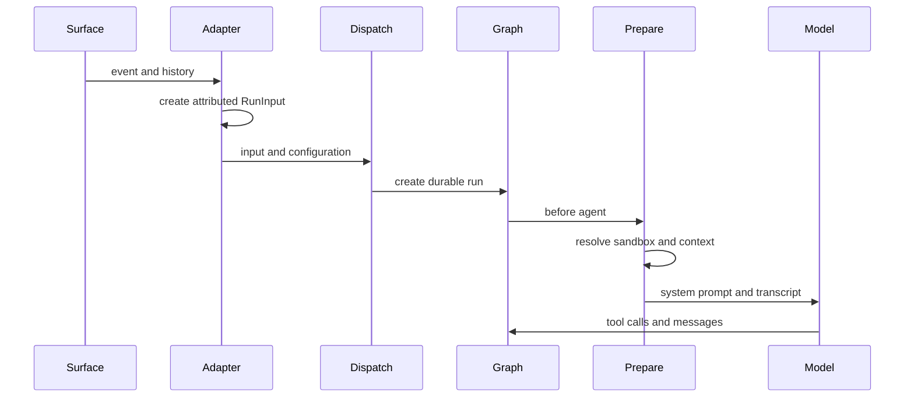

# Context Assembly and Prompt Engineering

Model-visible context is assembled in layers, not by passing an inbound webhook body directly to the model. The durable layer is a normalized `RunInput` transcript. At execution, preparation resolves a sandbox and builds fresh system instructions, identities, and optional recent context. Repository conventions and skills are then available through ordinary tools rather than copied blindly into the initial prompt. [Invocation](invocation.md) describes durable runs; [Threads and state](../concepts/threads-and-state.md) describes their state boundary.

*Context flow: adapters create the durable transcript first; preparation injects run-specific material immediately before model calls.*

## Two kinds of model input

**Durable transcript input** is the `RunInput.messages` list stored with the run: source messages, their attributed senders, channel/system introductions, and structured event metadata. Its ordering is deliberate. A prebuilt transcript cannot be mixed with raw content, identities, channels, or systems at `dispatch_agent_run`; otherwise dispatch builds one from supplied context or its fallback identity resolution. The resulting durable run carries configuration and metadata separately.

**Dynamically injected context** is computed against current state or current services. Examples are participant identity blocks, workspace and repository settings, a recent-thread-context section, sandbox location, credentials-derived sender identity, and messages arriving in the queue while an agent is running. It is not a rewrite of historical input. Preparation checks what is still visible after summarization before reintroducing a person, and applies a checkpointed setup latch only for the same message/configuration fingerprint; a later invocation re-prepares fresh material.

**Reviewer instruction context is target-branch context, not agent workspace context.** The PR reviewer fetches root and changed-file convention documents from GitHub at `base_sha`, then inlines the successful results into its reviewer prompt. This is intentionally independent of the checkout used by the main agent and does not imply that the documents came from the PR head.

## Transcript normalization and trust boundary

`human_input` and `system_input` serialize authored text as escaped `<input-message>` envelopes with namespaced `sender`, `surface`, `kind`, optional `channel`, and validated structured `<data>`. Text blocks in multimodal content are wrapped while non-text blocks retain their position. Entity introductions use `<dynamic-context>` messages for people, channels, and systems; their canonical XML has a SHA-256 identity used for deduplication. IDs and data-field names are validated, and parsing helpers ignore malformed XML.

Channel descriptions, Slack topic/purpose, issue bodies, comments, and other surface material remain application input rather than system instructions. They may be useful context, but serialization and attribution do not make their content trusted commands. External GitHub comments are separately addressed by the system prompt's untrusted-comment guidance.

Adapters build richer transcripts when simple fallback attribution is insufficient:

- Slack creates a channel introduction, replays relevant prior messages in order with human and third-party bot identities, avoids replaying Open SWE's own output or already-dispatched timestamps, and appends the triggering request. It falls back to the known triggering user for edits and button paths whose event timestamp cannot safely identify a human author.
- Linear emits the issue description as a system message with issue metadata, then included comments as attributed human messages. It chooses comments from the triggering comment onward when possible, otherwise recent non-bot comments, and preserves fetched image blocks.
- GitHub issue processing records issue provenance and uses an attributed follow-up on an existing thread; a new thread constructs initial issue/comment input. Review-comment handlers likewise pass structured, attributed input to the reviewer graph.

Dynamic introductions are deduplicated by their computed hash. State visibility, rather than merely historical existence, controls deduplication: summarization replaces pre-cutoff messages, so a context behind its cutoff must be eligible for reintroduction. Dashboard processing also persists injected hashes in thread metadata while consulting current graph messages, and queue injection uses visible hashes to avoid repeating context within a live run.

## Provenance is metadata, not prompt history

`SourceContext` is the durable routing/provenance record under `source_context` in LangGraph thread metadata. It represents Slack thread, Linear issue, GitHub issue, and PR references; adapters upsert it so reply, lifecycle, and watch features can find the originating surface. It is distinct from the transcript: provenance says where the work belongs, while `RunInput` says what the model sees for a particular invocation.

The model is deliberately forward-compatible. Its models allow extra fields and `dump()` excludes unset defaults, preserving unknown fields during read-enrich-write. `parse()` accepts mappings and degrades malformed metadata to an empty context with a warning rather than failing the run.

## Run preparation and system prompt composition

The main graph begins with an empty `system_prompt`. `PrepareAgentRunMiddleware` runs before the agent to obtain the sandbox/work directory, resolve credentials and sender identity, schedule title work, record run attribution, load the workspace, select an allowed recent-context audience, and construct the rendered prompt. It returns participant introductions as separate state messages; it does not alter old user messages, preserving transcript/cache semantics.

`BasePrepareRunMiddleware` persists `run_prepared` and `run_prepared_for`. Its fingerprint includes middleware type, the latest message, and subclass configuration. Resumption with that fingerprint skips idempotent setup; if a failure occurs before the checkpoint, setup can run again and must tolerate it. For every model call, the wrapper prepends `rendered_system_prompt` to any existing system message. Sandbox unreachability is notified and re-raised rather than allowing a run to proceed without its workspace.

`construct_system_prompt` renders source-specific guidance, working-environment and repository setup guidance, configured default prompt, repository custom instructions, workspace instructions, collaboration guidance, optional repository scope, recent-thread context, and shared tool guidance. Source selection controls which source prompt is rendered; repository-scope guidance is limited to dashboard and Slack sources. Recent context is only requested for permitted private/dashboard or eligible Slack audiences and is disabled for background completions and bot-triggered Slack runs.

Instruction precedence is explicit: repository custom instructions and workspace instructions are mandatory, but repository-specific custom instructions win over workspace instructions and `AGENTS.md` wins on conflict. A participant's standing instructions apply to that person's requests but yield to repository instructions and `AGENTS.md`.

## Repository instructions for agents and reviewers

After cloning or synchronizing a repository, the main prompt requires the agent to read a root `AGENTS.md` in full before other work. `SubdirAgentsReadMiddleware` adds scoped instructions after a successful string `read_file`: it locates unread ancestor `AGENTS.md` files from shallow to deep, reads them through the sandbox backend, and appends a `<system-reminder>` saying deeper instructions take precedence. A direct `AGENTS.md` read is marked loaded. Candidate failures, missing content, non-UTF-8 data, and read exceptions do not turn a successful requested read into a failure; scoped reads are capped at 1,000 lines and 64 KiB, with oversized text truncated.

The reviewer has a different delivery mechanism. It fetches root `AGENTS.md` from GitHub Contents at the PR `base_sha`, trying `CLAUDE.md` only if the first request is a 404. Non-200 responses, request errors, and files over 64 KiB yield no root convention text rather than a fallback that might be stale or unrelated. Once the PR diff is known, it derives changed-file ancestor paths and fetches scoped documents concurrently (maximum eight); each candidate independently tolerates failure, and shallow-to-deep ordering enables nested scope to override parent rules. The reviewer then renders that collected material into its system prompt.

## Skills and analyzer playbooks

Skills are virtual, readable `SKILL.md` files. The main agent's `CompositeBackend` routes skill path prefixes to read-only backends while leaving the normal sandbox as default. Bundled skills are always mounted; hosted runs additionally offer organization skills and, when a credential login exists, user skills. User skills are placed first in the advertised source order. Desktop uses state-backed user skills and redirects artifact routes so generated artifacts do not land in the project checkout.

The review-style analyzer is separate. Its launcher seeds `RunInput.files` with prefix-stripped bundled playbooks. Its `CompositeBackend` maps `/skills/` to a `StateBackend`, so the analyzer can read `/skills/<name>/SKILL.md` without writing playbooks to the sandbox. The prepare middleware chooses `bootstrap-repo-analysis` or `continual-learning` from the run mode and renders the corresponding required path into the analyzer prompt.

## Safe changes and verification

Preserve the separation between untrusted surface content, durable transcript, durable provenance, and current system instruction assembly. In particular, do not promote a channel field or external comment to trusted instructions, mutate history to attach the latest sender profile, suppress context merely because it exists before the summary cutoff, or make reviewer base-ref conventions depend on the agent checkout.

Focused tests include `tests/agent/test_input_messages.py` for escaping, blocks, metadata, and visibility; `tests/middleware/test_prepare_run_middleware.py` for preparation latching and wrapping; and `tests/agent/test_agents_md.py` for convention fetch fallback and failure behavior. Scoped-read, source-adapter, source-context, skills, and reviewer tests are the appropriate companion checks when changing their respective boundaries.
