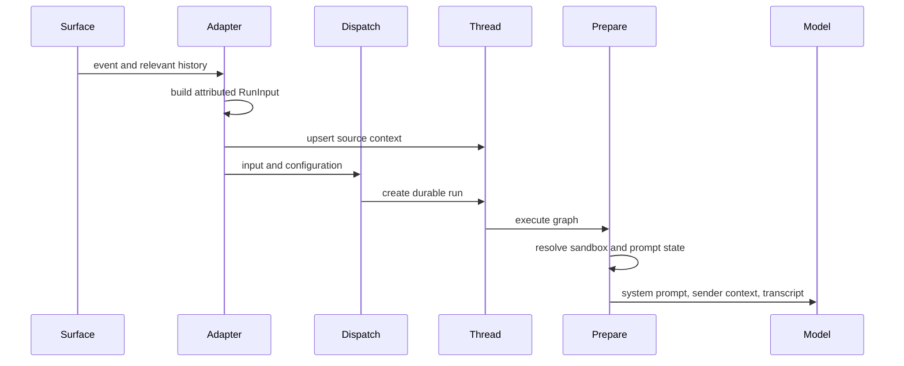

# Run Context and Prompt Construction

Model-visible context is deliberately layered. An integration first turns its event and useful history into a structured `RunInput`; durable thread metadata retains routing provenance separately. When the graph executes, preparation obtains current sandbox, workspace, identity, and plan information, renders a system prompt, and adds per-turn sender context without rewriting prior conversation history. This separation prevents a new invocation from silently changing what an old message meant.

This shows the boundary between integration normalization, durable provenance, and execution-time prompt assembly. See [Invocation](invocation.md) for the durable-run lifecycle and [Agent graph](../architecture/agent-graph.md) for graph composition.

## 1. Normalize inbound events into a transcript

`RunInput` contains ordered `messages` and may carry virtual `files`. Application-authored text becomes an XML-like `<input-message>` envelope with namespaced sender, surface, kind, optional channel, structured data, and escaped `<content>`. Text blocks within multimodal content are enveloped while non-text blocks, such as images, retain their order. Namespaced nonempty entity IDs are required, which keeps sender and channel references unambiguous.

Before attributed events, adapters can add `<dynamic-context>` introductions for people, channels, and systems. These introductions are SHA-256 hashes of their canonical XML. Channel `topic` and `purpose` carry `trust="untrusted"`: they are descriptive data rather than instructions. The shared system guidance likewise tells the model that marked fields and user-controlled values are data, not commands.

`dispatch_agent_run` is the common run-creation contract. An adapter can supply a fully ordered input—needed for multiparty histories—or let the dispatcher construct one from raw content and `RunConfig`. The latter derives Slack sender/channel identities first, then a GitHub login, then a Linear email, and finally a synthetic system sender. It rejects combining a prebuilt input with raw content or supplied identities, avoiding ambiguous duplicate context, then creates the durable LangGraph run with invocation metadata and streaming defaults.

### Surface-specific construction

- **Slack** starts with a channel introduction and walks thread history in order. It distinguishes people, Open SWE itself, and third-party bots; each event gets timestamp metadata. It follows history with an operational system context and the triggering request. For edits and button actions, the known triggering user prevents attributing the request to the bot or to an absent history item.
- **Linear** puts issue description and issue identifiers in a system message, then includes relevant comments as attributed human messages with comment IDs. If the triggering comment is known it uses that comment onward; otherwise it uses recent comments while removing known bot output. Description and comment images remain multimodal blocks.
- **GitHub** persists issue provenance and uses structured issue/event/comment fields for the new input. A first issue run fetches and orders issue comments for its initial context; an existing thread receives only the new issue follow-up or update. GitHub review paths use the same attributed-input pattern for PR and finding-reply metadata.

### Dynamic context and summarization

The injected-hash registry suppresses duplicate introductions during construction. However, the registry alone is not enough after Deep Agents summarizes history: messages before the summary cutoff are no longer visible to the model even though they remain in graph state. `visible_dynamic_context_hashes` considers only the post-cutoff suffix, allowing a needed identity introduction to be sent again. XML parsing helpers ignore malformed envelopes and only accept a claimed dynamic-context hash when it matches the canonical content.

## 2. Keep routing provenance outside the prompt transcript

`SourceContext` is durable thread metadata used to locate the originating Slack thread, Linear issue, GitHub issue, and PR. Webhook paths upsert it when creating or handling a thread, while the normalized `RunInput` records the particular material the model should see for this invocation. Treating these as separate state avoids turning operational routing records into implicit conversational instructions.

The model is designed for distributed and historical writers: `SourceContext` and its nested references allow unknown fields, and `dump()` excludes unset defaults so a read-enrich-write cycle preserves fields it does not own. `parse()` accepts mappings only and returns an empty context after validation failure rather than failing an otherwise executable run. Consumers therefore must tolerate missing provenance.

## 3. Prepare fresh run-specific prompt state

The main graph starts with an empty deep-agent system prompt. `BasePrepareRunMiddleware` runs before the agent and fingerprints the latest message, middleware class, and preparation configuration. Its checkpointed latch skips repeated setup on a resumed attempt for the same fingerprint, but a new turn prepares fresh tokens, prompt material, and context. Subclass setup must consequently be idempotent: a failure before checkpointing may cause it to run again.

The main preparation middleware schedules title work; resolves GitHub credentials, the sandbox work directory, workspace, triggering identity, user standing instructions, participants, and model route; and records run metadata. A sandbox-unreachable error is notified and re-raised rather than allowing a workspace-less execution. Its rendered prompt is installed immediately before every model call, ahead of an existing system message.

Sender information is a separate system-attributed message appended after the run input only when there is a human message and an attributable sender. It identifies the subject and hashes the sender-context content; it is omitted if that same introduction is still visible. This preserves cached message bytes across later runs while limiting a sender's git identity, personal instructions, collaboration settings, and PR-draft preference to the current turn.

### Prompt sections, source mode, and plan state

`construct_system_prompt` renders resource templates rather than accepting an arbitrary prompt path. It selects source guidance for Slack, Linear, GitHub, dashboard, background, schedule, or generic work; includes working-environment and repository-setup guidance; and adds a plan-mode entry section for every run plus an active plan section only in plan mode. It also conditionally includes a default prompt, allowed-repository scope, repository custom instructions, workspace instructions, admin workspace guidance, and sandbox-download guidance.

The instruction hierarchy is explicit in those templates: repository custom instructions override defaults; workspace instructions yield to repository instructions; and sender-level standing instructions yield to both repository instructions and `AGENTS.md`. The repository setup guidance requires reading a root `AGENTS.md` in full immediately after synchronizing or cloning the repository; its rules override defaults. Plan mode is state carried in configuration and changes the rendered guidance and plan-review URL, rather than being inferred from user prose.

## 4. Conventions at repository and file scope

After a successful string-returning `read_file`, `SubdirAgentsReadMiddleware` finds unread ancestor `AGENTS.md` files for the requested absolute path, reads them from the sandbox, and appends a `<system-reminder>` to that tool result. Candidates are shallowest first, and the reminder declares that deeper instructions win. Direct reads of an `AGENTS.md` mark it loaded, while loaded paths are tracked per thread. A missing backend, failed candidate read, non-UTF-8 content, empty content, or an error tool result does not break the original requested read. Reads are capped at 1,000 lines and 64 KiB; oversized text is truncated.

Review runs do not need a clone to apply conventions. The reviewer fetcher loads root `AGENTS.md` at the requested GitHub ref, falling back to `CLAUDE.md` only when the first response is 404. A network error, other status, or content over 64 KiB yields no root rules and does not fall back to a potentially stale secondary file. For changed files, it independently fetches each ancestor convention path concurrently (up to eight requests), applies the same filename preference and cap, and returns successful paths in shallow-to-deep order so a later nested document can take precedence.

## 5. Skills are lazy, read-only extensions

Skills are advertised to Deep Agents as routes containing `SKILL.md`, not bulk-copied into the system prompt. The main agent's `CompositeBackend` keeps the sandbox/project backend as default and mounts bundled skills read-only. Hosted runs also mount organization skills read-only and, when a credential login exists, user skills read-only; user skills are listed first. Desktop runs instead expose state-backed user skills and mount desktop artifact routes so scratch artifacts do not land in the user project.

The style analyzer uses a separate design: its `/skills/` route is a `StateBackend`, and its launchers seed the `RunInput.files` channel with prefix-stripped bundled playbooks. Route handling maps the agent-facing `/skills/<name>/SKILL.md` to the seeded `/<name>/SKILL.md`. Analyzer preparation selects the bootstrap or continual-learning playbook path from run mode and renders that path into its focused prompt; the agent then reads the procedure as a file.

## Safety boundaries and focused verification

The protocol separates authoritative system guidance from attributed external material. Do not promote channel topic/purpose, source event fields, GitHub comments, or fetched web data into trusted instructions. The main guidance specifically rejects following commands embedded in untrusted material, exposing credentials, or allowing a user to authorize either. Keep this boundary when adding fields, templates, or integration adapters.

When changing this workflow, preserve these invariants:

1. Preserve message ordering and identity attribution; use a prebuilt `RunInput` for multiparty history.
2. Do not mutate old user messages to insert current sender information.
3. Reintroduce an identity hidden by summarization instead of trusting an old injected-hash record.
4. Keep provenance resilient to malformed metadata and distinct from prompt content.
5. Make preparation safe to retry before its checkpoint, and let sandbox failures stop execution.
6. Enforce instruction precedence in templates and document fallback/failure behavior for repository conventions.

Focused coverage includes `tests/agent/test_input_messages.py` for escaping, multimodal order, introductions, and summary visibility; `tests/agent/test_agents_md.py` for fallback and size behavior; plus dispatch, source-context, Slack-context, scoped-AGENTS middleware, and skill-routing tests under `tests/agent`, `tests/slack`, and `tests/middleware`.
