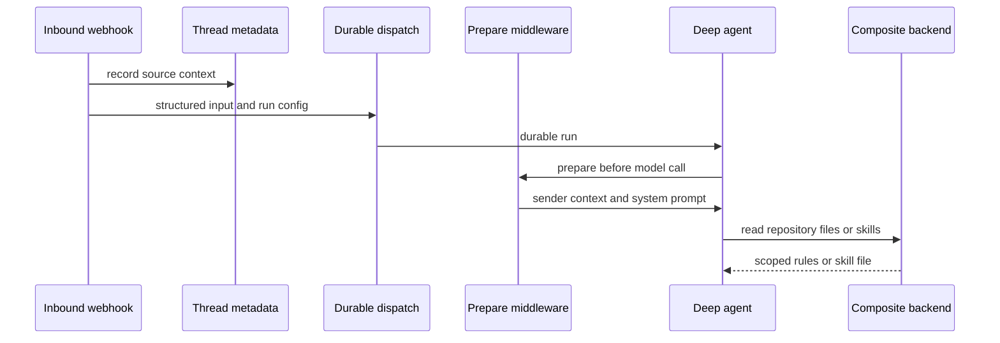

# Run Context Engineering Workflow

Context engineering is the boundary between external events and the model-visible run. It assigns a durable source and actor to inbound material, serializes it into attributable envelopes, supplies the run-specific system prompt, and exposes repository rules and playbooks without assuming the model will discover them unaided. The workflow is deliberately layered: source history is input state, policy is system instruction, repository conventions are loaded from the repository, and skills are virtual files.

This page focuses on the rendering and lifecycle of that context. For trigger verification and durable dispatch, see [invocation](invocation.md); for durable thread state, see [threads and state](../concepts/threads-and-state.md); for credential and untrusted-input boundaries, see [authorization and security](../concepts/auth-and-security.md); and for model/profile settings, see [models, profiles, and instructions](../concepts/models-profiles-instructions.md).

The inbound event creates durable structured input; preparation adds run-scoped context, while ordinary file reads progressively disclose repository instructions and skills.

## Inbound source data and identities

### Typed input envelopes

`agent/input_messages.py` is the serialization boundary for application-owned input. It renders each authored message in an `<input-message>` envelope with a namespaced `sender` identity, `surface`, `kind`, optional `channel`, structured `<data>`, and escaped `<content>`. A sender or channel identifier must be a non-empty namespaced identifier and cannot contain whitespace or XML-significant characters. Text and attribute values are escaped; multimodal content retains non-text blocks and wraps only text blocks. This makes Slack, Linear, GitHub, dashboard, desktop, automation, and evaluation inputs structurally consistent without treating external prose as system instructions.

Before authored messages, connectors can introduce people, channels, and systems as separate `<dynamic-context>` messages. Channel topic and purpose carry `trust="untrusted"`, explicitly preserving the distinction between useful channel metadata and authoritative instructions. GitHub issue creation, Linear issue creation, and Slack thread creation use these identities to represent the platform actor, participants, and messages rather than flattening the transcript into anonymous prompt text.

The initial history is intentionally materialized at dispatch time. A new GitHub issue run fetches and serializes issue comments; a Linear issue run fetches full issue details and selects comments from the triggering comment onward, or a recent non-bot tail when the trigger is absent; Slack selects an appropriate thread slice and represents human, Open SWE, and other bot messages with their respective kinds. This lets the first model turn see relevant conversation history without granting it a separate history-discovery task. Slack additionally resolves image URLs and file images into multimodal blocks; if the selected model lacks image support, it selects a vision-capable model override.

### Dynamic-context lifetime

An entity introduction has a SHA-256 hash of canonical serialized content. `build_input_messages` adds an introduction only when its hash is absent from the caller-supplied injected registry, then updates that registry. When queued messages are turned into input, the queue middleware carries the same registry so an entity is not repeatedly reintroduced.

The registry alone is insufficient after history summarization: it may remember a context block that the model no longer receives. `visible_dynamic_context_hashes` instead examines messages at and after the deepagents summarization cutoff. Preparation uses this visibility check for the per-turn sender-context introduction, allowing it to be reintroduced if summarization removed it. This is an important invariant: deduplication must never leave a visible sender message without the identity/context needed to interpret it.

### Provenance versus per-run configuration

`SourceContext` is the durable provenance record in thread metadata. It can hold a Slack thread reference, Linear issue reference, GitHub issue reference, and PR number; the same record is also used by baby-sit watches. Webhook metadata upserts preserve the source that opened an existing thread rather than repointing it from later activity, and enrich a Slack reference with a permalink when possible.

`RunConfig`, by contrast, is the flexible `RunnableConfig.configurable` contract for an individual graph execution. It carries identity, repository, source references, review details, model choices, behavior toggles, analyzer data, and job fields. Both models allow unknown keys and serialize only fields actually set, so independent writers can enrich their records without injecting defaults or discarding future fields. Their failure posture differs deliberately: malformed `SourceContext` becomes empty; malformed `RunConfig` drops invalid top-level fields iteratively so a bad optional value does not discard a usable `thread_id` or repository. Integer-like fields also reject booleans, avoiding Python/Pydantic's `True == 1` pitfall for PR numbers.

## Preparing a model turn

The main graph first builds an agent with an empty static system prompt. `PrepareAgentRunMiddleware` then performs the expensive, run-specific work immediately before the model is called: it resolves the sandbox and working directory, token/user identity, thread settings, selected environment, repository custom instructions, and sender information. It writes run metadata, returns the rendered prompt and working directory, and appends sender context as its own messages rather than rewriting a prior user message. Separate messages keep the cached transcript byte-stable and preserve the UI's one-envelope-per-message rendering model.

The sender context is a platform-generated `system:sender-context` message linked to the latest human sender. It contains the resolved sender-specific information and standing user instructions for that turn. Preparation avoids adding the sender-context identity again if it remains visible in state, but reintroduces it after summarization as described above. A sandbox connectivity failure is not silently converted into a partial run: it notifies the source and re-raises the failure.

### Prompt composition and instruction scope

`construct_system_prompt` assembles the base prompt with the work directory, source-specific response guidance, optional default repository, plan-mode constraints, repository modification scope, enabled integrations, repository custom instructions, environment instructions, and admin environment capabilities. The prompt states the operational precedence relevant to repository work:

1. `AGENTS.md` is mandatory when present and wins conflicts.
2. Repository-specific custom instructions and environment instructions are mandatory, but yield to `AGENTS.md`.
3. Sender-level standing instructions apply only to the sender's current turn and yield to repository instructions and `AGENTS.md`.

This ordering is not a substitute for input provenance: untrusted content such as a channel topic remains marked in the structured input, while system-rendered policy and sender context arrive through distinct system identities. `wrap_system_prompt` provides the common wire representation for prompts used outside the main prepare path: it creates an idempotent `<system-instructions format="open-swe-v1">` envelope containing the Open SWE system identity and serialized system messages, and appends only additions that are not already present.

## Repository conventions: `AGENTS.md`

Repository instruction files are obtained differently by graph because their execution environments differ.

### Main agent: progressive loading during repository work

The main prompt directs the agent, immediately after a sync or clone, to read the repository-root `AGENTS.md` in full before other work. `SubdirAgentsReadMiddleware` provides a second safeguard for scoped instructions. It wraps successful `read_file` calls for absolute paths, obtains the thread's sandbox backend, and attempts each ancestor directory's `AGENTS.md` from shallowest to deepest. Successfully read content is appended to the original tool result as a `<system-reminder>` which says that deeper instructions take precedence.

The middleware keeps a loaded-path set per thread. It marks a directly read `AGENTS.md` as loaded and marks attempted candidate paths before reading, so a file is surfaced at most once even if it is missing or unreadable. It does not alter a failed or non-string tool result, ignores non-UTF-8/empty content, reads at most 1,000 lines, and bounds included data to 64 KiB, adding `[truncated]` when necessary. Candidate read failures are debug-logged and skipped; they never turn an otherwise successful file read into a failure.

### Reviewer: deterministic GitHub fetch

The PR reviewer must have conventions before review rather than relying on a model clone. It fetches root `AGENTS.md` from the GitHub Contents API at the PR base SHA and uses `CLAUDE.md` only as a legacy fallback. A fallback occurs only after a 404; an HTTP error, unexpected status, network failure, or a file over 64 KiB returns no root convention rather than applying a possibly inconsistent fallback.

After the reviewer obtains the diff, it derives ancestor `AGENTS.md` candidates for changed paths and fetches scoped conventions at the same base SHA. Candidates are ordered shallowest-to-deepest, use bounded concurrency, and fail independently; directory-local `CLAUDE.md` has the same 404-only fallback behavior. Root and scoped instructions are therefore version-pinned to the code being reviewed, and later/deeper instructions can override broader ones.

## Agent skills as read-only virtual files

Skills use progressive disclosure rather than inlining every playbook into the system prompt. The main agent receives one or more skill route prefixes through `create_deep_agent(..., skills=...)`; deepagents' skills middleware advertises their name and description and the agent reads a matching `SKILL.md` through ordinary `read_file`.

The agent backend is a `CompositeBackend`: its default is the actual sandbox or desktop project backend, while route prefixes point to dedicated skill backends. The composite removes the route prefix before delegation. All main-agent skill routes are read-only, preventing a run from modifying bundled, organization, or stored user guidance via its virtual filesystem.

- `/bundled-skills/` is always a read-only virtual-mode `FilesystemBackend` for the repository's `baby-sit` and `html-artifacts` skills.
- Hosted runs always include `/organization-skills/`, a read-only `StoreBackend` using the shared organization namespace. When a triggering user login is available, `/skills/` is a read-only per-login store route and is placed first in discovery order.
- Desktop runs use a read-only `StateBackend` for `/skills/`, omit organization skills, and add artifact routes so deepagents' scratch/offload files do not land in the user's project checkout.

User and organization skills are persisted as `/<name>/SKILL.md` values containing YAML `name`/`description` front matter and a complete instruction body. Names are lowercase alphanumeric words separated by single hyphens; names, descriptions, and bodies have bounded lengths, and the organization collection is capped. User-skill tools resolve the triggering user's login and thus cannot target another user's namespace or a bundled route. Organization-skill tools require workspace admin authority because their result appears in every hosted user's future runs; their `instructions` argument is a full body replacement, not a patch.

The review-style analyzer applies the same pattern independently. It mounts a state-backed `/skills/` route over its sandbox and seeds the run input's `files` state with prefix-stripped bundled playbooks. `skill_path_for_mode` selects `bootstrap-repo-analysis` or `continual-learning`; no analyzer skill is written into the sandbox.

## Change and test guide

When changing this workflow, preserve these boundaries:

- Use the typed input builders for application-owned messages. Do not concatenate a new external surface into trusted prompt prose, and preserve multimodal block ordering.
- Treat thread metadata as durable, multi-writer data. Extend `SourceContext`/`RunConfig` compatibly and retain their tolerant parse-and-dump behavior.
- Keep prompt additions scoped: repository/environment policy is rendered in the system prompt, while a person's preferences belong to the sender-context message for that turn.
- Do not bypass virtual skill routes by writing skill files into a sandbox or project checkout. Protect cross-user and organization-wide mutations with the existing ownership/admin boundaries.
- Keep instruction loading bounded and non-fatal. A missing conventions file should reduce context, not fail unrelated file reads or a whole review.

Focused tests cover XML escaping and multimodal preservation (`tests/agent/test_input_messages.py`), source and run-config compatibility (`tests/agent/test_source_context.py`, `tests/agent/test_run_config.py`), `AGENTS.md` fallback and size limits (`tests/agent/test_agents_md.py`), and main-agent backend/skill route assembly (`tests/agent/test_agent_assembly_context.py`, `tests/agent/test_skills.py`).
