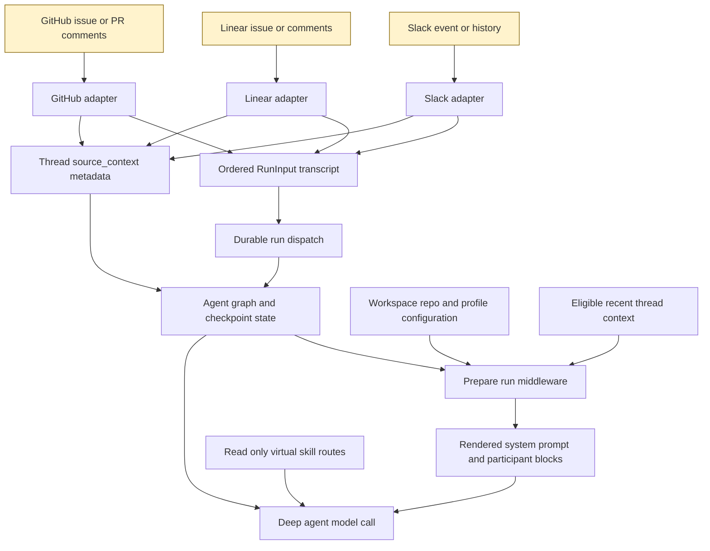

# Context Assembly and Repository Guidance

Model context is assembled in distinct layers, not by placing a webhook body directly in a system prompt. Surface code builds an ordered `RunInput` transcript; thread metadata preserves routing provenance; the graph factory mounts only the skills appropriate to the run; and preparation renders the per-invocation system prompt and participant additions. This separation matters for trust: content supplied by Slack, Linear, GitHub, or users is model input, while configured prompt sections and middleware establish system behavior.

```mermaid
flowchart TD
    Slack["Slack event or history"] --> SlackAdapter["Slack adapter"]
    Linear["Linear issue or comments"] --> LinearAdapter["Linear adapter"]
    GitHub["GitHub issue or PR comments"] --> GitHubAdapter["GitHub adapter"]
    SlackAdapter --> Transcript["Ordered RunInput transcript"]
    LinearAdapter --> Transcript
    GitHubAdapter --> Transcript
    SlackAdapter --> Provenance["Thread source_context metadata"]
    LinearAdapter --> Provenance
    GitHubAdapter --> Provenance
    Transcript --> Dispatch["Durable run dispatch"]
    Dispatch --> Graph["Agent graph and checkpoint state"]
    Provenance --> Graph
    Graph --> Prepare["Prepare run middleware"]
    Config["Workspace repo and profile configuration"] --> Prepare
    Recent["Eligible recent thread context"] --> Prepare
    Prepare --> Prompt["Rendered system prompt and participant blocks"]
    Skills["Read only virtual skill routes"] --> Agent["Deep agent model call"]
    Prompt --> Agent
    Graph --> Agent
    classDef external fill:#fff3cd,stroke:#856404,color:#333
    class Slack,Linear,GitHub external
```

This flowchart shows the model-visible assembly path. Yellow nodes are **external trust boundaries**: their text and metadata originate outside the agent service and must remain attributed input rather than being promoted to system instructions.

## Inbound transcripts and attribution

`RunInput` is a list of user-role and system-role messages, optionally with virtual files. `human_input` and `system_input` serialize authored text into an `<input-message>` envelope carrying a validated, namespaced sender ID, surface, kind, optional channel, and structured data. Text and XML-sensitive attributes are escaped; for multimodal input, only text blocks are enveloped and non-text blocks remain in their original order. Invalid entity IDs or structured-data field names fail construction rather than producing ambiguous XML.

Identity introductions are separate `<dynamic-context>` messages for channels, people, and systems. The system derives a SHA-256 digest from the canonical introduction when deciding whether an identity is already visible. This avoids repeating unchanged context, but `visible_dynamic_context_hashes` intentionally ignores messages before the deepagents summarization cutoff: an identity lost to compaction must be introduced again. The main preparation middleware similarly adds only participant blocks not currently visible, so a changed participant profile is resent without rewriting history.

The surface adapters choose transcript ordering when generic dispatch cannot faithfully represent history:

- **Slack** starts with channel context, replays previously undispatched non-Open-SWE messages in order with person or third-party-bot attribution, can add constant and per-turn Slack context, then appends the triggering request. Its explicit trigger-user fallback prevents edits and button actions from being incorrectly attributed to the bot or nobody.
- **Linear** represents the issue description as a system-originated message with issue data, then appends relevant non-bot comments with author introductions, comment IDs, and any fetched image blocks. It uses comments from the triggering comment onward when that comment is located, otherwise its recent-comment selection.
- **GitHub PR comments** are attributed to authors and carry PR number, URL, author, comment kind, path, line, and creation time as structured metadata.

`dispatch_agent_run` is the common boundary for these and generic callers. A caller may supply a prebuilt transcript, or raw content plus explicit context, or raw content for fallback identity derivation—but cannot combine a prebuilt input with raw fields. The fallback path derives a canonical Slack, GitHub, or Linear person where possible, otherwise constructs a synthetic system sender. Dispatch creates a durable LangGraph run with synchronous checkpoint durability, interrupt-by-default multitasking, resumable v3 streaming, and configured completion webhook support.

## Durable provenance versus visible input

`SourceContext` is not transcript text. It is persisted under `source_context` in thread metadata to identify the originating Slack thread, Linear issue, GitHub issue, or PR for routing and lifecycle operations. Metadata upserts retain the first nonempty source context on an existing thread, so later events cannot repoint its origin; Slack provenance may be enriched with a permalink. It also travels with baby-sit watches.

This schema is deliberately tolerant of old and distributed writers. Its models allow unknown fields and `dump()` excludes unset defaults, preserving unknown keys in read-enrich-write cycles. `parse()` accepts mappings only and yields an empty context after validation failure, so malformed historical metadata does not fail a run.

## Per-run prompt assembly

The graph is constructed with an empty static system prompt. `BasePrepareRunMiddleware` performs checkpointed setup before the agent and stores a fingerprint based on the latest message, middleware class, and subclass configuration. A resumed attempt whose fingerprint matches skips `_prepare`; later invocations prepare again, allowing fresh credentials, sandbox state, source context, and prompt material. Preparation implementations must consequently be idempotent, including when an attempt fails before the checkpoint.

For the main agent, preparation resolves the sandbox and working directory, default repository, workspace, model selection, trigger identity, and—when allowed—recent-thread context. It schedules title generation and records run metadata. It builds `construct_system_prompt(...)` from source-specific guidance; a default prompt; repository scope; repository custom instructions; eligible recent thread context; workspace instructions; collaboration and operational sections. It appends eligible participant identity blocks as separate messages rather than mutating an old human message. Recent context is deliberately restricted: it is disabled for background tasks and bot triggers, and private context requires the credential owner; shared Slack context is selected only for a recognized non-DM channel.

On every model call, the base middleware prepends the rendered prompt to any existing system message. The dynamic context and transcript remain messages in graph state, so the model receives prompt policy, attributed input, and newly needed participant descriptions through different mechanisms.

### Instruction precedence and externally supplied text

Repository custom instructions are rendered as mandatory system-level instructions and explicitly defer to `AGENTS.md`; workspace instructions explicitly defer to both repository custom instructions and `AGENTS.md`. The repository-setup prompt requires reading root `AGENTS.md` in full after a clone or synchronization (or before other work in a local checkout), and says its rules override defaults. Participant blocks can carry standing instructions, but their identity fields are context rather than a replacement for repository policy.

The model must treat inbound event bodies, issue descriptions, comments, Slack channel fields, and media references as externally supplied content. The envelope preserves their source and kind rather than making them system prompt sections. This is a critical safe-change boundary: do not bypass escaping/attribution, inject webhook text into `rendered_system_prompt`, or mutate cached history to add fresh sender data.

## Scoped repository guidance

Root guidance is prompt-driven; scoped guidance is tool-driven. After a successful string-returning `read_file`, `SubdirAgentsReadMiddleware` finds unread ancestor `AGENTS.md` files from shallow to deep, reads them through the thread sandbox, and appends a `<system-reminder>` to that tool result. The reminder states that deeper scopes take precedence. Direct reads of `AGENTS.md` mark that path loaded; paths are tracked per thread to avoid repeated injection. Candidate failures, empty/non-UTF-8 content, and read exceptions do not break the requested file read. Middleware bounds each candidate at 1,000 lines and truncates content beyond 64 KiB.

The reviewer has no need to clone a repository just to obtain conventions. It fetches root `AGENTS.md` at a supplied GitHub ref, tries `CLAUDE.md` only after a 404, and rejects an oversized document or any other fetch failure rather than using a secondary stale rule. For changed files it derives non-root ancestor paths, fetches candidates concurrently with a semaphore, and returns successful results in shallow-to-deep order. Scoped fetching applies the same `AGENTS.md` then `CLAUDE.md` fallback independently per directory.

## Skills are virtual, read-only context

Skills are advertised to deepagents as paths and read with `read_file`; their full bodies are not inserted wholesale into the main prompt. The main graph uses a `CompositeBackend` with the sandbox/project backend as default and read-only routes for bundled, organization, and (when a credential login is available) user skills. Bundled skills are always present. Hosted public or scope-unknown runs omit personal skill routes; hosted credentialed runs put user skills first, then organization and bundled routes. Desktop runs read user skills from state and also keep artifact routes out of the project checkout.

The review-style analyzer uses a separate `CompositeBackend` route at `/skills/` backed by `StateBackend`. Launchers seed prefix-stripped `SKILL.md` files in the run input's `files`; the composite route strips `/skills/` during lookup. Its prepare middleware selects either the bootstrap or continual-learning playbook path and renders that focused analyzer prompt.

## Focused verification

Use `tests/agent/test_input_messages.py` for escaping, multimodal preservation, and compaction visibility; `tests/agent/test_dispatch.py` for dispatch contracts; `tests/agent/test_source_context.py` for tolerant provenance; `tests/middleware/test_prepare_run_middleware.py` for preparation and participant reinjection; `tests/middleware/test_subdir_agents_middleware.py` and `tests/agent/test_agents_md.py` for convention behavior; and `tests/agent/test_agent_assembly_context.py` plus `tests/agent/test_skills.py` for graph skill-route assembly and persistence.
