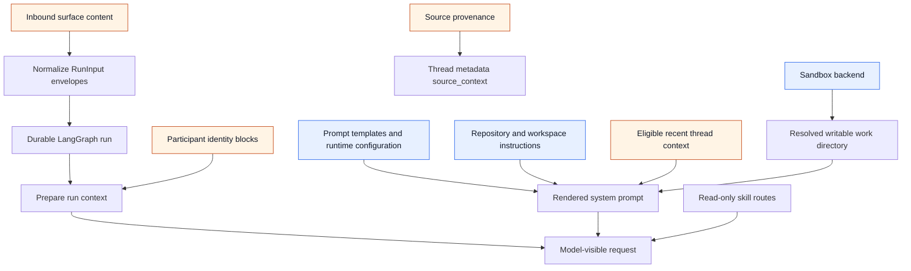

# Context and Prompt Assembly

Open SWE does not pass an inbound webhook or dashboard body straight to a model. It serializes application-owned input into a durable run transcript, retains routing provenance separately in thread metadata, and prepares run-specific context before the agent's model call. The resulting context has two important categories: **prompt-template material** produced from packaged prompt resources and trusted runtime configuration, and **user-controlled content** carried in structured input envelopes or explicitly delimited context blocks. The latter is context for the agent, not a replacement for system policy.

```mermaid
flowchart TD
  Event["Inbound surface content"] --> Normalize["Normalize RunInput envelopes"]
  Provenance["Source provenance"] --> Metadata["Thread metadata source_context"]
  Normalize --> Durable["Durable LangGraph run"]
  Durable --> Prepare["Prepare run context"]
  Templates["Prompt templates and runtime configuration"] --> Render["Rendered system prompt"]
  Repository["Repository and workspace instructions"] --> Render
  Recent["Eligible recent thread context"] --> Render
  Participants["Participant identity blocks"] --> Prepare
  Sandbox["Sandbox backend"] --> WorkDir["Resolved writable work directory"]
  WorkDir --> Render
  Prepare --> Model["Model-visible request"]
  Render --> Model
  Skills["Read-only skill routes"] --> Model
  Event:::user
  Provenance:::user
  Participants:::user
  Recent:::user
  Templates:::trusted
  Repository:::trusted
  Sandbox:::trusted
  classDef user fill:#fff4e5,stroke:#c2410c,color:#111827
  classDef trusted fill:#e7f0ff,stroke:#2563eb,color:#111827
```

*Caption: orange sources are surface- or user-controlled context; blue sources are system-selected templates, policy, or runtime capabilities. All converge only after run preparation.*

## From inbound content to a durable transcript

`dispatch_agent_run()` is the common agent-run boundary. A caller either supplies a deliberately ordered `RunInput` or supplies content plus identities for construction; mixing the two is rejected. When it must infer the input, dispatch derives a surface (`slack`, `linear`, `github`, `web`, `desktop`, or `eval`; other sources become `automation`), canonicalizes a known sender, and falls back to a `system:<source>` identity when it cannot attribute a human. Slack additionally contributes a channel identity from the triggering thread. The dispatch layer then creates a durable LangGraph run, rather than invoking the graph directly. See [Invocation](invocation.md) and [Threads and state](../concepts/threads-and-state.md) for run creation and checkpoint semantics.

`input_messages.py` is the serialization boundary. Human and system inputs become user-role `<input-message>` envelopes whose sender, surface, kind, optional channel, and scalar metadata are XML attributes; nested metadata becomes child elements; authored text is escaped. Text blocks in multimodal input are enveloped while non-text blocks are retained. Entity introductions are separate `<dynamic-context>` user messages for channel or system identities. Invalid namespaced entity IDs or invalid metadata-field names fail construction instead of creating ambiguous markup.

The sender's richer person context is intentionally not assumed at dispatch. During preparation, Open SWE resolves the triggering sender and the other recorded thread participants, makes one dynamic person block per participant, and adds only blocks whose canonical content hash is not visible in graph state. Visibility begins at the deepagents summarization cutoff, so a block hidden behind a summary is introduced again. This keeps attribution and standing instructions available without rewriting old messages.

### Provenance is not prompt history

`SourceContext` is the durable answer to “where did this thread originate?” It can retain Slack-thread, Linear-issue, GitHub-issue, and PR references in thread metadata and baby-sit records; it is not the normalized model transcript. Context parsing tolerates old or extended metadata: models allow extra keys, dumps exclude fields that were never set, and invalid mappings become an empty context with a warning. When webhook metadata is updated, a nonempty existing source context wins, preventing a later message from repointing an established thread.

## Preparation lifecycle and sandbox path

The graph starts with an empty `system_prompt`. `BasePrepareRunMiddleware` runs before the agent and checkpoints a latch keyed by middleware class, latest-message fingerprint, and configuration fingerprint. A resumed attempt for the same fingerprint skips already-completed setup; a later turn prepares again. Implementations must therefore make preparation idempotent, since work before the checkpoint can run more than once.

For the main agent, `PrepareAgentRunMiddleware` resolves credentials and a sandbox in parallel with sender identity, then resolves a writable work directory. A sandbox attach failure is reported through the unreachable-sandbox notification path and re-raised; it does not silently substitute a path. `resolve_sandbox_work_dir()` caches the first writable candidate, trying provider work-directory methods, shell `pwd`, provider home/root paths, and shell `$HOME`; a bridged local checkout uses its resolved work directory directly rather than a hosted `/workspace/<repo>` layout.

Preparation also loads the workspace, resolves participants, records run attribution, and conditionally fetches recent context. Recent context is only eligible for a suitable audience (private dashboard/DM or shared Slack channel, with ownership checks) and is disabled for background completion and bot-triggered Slack runs. Its lookup is bounded by a timeout and fails soft to an empty section; rendering drops whole entries until the character limit is met.

## Rendered system prompt and instruction authority

`construct_system_prompt()` renders `system/main` from packaged resources. The prompt loader accepts only relative `.md` or `.md.jinja` names below `openswe/resources/prompts`, and Jinja uses `StrictUndefined`; a missing substitution fails rendering rather than silently emitting a partial policy. The rendered composition includes working-environment and source guidance, deployment custom instructions, repository scope, collaboration policy, external-comment guidance, repository custom instructions, recent-thread context, workspace instructions, and workspace-admin/sole-writer variants as applicable.

Repository custom instructions and workspace instructions are system-prompt sections, but repository conventions are a separate operational authority: the main repository-setup template directs the agent to read root `AGENTS.md` after setup. Scoped conventions are supplied by `SubdirAgentsReadMiddleware`: after a successful absolute `read_file`, it reads previously unseen ancestor `AGENTS.md` files shallow-to-deep from the sandbox and appends a `<system-reminder>` to the tool result. Deeper scopes take precedence. Candidate reads are capped at 1,000 lines and 64 KiB; absent, failed, non-UTF-8, empty, or oversized inputs do not fail the requested read. Direct reads of an `AGENTS.md` mark it loaded for that thread.

Immediately before every model call, the base middleware prepends the prepared rendered prompt to any existing system message. It does not transform historical human messages. In particular, participant blocks arrive as new state messages, which preserves the checkpointed transcript and avoids making cached history depend on the latest identity lookup.

## Skills are capabilities, not prompt bulk

The main agent uses a `CompositeBackend`: its normal sandbox backend remains the default, while virtual skill paths route to read-only backends. Bundled skills are always exposed at `/bundled-skills/`. Hosted runs expose organization skills at `/organization-skills/`, plus per-credential user skills at `/skills/` when a credential login exists; user skills are first in the advertised source order. Desktop runs obtain user skills from state and add artifact routes so scratch/offloaded data does not land in the user's project checkout. `create_deep_agent(..., skills=skill_sources)` advertises those roots, allowing the model to read a chosen `SKILL.md` when needed rather than injecting every skill body.

`WorkspaceSkillsMiddleware` protects shared checkpoint state while deepagents loads skill metadata. It scopes `skills_metadata` to configured source prefixes, clears load errors, and applies that scope both before the agent and before model calls. The style analyzer has a distinct `/skills/` state backend and a focused prepared prompt naming the playbook path for its configured mode.

## Change guidance and focused tests

Preserve the boundary between durable provenance, serialized event content, and system-selected prompt material. New surface content should use the envelope builder or an intentional prebuilt `RunInput`; do not concatenate it into a system prompt. A new prompt resource must remain under the packaged prompt root and satisfy all template substitutions. Changes to preparation should preserve the fingerprint/checkpoint behavior and fail explicitly when there is no usable sandbox path. Changes to skill sources must retain their read-only routing and metadata scoping.

Focused coverage includes `tests/agent/test_input_messages.py`, `tests/agent/test_dispatch.py`, `tests/agent/test_source_context.py`, `tests/middleware/test_prepare_run_middleware.py`, `tests/middleware/test_subdir_agents_middleware.py`, `tests/middleware/test_workspace_skills.py`, `tests/agent/test_agent_assembly_context.py`, `tests/agent/test_skills.py`, and `tests/agent/test_agent_instructions.py`.
