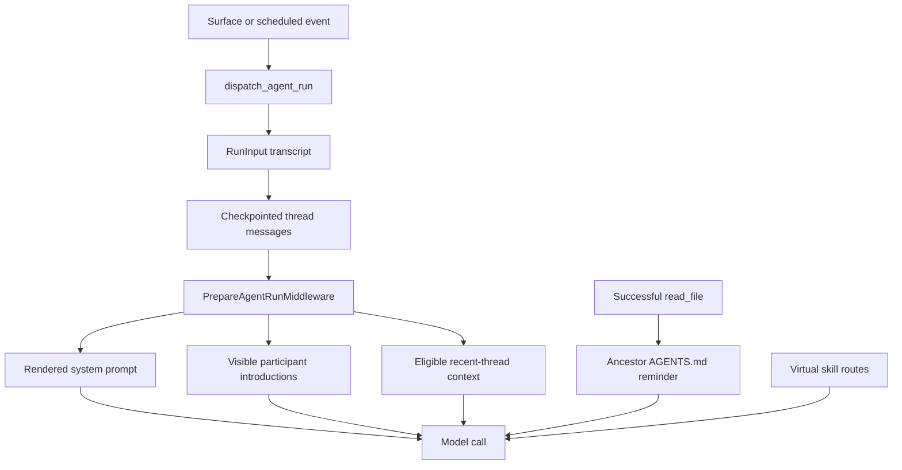

# Context construction and repository guidance

Open SWE does not send a raw event directly to a model. It separates the durable run input—the attributed conversation transcript—from per-invocation setup and the system prompt. This distinction matters for safe changes: source data can be model-visible without becoming instructions, and checkpointed history is not rewritten merely because the current sender or workspace information changes.

```mermaid
flowchart TD
    Event["Surface or scheduled event"] --> Dispatch["dispatch_agent_run"]
    Dispatch --> Input["RunInput transcript"]
    Input --> History["Checkpointed thread messages"]
    History --> Prepare["PrepareAgentRunMiddleware"]
    Prepare --> Prompt["Rendered system prompt"]
    Prepare --> Participants["Visible participant introductions"]
    Prepare --> Recent["Eligible recent-thread context"]
    Prompt --> Model["Model call"]
    Participants --> Model
    Recent --> Model
    Read["Successful read_file"] --> Scoped["Ancestor AGENTS.md reminder"]
    Scoped --> Model
    Skills["Virtual skill routes"] --> Model
```

This flow distinguishes input created at dispatch from context resolved immediately before model calls; scoped repository rules arrive after a successful file read, while skills are discoverable virtual files.

## 1. Dispatch: normalize input and preserve routing provenance

`dispatch_agent_run` is the shared boundary for Slack, Linear, GitHub, dashboard, and other agent triggers. Callers may provide a deliberately ordered `RunInput` transcript, or provide content and let the dispatcher create one. These modes are exclusive: combining a prebuilt input with raw content, a context, channels, or systems is rejected. The resulting run is created with synchronous durability, interrupt-by-default multitasking, resumable v3 streaming, and an optional authenticated completion webhook. Thus a follow-up can interrupt an active run and resume from a checkpoint rather than replacing the thread history.

When it constructs input itself, the dispatcher selects a supported surface, derives a canonical person identity from Slack trigger data, GitHub login, or Linear email, and otherwise attributes the event to a synthetic system identity. Slack also yields a channel identity containing its thread metadata and channel fields. This is a fallback path; surface adapters that need exact cross-author history should supply their own ordered `RunInput`.

`SourceContext` is deliberately separate from that transcript. It is thread metadata and watch-record provenance for the Slack reply route, Linear issue, GitHub issue, and PR number, rather than text the model should necessarily see. Its Pydantic models allow unknown keys and dump only explicitly set fields, so read-enrich-write callers preserve forward-compatible metadata. Parsing missing, non-mapping, or invalid historical data returns an empty context (and logs invalid validation) instead of failing the run.

## 2. Transcript envelopes and dynamic identities

`input_messages.py` owns the application input format. Human and system content is serialized as an escaped `<input-message>` envelope with a validated namespaced sender, surface, kind, optional channel, and structured data. For multimodal content, only text blocks are enveloped; non-text blocks retain their object and ordering. This preserves image or other provider blocks while making authorship and metadata explicit.

Before the message, `build_input_messages` can introduce channel and system entities as `<dynamic-context>` messages. Entity IDs and field names are validated; dynamic contexts are canonically hashed, and supplied hashes suppress duplicate introductions within that construction. Parsing helpers treat malformed XML as absent. `visible_dynamic_context_hashes` intentionally considers only messages after Deep Agents' summarization cutoff: an introduction hidden by compaction is no longer visible to the model and may be added again.

## 3. Per-run preparation and prompt inputs

The main graph starts with an empty `system_prompt`; `PrepareAgentRunMiddleware` supplies the rendered prompt later. Its base class fingerprints the latest message plus middleware configuration and records a `run_prepared_for` latch. A checkpointed retry for the same fingerprint skips setup, but a later invocation prepares fresh credentials, workspace data, and prompt material. Preparation is therefore required to be idempotent; a failure before checkpointing may repeat it. Forked Deep Agents contexts do not prepare independently.

For hosted runs, preparation concurrently attaches the sandbox and resolves the triggering identity, then determines the working directory, workspace, model attribution, and participants. It appends person introductions only when their dynamic context is not presently visible; this keeps sender data separate from a cached historical human message. It renders the system prompt with repository custom instructions, workspace name/instructions/repositories, source-specific guidance, and (when eligible) recent-thread context. The latter is enabled only by the sender profile and constrained to an owner-private dashboard or DM context, or an identified shared Slack channel; it is omitted for bot-triggered and background-completion runs. The lookup is bounded by a timeout and failure returns no recent context.

Immediately before each model call, `BasePrepareRunMiddleware` prepends `rendered_system_prompt` to an existing system message. The graph also assembles a `CompositeBackend` with the sandbox as default and special routes for skill content, then registers the prepare middleware and `SubdirAgentsReadMiddleware` in the Deep Agent middleware stack.

## 4. Repository instructions and `AGENTS.md`

The main system prompt includes configured repository custom instructions and workspace instructions, but repository-local conventions have an operational enforcement path too. After any successful string-result `read_file` with an absolute path, `SubdirAgentsReadMiddleware` finds unread ancestor `AGENTS.md` files from root toward the read file's directory, reads them through the thread sandbox, and appends a `<system-reminder>` to the tool result. The reminder says deeper scopes take precedence.

The middleware tracks loaded paths per thread, including an `AGENTS.md` read directly, so rules are not repeatedly appended. It reads at most 1,000 lines and 64 KiB, truncates oversized UTF-8 content, and silently skips absent, failed, non-UTF-8, empty, or otherwise unusable candidates. Crucially, this augmentation never turns a failed requested read into a success and never breaks a successful requested read because a convention file could not be loaded.

The reviewer cannot rely on an interactive sandbox read. It fetches root guidance at the PR base SHA through GitHub Contents, preferring `AGENTS.md` and using `CLAUDE.md` only when the preferred file is a 404. HTTP errors, transport failures, and content larger than 64 KiB produce no root guidance rather than fallback to possibly inappropriate rules. Once the PR diff is available, it independently derives changed-file ancestor paths and fetches scoped `AGENTS.md`/`CLAUDE.md` documents concurrently, capped at eight in-flight requests. Paths are shallow-to-deep so nested guidance is rendered later and can override parent guidance. Reviewer setup concurrently collects this with organization guidance, repository style prompts, approval policy, API standards, diff, PR overview, and existing review threads before constructing its system prompt.

## 5. Skills are virtual, scoped files

Skills are advertised and read as `SKILL.md` files, not pasted wholesale into the base prompt. The main agent's `CompositeBackend` routes `/bundled-skills/` to a read-only virtual filesystem. Hosted runs also route `/organization-skills/` to organization storage and, when a credential login exists, `/skills/` to that user's store; user skills are listed first. Desktop runs instead expose state-backed user skills plus bundled skills and add artifact routes so scratch files do not land in the project checkout. `create_deep_agent(skills=skill_sources)` supplies the discoverable prefixes.

Hosted runs without a credential login install `WorkspaceSkillsMiddleware`. It scopes skill metadata to configured source prefixes and clears skill-load errors before exposing state or wrapping a model call, preventing personal skill context retained by public checkpoints from leaking into a different run context. The reviewer separately creates `SkillsMiddleware` against its sandbox and appends formatted skill locations, discovered skills, and load warnings to its already-built reviewer prompt.

## Safe change and focused verification

Keep these boundaries intact: event and PR/comment bodies are data, not instruction authority; `SourceContext` is routing metadata, not a replacement transcript; and per-run sender or workspace context must not mutate prior user messages. Preserve retry idempotence in preparation, reintroduce identities hidden by summarization, and keep convention-file failures non-fatal.

Focused coverage includes `tests/agent/test_input_messages.py`, `tests/agent/test_source_context.py`, `tests/agent/test_agents_md.py`, `tests/middleware/test_prepare_run_middleware.py`, `tests/middleware/test_subdir_agents_middleware.py`, and `tests/agent/test_skills.py`. These tests exercise escaping and compaction behavior, tolerant provenance, GitHub convention fallback, preparation latching and participant restoration, scoped rule injection, and persisted virtual-skill format.
