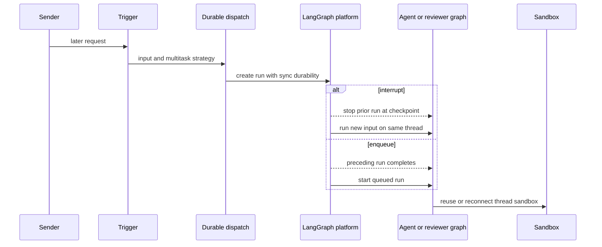
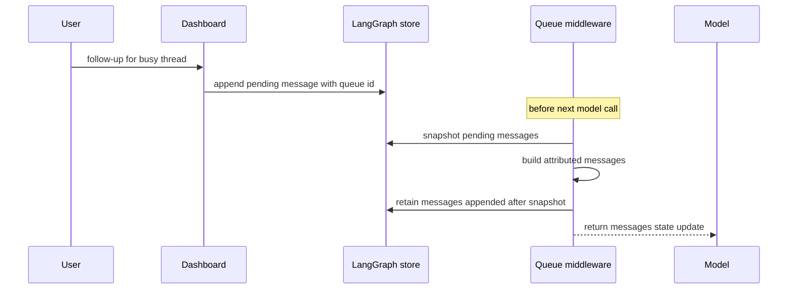

# Follow-ups, Interrupts, and Completion

A thread is the continuity boundary for its checkpointed conversation and its
thread-bound sandbox. Later work therefore normally targets the existing thread
rather than creating a competing workspace. There are two distinct delivery
mechanisms:

- A **durable follow-up run** is submitted to LangGraph with a multitask
  strategy. `"interrupt"` supersedes live work; `"enqueue"` waits as a later
  run.
- A **store-backed message** is appended to a busy thread's `pending_messages`
  record. Queue middleware incorporates it at the live run's next model
  boundary. It is not itself a run.

This distinction matters operationally: an enqueued *run* cannot act until the
preceding run ends, while a queued *message* can steer an active run. For
initial request construction and persistent thread state, see
[Invocation](invocation.md) and [Threads and state](../concepts/threads-and-state.md).
For middleware placement, see [Middleware stack](../architecture/middleware-stack.md).

## Durable follow-up dispatch

`dispatch_agent_run` is the common agent and reviewer entrypoint. It either
accepts a prebuilt `RunInput` or creates one from content and identity context,
then delegates to `create_durable_run`. The durable defaults are
`multitask_strategy="interrupt"`, `durability="sync"`, resumable streaming,
all v3-compatible stream modes, and subgraph streaming. `prepare_run_config`
also assigns/propagates an invocation ID and enables the event-streaming-v2
compatibility marker. Together, synchronous checkpoints and replayable streams
let an interrupt preserve prior progress and let a dashboard attach to a run it
did not initiate.

The dispatch contract is also the ordering boundary for sandbox acquisition.
Sandbox lifecycle code reuses an in-process backend or reconnects using the
thread's persisted `sandbox_id`. It does not replace a merely unreachable
normal-agent sandbox, because the replacement could hide uncommitted work; a
deleted sandbox is replaceable, and callers such as the reviewer can explicitly
allow unreachable replacement.

The durable strategy determines whether later work preempts the active run or waits behind it.

### Strategy selection

Slack chooses based on intent: `_dispatch_or_queue_slack_run` uses
`"interrupt"` for an explicitly tagged request and `"enqueue"` for an
untagged follow-up that has reached Slack processing. Slack message edits are
instead routed as corrected queued content, not a new run. Route-level tests
also establish that an untagged ordinary thread message is ignored unless
channel configuration makes it an explicit request; it is not automatically a
follow-up run.

Background automation avoids displacing interactive work. Finished sandbox
background tasks dispatch their notification with `"enqueue"`, and the task
monitor uses a sandbox-side claim/done marker so only one monitor delivers each
terminal task notification. Baby-sit terminal/failure updates likewise enqueue.
See [Scheduling and baby-sit](scheduling-and-baby-sit.md).

## In-flight message queue

The dashboard `POST /threads/{thread_id}/messages` continuation route is for a
**busy** thread. After authorizing the sender, it returns 409 for an idle thread
and 502 when activity cannot be determined. It updates participant/model and
handoff metadata, then queues a structured dashboard payload with text, a
client-provided or generated `queue_id`, web surface, GitHub identity, and any
non-text image blocks. Reusing the same `queue_id` is idempotent at the queue
helper, so a client retry does not append a duplicate message.

`queue_message_for_thread` stores `{"content": ...}` entries at
`("queue", thread_id) / "pending_messages"` in FIFO order. It retains at most
100 newest entries, dropping oldest entries on overflow. A queue failure becomes
a 502 from the dashboard endpoint; it does not silently claim delivery.

The queue is consumed at a model boundary without deleting messages appended while conversion awaits model or image work.

### Drain, attribution, and races

`check_message_queue_before_model` is installed before model calls in both the
agent and reviewer graphs; agent stop-summary mode omits it. It first consumes a
batched autofix event into a system instruction. It then snapshots queued
messages in FIFO order, builds their state messages, and removes only the
snapshot messages. The final read-and-filter step preserves follow-ups appended
during asynchronous conversion. If conversion fails, the outer error boundary
leaves the queue available for a later model call rather than losing it; a queue
read failure still returns any already-built autofix instruction.

Messages are reconstructed through `build_input_messages`, not appended as raw
text. Ordinary blocks use the `system:thread-queue` automation identity. A
dashboard payload changes the reply surface to web; when the prior surface was
Slack it adds one dashboard-handoff system notice, then adds a human message
attributed to the canonicalized sender. Visible dynamic-context hashes prevent
repeating context already in the effective transcript while respecting summary
cutoffs. Image URLs are fetched only after resolving the active/run model; when
that model lacks vision, fetched images are omitted and a warning is appended,
while supplied image blocks remain.

### Picking up messages left after completion

A message can arrive after a run's final model boundary, too late for that run
to drain it. On a successful normal completion, the completion handler checks
for such leftovers and calls `dispatch_pending_follow_ups`. That helper submits
an empty-input `follow_up_pickup` run whose first model call drains the store.
It uses `multitask_strategy="reject"` in this completion path: if another run
became pending first, the new pickup is rejected and that run drains the same
queue. A `follow_up_pickup` completion does not recursively create another
pickup, preventing repeated attempts when its leftovers remain undeliverable.

## Stop behavior

Stops enumerate live `pending` and `running` runs rather than trusting a cached
`latest_run_id`, cancel selected IDs with `action="interrupt"`, and record
interrupted transcript turns. Slack and dashboard intentionally differ in what
they do with deferred work afterwards.

A Slack `:x:` reaction resolves either a mapped agent reply or the root thread,
validates the mapping against Slack metadata, and claims a unique event ID only
after validation. It cancels all live runs, removes both deferred
`pending_messages` and autofix records, marks the thread interrupted, and starts
a constrained read-only stop-summary run mapped back to Slack. Missing or
duplicate event IDs, unmapped replies, mapping mismatches, cancellation failure,
or cleanup failure avoid the success path and summary dispatch. A code-channel
`agent_session_stopped` event performs the cancellation and cleanup and restores
the session to active, but does not dispatch a summary.

The authorized dashboard stop preserves the store queue. It cancels the caller's
live work, but deliberately leaves a run queued by another participant in place;
otherwise it marks the thread interrupted and dispatches a pending-follow-up
pickup when messages exist. If dispatching that pickup fails, the endpoint
returns 502 after cancellation was requested. The administrator endpoint cancels
all live runs and marks interruption without this queue-continuation behavior.

## Completion, failures, and ordering safeguards

A completion webhook is attached only when `RUN_COMPLETE_WEBHOOK_SECRET` is
configured and `COMPLETION_WEBHOOK_URL` is absolute and non-loopback. The public
`/webhooks/run-complete` route fails closed on an invalid or absent token before
passing an object payload to completion handling.

Completion treats `success`, `error`, `timeout`, and `interrupted` as terminal
for usage telemetry, but only `error` and `timeout` as user-visible failures.
`interrupted` is normal for an interrupting follow-up and therefore must not
post a misleading failure reply. Error/timeout replies are best effort to the
originating Slack, Linear, or GitHub location. Their deduplication is run-scoped
and retains the most recent 20 run IDs; legacy payloads without a run ID use a
thread-level fallback flag. Successful eligible Slack runs schedule session-cost
refresh once per run ID using the same bounded-record pattern.

Completion can arrive out of order. Before returning a code-channel Slack
session to `active`, completion checks for any pending or running run; an older
completion therefore cannot clear the loading state of newer work. Transcript
turn settlement is also idempotent by command receipt, allowing either
middleware/cancellation or webhook completion to arrive first. Completion-side
pickup is similarly guarded against starting alongside a newly pending run.

## Focused regression coverage

`tests/slack/test_slack_stop.py` covers mapped-reply and root stops, cancellation
of pending and running runs, deferred-work cleanup, summary dispatch,
duplicate/missing-event safety, metadata mismatch, cleanup failure, and the
no-summary session-stop path. `tests/slack/test_slack_untagged_flag.py` covers
tagged acceptance, untagged-message rejection, and message-update extraction of
only the revised text.
