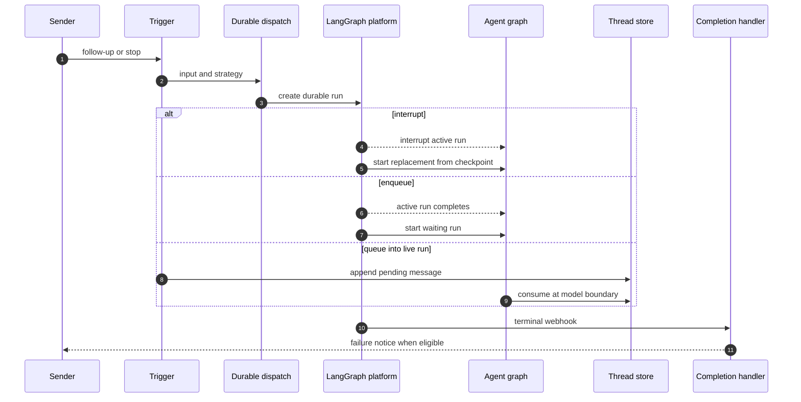

# Follow-ups, Interruption, and Completion

A thread is the continuity boundary: durable runs share its checkpointed state and its thread-bound sandbox. Incoming work has two deliberately different delivery mechanisms:

- A **durable follow-up run** is submitted with a LangGraph multitask strategy. `interrupt` replaces active work; `enqueue` waits for it.
- A **store-queued message** is injected into a run that is already executing at its next before-model boundary. It is not itself a run.

This distinction is important operationally. Use a run when the new request should be independently scheduled; use the queue to steer a live run without discarding its current state. See [Invocation](invocation.md), [Threads and state](../concepts/threads-and-state.md), and [Middleware stack](../architecture/middleware-stack.md) for the surrounding contracts.

## Durable dispatch and sandbox continuity

`dispatch_agent_run` is the common agent and reviewer dispatch entrypoint. It accepts a prebuilt `RunInput`, or builds one with source-aware sender/channel identities, then delegates to `create_durable_run`. Its default `multitask_strategy` is `"interrupt"`; callers explicitly choose `"enqueue"` for work that must follow interactive activity.

The durable defaults are `durability="sync"`, resumable streaming, subgraph streaming, and the v3-compatible event stream mode set. `prepare_run_config` adds an invocation identifier and start time, enables the streaming compatibility marker, and carries metadata into the run. Together these settings retain checkpoints and let a later dashboard client observe externally initiated runs.

Sandbox acquisition follows the same thread boundary. It uses a cached backend when available or reconnects through persisted `sandbox_id`; an unreachable existing sandbox fails rather than being silently replaced, because replacement can lose uncommitted work. A deleted sandbox is recreated, and callers such as the read-only reviewer can opt into replacement of merely unreachable sandboxes.

This sequence shows the separate interrupt, enqueue, queue-recovery, and terminal-notification paths.

### Strategy selection

Slack chooses strategy by urgency: explicitly tagged requests use `"interrupt"`, whereas untagged follow-ups use `"enqueue"`. A Slack message edit is instead appended to the store queue; if the thread is idle, it waits until a subsequent run reaches the middleware.

Automated updates avoid preempting people. Baby-sit terminal, ready, and failure updates, as well as a terminal sandbox background-task notification, dispatch with `multitask_strategy="enqueue"`. The background-task monitor claims a task notification in the sandbox before dispatch and records delivery only after dispatch succeeds, allowing failures to be retried.

## Queueing and recovering in-flight input

`queue_message_for_thread` stores `{"content": ...}` entries at `("queue", thread_id) / "pending_messages"`. It preserves FIFO order, deduplicates structured entries with the same `queue_id`, and caps storage at the newest 100 messages.

The dashboard continuation handler is only for a busy, authorized thread: it returns 409 for idle and 502 when activity cannot be determined. It updates participant and activity metadata, queues an attributed web payload containing text, sender, `queue_id`, timestamps, and non-text image blocks, then best-effort marks a Slack-origin thread as handed off to web.

A stream-command steering path handles a race that the busy check cannot eliminate. It queues the same type of payload; if its target run has ended after the write, it starts an empty-input `follow_up_pickup` run with strategy `reject`. The completion handler has a matching pickup path after an ordinary successful run. `reject` ensures that only one contender starts a run; its first model call drains the queue.

### Before-model queue middleware

`check_message_queue_before_model` is installed in the reviewer and normal agent graphs, but omitted for an agent stop-summary run. It is a no-op without a thread ID or store. On each model boundary it:

1. consumes and clears a pending autofix event into a system instruction;
2. snapshots queued messages in FIFO order;
3. rebuilds them through `build_input_messages`, preserving attribution and dynamic-context de-duplication; and
4. removes only the snapshot after message construction completes.

The last rule is a loss-prevention invariant: messages appended while image fetching or identity resolution is awaiting remain in the store. Conversely, construction failure leaves the snapshot for a later model call. A failed queue read still returns an already assembled autofix instruction, and the outer middleware failure is logged without aborting the model call.

Ordinary blocks are attributed to `system:thread-queue`. A dashboard payload switches the reply surface to web and, only when moving from Slack, adds a dashboard-handoff system message; its human message is attributed to the supplied canonical person. Image URLs are fetched only when the resolved model supports vision; unsupported fetched images are omitted with a warning while supplied image blocks remain.

## Stop behavior

Slack stop resolves a `:x:` reaction either through the reply-to-run mapping or as a root timestamp, then verifies that the target thread metadata names the same Slack location. It requires a unique event ID and claims it only after that validation. The handler enumerates every pending and running run, interrupts them, deletes both queued messages and autofix records, and marks the thread interrupted.

It then dispatches a `stop_summary` agent run and maps that run to the Slack thread. The summary prompt is read-only and exists to report the stopped work, not resume it. Cancellation or deferred-work cleanup failure prevents that successful-summary path. The code-channel `agent_session_stopped` event has the same cancellation and cleanup behavior but returns the session to `active` without dispatching a summary.

Dashboard cancellation is intentionally less destructive to deferred input. After authorization, it cancels live runs by enumeration rather than trusting `latest_run_id`, and it does not cancel a pending run queued by another user. It settles cancelled transcript turns, marks the thread interrupted, and normally starts a pending-follow-up pickup run if store messages remain. The machine and administrator cancellation variants stop runs and mark the thread but do not create that continuation.

## Completion, settlement, and notifications

Dispatch attaches `/webhooks/run-complete` only if `RUN_COMPLETE_WEBHOOK_SECRET` is configured and `COMPLETION_WEBHOOK_URL` is absolute and non-loopback. The route verifies the query token with a constant-time comparison and fails closed when no secret is configured.

At a terminal webhook, `handle_run_completion` finalizes invocation telemetry and settles the transcript turn. On a normal successful run it attempts to pick up messages that arrived after the last model call, synchronizes Slack background status, schedules answer feedback when appropriate, and—when the thread has a Slack destination—schedules a session-cost refresh once per run ID. A pickup run is excluded from another automatic pickup attempt to avoid repeating a leftover that could not be consumed.

Only `error` and `timeout` are terminal failures for user notification; `interrupted` is the expected outcome of an interrupting follow-up. For eligible Slack, Linear, and GitHub origins, failure replies are best effort and deduplicated by run ID (with a legacy thread-level fallback when the payload has no run ID). Automated `thread_wakeup` failures stay silent. Completion also avoids clearing a code-channel loading state while another pending or running run exists.

## Focused verification

`tests/slack/test_slack_stop.py` covers mapped-reply and root reactions, all-live-run cancellation, deferred-work cleanup, summary dispatch and mapping, duplicate/missing-event safety, metadata mismatch rejection, cleanup failure behavior, and the no-summary code-channel stop. `tests/webhooks/test_completion_webhook.py` covers missing identifiers, failure deduplication, interrupted-status silence, token verification, wakeup silence, and Slack status behavior while other runs or background tasks remain.
