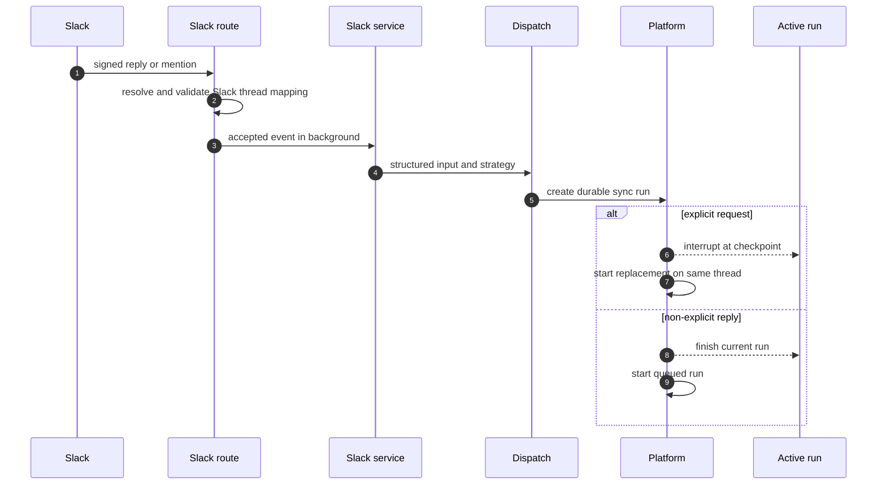
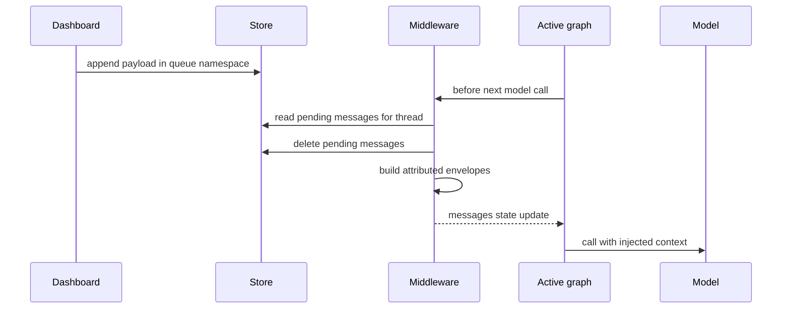
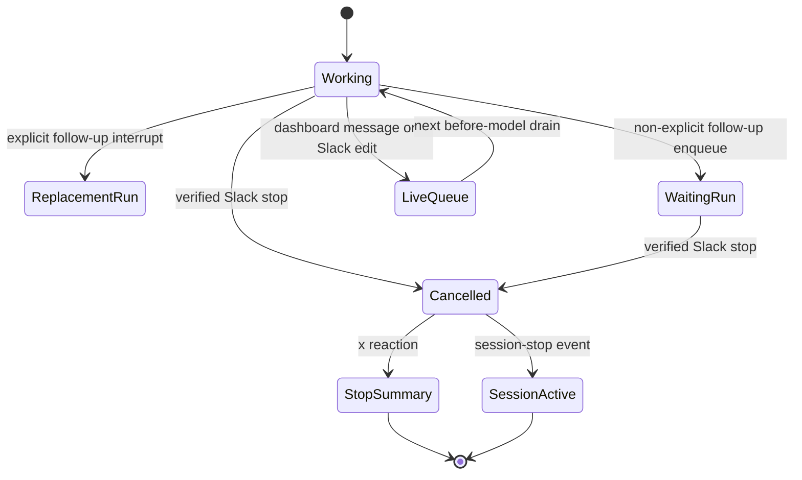

# Follow-up, interruption, and stop handling

A follow-up is input associated with an existing agent thread: a new Slack turn, a Slack edit, or a dashboard message while that thread is working. The system deliberately distinguishes **run scheduling** from **mid-run state injection**:

- A product trigger creates a durable run on its resolved thread. Its multitask strategy says whether it preempts the active run or waits behind it.
- The store-backed queue injects a message into the currently executing graph before its next model call. It is used by the dashboard for a live handoff and by Slack message edits; it is not the normal scheduling mechanism for an untagged Slack reply.
- A stop cancels live work for one verified Slack thread and removes deferred records. A `:x:` reaction then creates a constrained summary turn; a code-channel session-stop does not.

This page covers the boundary between surfaces and the graph. See [threads and state](../concepts/threads-and-state.md) for thread ownership, [invocation](invocation.md) for ordinary run creation, [context engineering](context-engineering.md) for the input envelope, and [sandbox lifecycle](../architecture/sandbox-lifecycle.md) for sandbox reuse.

## Resolve the originating thread before acting

Slack’s webhook route validates the signed request, rejects ineligible channels and bot-originated messages, and deduplicates accepted Event API deliveries. For ordinary follow-ups it resolves the `(channel_id, thread_ts)` mapping to an agent `thread_id`; a conflicting mapping is an error rather than a guess. A Slack edit takes a stricter route: the route retries locating the delivered-message mapping and accepts it only when its Slack thread timestamp, triggering user, and agent thread ID agree, and the agent thread still exists. It also rejects identity-changing edits and attachment-only link-unfurl edits.

The asynchronous Slack service refreshes source metadata and constructs a structured `RunInput` from the Slack context. Each message is attributed to a person or system identity and carries Slack channel and timestamp context. This is what keeps a later reply attached to the intended conversation rather than treating raw Slack text as global input.

## Durable run scheduling: interrupt or enqueue

`dispatch_agent_run` is the common contract for Slack, Linear, GitHub, and dashboard triggers. It builds or accepts a structured input and delegates to `create_durable_run`, which calls `client.runs.create`. The defaults are `multitask_strategy="interrupt"` and `durability="sync"`; the latter checkpoints before each step. Thus an interrupt on a busy thread stops the active run at a durable boundary and the new run has the thread’s conversation state, whereas an idle thread just starts. `stream_resumable=True` and the Protocol v2 streaming configuration make externally-triggered runs replayable to later dashboard clients.

`enqueue` is a platform run-scheduling alternative, not the store message queue below: the active run is allowed to finish and the new run begins afterwards. Background work such as babysitting can choose it. Slack chooses it for a non-explicit follow-up; an explicit bot tag, direct/code-channel directed request, or other explicit request chooses `interrupt`.

The platform serializes work per resolved thread: an explicit request preempts, while a non-explicit Slack follow-up is scheduled behind the active run.

This serialization is also an important sandbox invariant. `ensure_sandbox_for_thread` relies on interrupt scheduling so two runs for one thread do not provision sandboxes concurrently; it reuses a cached or persisted sandbox ID, recreates a deleted sandbox, but normally refuses to replace an unreachable one because replacement could silently discard uncommitted work.

## Live-message queue and context injection

### Dashboard handoff

`send_dashboard_message` first authorizes posting against thread metadata and requires the thread status to be `busy`. An idle thread receives HTTP 409 and must start through the stream command endpoint; inability to determine activity returns HTTP 502. For a live thread it updates handoff metadata (including participants, selected model/effort, and unresolved PR state where appropriate), then appends a structured payload to `("queue", thread_id)`, key `pending_messages`. The payload preserves text, `source: "dashboard"`, `surface: "web"`, the sender identity, and image blocks. When the prior source is Slack, a best-effort trace-reply update marks the web handoff.

`queue_message_for_thread` appends `{"content": ...}` in FIFO order and caps the stored list at 100 entries, dropping the oldest when over capacity. This record is scoped by the agent `thread_id`, so neither a queue read nor a stop cleanup can affect another thread.

### Before-model drain

`check_message_queue_before_model` is installed in the agent and reviewer middleware stacks and runs before every model call. It obtains `thread_id` from the run configuration and the graph store; absent either, it does nothing. It also consumes the per-thread `("autofix", thread_id) / "pending_event"` record and turns batched PR-babysitting feedback into an instruction to re-check CI and review comments rather than create another run.

For `pending_messages`, the middleware reads the record and deletes it **before** processing its contents. It then returns a `{"messages": [...]}` state update, so the next model call sees the injected messages as part of conversation state. Deleting early prevents a subsequent middleware invocation from injecting the same batch twice, at the cost that an error after deletion can lose that batch; the outer error handler logs and allows the model call to continue instead of aborting the run.

Queued dashboard messages produce a dashboard-handoff system message plus a human message attributed to the sender on the web surface. Other queued strings or blocks use the `system:thread-queue` identity. `build_input_messages` emits dynamic identity introductions only when their hashes are not already visible to the model; visibility respects the summarization cutoff, so context hidden behind a summary is reintroduced. Each structured input envelope stays in its own message because the transcript parser expects one envelope per message. Text blocks may be merged, but envelopes cannot be packed together. If queued content has images, the middleware resolves the thread model; unsupported URL images are omitted and a vision-support warning is appended instead.

The live queue is drained only at a before-model boundary, allowing the current run to incorporate a dashboard handoff without creating a competing run.

### Slack edits are deferred corrections

An accepted Slack message edit is routed only after delivered-message identity checks. The service labels it with an “updated message” instruction and queues its text/blocks instead of making a new run. If the thread is busy, the before-model middleware can incorporate it during the current run. If the thread is idle, nothing drains this queue until a later run; the edit intentionally does not itself restart finished work.

## Stop paths and their safety boundary

A Slack `reaction_added` event with `reaction == "x"` is handed to the stop handler in background. It resolves the reacted message through its run mapping (or treats a root message as the thread timestamp), resolves the Slack-thread mapping, fetches the agent thread, and verifies that `SourceContext` says the metadata belongs to the same channel and Slack thread. Only then does it claim the event for deduplication. These checks make an unknown mapping, a conflicting association, or a mismatched metadata record a no-op rather than a cross-thread cancellation.

The reaction stop lists all `pending` and `running` run IDs, cancels them with `action="interrupt"`, deletes both deferred records (`pending_messages` and `pending_event`) for that thread, and marks metadata as interrupted with `stop_requested_at_ms`. It then dispatches a stop-summary run with `stop_summary=True`. Its prompt forbids resuming work and all mutating actions, and requires one concise Slack summary. The normal agent graph omits queue-draining middleware in stop-summary mode, so a summary cannot consume new deferred input.

A Slack `agent_session_stopped` event applies the same verified-thread cancellation, deferred-work cleanup, and interrupted metadata update to the code-channel session thread, then returns that session to `active`. Unlike a `:x:` reaction, it does **not** dispatch a summary run.

A verified stop interrupts all live work and clears deferred state; only the reaction path follows it with a read-only summary.

## Operations and focused tests

Run creation can safely omit the completion webhook when its secret is unset or its configured URL is relative/loopback; dispatch logs the condition rather than letting webhook validation prevent every run. When enabled, the URL must be an absolute non-loopback HTTP(S) deployment URL and includes the secret token for completion verification.

Focused regression coverage lives in:

- `tests/middleware/test_check_message_queue.py`, which checks dashboard handoff attribution/envelope separation, autofix consumption, and text-only versus vision-capable image handling.
- `tests/dashboard/test_dashboard_web_handoff.py`, which checks idle rejection, structured busy-thread handoff queuing, and Slack trace-reply handoff behavior.
- `tests/slack/test_slack_stop.py`, which checks cancellation of both pending and running runs, record cleanup, summary dispatch, unknown/mismatched mapping rejection, and the no-summary session-stop path.

When changing this flow, preserve the resolution and metadata-match checks before cancellation, the delete-before-inject duplicate-prevention rule, and the distinction between platform `enqueue` scheduling and store-queue injection.
