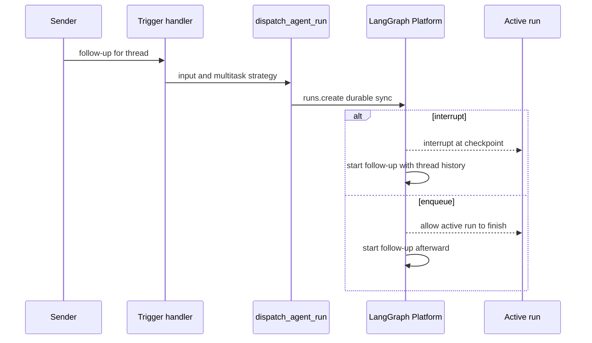
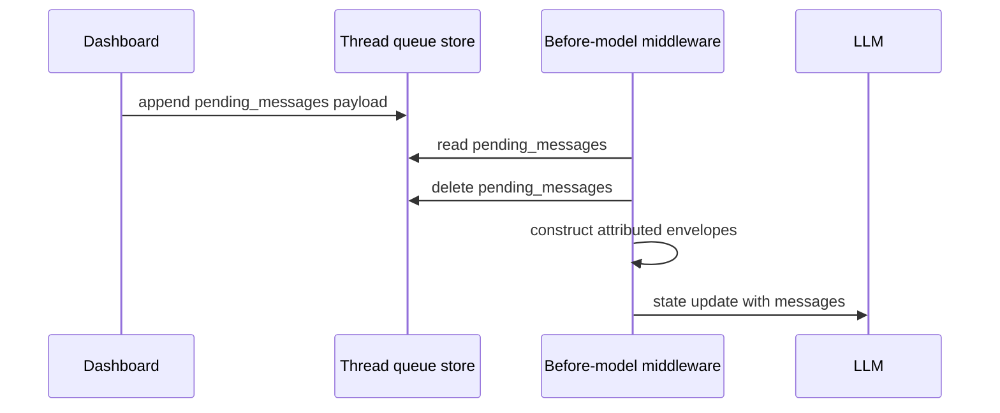

# Follow-up, Interrupt, and Stop Workflow

A follow-up is input for an existing agent thread: for example, another Slack
message, a dashboard message while the agent is working, or an automated PR
update. Open SWE has two deliberately different mechanisms:

- **Run multitasking** controls what a newly created run does to other runs on
  the same thread: it normally interrupts, or it can wait with `enqueue`.
- **The store message queue** carries a dashboard follow-up into an already
  active run. The next before-model boundary turns its payload into attributed
  conversation messages.

A stop is different from either: it cancels live runs and has stop-source-
specific handling for deferred work. See [Invocation](invocation.md) for normal
run creation, [Sandbox lifecycle](../architecture/sandbox-lifecycle.md) for the
execution environment, and [Threads and state](../concepts/threads-and-state.md)
for thread ownership and metadata.

## Dispatching a follow-up run

`dispatch_agent_run` is the common durable dispatch contract for Slack, Linear,
GitHub, and dashboard triggers. It builds (or accepts) a structured `RunInput`
and delegates to `create_durable_run`, which calls `client.runs.create`. Its
default `multitask_strategy` is `"interrupt"`; durable runs also default to
`durability="sync"`, so the platform checkpoints before each step. The dispatch
configuration enables resumable event streaming and uses the Protocol v2 stream
configuration, allowing a dashboard that did not create a run to replay its
lifecycle, tool, and subgraph events.

Follow-up run creation delegates concurrency policy to the LangGraph platform.

### Interrupt versus `enqueue`

With `multitask_strategy="interrupt"`, a follow-up on a busy thread halts the
active run and resumes the agent with full conversation history and the new
message; on an idle thread it simply starts. Sync durability makes the prior
run resumable from its latest checkpoint after interruption or failure, rather
than losing all progress.

Background work can instead pass `multitask_strategy="enqueue"`, which lets the
active run finish before the later run starts. `/baby-sit` progress/terminal
updates and background-task runs use this lower-priority policy. Slack makes the
choice from the request: an explicit bot tag uses `interrupt`; an untagged
eligible reply uses `enqueue`. The latter is still a new run after the active
one, not an entry in the store queue.

## Dashboard follow-ups: a store-backed queue

`send_dashboard_message` is intentionally only for a **busy** thread. It first
checks that the caller may post to the thread, then rejects unknown activity
with HTTP 502 and an idle thread with HTTP 409; clients must start an idle turn
via the stream commands endpoint. Before queuing, it updates thread metadata
(including selection and participant details) and clears resolved/attention
state where appropriate. Queue failure is HTTP 502.

The queue is a FIFO record at `("queue", <thread_id>)`,
`"pending_messages"`. `queue_message_for_thread` appends a `{"content": ...}`
entry and retains only the latest `MAX_QUEUED_MESSAGES` (100), dropping oldest
entries on overflow. Dashboard content is a structured payload: text, source
`"dashboard"`, web surface, a `github:<login>` sender identity, and non-text
image blocks. This retains identity and multimodal information rather than
flattening the message to text.

A dashboard follow-up is cleared from the store and injected before the active run's next model call.

### Queue consumption and message shape

`check_message_queue_before_model` is `@before_model` middleware in both the
agent and reviewer graphs. It reads `thread_id` and the LangGraph store from the
runtime context; without either, it does nothing. The agent graph excludes this
middleware for a `stop_summary` turn. For ordinary turns it reads the queue and
deletes `pending_messages` **before** transforming it, avoiding duplicate
injection if the hook executes again. The returned `{"messages": [...]}` state
update appends messages that the next model call can see.

The middleware also consumes `("autofix", <thread_id>)` / `"pending_event"`.
It deletes the record and injects a system instruction to re-check CI and review
comments before finishing rather than starting a separate PR-babysitting run.

Queued messages are serialized with `build_input_messages`:

- Unattributed queued text/blocks are emitted as the `system:thread-queue`
  system identity.
- A dashboard payload first adds a `system:dashboard-handoff` instruction, then
  emits the payload as a human web message attributed to its sender.
- Each structured `<input-message>` envelope is emitted in its own message.
  Combining envelopes into one content block would make the transcript parser
  render raw XML; ordinary text blocks can still be merged.
- If queued content has images, the middleware resolves the thread model. For a
  model without image support it omits URL-fetched image blocks and adds a
  vision-not-supported warning to the text.
- Dynamic context identities are deduplicated against
  `visible_dynamic_context_hashes(state)`. That function honors a summarization
  cutoff, so context hidden behind a summary is injected again rather than
  incorrectly treated as visible.

Errors in the middleware are isolated: they are logged and the model proceeds
without a queue update. A failed queue read still permits any already assembled
autofix content to be flushed.

## Stopping work

### Slack stop sources

The Slack route accepts a `reaction_added` event with `reaction == "x"` and
queues its handling in a background task; it also accepts an
`agent_session_stopped` event. Both handlers resolve the Slack channel/thread to
an Open SWE thread and verify that the thread's persisted Slack context matches.
They also deduplicate a supplied event ID before side effects.

For either stop source, the handler lists all `pending` and `running` run IDs,
cancels them with `runs.cancel_many(action="interrupt")`, deletes both queued
records (`pending_messages` and the autofix `pending_event`), and marks metadata
as `latest_run_status="interrupted"` with `stop_requested_at_ms`.

A `:x:` reaction additionally dispatches a stop-summary run and maps it back to
the Slack thread. Its `stop_summary` configuration removes queue middleware,
and its prompt prohibits resuming work or using mutating actions; its only
user-facing action is one concise Slack summary. A code-channel
`agent_session_stopped` event intentionally **does not** create that follow-up
run; after cancellation and cleanup it sets the code-channel session status to
`"active"`.

If cancellation or deferred-work cleanup fails, the reaction handler stops
before writing interruption metadata or dispatching a summary. A reaction with
no event ID, an unmapped non-root message, duplicate event, or mismatched Slack
metadata has no stop side effects.

### Dashboard cancellation is not Slack stop

`cancel_dashboard_thread` (and its admin variant) cancels every `pending` and
`running` run on the thread, not merely `latest_run_id`, then writes
`latest_run_status="interrupted"`. This allows the dashboard stop button to
handle externally triggered runs and stale metadata. The non-admin endpoint
authorizes the caller first; cancellation failures return HTTP 502 without the
status update.

Unlike Slack stop, the regular dashboard cancellation path does **not** delete
the store queue. If `pending_messages` exists after cancellation, it builds a
dashboard configuration and dispatches an empty-input follow-up run, allowing
the normal middleware to deliver the deferred message. If that dispatch fails,
the API returns HTTP 502 after cancellation.

## Focused verification

- `tests/middleware/test_check_message_queue.py` verifies dashboard handoff and
  sender envelopes, autofix-event delivery, and image behavior.
- `tests/dashboard/test_dashboard_thread_api.py` covers activity/authorization
  failures and cancellation of all live runs, including runs the browser did
  not start.
- `tests/slack/test_slack_stop.py` covers mapped/root reactions, metadata and
  event-ID guards, cleanup, summary dispatch, failure ordering, and the distinct
  session-stop behavior.
