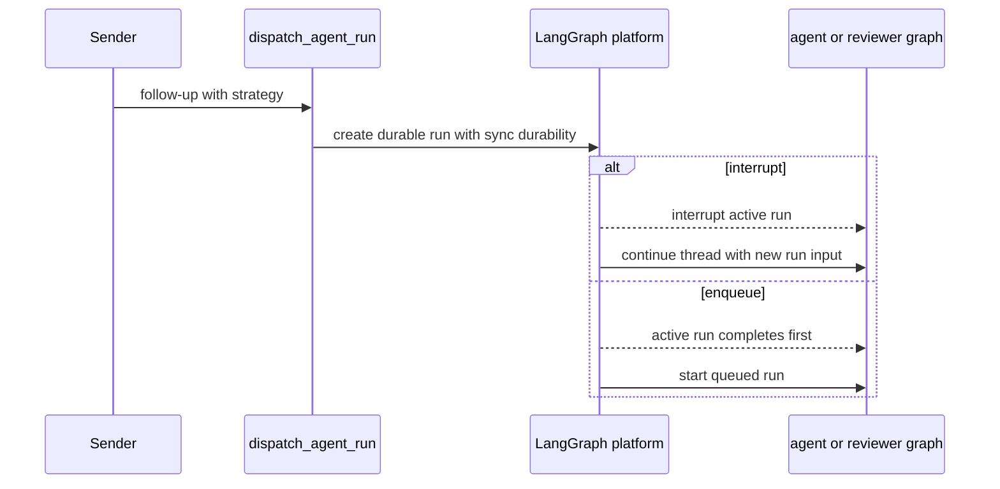
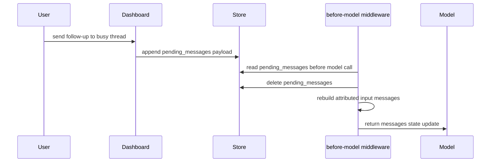
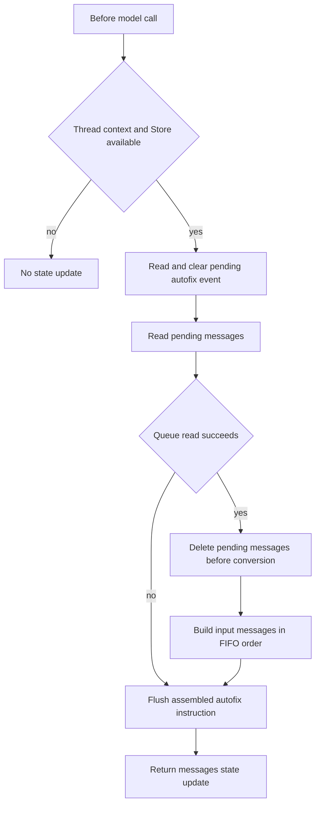

# Follow-Up, Interrupt, and Queue Handling

A LangGraph thread is the continuity boundary: a later run advances the same checkpointed history rather than opening another conversation. Open SWE handles new work on that thread in two distinct ways:

- A **durable run** is submitted with a multitask strategy. `"interrupt"` is the default and replaces active work; `"enqueue"` waits for it.
- A **store-backed message** is appended to `pending_messages` and becomes state at the active graph's next before-model boundary. It is not a queued platform run.

This distinction matters operationally: enqueueing preserves run ordering, whereas a message queue requires a graph to reach another model call before it is consumed. For thread identity and persisted state, see [Threads, Runs, and Durable State](../concepts/threads-and-state.md); for initial entrypoints, see [Inbound Invocation to Durable Run](invocation.md).

## Durable follow-up dispatch

`dispatch_agent_run` is the shared agent and reviewer dispatch boundary. Callers may provide structured `RunInput`, or provide content and identity context for it to construct one; it delegates to `create_durable_run`. The durable defaults are `durability="sync"`, `multitask_strategy="interrupt"`, a new or propagated invocation identifier, resumable subgraph streaming, and the v3 compatibility marker. Those stream settings let the dashboard attach to externally initiated work with the expected event modes.

A caller selects `"enqueue"` when its notification must not displace interactive work. In particular, terminal/failure `/baby-sit` updates and terminal sandbox-background-task notifications enqueue their agent run. Background-task delivery uses a sandbox-side claim and only marks the notification delivered after dispatch succeeds, so a failed dispatch can be retried.

The platform strategy determines whether a durable follow-up preempts current work or waits behind it.

### Slack and GitHub routing

Slack chooses the strategy from request intent: `_dispatch_or_queue_slack_run` uses `"interrupt"` for an explicitly tagged request and `"enqueue"` for an untagged follow-up. A Slack message edit is different: it queues corrected content instead of starting a run, including when the thread is idle; it waits for a later run to reach middleware. GitHub webhook paths also use the shared dispatcher, so their normal default is interruption unless a caller explicitly changes it.

Completion callbacks are optional so a bad deployment setting cannot break dispatch. A callback is attached only when `RUN_COMPLETE_WEBHOOK_SECRET` is set and `COMPLETION_WEBHOOK_URL` is absolute and non-loopback. The public `/webhooks/run-complete` endpoint fails closed when the query token does not match the secret.

## In-flight dashboard follow-ups

`POST /threads/{thread_id}/messages` is a continuation endpoint for a **busy** thread, not a general start-run API. It loads the thread, authorizes the session user through thread posting policy, and checks activity. An indeterminate status returns 502; an idle thread returns 409 and directs clients to stream commands instead.

Before queuing, the endpoint updates participant, activity, plan-mode, and chosen-model metadata (and reopens a resolved PR-linked thread when necessary). It creates a payload with text, web/dashboard provenance, a client-generated `queue_id`, timestamp, `github:<login>` sender identity, and validated non-text image blocks. A Slack-originated thread is best-effort annotated with a web-handoff trace update after the queue succeeds.

`queue_message_for_thread` writes `{"content": ...}` entries at `("queue", thread_id) / "pending_messages"`. It appends FIFO, deduplicates structured payloads with an already-present `queue_id`, retains only the newest 100 entries, and reports store failures as `False`. It also records feedback activity.

A dashboard follow-up enters the live graph at the next model boundary instead of becoming another durable run.

## Before-model queue consumption

`check_message_queue_before_model` is installed in both the agent and reviewer middleware stacks; the agent excludes it in `stop_summary` mode. Missing thread context or Store is a no-op.

At each model boundary, middleware first reads `("autofix", thread_id) / "pending_event"`. A record with a reason produces the rendered autofix instruction, including string details when provided, and is cleared. It then reads the message queue. It deletes `pending_messages` before converting its entries, which avoids duplicate injection if middleware is invoked again; consequently, conversion failures after deletion can lose that batch. Queue-read failure does not discard an already assembled autofix instruction.

The middleware consumes deferred autofix and message records before conversion and appends the resulting state update for the imminent model call.

Queued content is rebuilt through `build_input_messages`, preserving transcript attribution and dynamic-context deduplication rather than appending raw text. Ordinary blocks use the `system:thread-queue` automation identity. A dashboard payload first adds a dashboard-handoff system instruction, then creates a web human message for its supplied sender; its `queue_id` is assigned to the final structured message. Visible dynamic-context hashes prevent repeated identity context, with summarization cutoffs considered when deciding what remains visible.

For payloads containing image URLs or image blocks, middleware resolves the thread's selected model once. Unsupported fetched image URLs are omitted and a vision warning is appended to text, while supplied image blocks are retained. Exceptions in the outer middleware are logged and leave the model call able to proceed.

## Stops intentionally have different queue policies

Both Slack and dashboard stop implementations enumerate every `pending` and `running` run—rather than trusting `latest_run_id`—and cancel them with `action="interrupt"`. This permits stops from a browser that did not create the run and handles stale metadata.

A Slack `:x:` reaction is accepted asynchronously by the webhook route. The stop handler resolves either an agent-reply mapping or the root timestamp, verifies that the target thread's Slack metadata matches the location, then claims the event ID. Missing IDs, duplicate claims, missing mappings, and mismatches have no stop side effect. On success it cancels runs, deletes both `pending_messages` and `pending_event`, marks the thread `interrupted` with a stop time, and dispatches a constrained `stop_summary` run mapped back to Slack. If cancellation or deferred-work cleanup fails, it does not dispatch that summary. A code-channel `agent_session_stopped` event performs cancellation and the same cleanup, returns the session to `active`, and deliberately does not start a summary run.

The authorized dashboard `POST /threads/{thread_id}/cancel` marks the thread interrupted but preserves `pending_messages`. If messages exist, it dispatches an empty-input continuation run; middleware consumes the preserved records. A failure to launch that continuation becomes 502 after cancellation was requested. The admin cancellation variant only cancels and marks the thread; it does not launch queued continuation work.

## Terminal completion

The completion handler finalizes invocation usage for `success`, `error`, `timeout`, and `interrupted`. It treats only `error` and `timeout` as failures: interruption is expected when a follow-up preempts a run. Failure replies are best-effort and routed from source metadata to Slack, Linear, or GitHub; deduplication is run-scoped when a run ID is present and falls back to a legacy thread flag when it is absent. Automated thread-wakeup failures do not send a failure reply.

For successful non-reviewer runs, completion settles a code-channel session only if no newer pending/running run exists, can schedule answer feedback, and schedules Slack session-cost refresh only for an eligible Slack thread and invocation ID. The per-run refresh marker prevents duplicate callback delivery from scheduling the cost job twice.

## Focused tests

The regression suite covers dispatcher defaults, stream configuration, callback URL safety, and prebuilt input in `tests/agent/test_dispatch.py`. Queue tests exercise dashboard handoff attribution, autofix details and cleanup, and vision behavior in `tests/middleware/test_check_message_queue.py`; `tests/test_thread_ops.py` covers `queue_id` deduplication. `tests/slack/test_slack_stop.py` covers mapped/root stops, live-run cancellation, deferred-work deletion, idempotence and validation failures, cleanup failures, summaries, and code-channel no-summary stop. Completion tests cover terminal telemetry, idempotent failure replies, reviewer check settlement, and session-cost refresh in `tests/webhooks/test_completion_webhook.py`.
