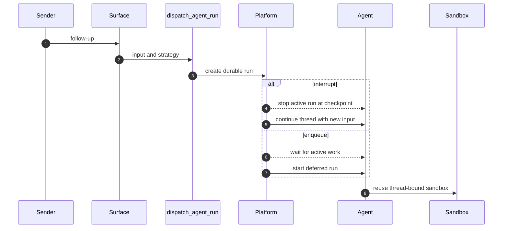
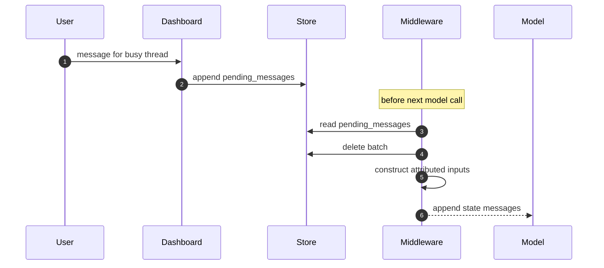

# Follow-ups, Interrupts, and Completion

A thread is the continuity boundary: its checkpointed graph state and its sandbox metadata let later work continue the same conversation and workspace. A new request arriving on a busy thread takes one of two distinct paths:

- A **durable run** is created with a multitask strategy. `"interrupt"` replaces active work at a checkpoint; `"enqueue"` waits for it in the platform's run queue.
- A **queued message** is stored for a currently busy run. Before its next model call, middleware removes the batch from the store and appends structured messages to the existing state.

Thus an enqueued run is not a queued message: it starts only after another run finishes, while a queued message is consumed by the active run at its next model boundary. See [Invocation](invocation.md), [Threads and state](../concepts/threads-and-state.md), and [Sandbox lifecycle](../architecture/sandbox-lifecycle.md) for the surrounding contracts.

## Durable dispatch and continuity

`dispatch_agent_run` is the shared contract for agent and reviewer invocations. It accepts either a prebuilt `RunInput` or content plus identities, rejects combining those forms, and delegates to `create_durable_run`. The latter defaults to `multitask_strategy="interrupt"` and `durability="sync"`; it also supplies v3-compatible stream modes, subgraph streaming, and resumable streaming.

`prepare_run_config` merges supplied metadata, resolves or creates an invocation ID, records its start time, and sets `__event_streaming_v2`. This gives externally triggered runs the same replayable event shape that dashboard-created runs use. Sync durability is the checkpointing precondition for safe interruption and recovery.

The platform strategy decides whether the follow-up preempts active work or waits behind it.

Sandbox acquisition is also thread-bound. It reuses a cached backend where possible, otherwise reconnects using persisted `sandbox_id`; normal agent work fails rather than silently replacing an unreachable sandbox, because an empty replacement could lose uncommitted work. A deleted sandbox is recreated, and callers such as the read-only reviewer can opt into replacement for an unreachable sandbox.

### Strategy selection by source

Slack chooses urgency from how the message was addressed. `_dispatch_or_queue_slack_run` passes `"interrupt"` for an explicitly tagged request and `"enqueue"` for an untagged follow-up; DMs count as explicit requests. A Slack message edit is different again: it is placed in the message queue rather than dispatched, so an edit made while idle waits for a later run to reach middleware.

GitHub webhook paths dispatch structured human or system `RunInput` through the same common dispatch contract; absent an explicit override they receive the `"interrupt"` default. By contrast, automation avoids preemption: `/baby-sit` terminal/failure follow-ups and completed sandbox-background-task notifications explicitly use `"enqueue"`. The background-task monitor claims each terminal task through a sandbox marker, marks the claim delivered only after dispatch succeeds, and releases it on dispatch failure.

## Live dashboard handoff and queue drain

`POST /threads/{thread_id}/messages` calls `send_dashboard_message`. This is a busy-thread continuation endpoint: after authorization, it returns 409 for an idle thread and 502 if activity cannot be determined. It updates participant, activity, plan-mode, and optional model metadata, then queues an attributed payload containing text, `source: "dashboard"`, `surface: "web"`, a GitHub identity for the sender, a client-derived `queue_id`, and non-text image blocks. The queue ID makes retries idempotent against existing structured queue entries. When applicable, it also best-effort marks the originating Slack conversation as handed off to web.

`queue_message_for_thread` persists entries as `{"content": ...}` in `("queue", thread_id) / "pending_messages"`. It preserves FIFO ordering, keeps only the newest 100 entries, and drops oldest entries on overflow. Queue failure returns `False` to the caller; the dashboard converts that failure to HTTP 502.

A dashboard follow-up is injected into the current run rather than becoming a second run.

`check_message_queue_before_model` is before-model middleware in both agent and reviewer graphs; agent stop-summary mode excludes it. With thread and store context available, it consumes a batched `("autofix", thread_id) / "pending_event"` into a system instruction, then reads the message queue. It deletes `pending_messages` before conversion to prevent re-injection on a later middleware pass, and returns a state update in queue order. If the queue read fails, it still flushes an already assembled autofix instruction; outer errors are logged so the model call can continue.

Queued content is rebuilt with `build_input_messages`, not inserted as raw text. Ordinary blocks are attributed to `system:thread-queue`; dashboard content first receives a dashboard-handoff system message and then an attributed web human message. Dynamic identity/context introductions are filtered by hashes already visible to the model, with the summarization cutoff respected so context hidden behind a summary is reintroduced. Structured envelopes stay in separate messages because the transcript parser expects one envelope per message.

For queued image URLs, middleware resolves the thread model once. If it lacks vision support, downloaded image URLs are omitted and a warning is added to text; supplied image blocks remain. Image fetches and model-metadata lookup are best-effort within the middleware's error isolation.

## Stops and their intentional differences

Both Slack and dashboard stops enumerate all `pending` and `running` runs, then call `cancel_many(..., action="interrupt")`; they do not trust a possibly stale `latest_run_id`. What happens to deferred work differs by surface.

### Slack stop

A `:x:` reaction is resolved through the Slack reply-to-run mapping, or treats the reacted root timestamp as the thread timestamp. The handler verifies the mapped thread's Slack channel and timestamp before it claims the event ID. Missing IDs, duplicate claims, unmapped reply reactions, and mapping/metadata mismatches cause no destructive action.

After claiming a valid stop, Slack cancels live runs, deletes both `pending_messages` and the autofix event, and records `latest_run_status="interrupted"` with a stop timestamp. It then dispatches a stop-summary run using the preserved source configuration and maps that new run back to the Slack thread. The summary graph operates in `stop_summary` mode, which excludes queue injection; its prompt is responsible for the read-only concise Slack summary behavior. Cancellation or deferred-work cleanup failures prevent the summary dispatch.

A code-channel `agent_session_stopped` event follows the same cancellation, cleanup, and interrupted-status path, then sets the Slack session active. It does not dispatch a summary run.

### Dashboard stop

`POST /threads/{thread_id}/cancel` authorizes the caller, cancels every live run found by pagination, and marks the thread interrupted. Unlike Slack, it preserves `pending_messages`. If messages are present, it submits an empty-input agent run; queue middleware then drains that retained work and metadata is updated to the new pending run. If that submission fails, the endpoint reports HTTP 502 even though cancellation was already requested. The admin cancellation route cancels and marks status but does not submit this queued continuation.

## Completion callbacks and user-facing settlement

Dispatch attaches a completion webhook only when `RUN_COMPLETE_WEBHOOK_SECRET` is set and `COMPLETION_WEBHOOK_URL` is absolute and non-loopback. The resulting URL carries `?token=` unless it already has a query string. `/webhooks/run-complete` verifies that token with a fail-closed comparison before it accepts JSON and calls `handle_run_completion`; without the secret, callbacks and completion replies are disabled rather than allowing unauthenticated requests.

Completion finalizes agent usage telemetry for terminal `success`, `error`, `timeout`, and `interrupted` runs when an invocation ID is available. `error` and `timeout`, but not `interrupted`, are terminal failures eligible for a best-effort originating-channel reply. Failure replies target Slack, Linear, or GitHub from source metadata, and are idempotent per run ID with a bounded remembered-ID list; legacy payloads without a run ID use a thread-level flag. Automated `thread_wakeup` failures are deliberately ignored.

On successful non-reviewer agent runs, completion settles Slack loading/session status only after confirming no pending or running run remains. It schedules answer feedback unless the run was an automated wakeup. Eligible Slack runs also schedule a session-cost refresh once per run and record that scheduling in thread metadata.

## Regression focus

`tests/slack/test_slack_stop.py` covers mapped-reply and root reactions, cancellation of pending and running runs, cleanup of deferred records, status mutation, summary dispatch and mapping, duplicate and missing-event safety, metadata mismatch rejection, cleanup/cancellation failures, and code-channel stop without a summary. These tests protect the crucial rule that stop handling must be idempotent and must not claim a successful stop workflow after partial cleanup failure.
