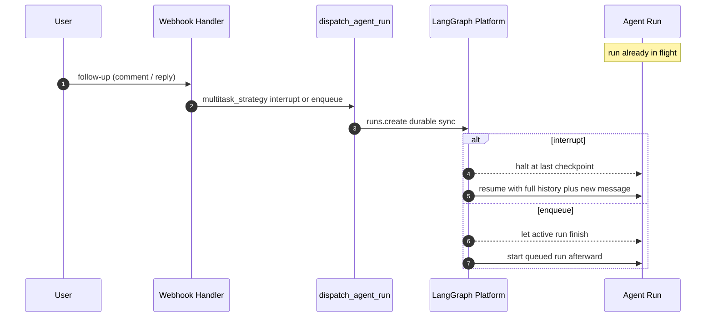
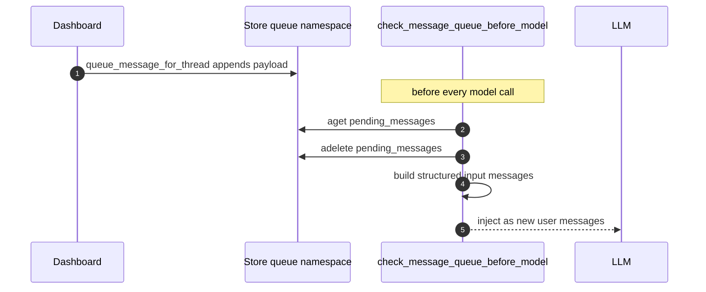

# Mid-Run Follow-Up Messages

A "follow-up" is any input that arrives for a thread that is already running: a
second Linear comment while the first is being worked, a Slack reply, a
dashboard message typed into a live run, or a background PR-babysitting event.
Open SWE handles these along two distinct paths depending on who sent the
follow-up and how urgent it is:

- **Interrupt-and-resume** — explicit user requests halt the active run and
  restart the agent with full history plus the new message.
- **Enqueue** — non-urgent or background follow-ups are appended to a per-thread
  store queue and injected by a before-model middleware ahead of the next model
  call, without disturbing the run that is already in flight.

These paths, and the stop/cancel path that discards pending work, are described
below. For how runs are created in general see
[workflows/invocation](invocation.md); for where the queue-draining middleware
sits in the model loop see
[architecture/middleware-stack](../architecture/middleware-stack.md); and for
the thread and store state these mechanisms read and write see
[concepts/threads-and-state](../concepts/threads-and-state.md).

## Two dispatch strategies

Every Slack, Linear, GitHub, and dashboard trigger routes through the single
durable dispatch contract `dispatch_agent_run`, which forwards a
`multitask_strategy` to `create_durable_run` and ultimately to
`client.runs.create`. The default is `"interrupt"`.

With `multitask_strategy="interrupt"`, a new run on a busy thread halts the
active run and resumes the agent with the full conversation history plus the new
message. Because dispatch also sets `durability="sync"` (a checkpoint before
each step), the interrupted run's progress is preserved rather than lost. On an
idle thread the same call simply starts a run. This is why the older in-process
busy-check and lock were removed: interrupt makes them unnecessary, and it also
guarantees a thread never provisions two sandboxes concurrently.

Background and low-priority follow-ups opt out of interruption by passing
`multitask_strategy="enqueue"`, letting the current run finish before the queued
run starts. `/baby-sit` terminal and progress updates dispatch with `enqueue`,
as do the periodic background-task runs.

Follow-up dispatch chooses between halting the active run and waiting for it to finish.

### Slack: explicit tag interrupts, else enqueue

Slack applies this choice per message: `_dispatch_or_queue_slack_run` dispatches
with `multitask_strategy="interrupt"` when the message explicitly tagged the
bot, and `"enqueue"` otherwise. An untagged reply in a channel the agent is
already working therefore lands behind the current run rather than derailing it,
while an explicit `@open-swe ...` request takes precedence immediately.

## The store-backed message queue

Separately from run multitasking, Open SWE keeps a first-in-first-out queue in
the LangGraph store under the namespace `("queue", <thread_id>)`, key
`pending_messages`. `queue_message_for_thread` reads the existing list, appends
`{"content": ...}`, caps the list at `MAX_QUEUED_MESSAGES` (100, dropping the
oldest on overflow), and writes it back. This queue is used for the dashboard's
deliberate "inject a follow-up into a run that's already in flight" path
(`send_dashboard_message`), which requires the thread to be active (busy) and
otherwise returns HTTP 409/502.

The dashboard enqueues a structured payload — the follow-up text, a `source` of
`dashboard`, a `web` surface, the sender's identity (`github:<login>`), and any
image blocks — rather than a bare string, so the middleware can rebuild it into
a properly attributed input message.

### Draining the queue before each model call

`check_message_queue_before_model` is a `@before_model` middleware installed in
both the agent and reviewer graphs. It runs before every LLM call (except in
stop-summary mode, where it is omitted). On each invocation it:

1. Reads `thread_id` from the run config and obtains the store; if either is
   missing it does nothing.
2. Consumes any batched PR-babysitting event from `("autofix", <thread_id>)`
   (`_consume_pending_autofix_event`), turning it into a system instruction that
   tells the agent to re-check CI and review comments before finishing rather
   than starting a separate run.
3. Reads `pending_messages` from `("queue", <thread_id>)` and **deletes the key
   immediately** — before processing — so that if the middleware runs again the
   same messages are not injected twice.
4. Converts each queued entry into structured input messages and returns them as
   a `{"messages": [...]}` state update, which appends them to the conversation
   as new user/system messages the model then sees.

Because the queue is drained at the before-model boundary, an enqueued dashboard
follow-up is surfaced to the model at the next step of the *current* run,
without interrupting it.

The before-model middleware pulls and clears the queue, then injects the messages ahead of the next LLM call.

### Structuring and attributing queued messages

Queued payloads are rebuilt into the application's structured input-message
envelopes via `build_input_messages` (from `agent/input_messages.py`), not
appended as raw text. The middleware:

- Wraps a queued Linear/Slack/system message in the `system:thread-queue`
  system identity so the transcript shows it came from the queue.
- Rebuilds a dashboard payload that carries a `sender` into a `human` input
  message attributed to that person, on the `web` surface.
- Translates a dashboard-source marker (`source == "dashboard"`) into a
  dedicated dashboard-handoff system message.
- Emits each serialized envelope as its own message, because the transcript
  parser expects exactly one `<input-message>` envelope per message; packing
  several envelopes into one message's content blocks would render as raw XML.
  Plain text blocks are merged, but structured envelopes are flushed separately.

Queued image handling is model-aware: if any queued payload carries images the
middleware resolves the thread's model, and when that model cannot accept images
it skips the image blocks and appends a "vision not supported" note to the text
instead of failing.

The middleware also avoids re-introducing dynamic-context (person/channel/system
identity) blocks the model can still see: it seeds the set of already-injected
context hashes from `visible_dynamic_context_hashes(state)`, which accounts for
summarization cutoffs so a context block hidden behind a summary is treated as
absent and reintroduced.

### Failure isolation

The whole middleware body is wrapped so that any error — a store read failure, a
malformed payload — is logged and results in the model call proceeding with no
injected messages rather than aborting the run. A failed `pending_messages`
read still flushes whatever autofix/content blocks were already assembled.

## Stop and cancel handling

A Slack `:x:` reaction (or a Slack code-channel session-stop event) is an
emergency stop, handled in `agent/utils/slack_stop.py`. Processing a stop:

1. Resolves the reacted-to message back to its Open SWE thread and verifies the
   thread metadata matches the Slack channel/thread, ignoring reactions that do
   not map to a known, matching thread. The Slack event is claimed
   (deduplicated) before acting.
2. Lists the thread's `pending` and `running` runs and cancels them all with
   `runs.cancel_many(..., action="interrupt")`.
3. **Clears deferred work**: `_clear_deferred_work` deletes both the
   `pending_messages` record in the `queue` namespace and the `pending_event`
   record in the `autofix` namespace, so a stop also discards queued follow-ups
   and batched babysitting events that would otherwise be injected on a later
   run.
4. Marks the thread metadata `latest_run_status="interrupted"` with a
   `stop_requested_at_ms` timestamp.
5. Dispatches a read-only **stop-summary** run whose prompt forbids resuming the
   task or taking any mutating action, and directs the agent to post a single
   concise summary of what was done, what was interrupted, and what remains.

The stop-summary run is dispatched through the normal `dispatch_agent_run`
contract (interrupt strategy). In stop-summary mode the queue-draining
middleware is intentionally excluded from the middleware stack, so the summary
turn does not pick up newly queued messages.

## Invariants and operational notes

- The `pending_messages` key is deleted before its contents are processed;
  duplicate middleware runs cannot re-inject the same batch.
- The queue is FIFO and capped at 100 messages; overflow silently drops the
  oldest entries.
- Interrupt preserves in-progress work through `durability="sync"`; a stop
  discards both the run and any deferred queue/autofix records.
- The queue and the run-multitasking strategies are complementary: webhook
  triggers generally rely on interrupt/enqueue at run creation, while the
  store queue exists for injecting a follow-up into a run that is already
  running (the dashboard path).
