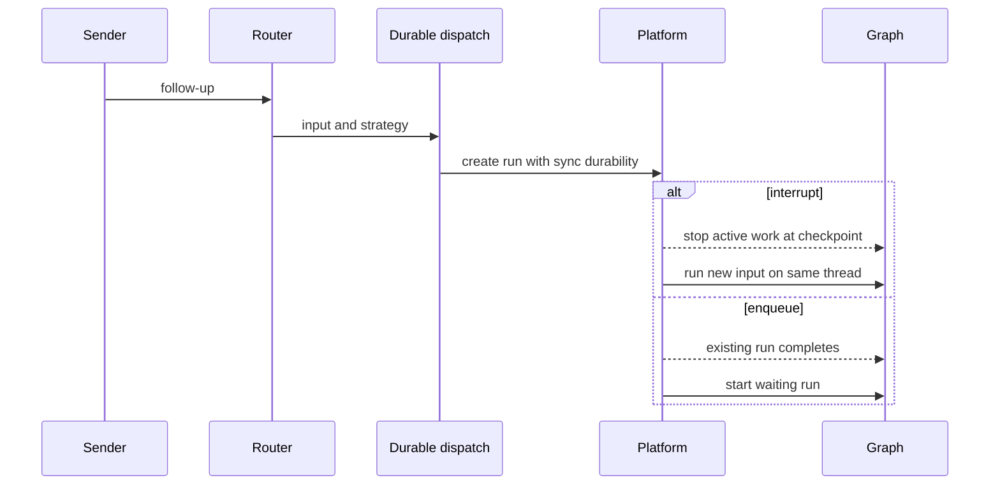
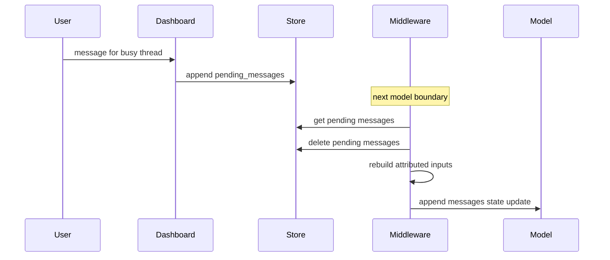
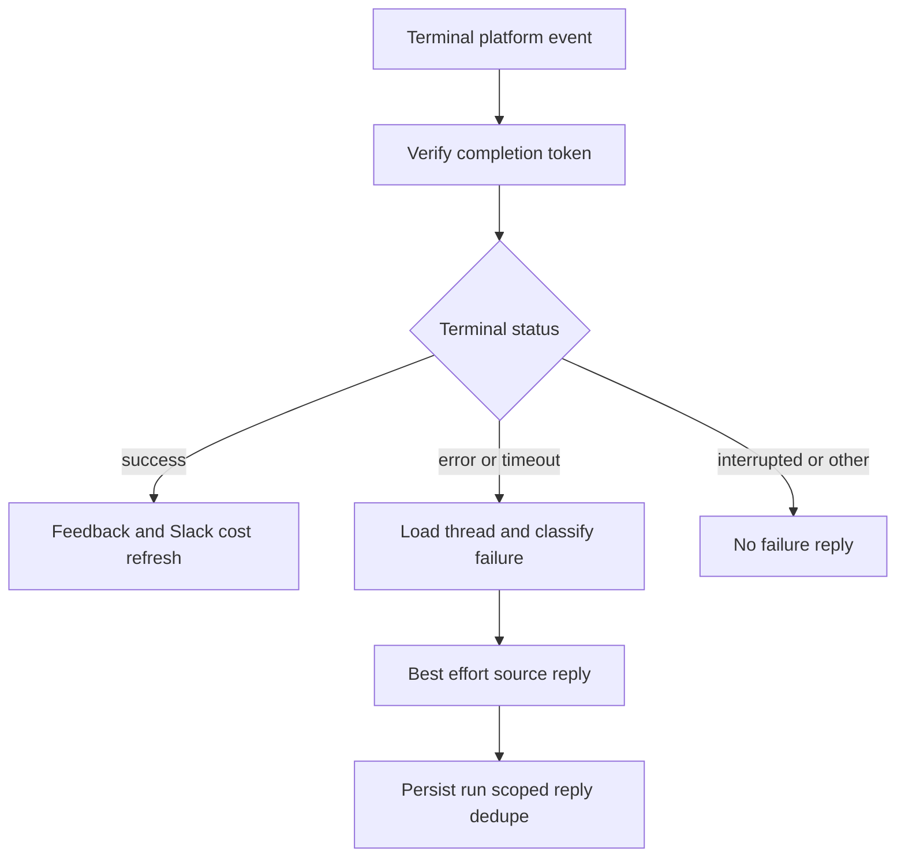

# Follow-up, Interruption, and Completion Handling

A thread is the continuity boundary for checkpointed conversation state and its sandbox. A request that arrives during work therefore has two deliberately different delivery mechanisms:

- A **durable follow-up run** is submitted to the platform. `interrupt` replaces active work at a checkpoint; `enqueue` waits behind it.
- A **store-backed queued message** is injected into an already-running graph at its next before-model boundary. It is not a queued run and cannot start an idle thread by itself.

The former is the normal integration path; the latter supports a browser handoff and message corrections. See [Invocation](invocation.md) for run creation, [Threads and state](../concepts/threads-and-state.md) for state ownership, and [Scheduling and baby-sit](scheduling-and-baby-sit.md) for watcher-driven work.

## Durable routing and preemption

`dispatch_agent_run` is the shared agent/reviewer boundary. Callers either provide a prebuilt `RunInput` or content plus identity context; it rejects attempts to combine both. It delegates to `create_durable_run`, which prepares merged configuration and metadata with one invocation ID, enables the v3 compatibility marker, and creates the platform run. The defaults are `multitask_strategy="interrupt"`, `durability="sync"`, resumable streams, all v3 stream modes, and subgraph streaming. Sync durability provides a checkpoint before each step; resumable v3 events let the dashboard attach to and replay a run created by Slack, GitHub, or another source.

The durable-run path preserves thread continuity while selecting preemption or platform ordering.

### Strategy is chosen by the source

An explicit Slack tag uses `interrupt`; an allowed untagged Slack follow-up uses `enqueue`. A Slack message edit is different again: its corrected text is stored in `pending_messages`, so it becomes visible at a later model boundary. If the thread is already idle, that edit waits for a subsequent run.

Background automation avoids preempting interactive work. Terminal and failure notifications from baby-sit, and completed sandbox background-task notifications, dispatch with `enqueue`. The background-task monitor uses a sandbox-side claim file before dispatch and marks notification delivery only after dispatch succeeds, releasing the claim on failure.

Sandbox access remains thread-bound: the lifecycle code reuses a cached backend or reconnects through persisted metadata. A normal agent does not silently replace an unreachable existing sandbox because doing so can lose uncommitted work; deleted sandboxes may be replaced, and reviewers can opt in to replacing unreachable ones.

## Browser follow-ups and the live message queue

`POST /threads/{thread_id}/messages` calls `send_dashboard_message`. This is a continuation endpoint, not a way to begin an idle thread:

1. It loads the thread and applies `_assert_thread_postable` to the authenticated GitHub login and optional email.
2. It records browser source, participant, feedback activity, plan-mode, and selected model/effort metadata; a new message can also reopen a resolved or attention-marked thread.
3. It requires platform status `busy`: unknown activity is HTTP 502 and idle is HTTP 409, directing the caller to stream commands to start a run.
4. It queues an idempotency-bearing dashboard payload with text, web surface, `github:<login>` sender identity, and non-text image blocks. Slack-originated threads receive a best-effort handoff indication.

`queue_message_for_thread` writes `{"content": ...}` records to `("queue", thread_id) / "pending_messages"`. It appends FIFO, deduplicates a dictionary payload with the same `queue_id`, retains only the newest 100 records, and notes feedback activity after a successful write. A failure becomes a 502 for the dashboard caller.

The queue transfers a follow-up into the active graph instead of creating another durable run.

### Drain, attribution, and failure behavior

`check_message_queue_before_model` is installed in both agent and reviewer middleware stacks, except that the agent excludes it for `stop_summary` mode. With no run `thread_id` or no store it does nothing. On each model call it first consumes `("autofix", thread_id) / "pending_event"` into an instruction to revisit CI and review feedback. It reads `pending_messages` and deletes it *before* conversion, preventing a repeated middleware call from injecting that batch again. The output is a FIFO `messages` state update.

Queued content is rebuilt via `build_input_messages`, not appended as untyped text. Ordinary blocks are attributed to `system:thread-queue`; a dashboard payload first adds the dashboard-handoff system instruction, then a web human message with the supplied sender. Dynamic-context hashes already visible after the summarization cutoff are suppressed, while context hidden behind the cutoff can be reintroduced. Structured envelopes remain separate messages because the transcript parser expects one envelope per message.

For queued image URLs, the middleware resolves the thread model once. It omits fetched URLs for a non-vision model and adds a warning to text, but retains supplied image blocks. Errors are isolated: a queue-read error still flushes a previously assembled autofix instruction, and an outer middleware error is logged without preventing the model call.

## Stop paths

Both Slack and dashboard stops enumerate every `pending` and `running` run, including paginated results, then call `runs.cancel_many(..., action="interrupt")`; neither relies on potentially stale `latest_run_id`. Their deferred-work policy differs.

### Slack emergency stop

The Slack webhook verifies its signature and schedules `:x:` reactions in the background. Stop processing accepts a mapped agent reply or the Slack root timestamp, resolves the mapped Open SWE thread, and verifies the metadata's Slack channel and root timestamp before claiming the event. A missing event ID, duplicate claim, unknown mapping, or metadata mismatch has no side effects. Any Slack user may issue a valid stop reaction.

After cancellation, Slack deletes both deferred records (`pending_messages` and autofix `pending_event`), writes `latest_run_status="interrupted"` and a stop timestamp, and dispatches a `stop_summary` agent run. That mode excludes the message-queue middleware and restricts tools so the summary can inspect state and give one concise Slack-thread summary without continuing the task or mutating the workspace. The resulting run is mapped to the Slack thread. If cancellation or cleanup fails, processing stops before the status update and summary dispatch.

A code-channel `agent_session_stopped` event follows the same validation, cancellation, cleanup, and interrupted-state update, then returns the Slack session to `active`; it intentionally does not create summary work.

### Dashboard cancellation and preserved handoff

`POST /threads/{thread_id}/cancel` authorizes posting access, cancels all live runs, and marks the thread interrupted. Unlike Slack stop it preserves `pending_messages`. If messages remain, it submits an empty-input agent run; queue middleware drains those messages and metadata is updated to its pending run ID. A continuation-submission failure is HTTP 502 after cancellation has already been requested. `POST /admin/threads/{thread_id}/cancel` has separate admin authorization and does not launch this queued continuation.

The terminal-completion path treats an interruption as expected follow-up control flow rather than a failure.

## Completion callbacks, feedback, telemetry, and recovery

A dispatch attaches `/webhooks/run-complete` only when `RUN_COMPLETE_WEBHOOK_SECRET` is configured and `COMPLETION_WEBHOOK_URL` is absolute, HTTP(S), and non-loopback. The URL gets `?token=` only when it has no existing query string; unsafe or incomplete configuration disables callbacks rather than causing run creation to fail. The route fail-closes: an invalid or absent token is HTTP 401, malformed JSON yields an error result, and only object payloads reach `handle_run_completion`.

Completion finalizes agent-usage telemetry for `success`, `error`, `timeout`, and `interrupted` payloads when a consistent invocation ID is available; it converts serialized messages where possible. Successful non-reviewer runs settle code-channel loading only when no newer live run exists, schedule answer feedback unless the run is an automated thread wakeup, and schedule a Slack session-cost refresh only for a Slack-thread run with an invocation ID. The refresh and failure-reply markers retain the newest 20 run IDs, making repeated webhook delivery idempotent per run.

Only `error` and `timeout` are terminal failures. The handler may settle a failed reviewer check, then posts a best-effort explanation to the originating Slack thread, Linear issue, or GitHub PR/issue according to source metadata. It classifies known model/sandbox/context failures for more useful guidance. Automated wakeup failures are deliberately ignored, and `interrupted` receives no alarming failure reply because a replacement run may be continuing the same thread.

The scheduler exposes `task="reconcile"`, which runs `reconcile_stale_runs`. The sweep paginates busy threads, lists pending runs, parses `created_at`, and interrupts only runs older than its 1,800-second default. Per-thread failures and unparseable timestamps are logged and skipped, so one bad record does not abort the sweep; its result reports checked threads, stale runs found, and cancellations. This releases threads held busy when a completion callback was lost.

## Operational checks and focused tests

Configure `RUN_COMPLETE_WEBHOOK_SECRET` and a deployment-reachable, non-loopback `COMPLETION_WEBHOOK_URL` ending in `/webhooks/run-complete` to enable terminal handling. Monitor warnings about disabled completion callbacks, failed completion thread reads, queue failures, and reconciliation counts. Queue consumers must preserve delete-before-convert semantics and stop handlers must preserve their different cleanup policies.

`tests/slack/test_slack_stop.py` covers root and mapped-reply reactions, pending-plus-running cancellation, cleanup, metadata changes, summary dispatch and mapping, duplicate/missing-event safety, mapping/metadata rejection, cleanup/cancellation failure, non-owner reactions, and code-channel stop without a summary. Complementary dashboard, completion-webhook, thread-queue, and reconciliation tests exercise authorization/status errors, handoff payloads, token and callback behavior, queue-id dedupe, and stale pending-run filtering.
