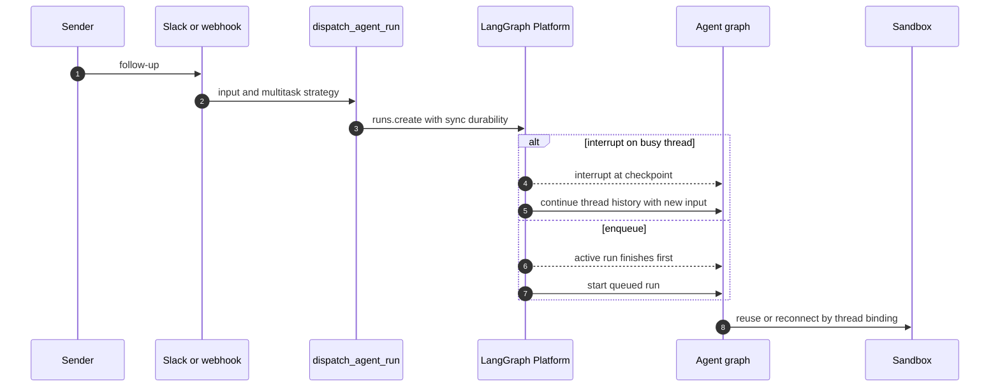
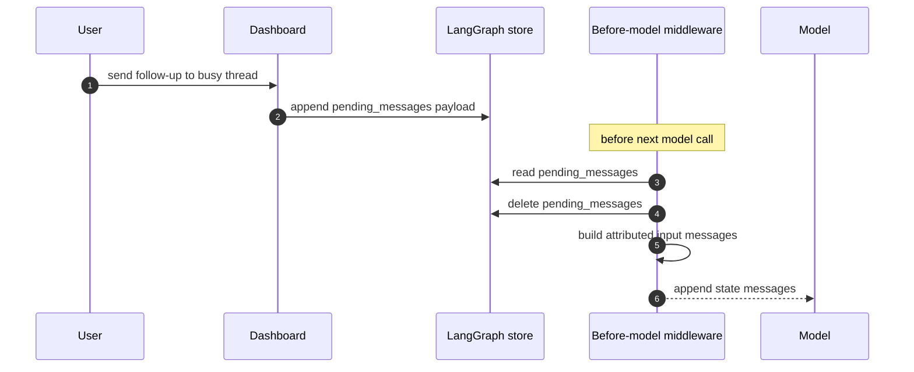

# Follow-ups, Interrupts, and Stop Control

A thread is the continuity boundary for both the LangGraph conversation and the
sandbox bound to its metadata. A later request can therefore continue the same
work without creating a second workspace. Open SWE has two complementary ways
to deal with work that arrives while a thread is busy:

- **Run-level multitasking** submits another durable run. The normal strategy is
  `"interrupt"`, which supersedes active work; low-priority work can use
  `"enqueue"`, which waits at the platform run queue.
- **The store-backed message queue** puts a message into a live run's thread
  state. Before its next model call, middleware consumes and appends that
  message to the existing conversation.

The first approach is how ordinary webhook turns are scheduled. The second is
principally the dashboard's in-flight handoff path. They should not be confused:
an enqueued *run* starts after an active run ends, while a queued *message* is
injected into the active run at its next model boundary. For general invocation
and durable thread state, see [Invocation](invocation.md) and
[Threads and state](../concepts/threads-and-state.md). For sandbox ownership and
recovery details, see [Sandbox lifecycle](../architecture/sandbox-lifecycle.md).

## Durable follow-up dispatch

`dispatch_agent_run` is the common agent/reviewer dispatch contract. It builds
or accepts structured `RunInput`, then calls `create_durable_run`. The latter
sets a fresh `prepare_run_id`, enables the event-streaming-v2 configurable
marker, merges metadata, and calls `client.runs.create` with:

- `multitask_strategy="interrupt"` unless the caller selects another strategy;
- `durability="sync"`, so there is a checkpoint before each step;
- resumable, subgraph-capable Protocol v2 stream modes, allowing a later
  dashboard client to replay events from a run it did not create; and
- an optional completion webhook, only when a non-loopback absolute completion
  URL and `RUN_COMPLETE_WEBHOOK_SECRET` are configured.

Interrupting an active run retains the thread's checkpointed history rather
than starting a separate conversation. A subsequent agent step also resolves
the sandbox by thread: it reuses an in-memory backend or reconnects through the
persisted `sandbox_id`. This serialization is why the sandbox lifecycle relies
on interrupt dispatch rather than a separate cross-process provisioning lock.
An unreachable existing sandbox is not silently replaced for a normal agent
thread, because replacement would discard uncommitted work; a deleted sandbox
can be recreated, and the read-only reviewer can explicitly allow replacement.

The durable run strategy controls whether new work preempts the active thread run or waits behind it.

### Choosing interrupt or enqueue

Explicit Slack requests are urgent: `_dispatch_or_queue_slack_run` uses
`"interrupt"` when the bot was explicitly tagged, and `"enqueue"` for an
untagged Slack follow-up. This lets a participant add context without normally
displacing the current turn, while an explicit request takes precedence. Slack
message edits take a third route: the corrected content is placed in the store
message queue; if the thread is idle, it remains there until a later run reaches
a model call.

Automation deliberately avoids preemption. `/baby-sit` terminal/failure updates
and notifications for finished sandbox background tasks dispatch with
`multitask_strategy="enqueue"`. This preserves the interactive run's ordering
and lets the notification run execute afterward. See
[Scheduling and baby-sit](scheduling-and-baby-sit.md) for the watcher behavior.

## Injecting a dashboard follow-up into a live run

`send_dashboard_message` is a continuation endpoint, not an idle-thread start
endpoint. It first authorizes that the caller may post to the thread, then
requires its LangGraph status to be `busy`; it returns 409 for an idle thread
and 502 if activity cannot be determined. It updates handoff metadata, including
participant and selected-model information, then queues a structured payload:
text, `source: "dashboard"`, `surface: "web"`, a `github:<login>` sender, and
non-text image blocks when present. If the thread originated in Slack, it also
best-effort updates the Slack trace reply to indicate the web handoff.

`queue_message_for_thread` persists these records at
`("queue", thread_id)`, key `pending_messages`, as `{"content": ...}` entries.
It appends in FIFO order and retains the newest 100 entries, dropping the oldest
on overflow. Store errors are logged and reported to the dashboard as a failed
queue operation.

The dashboard inserts a follow-up into the current run at the next before-model boundary rather than creating another run.

### Queue drain and message attribution

`check_message_queue_before_model` is installed in the agent graph and reviewer
graph. It obtains `thread_id` and the LangGraph store from run context; absent
context or store is a no-op. The middleware is deliberately excluded from the
agent's `stop_summary` mode.

At every model boundary it first consumes a batched
`("autofix", thread_id) / "pending_event"` record. It deletes that record and
adds a system instruction to re-check CI and review comments before finishing,
rather than launching a separate run. It then reads `pending_messages` and
deletes the record *before* conversion, preventing a subsequent middleware
invocation from injecting the same batch twice. The resulting
`{"messages": [...]}` state update appends the inputs in FIFO order for the
model to see.

Queued content is reconstructed with `build_input_messages`, rather than
inserted as unstructured text:

- Ordinary queued blocks become a system message attributed to
  `system:thread-queue` on the automation surface.
- A dashboard payload produces a dashboard-handoff system message followed by a
  human message attributed to its supplied sender on the web surface.
- Dynamic identity context is emitted only when its hash is not already visible
  to the model. The visibility calculation honors a summarization cutoff, so
  context retained only in historical state is introduced again.
- Each structured envelope is its own message because the transcript parser
  expects one `<input-message>` envelope per message. Plain text blocks may be
  merged before serialization.

For payloads with image URLs, the middleware reads the thread model once. If it
does not support vision, it omits those fetched images and adds a warning to the
text; supplied image blocks are retained. Failures in the outer middleware are
logged and allow the model call to proceed rather than aborting the run. A
failed queue read still flushes any autofix instruction already assembled.

## Stopping work

Slack and dashboard stops share a core rule: enumerate both `pending` and
`running` run IDs for the thread and cancel them with
`runs.cancel_many(..., action="interrupt")`, rather than trusting a cached
`latest_run_id`. Their post-stop continuation policies intentionally differ.

### Slack emergency stop

The Slack route accepts a `:x:` reaction and schedules stop processing in the
background. The handler resolves a reaction on an agent reply through its
Slack-run mapping (or uses the root timestamp), finds the mapped Open SWE
thread, and verifies that thread metadata names the same Slack channel and
thread timestamp. It claims the Slack event only after that validation; missing
event IDs and duplicate claims have no side effects.

After successful cancellation, Slack stop deletes both deferred records:
`("queue", thread_id) / "pending_messages"` and
`("autofix", thread_id) / "pending_event"`. It writes
`latest_run_status="interrupted"` and `stop_requested_at_ms`, then starts a
special stop-summary run. Its prompt permits only read-only inspection and
requires its first and only user-facing action to be a concise Slack thread
summary; it prohibits continuing the task or mutating files, commands, commits,
or PRs. The summary run is mapped back to the Slack thread for future reaction
resolution. If cancellation or deferred-work cleanup fails, the handler does
not claim a successful summary outcome.

A code-channel `agent_session_stopped` event performs the cancellation and
queue/autofix cleanup too, updates the status, and returns the Slack session to
`active`; unlike a reaction, it does not create a summary run.

### Dashboard stop and continuation

The dashboard stop endpoint authorizes the caller against thread metadata and
cancels all currently live runs for the thread. This works for runs initiated by
Slack, Linear, GitHub, or CI as well as runs begun by the browser. It marks the
thread interrupted but **does not discard** `pending_messages`. If a dashboard
follow-up is present, it dispatches an empty-input agent run after cancellation;
the before-model middleware drains that preserved queue, and metadata is updated
to the new pending run ID. Failure to launch this continuation is surfaced as
HTTP 502 after the cancellation has already been requested. The administrator
variant cancels and marks interrupted without this authorization or queued
continuation behavior.

## Completion and operational checks

Every durable dispatch is configured to request a completion callback only when
completion webhook configuration is safe: the URL must be absolute and not
loopback, and a secret must be present. The `/webhooks/run-complete` route
rejects invalid tokens. Successful Slack agent runs schedule session-cost
refresh; `error` and `timeout` runs receive a best-effort, run-idempotent reply
on their originating Slack, Linear, or GitHub channel. `interrupted` is not a
failure status because it is the expected result of an interrupting follow-up.

Focused regression coverage in `tests/slack/test_slack_stop.py` exercises mapped
reply and root stops, all-live-run cancellation, deferred-work deletion,
metadata/status changes, stop-summary dispatch, duplicate and missing-event
protection, mapping/metadata mismatch rejection, and the no-summary
code-channel session-stop path. Slack route tests additionally cover event
deduplication and the distinction between mentioned and untagged messages.
