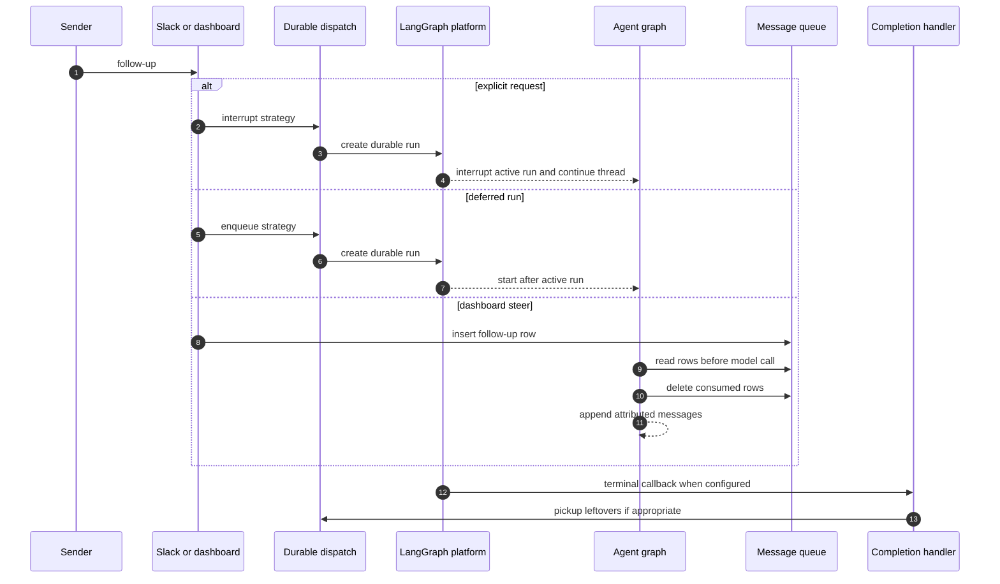

# Follow-ups, interruption, queues, and cancellation

A thread is the continuity boundary for a conversation and its durable LangGraph state. When more work arrives, Open SWE deliberately chooses between three different mechanisms:

- **Interrupt a run** for a request that should take precedence. The new durable run continues the same thread after the platform interrupts the active one.
- **Enqueue a run** when the work must wait for the current run. This is a platform-level run queue, not the message queue.
- **Steer a message** into an already live run. A database row is consumed at the run's next before-model boundary, so no extra run is normally created.

The distinctions matter operationally: interrupt and enqueue submit a new run; steering delivers additional input to an existing run. A late steering message has a recovery path that creates an empty-input pickup run only if the active run has already ended. For durable invocation defaults, see [Invocation](invocation.md); for thread ownership and state, see [Threads and state](../concepts/threads-and-state.md).

## Dispatch contract and strategy selection

`dispatch_agent_run` is the common entry point for agent and reviewer dispatch. Callers either provide a structured `RunInput` or give content plus identities for the helper to build one. It delegates to `create_durable_run`, whose default `multitask_strategy` is `"interrupt"` and whose default durability is `"sync"`.

Durable creation also adds an invocation identity and start time, enables the v3-compatible event-stream marker, and requests values, updates, messages, custom events, tasks, and checkpoints with subgraph and resumable streaming enabled. An externally triggered run can therefore be observed and replayed by a dashboard that did not create it. The completion callback is attached only when `RUN_COMPLETE_WEBHOOK_SECRET` is present and `COMPLETION_WEBHOOK_URL` is absolute and non-loopback; otherwise run creation proceeds without a callback rather than being poisoned by an invalid webhook URL.

Slack applies urgency at dispatch time: an explicitly tagged request uses `"interrupt"`, while an untagged follow-up uses `"enqueue"`. Background-task completion messages also use `"enqueue"`, so a finished shell task does not preempt interactive work. Before a terminal background task notification is dispatched, the reconciler claims it in the sandbox; it marks the notification delivered only after dispatch succeeds and releases the claim if it fails. See [Scheduling and baby-sit](scheduling-and-baby-sit.md) for scheduling-related follow-ups.

```mermaid
sequenceDiagram
    autonumber
    participant Sender
    participant Entry as Slack or dashboard
    participant Dispatch as Durable dispatch
    participant Platform as LangGraph platform
    participant Agent as Agent graph
    participant Queue as Message queue
    participant Complete as Completion handler

    Sender->>Entry: follow-up
    alt explicit request
        Entry->>Dispatch: interrupt strategy
        Dispatch->>Platform: create durable run
        Platform-->>Agent: interrupt active run and continue thread
    else deferred run
        Entry->>Dispatch: enqueue strategy
        Dispatch->>Platform: create durable run
        Platform-->>Agent: start after active run
    else dashboard steer
        Entry->>Queue: insert follow-up row
        Agent->>Queue: read rows before model call
        Agent->>Queue: delete consumed rows
        Agent-->>Agent: append attributed messages
    end
    Platform->>Complete: terminal callback when configured
    Complete->>Dispatch: pickup leftovers if appropriate
```
This sequence shows the separate interrupt, enqueue, steering, pickup, and completion paths.

## Message steering and pickup

The store-backed queue is implemented by `QueuedMessage`, not by LangGraph store state. Each item is a `thread_queued_message` database row with a monotonically generated sequence number. Writers insert rows and the consumer deletes only the rows it consumed, avoiding lost writes caused by replacing a shared queue record. Reads are oldest-first. The queue retains at most 100 newest rows per thread, dropping older rows beyond that cap; a supplied dashboard `queue_id` is unique per thread, making a retry idempotent.

Dashboard `run.start` requests sent while a run is live can take either of two paths:

- `steer_running_thread` records the human message in the existing transcript turn and inserts an attributed payload—text, image blocks, GitHub sender, web surface, and the message id—into the message queue. This is the normal in-flight handoff path.
- `queue_follow_up_run` creates a separate durable run with `multitask_strategy="enqueue"`, records the turn as queued, and tags the run with the submitting user. It is used when a distinct later turn is required rather than an in-flight steer.

A steering request checks again whether the target run is live after inserting its row. If it ended in that gap, `dispatch_pending_follow_ups` can submit an empty-input `follow_up_pickup` run using `"reject"`; `reject` avoids racing another newly started run. The completion handler performs the same best-effort pickup after a successful non-pickup run, but only if there is no pending run and the thread has an owner. A pickup run deliberately does not recursively trigger another pickup after success.

## Before-model queue drain

`check_message_queue_before_model` is installed in both the agent and reviewer graphs; the agent omits it in `stop_summary` mode. At each model boundary it snapshots queue rows for the configured thread, rebuilds them as structured input messages in FIFO order, and removes the rows only after all messages are successfully built. Consequently, a conversion failure leaves the batch available for a later model call instead of silently losing it. A queue-read failure is logged and does not prevent the model call.

Ordinary content is attributed to the `system:thread-queue` automation identity. Dashboard-style payloads preserve the supplied person identity, canonicalize it, use the web surface, and assign the queued message id to the final structured message. If a Slack reply surface is moving to the dashboard, the middleware injects one dashboard-handoff system message and changes the reply surface to web without repeating the handoff notice for later web messages. Dynamic-context hashes prevent re-introducing context already visible in state.

For queued image URLs, the middleware uses the run model when available, otherwise thread metadata, unless image-model fallback is enabled. It skips fetched URL images for a non-vision model and appends a warning to text; inline image blocks are retained. The outer middleware isolates unexpected errors so they do not abort the model call.

## Cancellation policies

### Slack stop actions

A Slack `:x:` reaction is resolved either from an agent-reply run mapping or from the root message timestamp. The handler then verifies that the resolved thread's source context names the same Slack channel and thread timestamp before claiming the Slack event. Missing IDs, duplicate claims, bad mappings, and mismatched metadata therefore have no cancellation side effects.

After validation and claim, Slack stop enumerates every pending and running run, interrupts them in one `cancel_many` call, clears the database message queue, and marks the thread's latest status as interrupted. It then dispatches a `stop_summary` agent run and maps that summary run back to the Slack thread. The summary graph has the queue middleware disabled. If cancellation or queue cleanup fails, the handler stops before status update and summary dispatch.

The code-channel `agent_session_stopped` event performs the same active-run interruption, queue clear, and interrupted status update after validating its special session thread. It then returns the Slack session to `active`; unlike a reaction stop, it does not start a summary run.

### Dashboard cancellation

Dashboard cancellation authorizes the caller and enumerates live runs rather than trusting `latest_run_id`, which may be stale or belong to a run started from Slack, Linear, GitHub, or automation. An owner stop normally leaves another user's separately enqueued run intact; all other pending and running runs are interrupted, and the corresponding transcript turns are settled as interrupted. It marks the thread interrupted and, when no other user's queued run was retained, dispatches a pickup run for any preserved message-queue rows. The machine/admin cancellation variants interrupt live runs and mark the thread interrupted without this owner-specific pickup behavior.

## Completion delivery and operations

The completion receiver is fail-closed: token verification uses the configured `RUN_COMPLETE_WEBHOOK_SECRET`, and an unset secret rejects all completion callbacks. Terminal `error` and `timeout` are failures; `interrupted` is intentionally not one, because interruption is the normal result of a follow-up that supersedes work.

For failures, completion posts a best-effort reply to the originating Slack, Linear, or GitHub location when source metadata is sufficient. Idempotence is run-scoped when a run ID exists, retaining a bounded recent list; legacy payloads without a run ID use a thread-level fallback flag. Event-woken runs also limit repeated failure replies with a consecutive-failure counter. On successful eligible Slack runs, completion schedules a session-cost refresh once per run; it also settles the code-channel loading status only when no pending or running run remains.

### Focused regression coverage

`tests/slack/test_slack_stop.py` exercises mapped-reply stops, cancellation of pending and running runs, queue cleanup, summary dispatch and mapping, duplicate and missing-event safety, metadata mismatch rejection, cleanup failures, and the no-summary session-stop path. `tests/slack/test_slack_event_dedupe.py` verifies that overlapping mention and message deliveries start only one background task. `tests/slack/test_slack_untagged_flag.py` covers normal-channel mention classification and kitchen-channel explicit-mention behavior. Queue conversion behavior is covered separately in `tests/middleware/test_check_message_queue.py`.
