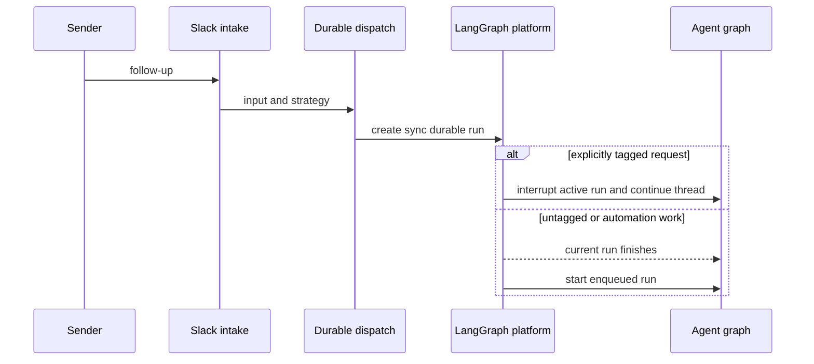
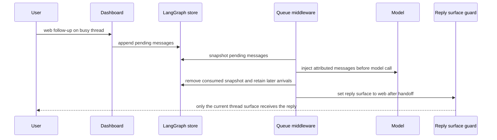
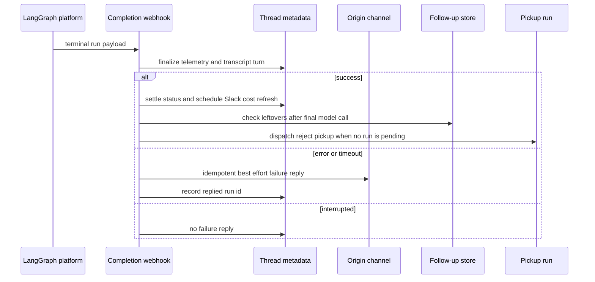

# Follow-ups, Interrupts, and Completion Delivery

A thread is the continuity and delivery boundary: its durable LangGraph state, metadata, and sandbox-backed work remain associated with one conversation. Open SWE does not start a second independent owner for a follow-up. Instead, it either creates another durable run on that same thread or steers a message into the current run. This preserves the **single-thread-owner posting invariant**: a reply is owed by the one thread that owns the conversation, and a handoff changes that thread's reply surface rather than creating competing Slack and web responders.

There are two deliberately different queues:

- A **durable run queue** is controlled by `multitask_strategy`. `interrupt` preempts the active run at its synced checkpoint; `enqueue` waits for it.
- The **store message queue**, `("queue", thread_id) / "pending_messages"`, is for a message arriving while a run is already in flight. Before the next model call, graph middleware injects it into that run's state.

Thus an enqueued run begins only after earlier work ends, while a queued message can change the active run at its next model boundary. See [Invocation](invocation.md), [Threads and state](../concepts/threads-and-state.md), and [Collaborative tasks](collaborative-tasks.md) for the surrounding lifecycle.

## Dispatch policy: interrupt, enqueue, or inject

`dispatch_agent_run` is the common agent and reviewer dispatch boundary. Callers may provide an already attributed `RunInput`, or supply content and identities for it to build one; it then delegates to `create_durable_run`. That durable creation defaults to `multitask_strategy="interrupt"` and `durability="sync"`, creates/ensures a titled system-owned thread when requested, and enables resumable, subgraph-capable v3 stream modes. Consequently, a client that attaches after a Slack- or automation-triggered run can replay its stream rather than treating the thread as idle.

The dispatch configuration also gives each run an invocation identity and start time, preserves source/workspace context for system follow-ups, and records Slack channel metadata when available. A completion webhook is attached only when `RUN_COMPLETE_WEBHOOK_SECRET` is set and `COMPLETION_WEBHOOK_URL` is absolute and not loopback. This avoids making run creation fail on platform-rejected local webhook URLs.

```mermaid
sequenceDiagram
    participant Sender
    participant Intake as Slack intake
    participant Dispatch as Durable dispatch
    participant Platform as LangGraph platform
    participant Graph as Agent graph

    Sender->>Intake: follow-up
    Intake->>Dispatch: input and strategy
    Dispatch->>Platform: create sync durable run
    alt explicitly tagged request
        Platform->>Graph: interrupt active run and continue thread
    else untagged or automation work
        Platform-->>Graph: current run finishes
        Platform->>Graph: start enqueued run
    end
```
The durable strategy decides whether a new run preempts the thread or waits behind its current run.

### Policy at important entrypoints

- Slack uses `interrupt` for an explicitly tagged request and `enqueue` for an untagged follow-up. A Slack message edit is not a new run; its revised content is placed in the store queue.
- Completion of a sandbox background task dispatches a notification follow-up with `enqueue`, so it does not displace interactive work. Its callback/polling reconciler claims terminal task notifications before delivery, preventing duplicate completion notices.
- The dashboard continuation endpoint is intentionally only for a **busy** thread. After authorization it returns 409 for an idle thread and 502 when activity cannot be determined; it records a structured, attributed web payload in the store instead of dispatching a run.

`queue_message_for_thread` appends `{"content": ...}` records in FIFO order and keeps only the newest 100. A dashboard `queue_id` makes a retry idempotent. A dashboard payload contains the text and images, a web surface, a canonical GitHub sender identity, and a client or generated queue ID. If the conversation began in Slack, the dashboard also best-effort updates Slack's trace reply to show that the conversation moved to the web.

```mermaid
sequenceDiagram
    participant User
    participant Dashboard
    participant Store as LangGraph store
    participant QueueMW as Queue middleware
    participant Model
    participant ReplyGuard as Reply surface guard

    User->>Dashboard: web follow-up on busy thread
    Dashboard->>Store: append pending messages
    QueueMW->>Store: snapshot pending messages
    QueueMW->>Model: inject attributed messages before model call
    QueueMW->>Store: remove consumed snapshot and retain later arrivals
    QueueMW->>ReplyGuard: set reply surface to web after handoff
    ReplyGuard-->>User: only the current thread surface receives the reply
```
A web handoff is injected into the existing owner run and moves its response obligation to web, avoiding competing Slack and web posting.

## Queue drain, attribution, and response ownership

`check_message_queue_before_model` is installed in both the agent and reviewer graphs; the agent omits it for a `stop_summary` run. It first consumes a batched autofix event from `("autofix", thread_id) / "pending_event"` and turns it into a system instruction. It then snapshots `pending_messages`, transforms messages into attributed input envelopes, and consumes only that snapshot. The consume helper rereads the record and retains entries appended while image retrieval or identity resolution was awaiting, so concurrent follow-ups are not dropped. If conversion fails, the snapshot remains for a later model call.

Ordinary queued content is attributed to `system:thread-queue`. Dashboard content is rebuilt as a human web message from its supplied sender; when it moves a Slack conversation to the web, a dashboard-handoff system message is included once and the state’s `reply_surface` becomes `web`. Dynamic context hashes avoid repeating visible introductions while still respecting summarized-away context. For queued image URLs, middleware uses the selected run or thread model to decide whether vision is supported; unsupported fetched images are omitted with a warning, while supplied image blocks are retained.

`RequireUserReplyMiddleware` enforces delivery only when the current reply surface is Slack. It resets the surface for every run, recognizes successful final reply-tool calls, and nudges the model up to two times if it ends a human turn without one. If it still has final text after the retry budget, it posts that text on the model’s behalf. Once the queue middleware switches a live conversation to web, this Slack fallback no longer posts, preserving the single owner/surface rule.

## Stop and cancel semantics

Slack `:x:` reactions are accepted asynchronously. The stop handler resolves either a mapped agent reply or the root Slack timestamp, finds the corresponding thread, validates that its stored Slack context has the same channel and root timestamp, and only then claims the Slack event ID. Missing IDs, duplicate claims, unknown mappings, and metadata mismatches have no stop side effects.

For a valid reaction, it enumerates every `pending` and `running` run, cancels them with `action="interrupt"`, deletes both pending message and autofix records, marks the thread interrupted with a stop timestamp, and starts a restricted `stop_summary` agent run. The summary run is mapped to the Slack thread so later reactions can resolve it. A cancellation or cleanup failure prevents the success-summary sequence from being dispatched. The code-channel `agent_session_stopped` event shares cancellation, cleanup, and interrupted status handling, then restores the session to `active`; it does not run a summary.

The dashboard owner stop likewise lists live runs rather than trusting a potentially stale `latest_run_id`, but it has a different fairness policy: it leaves another person's queued run intact and only cancels queued work owned by the stopper or unowned work. It preserves the store queue. If no other queued run was kept, it starts an empty-input `follow_up_pickup` run, whose first model call drains the leftover messages. A failure to submit that pickup is returned as HTTP 502 after cancellation was requested. Machine-principal cancellation is a separate path that cancels queued work too.

## Completion delivery and recovery

The platform calls `POST /webhooks/run-complete` for eligible durable runs. The endpoint fail-closes with a constant-time check of the configured token, rejects invalid tokens with 401, and ignores malformed/non-object payloads rather than treating them as run completions.

`handle_run_completion` finalizes terminal invocation telemetry and transcript turns, then routes terminal effects. `success`, `error`, and `timeout` can deliver task messages and event subscriptions; `interrupted` is terminal for telemetry but is not a failure reply because interruption is expected during normal follow-up replacement. On a successful eligible Slack agent run, completion settles status and schedules session-cost refresh with run-scoped deduplication. On `error` or `timeout`, it posts a best-effort failure notification to the source channel—Slack thread, Linear issue, or GitHub issue/PR—and records the run ID in bounded metadata to make webhook retries idempotent. Repeated event-woken failures are capped to avoid indefinitely spamming a channel.

A successful run can finish just after its final model call, leaving a newly queued store follow-up unseen. Completion detects this and, when no run is already pending, asks `dispatch_pending_follow_ups` to create a `reject`-strategy empty-input pickup. `reject` ensures it does not disturb a run started in the meantime; that newer run will drain the same queue itself.

```mermaid
sequenceDiagram
    participant Platform as LangGraph platform
    participant Completion as Completion webhook
    participant Thread as Thread metadata
    participant Channel as Origin channel
    participant Store as Follow-up store
    participant Pickup as Pickup run

    Platform->>Completion: terminal run payload
    Completion->>Thread: finalize telemetry and transcript turn
    alt success
        Completion->>Thread: settle status and schedule Slack cost refresh
        Completion->>Store: check leftovers after final model call
        Completion->>Pickup: dispatch reject pickup when no run is pending
    else error or timeout
        Completion->>Channel: idempotent best effort failure reply
        Completion->>Thread: record replied run id
    else interrupted
        Completion->>Thread: no failure reply
    end
```
Completion routes effects through the originating thread and channel while a pickup run handles follow-ups that missed the completed run's final model boundary.

Completion callbacks are a safety mechanism, not the only recovery mechanism. The scheduler's `reconcile` task paginates busy threads, examines their pending runs, and cancels ones older than `max_age_seconds` (default 1,800 seconds) with `interrupt`. Per-thread failures are logged and isolated so one unreadable thread does not abort the sweep; the result reports checked threads, stale runs, and cancellations.

## Focused tests and operational checks

`tests/slack/test_slack_stop.py` covers mapped-reply stop resolution, cancellation of both pending and running runs, deferred-work cleanup, metadata changes, summary dispatch and remapping, duplicate-event safety, Slack-context mismatch rejection, and failures during cancellation or cleanup. Operators enabling failure delivery must configure both `RUN_COMPLETE_WEBHOOK_SECRET` and a deployment-reachable non-loopback `COMPLETION_WEBHOOK_URL`; otherwise dispatch intentionally runs without a completion callback and the webhook endpoint rejects calls.
