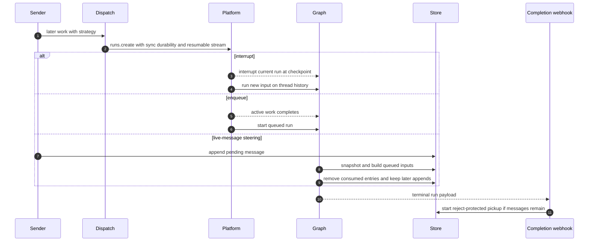

# Follow-Ups, Interruption, and Completion

A thread is the continuity boundary for a durable LangGraph conversation and its thread-bound sandbox. Open SWE handles later work in two distinct ways:

- A **durable follow-up run** uses a multitask strategy. `interrupt` is the default: it replaces active work on the same checkpointed thread; `enqueue` waits behind existing work.
- A **store-backed message** is injected into a run already in flight at its next before-model boundary. This is used for dashboard steering and selected message updates; it is not a platform run queue.

Thus, an enqueued run and a queued message have different ordering and failure properties. The former starts after the platform's current work; the latter is consumed by graph middleware, and requires either a still-live run or a pickup run. See [Invocation](invocation.md), [Threads and state](../concepts/threads-and-state.md), [Middleware stack](../architecture/middleware-stack.md), and [Scheduling and baby-sit](scheduling-and-baby-sit.md).

## Durable dispatch and stream visibility

`dispatch_agent_run` is the common agent/reviewer dispatch entry point. It either accepts a prebuilt `RunInput` or builds one from content and source identities, then delegates to `create_durable_run`. The latter prepares an invocation ID and metadata, ensures a title when it owns thread creation, and calls `client.runs.create`.

The durable defaults are deliberately shared by externally triggered and dashboard work:

- `multitask_strategy` defaults to `"interrupt"`; callers can select `"enqueue"` or, where race avoidance matters, `"reject"`.
- `durability="sync"` checkpoints before each step, so interruption or a recycle preserves checkpointed progress.
- It enables the v3-compatible event-stream marker, `values`, `updates`, `messages`, `custom`, `tasks`, and `checkpoints` modes, subgraph streaming, and resumable streams. A dashboard can consequently attach to and replay a run it did not start, including the lifecycle data used to show it as loading.
- A completion webhook is attached only when `RUN_COMPLETE_WEBHOOK_SECRET` is present and `COMPLETION_WEBHOOK_URL` is absolute and not loopback. The public receiver verifies the query token and fails closed when the secret is absent.

Sandbox acquisition follows the same thread boundary: it reuses a cached backend or reconnects using persisted sandbox metadata. A normal agent run fails rather than silently replacing an unreachable sandbox, preventing loss of uncommitted work. A deleted sandbox is replaced; callers such as the read-only reviewer may explicitly permit replacement of an unreachable sandbox.

```mermaid
sequenceDiagram
    autonumber
    participant Sender
    participant Dispatch
    participant Platform
    participant Graph
    participant Store
    participant Complete as Completion webhook

    Sender->>Dispatch: later work with strategy
    Dispatch->>Platform: runs.create with sync durability and resumable stream
    alt interrupt
        Platform-->>Graph: interrupt current run at checkpoint
        Platform->>Graph: run new input on thread history
    else enqueue
        Platform-->>Graph: active work completes
        Platform->>Graph: start queued run
    else live-message steering
        Sender->>Store: append pending message
        Graph->>Store: snapshot and build queued inputs
        Graph->>Store: remove consumed entries and keep later appends
    end
    Graph-->>Complete: terminal run payload
    Complete->>Store: start reject-protected pickup if messages remain
```
This sequence distinguishes platform-level interruption or enqueueing from store-backed steering, and shows terminal completion's pickup path.

### Strategy selection

Slack dispatch chooses `"interrupt"` for an explicitly tagged request and `"enqueue"` for an untagged follow-up. A Slack message edit instead enters the store queue, so corrected content can be observed by the active run rather than spawning a separate run.

Automation does not preempt interactive work. Baby-sit readiness, terminal, and failure updates, as well as terminal sandbox-background-task notifications, use `multitask_strategy="enqueue"`. Background notifications are claimed before dispatch and marked delivered only after it succeeds, so a failed delivery can be retried.

## Queueing and reconciling a live follow-up

`send_dashboard_message` authorizes the sender against thread metadata and requires a busy thread. It returns 409 when idle and 502 when activity cannot be determined. It updates participant, activity, model/effort, and resolution metadata, then queues a structured web payload containing text, a stable client-or-generated `queue_id`, the GitHub-attributed sender, and non-text image blocks. A Slack-originated thread is best-effort marked as handed off to the web.

`queue_message_for_thread` stores `{"content": ...}` entries under `("queue", thread_id) / "pending_messages"` in FIFO order. It deduplicates a structured payload whose `queue_id` is already present, caps the collection at the newest 100 entries, and reports store failure to the caller.

### Before-model drain

The agent and reviewer graphs install `check_message_queue_before_model`; the agent excludes it for a `stop_summary` run. On every model boundary the middleware:

1. consumes a batched `("autofix", thread_id) / "pending_event"` into a system instruction;
2. snapshots `pending_messages` in FIFO order and reconstructs them with `build_input_messages`; and
3. after all messages have been built, removes only the snapshot entries, retaining messages appended while it awaited model lookup or image retrieval.

The last rule is important: conversion errors leave the snapshot for a later model call instead of dropping it, while newly appended follow-ups are not erased by a whole-record delete. A queue-read failure still flushes an already assembled autofix instruction, and outer middleware errors are logged rather than aborting the model call.

Ordinary blocks become an automation-surface system input attributed to `system:thread-queue`. A dashboard payload moves the reply surface to web; when moving from Slack it adds a dashboard-handoff system message, and it becomes a web human message attributed to the supplied canonical person. Dynamic context is injected only when its hash is not already visible after the summarization cutoff. Structured envelopes remain separate messages because the transcript parser expects one envelope per message.

For queued images, the middleware resolves the active run model first and otherwise reads the thread model. When that model lacks vision support, it keeps supplied image blocks but omits fetched URL images and adds a warning to text.

### The completion race and pickup runs

A message can be written after a run's final model call, or after the initial busy check but before the store write. To avoid stranding it, `dispatch_pending_follow_ups` examines the store and starts an empty-input run with `kind="follow_up_pickup"`; that run's first model call drains the queue. The immediate steering path performs this check if its target run is no longer live. Successful normal completion performs the same check unless the completing run is itself a pickup. Both use `multitask_strategy="reject"` where they race with another starter, so an already-started run drains the same queue rather than creating a duplicate pickup.

## Interruption and stop control

A Slack `:x:` reaction resolves either the mapped agent reply or root timestamp to a Slack thread, validates matching Slack metadata, and claims a nonempty event ID only after validation. It enumerates every pending and running run, cancels them with `action="interrupt"`, clears queued messages and autofix events, and records interrupted status and a stop timestamp. It then dispatches a `stop_summary` run mapped back to Slack. The summary mode omits queue middleware and is constrained by its prompt to a read-only concise status summary. Cancellation or deferred-work cleanup failure prevents the successful-summary path; duplicate, missing-ID, or mismatched events have no effect.

A code-channel `agent_session_stopped` event follows the same cancellation, cleanup, and metadata update path, then returns the session to active without a summary run.

Dashboard cancellation is intentionally less destructive. After authorization, it enumerates live runs rather than relying on `latest_run_id`, records interrupted turns, and marks the thread interrupted. For a user stop it does not cancel a queued run attributed to a different user; otherwise it starts a pending-follow-up pickup when store messages remain. The machine and admin variants cancel live work and mark interruption without that user continuation policy.

## Completion replies and background wakeups

`/webhooks/run-complete` accepts only a valid completion token, validates that the JSON payload is an object, and delegates terminal handling. Completion finalizes invocation usage telemetry and transcript turns. It treats `success`, `error`, `timeout`, and `interrupted` as terminal for telemetry, but only `error` and `timeout` as user-visible failures: interruption is the healthy outcome of a replacement follow-up.

For an eligible successful run, completion restores a code-channel session only after confirming no other live run remains, synchronizes Slack background status, schedules answer feedback except for automated wakeups, and schedules a Slack session-cost refresh once per run ID. On `error` or `timeout`, it best-effort settles an affected reviewer check, restores/synchronizes Slack state, and posts an attributed failure reply to Slack, Linear, or GitHub. Failure-reply deduplication is run-scoped (with a bounded metadata history); legacy payloads without a run ID fall back to a thread-level flag.

## Focused regression coverage

`tests/slack/test_slack_stop.py` covers mapped-reply stops, cancellation of pending and running work, deferred-work deletion, interrupted metadata, summary dispatch/mapping, mismatched metadata, duplicate event claims, and cancellation or cleanup failure. Slack webhook tests separately cover delivery deduplication and untagged/kitchen-channel classification.
