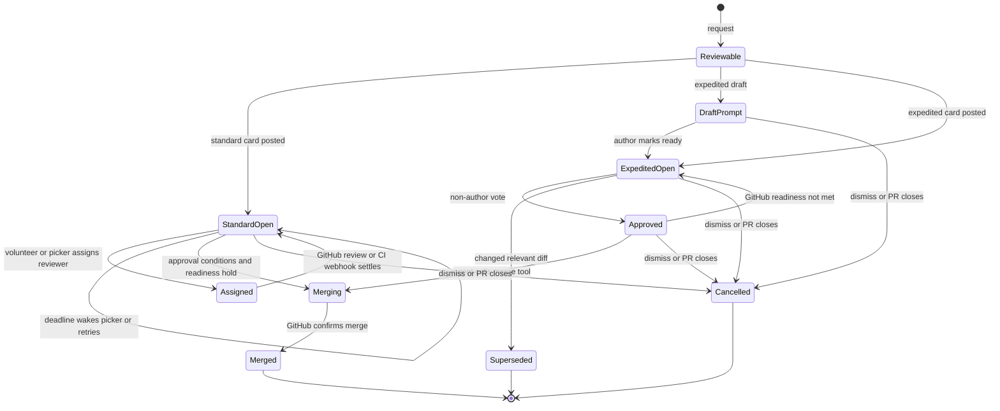

# Human and expedited Slack review

Open SWE represents both review experiences with one durable `human_review_request` and its participants. A partial uniqueness constraint permits only one open request for a pull request, irrespective of kind. The request is the coordination record—Slack locations, PR head and card state, participants, deadline context, and (for expedited review) the fingerprint and excluded hunks—not a substitute for GitHub's review and branch-protection decisions.

There are two user-facing paths:

| Path | Appropriate PR | What Slack does | Approval and merge model |
| --- | --- | --- | --- |
| **Standard** | An open, non-draft, conflict-free PR without a failing required check | Posts a review card in the repository-selected review channel. People volunteer or Open SWE selects a reviewer. | Reviewers submit reviews on GitHub. At least one standing GitHub approval is required; normally every card reviewer must approve, subject to the two-hour merge deadline. |
| **Expedited** | An experimental, enabled, small PR whose relevant text diff is fully reviewable in Slack | Posts a diff card and accepts an explicit **Approve** click. A draft first gets an author-only DM to mark ready. | One non-author, write-capable linked user votes; Open SWE immediately tries to submit that user's GitHub `APPROVE` review, then the agent explicitly invokes the merge tool. |

The `posted` request kind is related infrastructure for an existing PR link in a review channel: it receives approval/merge reactions and can trigger reviewer picking, but Open SWE does not edit that message or merge through it. It is not a third interactive review-card experience.

## Shared lifecycle and coordination

`HumanReviewRequest` stores `standard`, `expedited`, and `posted` kinds and tracks `open`, `merged`, `superseded`, `cancelled`, or `rejected` state. Participants reference `users.id`, rather than mutable Slack or GitHub handles. Database row locks protect transitions, click writes, and merge sequencing; the one-open-request invariant also handles concurrent creation.

A standard request is refused if another expedited request is open. Starting expedited review supersedes an open standard or posted request; a changed expedited diff supersedes its old card before a new one is created. The old request can be reopened only if its replacement fails to reach Slack. Closing an unmerged expedited request dismisses any GitHub approvals that its votes created; a later closing card retries dismissal for earlier cards that GitHub previously refused to dismiss.

The state transitions show card creation, reviewer/vote events, deadline work, and the GitHub-confirmed terminal outcomes.

A GitHub `pull_request` close webhook re-reads current PR state rather than trusting the event: merged cards transition to `merged` and get a merged reaction; closed cards are cancelled. This makes late webhooks harmless when a PR was reopened. GitHub review/check events settle standard requests; a finished commit-status event rechecks all open standard/posted requests in that repository because it identifies a SHA rather than a PR number.

## Standard review: request, routing, and card actions

`request_human_review` is available to enabled agent runs; the dashboard request route and MCP server route to the same standard request logic. Requesting is separately feature-flagged (`human_review_requests`) per person and disabled by default. The requester may provide a `channel` override; otherwise Open SWE resolves `.open-swe/settings.json` at the PR's relevant revision. A `reviewChannel` can be a name or ID. With `reviewChannelRules`, the first case-sensitive path rule matching each changed file assigns it to a channel; the channel with the most matching changed files wins, with random tie-breaking. An unmatched PR has no destination. A standard request also requires that the PR author be an Open SWE user.

The card is a thread reply broadcast to the configured review channel when the asking Slack thread is already there; otherwise it is a top-level channel message, with the originating thread pointed to the card when possible. Its summary is supplied by the agent as `inline_summary`, or derived deterministically from the first 280 characters of the PR description—no model-generated summary is introduced. The original requester or originating agent may update that summary by requesting again; other repeated requests reuse the existing card.

**I'll review** resolves the Slack identity to a linked Open SWE user with GitHub write permission, rejects the author, records that person as a `review` participant, refreshes the card, and requests their GitHub review. Any number of users may volunteer. **Dismiss** is deliberately available to anyone able to see the card. The agent can do the same through `dismiss_human_review_request`.

### Assignment, reminders, and deadlines

On creation, standard review schedules two one-shot scheduler runs: `unclaimed` after the workspace's `human_review_auto_assign_minutes`, and `auto_merge` after two hours. If either cannot be scheduled, the just-created row is removed rather than leaving an indefinitely waiting card. The workspace value is resolved from the request context and can override the instance setting; it affects assignment waits, not the fixed two-hour merge deadline.

When nobody volunteers, `start_auto_assign` uses CODEOWNERS and changed-file review history to choose a candidate. It can wake the originating agent with a suggested choice, or assign directly; assignment adds the participant, requests GitHub review, tags the card, and DMs the person with accept/decline/snooze actions. A pending pick expires after the same assignment interval unless snoozed; a GitHub review counts as accepting it. Declines and expired picks withdraw the GitHub request and rotate to another candidate when available. Reminders are scheduled after two business hours measured in the reviewer's local weekday 09:00–18:00 window.

The scheduler graph dispatches `task="human_review"` to `run_deadline(request_id, step)`. Its meaningful steps are `unclaimed`, `pick_expiry`, `auto_merge`, plus dynamic `snooze:<user-id>` and `remind:<user-id>` steps. Deadline handlers re-read the request and return harmless inactive/closed statuses for stale runs; temporary GitHub or delivery failures reschedule a short retry. This keeps timers advisory and state validation authoritative.

### Standard settlement and merge

Every relevant webhook and the auto-merge deadline call `settle`. It re-fetches readiness and latest GitHub review state, updates the card with the current wait reason, and merges only when all of the following hold:

1. At least one non-author standing GitHub approval exists.
2. Each standard-card reviewer has approved, **or** two hours have elapsed since request creation.
3. The PR is open, non-draft, conflict-free, has no running, failing-required, or unreported required checks, no unresolved review threads, and no standing request for changes.

CODEOWNERS coverage is used to request additional reviewers where an initial approval leaves changed owner areas uncovered. It influences reviewer coordination, while the ultimate GitHub approval and readiness gates still control merging.

On success the card is collapsed/retired as merged and a `:merged:` reaction (or fallback) is applied. If GitHub refuses a merge, the request remains open, the refusal becomes the card detail, and there is no branch-protection or administrator bypass.

## Expedited review: eligibility and Slack interaction

Expedited review is off until an instance administrator enables `expedited_review_enabled`. `expedite_pr_approval` additionally requires an executable agent thread and Slack destination: the current Slack thread or an explicitly named accessible channel. It only serves PRs authored by Open SWE users. The agent chooses when to ask; no background process automatically enrolls a small PR.

The eligibility gate is designed to ensure voters can read what they approve:

- The PR must be open, contain fewer than 100 changed files and at least one changed line. All shown, non-test/non-generated files must provide a text patch. The intended limit is 20 shown changed lines, while the enforced tolerance is 25.
- Test files do not count toward the line limit or readable-patch gate. Declarative generated `swagger.*`, `openapi.*`, and snapshot files are likewise excluded from both gates; executable generated code is not. The card can show test diffs when the PR is test-only or tests are the majority; otherwise it names them.
- The agent may exclude individual hunk(s) that qualify under `.open-swe/APPROVALS.md` at the base SHA, naming guideline and reason. CI workflow paths, migrations, dependency manifests/lockfiles, environment files, and auth/credential/secret/token paths cannot be excluded. An exclusion request is audited with base/head SHAs and an `APPROVALS.md` hash.
- The accounting check refuses a PR if drawn, excluded, test, and generated line totals do not equal the PR total. The fingerprint covers the non-test/non-generated input including excluded hunks. Thus a changed excluded hunk invalidates its exclusion and is drawn again, while a commit changing only unshown tests or declarative generated files preserves the card's fingerprint.

An expedited request pins the head SHA and fingerprint. Recalling `expedite_pr_approval` for an unchanged diff reuses its card; a changed diff retires the old card and posts a replacement. A configured `reviewChannel` is automatically used as a public, internal broadcast destination once a non-draft card is ready. Without it, the card can be broadcast once to its own channel by a thread participant, or copied once to another public, non-externally-shared channel by a write-capable voter. Finished channel copies are deleted, leaving the terminal card in its thread.

A draft receives its full **Mark ready for review** card only as an author DM. The author action uses that author's GitHub token and GitHub's GraphQL `markPullRequestReadyForReview` mutation; it is not an App undraft. Once ready, the shared card is posted and can be approved. Failure to deliver the DM or absent Slack linkage tells the agent to have the author mark it ready on GitHub.

A ready card renders the relevant diff and explicit **Approve**/**Dismiss** controls. Reactions are not votes. A voter must be a linked person with repository write permission and a stored GitHub token; the author cannot vote. The first non-author click records an `approve` participant under a row lock, refreshes the card, tries to submit an `APPROVE` GitHub review on the current head only if the fingerprint still matches, and wakes the originating agent once. If submission fails, the vote remains recorded and the merge flow retries it. Anyone can dismiss an open card; dismissal cancels it and withdraws its vote-generated GitHub reviews.

## Merge controls shared by both paths

The readiness snapshot is taken from live GitHub PR, check, required-check, review, unresolved-thread, and mergeability data. A merge blocks for a draft/closed PR, conflict or unresolved mergeability, pending checks, required failures, missing required check reports, unresolved threads, or standing changes requested. Non-required failing checks do not block when GitHub reports the PR as `unstable` rather than branch-protection-blocked.

For expedited review, the agent invokes `merge_expedited_pr`—usually when the approval wake-up or a `/baby-sit` watch observes green checks. The tool verifies the card belongs to its agent thread and re-reads the PR. It requires an expedited approval and readiness, rechecks the head immediately before merging, and ensures each recorded approval has a standing GitHub review, resubmitting stale or previously failed submissions if needed.

If the expedited fingerprint changes but the revised PR remains eligible, the tool returns `diff_changed` without merging. The agent must either post a fresh card or call again with `keep_approval_reason`; the latter posts an explanatory PR comment and replaces the stored fingerprint before proceeding. If the changed PR is ineligible, the card is superseded and votes are discarded. This explicit path is the only way to carry votes across a relevant change.

Actual merges are performed with a GitHub App token scoped to `contents: write` and `pull_requests: write` when available, conditional on the expected head SHA, and using the first repository-allowed merge method (including its squash-message handling). GitHub's response is final: refusal leaves the request open and does not weaken repository rules. The separate signed-in-user PR action API follows the same confirmation discipline: it sends the expected SHA for merge, and uses GitHub GraphQL because REST cannot clear draft state.

## Relationship to automated PR review

Human review does not replace the automated PR-review workflow described in [Pull Request Review Workflow](pr-review.md). When Open SWE auto-review is enabled, readiness requires an Open SWE review for the exact head as part of the normal checks/review conditions. Human-request webhooks then keep their Slack state aligned with CI and GitHub review outcomes; they do not manufacture approvals or bypass unresolved automated findings. See [PR Creation Workflow](pr-creation.md), [Scheduling and Baby-sit](scheduling-and-baby-sit.md), and [GitHub, Slack, and Linear integrations](../integrations/github-slack-and-linear.md) for adjacent creation, monitoring, and integration behavior.

## Operational and test focus

Operators should configure a reachable `reviewChannel` (and optional path rules), enable requester and expedited feature flags intentionally, ensure the GitHub App and eligible users' GitHub tokens are available, and monitor scheduler failures: a standard request is discarded if its initial deadline scheduling fails. A missing or inaccessible channel prevents card posting; for private standard-review channels the bot must be invited.

Focused regression coverage is organized around the safety boundaries: `tests/expedited_review/test_eligibility.py` covers visibility, exclusions, accounting, and fingerprints; `test_voting.py` covers identity, duplicate and changed-diff votes, GitHub submission, and wake-up behavior; `test_merge.py` covers head pinning, stale reviews, threads, readiness, and no-bypass merge outcomes. `tests/human_review/test_standard.py` covers request blockers, merge waits, and timing; `test_picking.py` covers CODEOWNERS and selection behavior; `test_posted.py` covers the linked-post variant.
