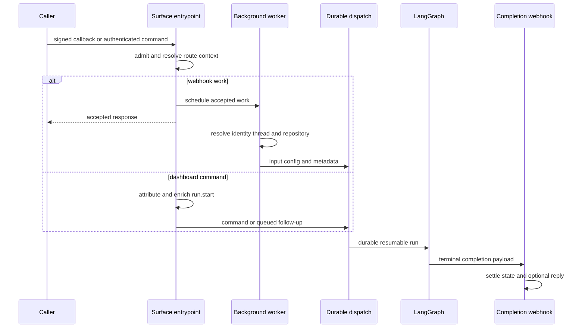

# Inbound Invocation and Durable Dispatch

Open SWE accepts authenticated dashboard commands, signed integration callbacks, and scheduler work, but these are *surfaces*, not authorization grants. Each entrypoint performs its own admission and access checks, derives or creates a durable thread, records source context and actor/repository configuration, serializes attributed input, and then creates a LangGraph run. `source` tells the dispatch contract how the run was invoked for logging and metadata; graph choice comes from `assistant_id`, and access still comes from the entrypoint's checks and the thread/repository policy.

See [Threads and state](../concepts/threads-and-state.md) for persistence ownership, [Dashboard UI](../integrations/dashboard-ui.md) for client behavior, and [Follow-up messages](follow-up-messages.md) for the queued-message lifecycle.

## Shared boundary and durable run contract

`create_app` installs the dashboard, plan, workflow-approval, Linear, Slack, health/completion, GitHub, and sandbox-tool routers. Startup validates GitHub login allowlisting, sandbox and local-model configuration, database/migrations, and imports legacy workspace/user records. Dashboard CORS is credentialed and rejects `*` as an allowed origin.

All agent and reviewer producers should converge on `dispatch_agent_run` or, for special cases such as schedule creation, `create_durable_run`. The former refuses an ambiguous mixture of a prebuilt `input` and raw content/identity arguments; when it builds input itself, it derives an identity envelope from `RunConfig`. Its `assistant_id` selects `agent` or `reviewer`—it is not inferred from a source label.

`create_durable_run` supplies the operational defaults:

- `multitask_strategy="interrupt"`: a new direct request replaces active work unless the caller requests `enqueue`.
- `durability="sync"`: the platform checkpoints before steps, preserving progress for resume after interruption or a process recycle.
- `stream_resumable=True`, all v3 stream modes, and `stream_subgraphs=True`: a later dashboard client can replay external runs and see tool and nested-agent events.
- A fresh `invocation_id` and `invocation_started_at` in configurable state and metadata, plus the v3 compatibility marker. These correlate one application dispatch across execution, completion, and telemetry.

*Sequence: every surface establishes context before using durable dispatch; webhooks acknowledge before their slower worker path, while the completion callback handles terminal state.*

A completion callback is attached only if `RUN_COMPLETE_WEBHOOK_SECRET` is set and `COMPLETION_WEBHOOK_URL` is absolute and non-loopback. This avoids an invalid local URL making every run creation fail. The `/webhooks/run-complete` receiver fails closed on the query token before parsing JSON.

## Webhook admission and context construction

GitHub, Linear, and Slack verify a platform signature against the raw request body before decoding JSON and return `401` on failure. Routes then ignore unsupported, malformed, or ineligible events rather than treating a valid signature as permission to run. GitHub also checks that a workspace owns the repository (returning `503` on an ownership lookup failure so GitHub retries) and applies repository allowlist and public-repository organization gates where applicable.

### Slack

Slack resolves channel eligibility before work is admitted. It blocks external shared or unverified channels; an `app_mention` in an external shared channel receives a one-time claimed refusal reply rather than a run. It drops bot/self messages and, outside code channels, accepts ordinary messages only when they are an app mention or a DM. A code channel is one session keyed to its channel, so its messages are directed to the agent; DM sessions can similarly use a stable per-user session key.

Before scheduling normal work, Slack claims the event ID. Only the claimant can create the background task, making redelivery deduplication part of the dispatch gate. It resolves the agent thread by preferring a stored Slack location mapping, then matching thread metadata, then a deterministic Slack-derived ID; a conflicting mapping is an error, not a guess. The worker fetches channel/history/user context, determines workspace and repository, upserts Slack source context and participant metadata, and constructs channel/person/message envelopes. Workspace tags are accepted only on the opening turn and only when the named workspace exists.

A human Slack run requires a valid mapped GitHub token; otherwise the worker posts an account-link or re-authentication prompt and stops. Allowed integration bots have additional public/system-owned-thread checks. Explicit requests use `interrupt`; untagged follow-ups use `enqueue`. A message update is verified against the delivered message and then routed as a queued correction, not a separate standalone run.

### Linear and GitHub

Linear accepts only non-bot `Comment` `create` events that mention Open SWE. Repository selection prefers an explicit repository in the comment, then the author's dashboard default, then the workspace default; the result must be allowlisted. Its worker derives the stable thread from the Linear issue ID, records issue source context, maps the author email to GitHub identity where possible, serializes the issue as system input and comments as attributed human input, and dispatches the result. Image-bearing issues can select a vision fallback.

GitHub routes issue, PR, comment/review, push, CI, and review-finding reply families to distinct workers. Ordinary issue/comment work must mention Open SWE, while supported PR state transitions can start or update automatic review and pushes evaluate watched PRs. For a PR comment, the worker recovers an Open SWE branch UUID if present; otherwise it derives the canonical PR thread ID. It obtains the mapped user's token, retries once on a GitHub `401`, reacts with eyes, fetches comments since the last tag, creates attributed input, and triggers or queues the run. Reviewer work uses `reviewer_thread_id` and `assistant_id="reviewer"`, keeping its state and graph separate from coding work.

## Dashboard and desktop commands

The dashboard proxy requires JSON and checks thread readability/postability. A nonexistent thread is permitted only for `run.start`; that first command lazily creates the dashboard record and stamps ownership, visibility, title, repository/workspace, resolved model settings, and the authenticated user's attribution. It replaces client messages with structured input envelopes and validates image content and model capability before forwarding the command. Existing `run.start` commands also receive current participants, invocation correlation, normalized configurable state, and safe server-owned metadata rather than trusting protected client metadata.

When a thread is busy, a dashboard `run.start` defaults to **steering**: the new attributed message is put in the thread message queue for the live agent to pick up before its next model call. If the client explicitly supplies `multitask_strategy="enqueue"`, the proxy creates a distinct durable queued run that begins once the thread becomes idle. It rejects offloading on a busy or new conversation. If a queued/steered message races completion, the worker attempts a `reject`-strategy pickup, avoiding two simultaneous replacements.

A dashboard stop is thread-wide: it enumerates pending and running runs instead of relying on possibly stale `latest_run_id`, interrupts those belonging to the stopper, settles their transcript turns, and starts pending leftover work when appropriate. It deliberately preserves another user's queued follow-up. Per-run cancellation is also exposed through the authenticated dashboard route.

Desktop requests use the dashboard/`source="desktop"` path, but local shell execution is separately constrained. The requested project path must resolve to a configured allowlisted project or to a worktree under `OPEN_SWE_LOCAL_WORKTREES_DIR`; being labeled desktop alone does not authorize filesystem access.

## Schedules and automation

Schedule records are workspace-scoped and scheduled crons target the `scheduler` assistant. A tick hands `schedule_id` to `launch_scheduled_agent_run`, which verifies that the record exists, has the `schedule` trigger, and is enabled. Before each launch it rechecks workspace access to the configured repository. Each execution receives a new UUID thread, schedule/automation metadata and system-attributed input, then uses `create_durable_run`.

A schedule configured for Slack `always` notifications posts its root Slack message first and binds that location to the fresh thread. Failure to create that message prevents the run, preserving the reply context rather than silently running without it. After durable creation, bookkeeping records the latest thread/run and trigger time; bookkeeping failure does not undo the already-durable run. GitHub issue-opened automations use a delivery-and-schedule claim thread to prevent duplicate launches.

## Input and thread identity invariants

Thread-ID derivations are persisted, cross-process routing contracts. Slack locations, Linear issues, GitHub issues/PRs, and reviewer threads must produce exactly the same namespace and stable input string to recover existing state; changing a formula can orphan live threads. A branch UUID is only recovered when one is embedded in the branch name—otherwise PR comments use the canonical PR-derived identity.

Input is structured rather than an unlabelled prompt string. `human_input` and `system_input` enforce kind alignment; authored text is XML-escaped within an `<input-message>` envelope that carries sender, surface, and optional structured data. Channel/system/person introductions are dynamic context blocks hashed from canonical XML and are omitted only when their hash remains visible in state. This preserves attribution through replay and summarization without repeatedly injecting the same context.

## Completion and operations

The completion handler finalizes invocation usage and transcript turns. A successful ordinary run can start pending dashboard follow-ups, restore code-channel status only when no later run is live, schedule answer feedback, and schedule a deduplicated Slack session-cost refresh when source context supplies a Slack location. A `follow_up_pickup` success does not recursively create another pickup.

For `error` and `timeout`, completion best-effort settles an unfinished reviewer check, restores a code-channel session safely, and posts a source-specific failure notification to Slack, Linear, or GitHub. Failure replies are idempotent per `run_id`; legacy payloads without one use a thread-level fallback. `interrupted` intentionally has no failure reply because it is the expected outcome of an interrupting follow-up. Automated wakeup failures are also silent.

### Safe change checklist

- Verify raw-body signatures before JSON parsing, preserve Slack event claims and channel eligibility, and test retry/redelivery behavior.
- Treat thread-ID formulas, persisted source context, and envelope schemas as compatibility surfaces. Never replace a mapping conflict with heuristic routing.
- Keep new producers on durable dispatch and explicitly choose `assistant_id` and `interrupt` versus `enqueue`; do not use `source` as authorization or graph selection.
- Exercise replay of externally initiated streams, sync durability defaults, completion-webhook configuration fallbacks, and completion idempotence.
- For dashboard changes, cover lazy creation, server-side attribution, busy steering versus enqueue, and cancellation of all live runs. For schedules, cover access rechecks and Slack-root failure before dispatch.
