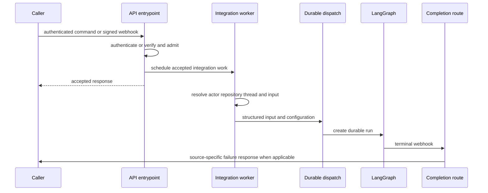
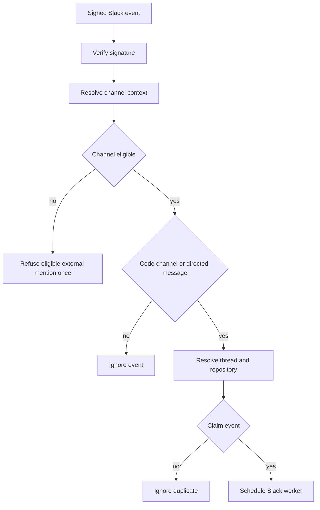

# Invocation from Dashboard, Webhooks, and Desktop

Open SWE accepts work from authenticated dashboard commands, signed integration callbacks, desktop-originated dashboard runs, and scheduler ticks. These surfaces converge on LangGraph threads and durable runs, while retaining source context, repository selection, and structured sender identities. See [Auth and security](../concepts/auth-and-security.md), [Threads and state](../concepts/threads-and-state.md), and [Follow-up messages](follow-up-messages.md) for the adjacent policies and lifecycle.

## Invocation paths

This shows the shared boundary. Webhook routes acknowledge after inexpensive admission and schedule their remote work in `BackgroundTasks`; dashboard commands are authorized, enriched, and proxied to LangGraph synchronously.

`create_app` composes the dashboard, plan and workflow-approval routes with Linear, Slack, health/completion, and GitHub routers. It refuses wildcard dashboard CORS origins when credentials are enabled and validates sandbox and local-development model configuration during lifespan startup. Consequently, route composition and startup validation are part of the invocation boundary rather than a responsibility of individual webhooks.

## Webhook admission

GitHub, Linear, and Slack read the raw request body and verify the platform signature before parsing JSON; a failed verification is `401`. Invalid JSON and unsupported/ineligible events return an ignored or error response rather than starting a run.

### Slack: conversation admission and attribution

Slack checks channel eligibility before ordinary message processing. It blocks externally shared or unverified channels; a valid app mention in an external shared channel gets a claimed, one-time refusal reply and is not dispatched. It rejects bot and self events, validates that a message edit retains its identity and changes visible text, and, outside a code channel, accepts an ordinary message only when it is a mention, DM, ready-plan reply, or qualifying untagged two-party reply. Code channels instead represent a shared session: messages there use the channel session thread and are treated as directed requests.

The Slack route resolves a location by preferring an explicit stored mapping, then matching metadata, then a deterministic ID. A conflict is an error rather than an invitation to guess. Claiming `event_id` occurs before normal background work is scheduled, so only the claimant can create the run.

The worker loads profile, thread history, channel context, mappings, and optional image content; it persists `SourceContext.slack_thread`, repository, actor, visibility, environment, and other configuration on the thread. Coding work requires a valid mapped triggering-user GitHub token unless the trigger is an approved bot; an unavailable or revoked token produces an account-link or re-login prompt instead of a dispatch. The first `env:<name>` may choose a valid environment; later turns use the stored environment because the sandbox was selected at thread creation.

Slack converts context and the request into typed input. Explicit requests use `multitask_strategy="interrupt"`; other follow-ups use `"enqueue"`. An edit is put into the thread message queue, never launched as an independent run, and an idle-thread edit waits for a future request to drain it.

### Linear: comment-to-issue execution

Linear admits only non-bot `Comment` `create` events that mention Open SWE. It chooses the repository from explicit comment text, then the author’s dashboard default, then the team default; the result must pass the repository allowlist. The accepted route passes issue and triggering-comment information to its background worker.

The worker derives the deterministic thread ID from the Linear issue ID, chooses identity from comment author then creator then assignee, and maps that email to a GitHub login where possible. It persists Linear issue source context and builds a typed system issue description plus typed human messages for relevant comments and their authors. Images are downloaded into multimodal input, with a vision-model fallback when necessary, before dispatching the run.

### GitHub: coding and reviewer graphs

GitHub multiplexes issue, PR, comment, review, push, and CI events. It filters unsupported actions, applies repository allowlists where applicable and the public-repository organization gate, requires an Open SWE mention for ordinary issue/comment work, and routes review-finding replies separately. PR opening or ready-for-review can start automatic review only for a repository that enables it; watched pushes can cause a re-review.

For a coding PR comment, the worker first recovers an Open SWE branch UUID, otherwise uses the deterministic PR thread ID. It requires a mapped author email/token, authorizes the thread, retries token resolution once after a GitHub authentication failure, reacts with eyes, fetches comments since the last tag, and serializes per-author human messages before triggering or queueing the run. Private threads additionally filter out authors who cannot prompt that thread.

Reviewer executions are isolated from coding work: the canonical `reviewer_thread_id` is used with `assistant_id="reviewer"`. The reviewer worker creates or updates reviewer metadata and check status, then dispatches the review graph with PR data rather than sharing the coding-agent thread.

## Dashboard and desktop

The dashboard proxy requires JSON and authenticated access. A missing client-minted thread is permitted only for `run.start`; the command lazily creates and stamps the dashboard thread. Other commands to a missing thread are `404`; posting/reading existing threads are governed by their metadata, with admin-thread input commands requiring an admin.

`run.start` requires a valid GitHub token for the authenticated login. It rebuilds caller configuration from trusted thread metadata, creates a new invocation ID, normalizes model and effort choices, resolves requested environment, validates visibility and images, and serializes the authenticated user’s message and identity as typed web input. A busy thread rejects a new `run.start` with `409` rather than silently creating concurrent dashboard work. After a successful start the proxy records run metadata and observes time-to-first-text.

The desktop client reaches this invocation path with `source="desktop"`. Local shell execution is enabled only for that source and only if `local_project_path` resolves to either a registered project in `OPEN_SWE_LOCAL_PROJECTS_FILE` or a worktree beneath `OPEN_SWE_LOCAL_WORKTREES_DIR`; the resolved path must exist as a directory.

## Schedules

Schedules are persisted workspace records backed by LangGraph crons whose assistant is `scheduler`. A tick enters the scheduler graph and calls `launch_scheduled_agent_run`. Launch checks that an enabled schedule still has workspace repository access, then creates a fresh UUID agent thread with automation metadata and a typed system input. If an always-notified schedule cannot create its Slack root message, launch fails rather than running without its notification context.

## Thread IDs and input envelopes

Thread-ID derivations are persisted cross-process routing contracts. Slack locations, Linear issues, GitHub issues/PRs, and reviewer work must reproduce the same namespace and stable input to recover live state; changing them can orphan threads. `thread_id_from_branch` extracts an embedded UUID only, leaving the PR-derived ID as the fallback.

Input is structured rather than arbitrary prompt text at the graph boundary. `human_input` and `system_input` enforce kind alignment; authored text is XML-escaped inside `<input-message>` envelopes. Identity and channel context is serialized as SHA-256-hashed `<dynamic-context>` blocks, allowing already-visible context to be omitted, while Slack topic and purpose are marked `trust="untrusted"`.

## Durable dispatch and completion

`dispatch_agent_run` is the common agent/reviewer contract. It rejects a prebuilt input combined with raw content or identities; otherwise it constructs input and delegates to `create_durable_run`. The durable defaults are `multitask_strategy="interrupt"`, `durability="sync"`, `if_not_exists="create"`, resumable streaming, the v3 stream-mode set and subgraphs. `prepare_run_config` places one invocation ID and the streaming marker in configurable state and metadata, correlating dispatch, telemetry, and completion.

A completion webhook is attached only when `RUN_COMPLETE_WEBHOOK_SECRET` is configured and `COMPLETION_WEBHOOK_URL` is absolute and non-loopback. The public receiving route fails closed on the token. On success, eligible Slack-backed runs receive a deduplicated session-cost refresh. On `error` or `timeout`, completion best-effort settles unfinished reviewer checks, returns a code-channel session to active only when no later run is live, and posts a Slack, Linear, or GitHub failure response. Failure response deduplication is per run ID, with a legacy thread-level fallback for payloads lacking one; `interrupted` is deliberately not a failure reply.

## Safe changes and focused verification

- Preserve raw-body verification before parsing, channel/repository gates, and event claims. Test Slack replay/deduplication, external-channel refusal, bot filtering, and directed-message rules.
- Treat `agent/thread_ids.py` formulas and persisted source context as compatibility surfaces. Test a Slack mapping conflict instead of adding a heuristic that guesses a thread.
- Keep new invocation sources on `dispatch_agent_run` or `create_durable_run`. `tests/agent/test_dispatch.py` covers durable defaults, stream configuration, invocation correlation, input construction, and completion-webhook fallback.
- Test dashboard lazy creation, authorization, model/image/config enrichment, busy-thread rejection, and cancellation through the thread proxy/runs tests.
- Test completion success/failure status handling, source-specific responses, reviewer cleanup, per-run deduplication, cost refresh, and intentional silence for interrupted runs.
