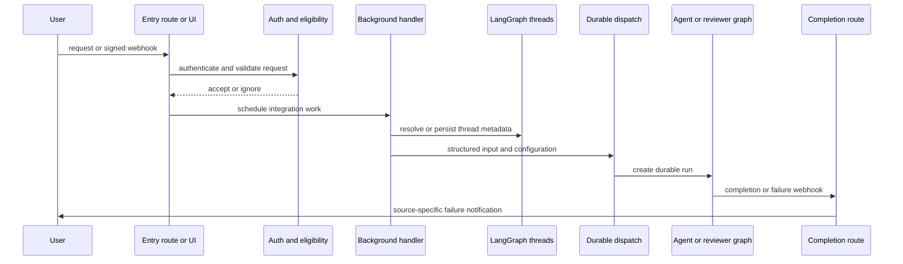

# Inbound Invocation Workflow

Open SWE has several entry surfaces, but they converge on a LangGraph thread and a durable run. Webhook routes are deliberately thin: they authenticate and filter synchronously, then put integration work in a FastAPI background task. The dashboard is an authenticated control plane that either starts a new run through the LangGraph command proxy or queues a message on an already-active thread. Schedules create an isolated thread per firing. Desktop runs use the same run configuration but a local-project sandbox boundary.

This shows the shared lifecycle; dashboard starts can proxy directly to LangGraph, while webhook handlers run after the HTTP acknowledgement.

## Entrypoints and trust boundaries

`create_app` composes dashboard, Linear, Slack, health/completion, and GitHub routers. Dashboard mutation routes require same-origin protection, and their action handlers also require an authenticated session. In particular, a dashboard `run.start` requires a usable GitHub token before it is forwarded; access to a repository is checked when the dashboard creates or edits repo-scoped work. The desktop application obtains that dashboard session through its PKCE-bound browser handoff; it does not introduce a second agent-dispatch API.

GitHub, Slack, and Linear routes read the **raw** body and verify the provider signature before decoding JSON. Missing configuration is not permissive: all three verification implementations reject the request when their signing secret is absent. Slack additionally rejects a request timestamp outside its five-minute freshness window. A signature failure yields HTTP 401. This makes the route, rather than a background task, the security boundary.

After verification, webhook routes return an accepted or ignored response promptly and place expensive work in `BackgroundTasks`. An accepted HTTP response therefore means the event passed synchronous admission, not that a run has completed. Invalid JSON and unsupported/ineligible events return structured error/ignore responses rather than entering the agent.

## Resolve eligibility, repository, and thread

### Slack

Slack resolves channel context before dispatch. Operations are allowed only in DMs or channels confirmed not externally shared; an app mention in a Slack Connect channel gets a deduplicated refusal reply and is not run. The route also drops bot traffic, its own messages, and duplicate event deliveries. Outside a code channel, it admits an app mention, DM, reply to a ready plan, or an untagged reply only when the sender and Open SWE are the live participants. Code channels intentionally turn all channel messages into one directed session.

A normal Slack conversation maps to an agent thread through `resolve_slack_thread_id`: explicit persisted mapping wins, then matching Slack metadata, then the deterministic Slack-derived ID. Ambiguous metadata is an error rather than a guess. The handler obtains channel history and profiles, records source context and repository metadata, and converts historical human and bot messages plus the triggering request into typed input. Unless bot-token-only mode is enabled, the triggering Slack user must have a valid mapped GitHub account because coding runs open PRs as that user; otherwise Open SWE posts an account-link prompt instead of dispatching.

An explicit tag (and certain directed code-channel/DM actions) uses `interrupt`; a non-explicit Slack follow-up uses `enqueue`. Thus conversational continuity does not automatically cancel active work, while a direct new request can supersede it.

### Linear

Linear admits only `Comment` `create` events that mention an Open SWE handle, and excludes bot and known Open SWE output. It chooses a repository in priority order: explicit `owner/repo` in the comment; the mapped dashboard user's default repository; team/project mapping; then team default. The resolved repository must be allowed.

The worker reacts 👀 to the triggering comment, derives one thread ID from the Linear issue ID, and refetches issue detail. It chooses the acting email from comment author, creator, then assignee; maps that email to a GitHub login where possible; stores source metadata; then builds a system issue introduction and typed per-author comments. Image URLs can be fetched into multimodal blocks, with a vision-model fallback when needed. After dispatch it posts a trace comment linking the Open SWE thread.

### GitHub and reviewer isolation

The GitHub route multiplexes issue/comment, PR/review, push, and CI events. Coding issue and comment paths require an Open SWE mention, enforce the repository allowlist, and apply the public-repository organization gate. PR opened/ready events may start automatic review only when review is enabled; push is evaluated for re-review. A reply to an existing review finding is handled as a reviewer interaction rather than a coding request.

For a PR comment, the worker reacts 👀, derives the coding thread from an Open SWE branch UUID when present (otherwise owner/repository/PR), resolves the trigger user's GitHub token via email mapping, and retries token refresh once after a 401. It collects comments since the last Open SWE tag and supplies author identities with typed human messages. Issue IDs, Linear issue IDs, Slack locations, PR comments, and reviewer threads all use deterministic formulas. Those formulas are persisted routing contracts: changing one prevents existing state from being found.

Reviewer runs are deliberately separate from coding runs: first review, re-review, and finding replies use `reviewer_thread_id` and `assistant_id="reviewer"`. This prevents reviewer state, watches, and GitHub check lifecycle from colliding with the agent's coding thread.

## Dashboard, desktop, and automation

The dashboard's `run.start` enrichment creates a metadata record for a client-minted new thread, validates image count/type/size and model capability, requires the caller's GitHub token, and builds a web-surface human input with a GitHub identity. Existing and busy threads do not accept another `run.start`; `send_dashboard_message` verifies posting permission, updates participant and resolution metadata, and writes the user message to the durable pending-message queue. Cancelling a thread interrupts all pending/running runs; if queued messages remain, it starts a replacement run to consume them. This allows the web UI to control runs originally invoked by integrations as well.

Desktop is a run source selected by configuration. Its shell backend only accepts a registered local project or a worktree underneath `OPEN_SWE_LOCAL_WORKTREES_DIR`; any other `local_project_path` fails validation. Desktop artifact routes place offloaded results outside the project so agent scratch data is not accidentally staged as repository changes.

A schedule validates a five-field cron expression and, on firing, makes a fresh UUID thread. It checks the schedule owner's repository access, optionally creates and binds a Slack root message, persists schedule/source metadata, and invokes `create_durable_run` with a system automation message. This isolation means two schedule occurrences are separate agent sessions rather than follow-ups on one thread.

## Common dispatch and completion contract

Integration handlers normally construct `RunInput` themselves. Its messages use strict input envelopes: authored content has sender, surface, and kind metadata; role-specific constructors enforce `human` versus `system`; dynamic identity context is hash-stamped so it need not be reintroduced every turn. A simpler caller can give `dispatch_agent_run` plain content, in which case it synthesizes a namespaced Slack/GitHub/Linear identity or a `system:` actor.

`dispatch_agent_run` delegates to `create_durable_run`. The default multitask strategy is `interrupt`, durability is `sync`, and runs are resumable with v2 stream configuration and subgraph streaming. These defaults preserve checkpoints across failure/recycle and let a late-attaching dashboard replay lifecycle and nested agent activity. `assistant_id` selects the coding agent or reviewer graph.

Completion delivery is optional but safe by construction. Dispatch attaches `COMPLETION_WEBHOOK_URL` only if `RUN_COMPLETE_WEBHOOK_SECRET` is set and the URL is absolute and non-loopback; otherwise it logs and creates the run without a completion webhook rather than making all creates fail. The route at `/webhooks/run-complete` is token-gated and fail-closed. On `error` or `timeout`, completion uses source metadata to post a best-effort notification back to Slack, Linear, or GitHub; it deliberately ignores `interrupted`, because a normal interrupt is commonly replaced by the follow-up run. Failure notifications are deduplicated per run ID, and a failed reviewer run also best-effort settles its outstanding GitHub check.

## Operational checks and focused tests

Configure each inbound provider's signing secret (`SLACK_SIGNING_SECRET`, `GITHUB_WEBHOOK_SECRET`, `LINEAR_WEBHOOK_SECRET`) before enabling its endpoint. To enable completion-side failure delivery, configure both `RUN_COMPLETE_WEBHOOK_SECRET` and a reachable HTTPS `COMPLETION_WEBHOOK_URL`; loopback and relative values intentionally disable that feature. For desktop, configure either registered projects or `OPEN_SWE_LOCAL_WORKTREES_DIR` before allowing local execution.

`tests/webhooks/test_linear_webhook_author.py` verifies that Linear author email is mapped into both configuration and thread metadata and that downloaded images stay attached to the issue/comment that referenced them. `tests/webhooks/test_completion_webhook.py` exercises failure reply idempotence and reviewer check cleanup, including the rule that ordinary coding failures do not settle reviewer checks.

For related detail, see [Authentication and security](../concepts/auth-and-security.md), [Threads and state](../concepts/threads-and-state.md), [Dashboard UI](../integrations/dashboard-ui.md), [Context engineering](context-engineering.md), and [Follow-up messages](follow-up-messages.md).
