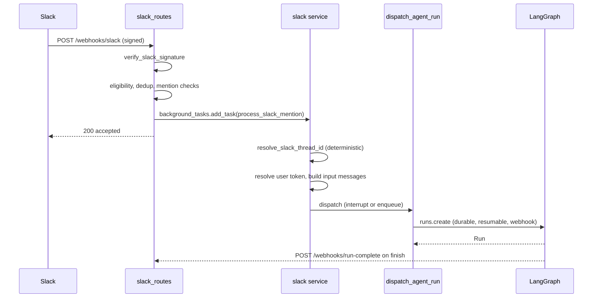

# Invocation: Slack, Linear & GitHub Webhooks

Every external trigger — a Slack mention, a Linear comment, a GitHub PR or issue
comment — reaches Open SWE as an HTTP webhook and leaves as a single dispatched
LangGraph run. The three surfaces differ in how they authenticate, resolve a
repository and triggering user, and acknowledge the human, but they converge on
one contract: [`dispatch_agent_run`](repo://agent/dispatch.py#L278-L327) creating
a durable run on a **deterministically derived thread id**, with input built by
[`agent/input_messages.py`](repo://agent/input_messages.py).

This page traces each surface end to end and documents the shared dispatch
contract. For what happens when a message arrives while a run is already
executing, see [workflows/follow-up-messages](repo://openwiki/workflows/follow-up-messages.md);
for how threads persist and re-derive their identity, see
[concepts/threads-and-state](repo://openwiki/concepts/threads-and-state.md); for
signature verification and repo/org gating, see
[concepts/auth-and-security](repo://openwiki/concepts/auth-and-security.md); and
for what the dispatched run ultimately produces, see
[workflows/pr-creation](repo://openwiki/workflows/pr-creation.md).

## The shape of every trigger

All three route modules share the same skeleton:

1. Read the raw request body and **verify the platform signature** before
   parsing anything. A missing or invalid signature is a `401`.
2. Filter by event type / action, drop bot-authored events and duplicate
   deliveries, and require an explicit `@open-swe` mention where applicable.
3. Schedule the real work on a FastAPI `BackgroundTask` and return a fast
   `{"status": "accepted"}` so the platform does not retry.
4. In the background task: resolve the repository and triggering user, compute a
   deterministic `thread_id`, acknowledge the human (👀), build input messages,
   and call `dispatch_agent_run`.

Representative flow for a Slack mention; Linear and GitHub follow the same verify → background → resolve → dispatch shape.

## Signature verification (the security boundary)

Each route rejects unsigned or badly signed requests before parsing the body:

- **Slack** — [`verify_slack_signature`](repo://agent/utils/slack.py#L153-L178)
  recomputes `v0:<timestamp>:<body>` HMAC-SHA256 against `SLACK_SIGNING_SECRET`,
  compares in constant time, and additionally rejects timestamps older than five
  minutes to defeat replay.
- **GitHub** — [`verify_github_signature`](repo://agent/utils/github_comments.py#L85-L104)
  checks `X-Hub-Signature-256` (`sha256=`-prefixed HMAC) against
  `GITHUB_WEBHOOK_SECRET`.
- **Linear** — [`verify_linear_signature`](repo://agent/webhooks/common.py#L1015-L1035)
  checks the `Linear-Signature` HMAC against `LINEAR_WEBHOOK_SECRET`.

All three are **fail-closed on a missing secret**: an unconfigured signing
secret rejects every webhook rather than accepting unauthenticated traffic.

## Deterministic thread ids

The thread id is a cross-process routing contract: webhooks, the dashboard, and
the reviewer each re-derive the *same* id from the same external identifiers, so
a follow-up lands on the existing thread instead of forking a new one. The
formulas live in [`agent/thread_ids.py`](repo://agent/thread_ids.py#L1-L71) and
are part of the persisted data model — changing a formula orphans live threads.

- **Slack** — `slack_thread_id(channel, timestamp, nonce)` is a UUIDv5 of
  `slack:<channel>:<ts>:<nonce>`. Because a Slack `thread_ts` can be remapped,
  webhooks call [`resolve_slack_thread_id`](repo://agent/utils/slack.py#L1620-L1656),
  which prefers an explicit stored mapping, else searches thread metadata for the
  Slack location, and only then falls back to the derived id; more than one match
  raises `SlackThreadMappingError` rather than guessing.
- **Linear** — `linear_issue_thread_id(issue_id)` is a SHA-256-derived UUID of
  `linear-issue:<issue_id>`, so every comment on an issue routes to one thread.
- **GitHub** — for a PR that Open SWE branched, the id is recovered from the
  branch name with [`thread_id_from_branch`](repo://agent/thread_ids.py#L68-L71)
  (Open SWE embeds a UUID in branches it creates); otherwise it uses
  `pr_comment_thread_id(owner, repo, pr)`. Issues use
  `github_issue_thread_id(issue_id)`, and reviewer runs use the separate
  `reviewer_thread_id(owner, repo, pr)` namespace.

## Slack

[`/webhooks/slack`](repo://agent/webhooks/slack_routes.py#L166-L499) handles
Slack's Event API. It answers `url_verification` challenges, ignores non-event
callbacks, and short-circuits reaction / session events to their own handlers.

**Channel eligibility and Slack Connect refusal.** Before doing anything else it
fetches channel context and calls
[`slack_channel_allows_operations`](repo://agent/utils/slack.py#L1034-L1041),
which only permits DMs or channels Slack confirms are *not* externally shared
(`is_ext_shared` and `is_pending_ext_shared` both `False`). In an externally
shared channel an `app_mention` gets a one-time reply —
`"Open SWE does not operate in channels with external participants."` — and the
event is dropped; Open SWE never runs against a Slack Connect channel with
outside participants.

**What counts as directed at Open SWE.** Outside code channels, a message is
handled only if it is an `app_mention`, a DM, a reply to a ready plan, or an
untagged two-party reply where the sender and Open SWE are the only live
participants. Bot-authored events and the bot's own messages are dropped, and
retries of an already-seen `event_id` are ignored.

**Instant acknowledgement and dedup.** Deduplication is enforced with
[`claim_slack_event`](repo://agent/webhooks/slack_routes.py#L495-L497), which
gates the background task so only the first delivery dispatches. The human-facing
acknowledgement (the 👀 reaction and threaded replies) is posted by the running
agent through its Slack tools rather than by the route.

**Building the run.** The background task
[`process_slack_mention`](repo://agent/webhooks/slack.py#L449-L455) wraps the
implementation in error handling that posts a user-visible failure notice.
[`_process_slack_mention_impl`](repo://agent/webhooks/slack.py#L554-L934)
resolves the thread id, warms the user-mapping cache, and looks up the sender's
Slack profile (email, name, timezone). Open SWE opens PRs *as the triggering
user*, so unless the deployment is in bot-token-only mode a run is blocked when
the Slack user has no valid GitHub token, and the user is prompted to link their
account instead of dispatching. It then serializes the thread history into
structured input via [`_slack_context_input`](repo://agent/webhooks/slack.py#L354-L410):
a channel introduction, per-sender person/system introductions, each prior
message as a typed `input-message`, and an operational-context system message.

**Interrupt vs enqueue.** Whether a Slack follow-up interrupts the active run is
decided by [`_interrupts_active_run`](repo://agent/webhooks/slack.py#L95-L109):
an explicit tag (or a treated-as-mention DM/code-channel message) interrupts;
other follow-ups enqueue. [`_dispatch_or_queue_slack_run`](repo://agent/webhooks/slack.py#L192-L214)
passes `multitask_strategy="interrupt"` when explicitly tagged and `"enqueue"`
otherwise.

## Linear

[`/webhooks/linear`](repo://agent/webhooks/linear_routes.py#L11-L163) fires only
on `Comment` `create` events. It drops bot-authored comments and Open SWE's own
bot messages, and requires the comment to mention `@open-swe`. Repository
resolution is layered: an explicit `owner/repo` in the comment text, else the
commenter's dashboard `default_repo`, else a team/project mapping, else the team
default; a repo outside the allowlist is rejected. The route stashes the
triggering comment, its id, and the author onto the issue payload and schedules
[`process_linear_issue`](repo://agent/webhooks/linear.py#L26-L337).

The background task **acknowledges instantly** by reacting 👀 to the triggering
comment via [`react_to_linear_comment`](repo://agent/webhooks/common.py#L402-L436),
derives the thread id from the issue id, fetches full issue details, and resolves
the triggering user's email/login from the comment author, issue creator, or
assignee. It builds input messages — a Linear-issue system introduction carrying
the issue's description and metadata, then per-author person introductions and
each relevant comment as a human `input-message` (with image blocks when the
comment embeds images) — and dispatches with the default `interrupt` strategy.
Finally it posts a trace comment linking the Open SWE thread.

## GitHub

[`/webhooks/github`](repo://agent/webhooks/github_routes.py#L11-L182) multiplexes
issue, issue-comment, PR, PR-review, PR-review-comment, push, and CI events. It
verifies the signature, rejects unsupported event types and actions, and gates on
the repo allowlist and a public-repo org gate. Comment and issue events require
an `@open-swe` mention (`mentions_open_swe`) before they are accepted; replies to
an Open SWE review finding are routed separately to the reviewer graph.

**PR comments.** [`process_github_pr_comment`](repo://agent/webhooks/github.py#L799-L946)
extracts PR context, derives the thread id from the PR branch (or the PR-comment
namespace for a branch Open SWE did not create), and resolves the triggering
user's GitHub token via their email mapping (refreshing once on a 401). It
**acknowledges instantly** with a 👀 reaction —
[`react_to_github_comment`](repo://agent/utils/github_comments.py#L147-L186)
posts the `eyes` content reaction (a GraphQL `EYES` reaction for PR-review
bodies). It then gathers all comments since the last `@open-swe` tag, builds
per-author person introductions plus one human `input-message` per comment, and
hands off to [`_trigger_or_queue_run`](repo://agent/webhooks/common.py#L1089-L1123),
which upserts thread metadata and dispatches.

**Issues, auto-review, and re-review.** `issues` / `issue_comment` events flow to
`process_github_issue`, which uses a webhook-authored system introduction for a
first run and a human introduction for follow-up comments. PR `opened` /
`ready_for_review` schedule a first review, `push` schedules a re-review, and a
reply to a finding re-runs the reviewer — each on the appropriate reviewer thread
and dispatched with `assistant_id="reviewer"`.

## Structured input messages

Regardless of surface, content is never sent to the model as raw text. Callers
build typed [`RunInput`](repo://agent/input_messages.py#L67-L69) whose messages
are serialized into a strict envelope by
[`agent/input_messages.py`](repo://agent/input_messages.py#L259-L330):

- Each authored message becomes an `<input-message sender=… surface=… kind=…>`
  element wrapping an XML-escaped `<content>` body plus optional structured
  `data`. `kind` is `human` or `system`, and `human_input` / `system_input`
  enforce that the kind matches.
- Senders, channels, and systems are introduced once as
  [`<dynamic-context>`](repo://agent/input_messages.py#L216-L245) blocks stamped
  with a SHA-256 `hash`, so the same identity is not re-introduced on every turn;
  untrusted fields like a channel topic/purpose are marked `trust="untrusted"`.
- `dispatch_agent_run` itself can synthesize identities from the `configurable`
  dict via [`_dispatch_input`](repo://agent/dispatch.py#L71-L152) when a caller
  passes plain content instead of a prebuilt `RunInput`, mapping a Slack/GitHub/
  Linear sender to a namespaced `sender_id` and falling back to a `system:` actor.

## The durable dispatch contract

[`dispatch_agent_run`](repo://agent/dispatch.py#L278-L327) routes every trigger
through [`create_durable_run`](repo://agent/dispatch.py#L233-L275), which applies
Open SWE's LangGraph run defaults. These defaults are the reason a
webhook-triggered run behaves like one started from the dashboard:

- **`multitask_strategy="interrupt"`** (default) — a follow-up halts the active
  run, whose progress is preserved by the sync checkpoint, and resumes the agent
  with full history plus the new message; on an idle thread it simply starts.
  Background follow-ups can opt into `"enqueue"` instead. See
  [workflows/follow-up-messages](repo://openwiki/workflows/follow-up-messages.md).
- **`durability="sync"`** — the run checkpoints before each step, so a crash or
  container recycle resumes from the last checkpoint rather than losing all work.
- **Run-complete webhook** — when configured, the platform POSTs completion or
  failure to `…/webhooks/run-complete`, so every run ends with a signal even if
  the agent process dies. The URL is resolved by
  [`_resolve_completion_webhook_url`](repo://agent/dispatch.py#L177-L201): it is
  only attached when `RUN_COMPLETE_WEBHOOK_SECRET` is set, and it **degrades to
  no webhook** for a relative or loopback URL (which the platform rejects,
  otherwise poisoning every `runs.create`). The secret is appended as `?token=`.
  The receiving route [`/webhooks/run-complete`](repo://agent/api/health.py#L17-L27)
  is fail-closed on that same token.
- **`stream_resumable=True`** — the run's event stream is retained so a client
  that attaches later can replay it. Without it the web UI cannot observe a run
  it did not start: the v2 protocol only synthesizes the `lifecycle: running`
  event that drives the loading state when it can replay the run's events.
- **Protocol v2 stream shape** — the same `stream_mode` set
  ([`V2_RUN_STREAM_MODES`](repo://agent/dispatch.py#L61-L68)), `stream_subgraphs`,
  and the [`EVENT_STREAMING_V2_CONFIG_KEY`](repo://agent/dispatch.py#L53-L58)
  marker (set in [`prepare_run_config`](repo://agent/dispatch.py#L214-L230)) that
  the dashboard's `run.start` applies. The server fixes a run's streaming
  protocol at creation; without the marker a run streams `values` only, so the
  dashboard would see no `tools` events and no nested subagent namespaces for a
  Slack/Linear/GitHub-triggered run.

`create_durable_run` also stamps a `prepare_run_id` into both `configurable` and
`metadata` and selects the graph through `assistant_id` (`"agent"` for coding
runs, `"reviewer"` for review runs).
