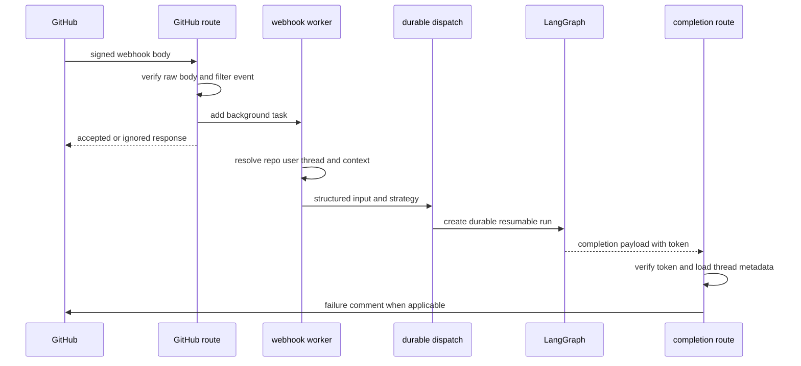

# Inbound invocation to durable run

Open SWE has two complementary ways to start work. The dashboard forwards an authenticated `run.start` command after enriching it; integration and automation paths use the shared durable-dispatch contract. Both create work against a LangGraph thread, with typed input and a v2-capable resumable stream. A dashboard can therefore attach to and cancel a run that began elsewhere.

The FastAPI composition registers the dashboard, plan/approval, Linear, Slack, health/completion, and GitHub routers. It rejects `*` in `DASHBOARD_ALLOWED_ORIGINS` when credentialed CORS is enabled, rather than running an unsafe wildcard configuration. [Architecture overview](../architecture/overview.md), [auth and security](../concepts/auth-and-security.md), [threads and state](../concepts/threads-and-state.md), and [context engineering](context-engineering.md) provide the adjacent contracts.

## Representative external trigger and completion contract

This shows an integration request: authentication and cheap eligibility decisions happen before acknowledgement, while remote lookups and dispatch are background work. Completion is a separate, authenticated callback rather than an assumption that the agent itself will always post a final message.

## HTTP ingress: verify first, then acknowledge

Slack, GitHub, and Linear routes read the **raw** body and validate the corresponding signature before JSON parsing; invalid or absent signatures receive `401`. The shared verifiers are deliberately fail-closed when their signing secret is unset. Slack also rejects a request timestamp outside its five-minute age window, which prevents replay of an otherwise valid signature.

After verification, routes return an ignored result for unsupported or ineligible events and use FastAPI `BackgroundTasks` for accepted work. Thus a platform acknowledgement does not mean a run was successfully created; it means the request passed the synchronous gate and was handed off. Failed JSON is reported as an error response rather than dispatched.

### Integration-specific gates and context

- **Slack** handles Event API callbacks after its URL-verification challenge. It rejects bot/self messages, keeps delivery deduplication behind `claim_slack_event`, and restricts ordinary-channel requests to app mentions, DMs, ready-plan replies, or eligible untagged two-party replies. It refuses operations in externally shared channels; an app mention in such a channel receives the one-time refusal response.
- **Linear** accepts only `Comment` `create` events that mention Open SWE and are neither bot-authored nor one of its own recognizable bot messages. Repository selection is ordered: an explicit repository in the comment, the author's dashboard default, a team/project mapping, then the team default. The selected repository must be allowlisted.
- **GitHub** multiplexes issue, issue-comment, pull-request, review, review-comment, push, and CI events. It filters actions, allows only configured repositories, applies the public-repository organization gate when required, and requires a mention for ordinary issue/comment work. PR opened/ready and push paths can initiate or update automated reviewer work; a reply to a reviewer finding goes to its reviewer flow.

Workers then resolve source-specific identity, repository and history. Linear reacts to the triggering comment with `👀`, includes issue description and relevant comments (including image content when fetchable), maps the user's email to the GitHub identity used for PR work, dispatches, and posts a trace comment. GitHub PR-comment handling resolves the actor token through the email mapping (with a single refresh retry on `401`), reacts with eyes, and packages comments after the last Open SWE tag. Slack builds channel, participant, history, and operational context; it blocks a run when the triggering user lacks a GitHub token unless bot-token-only mode is enabled, prompting account linkage instead.

## Thread identity and input boundary

Thread IDs are stable routing keys, not incidental run IDs. Slack uses its channel/thread timestamp (with mappings preferred during resolution), Linear derives an ID from the issue ID, GitHub issues from the issue ID, and GitHub PR conversations from either the UUID embedded in an Open SWE branch or the owner/repository/PR number. Reviewer work has a separate `reviewer_thread_id` namespace. These formulas are a persisted cross-process contract: changing their namespace or input strings strands existing threads.

Input is serialized rather than concatenated into an untyped prompt. An authored item is an XML-escaped `<input-message>` with sender, surface, and kind attributes and optional structured data. `human_input` and `system_input` enforce the matching kind. Person, channel, and system introductions are `<dynamic-context>` blocks hashed from their canonical content; duplicate known context can be suppressed, while Slack topic and purpose fields are explicitly marked `trust="untrusted"`.

## Interrupt versus enqueue

`dispatch_agent_run` defaults to `multitask_strategy="interrupt"`. An explicit Slack request uses that behavior, while an ordinary Slack follow-up uses `"enqueue"`; edits do not count as explicit requests. Interruption is intentional: it stops the active run and lets the replacement see the thread history plus the new message. Enqueue preserves ordering for background-style follow-ups. The detailed follow-up lifecycle is documented in [follow-up messages](follow-up-messages.md).

Dashboard behavior distinguishes a new `run.start` from a message sent while a thread is active. The command-enrichment path requires the caller's GitHub token, rejects starting on a busy thread, validates image type/size/model support, constructs structured web input, updates thread metadata, and sets a resumable v2 stream request. A live-thread message is instead persisted with `queue_message_for_thread`; if a user cancels active runs and queued messages remain, the dashboard dispatches an empty-input durable run to consume the queue. Cancellation lists every pending/running run for the thread and interrupts them, avoiding reliance on a stale `latest_run_id` or on browser ownership of the run.

## Shared durable-dispatch contract

`create_durable_run` is the service-to-LangGraph contract used by `dispatch_agent_run`, schedules, and other automation. `assistant_id` selects the `agent` or `reviewer` graph; prebuilt `RunInput` cannot be mixed with plain content/identity arguments. For plain content, dispatch derives an appropriate Slack, GitHub, Linear, or system actor identity from the configurable context.

The defaults are operational invariants:

- **Sync durability:** `durability="sync"` checkpoints before each step, so a crash or recycle can resume from the last checkpoint rather than discard all work.
- **Resumable, v2-shaped streams:** `stream_resumable=True`, the standard stream-mode set, `stream_subgraphs=True`, and the forced `__event_streaming_v2` configurable marker allow a later dashboard client to replay activity, including tool/lifecycle channels and nested subagent namespaces. The server assigns a `prepare_run_id` and mirrors it into metadata for correlation.
- **Completion callback only when viable:** a completion webhook is attached only when `RUN_COMPLETE_WEBHOOK_SECRET` exists and `COMPLETION_WEBHOOK_URL` is absolute and non-loopback. Otherwise dispatch deliberately omits it: a relative or loopback webhook would make the platform reject every `runs.create`. With a viable URL, the token is appended unless the URL already has a query string.

Schedules create/update their thread metadata, construct a system/automation input, and invoke `create_durable_run`; a Slack-targeted schedule binds its Slack location and records the run mapping. Desktop runs are distinguished by `source == "desktop"`; their local project path must resolve to a registered project or an Open SWE worktree before a local-shell backend may operate there. Evaluation is not an inbound serving webhook: the reviewer evaluation runs in a GitHub Action and reports status to a LangGraph store record, which the dashboard reads and marks failed only after a stale heartbeat.

## Completion and failures

`/webhooks/run-complete` verifies its query token before accepting JSON. Verification is fail-closed when `RUN_COMPLETE_WEBHOOK_SECRET` is absent, so enabling dispatch callbacks requires configuring both a secret and a reachable absolute completion URL.

On `success`, completion may schedule deferred session-cost refresh for a Slack agent thread and restores a code-channel session only after confirming no pending or running replacement exists. On terminal `error` or `timeout`, it reloads thread metadata, makes best-effort reviewer-check cleanup, and posts a source-aware user-facing failure reply to Slack, Linear, or GitHub. `interrupted` deliberately produces no failure notice because it is the normal result of an interrupting follow-up. Failure replies are idempotent per run ID (bounded history retained in metadata); legacy payloads without a run ID use a thread-level fallback, preventing duplicate notifications without permanently suppressing later run failures.

## Operations and focused verification

Configure platform signing secrets, repository/organization policy, GitHub identity mapping, and—if completion notifications are desired—both `RUN_COMPLETE_WEBHOOK_SECRET` and a publicly reachable `COMPLETION_WEBHOOK_URL` ending in `/webhooks/run-complete`. Treat a warning about a relative/loopback completion URL as loss of completion delivery, not as a harmless local fallback.

Focused regression coverage lives in `tests/agent/test_dispatch.py` (durability, v2 stream defaults, completion URL validation, and structured identity fallback) and `tests/webhooks/test_completion_webhook.py` (failure reply routing, reviewer cleanup, and idempotence). Integration-route and thread-ID tests should accompany changes to filtering, routing namespaces, or signature behavior; those changes can otherwise produce duplicate runs, dropped follow-ups, or orphaned threads.
