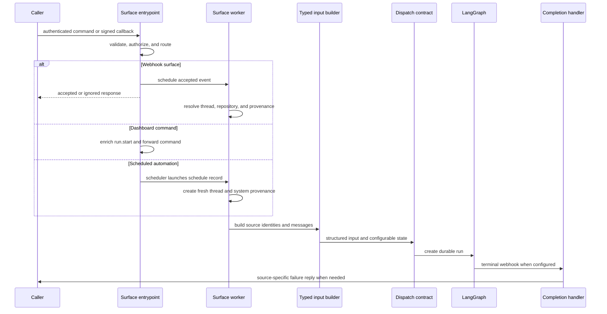

# Invocation from Product and Webhook Surfaces

Open SWE accepts work from an authenticated dashboard, signed integration callbacks, and automation ticks. Each surface owns its admission and context gathering, but durable agent and reviewer runs converge on a shared LangGraph dispatch contract. The resulting thread metadata and typed input retain the source, identities, repository, and reply location needed by the graph and completion handling. See [Threads and state](../concepts/threads-and-state.md), [Dashboard UI](../integrations/dashboard-ui.md), and [Follow-up messages](follow-up-messages.md).

## Shared contract and trigger preparation

This sequence distinguishes inexpensive synchronous admission from the preparation that occurs in webhook background tasks, while showing the common durable-run boundary.

`create_app` installs dashboard, plan, workflow-approval, Linear, Slack, health/completion, GitHub, and sandbox-tool routers. Startup rejects credentialed wildcard dashboard CORS, validates login, sandbox, and local model configuration, and migrates the database; a workspace-import failure leaves repository routing fail-closed, so GitHub returns a retryable `503` instead of silently dropping owned work.

## Admission before side effects

GitHub, Linear, and Slack read and verify the raw request body before JSON parsing; an invalid signature is `401`. Event logging occurs after verification. A malformed but authenticated payload is reported as an error or ignored response rather than being dispatched.

GitHub first rejects deliveries for a repository that no workspace owns. If ownership lookup itself fails it returns `503` to request redelivery. It then multiplexes supported pull-request, push, CI, issue, and comment/review event types: PR watch and auto-review actions have their own gates, ordinary issue/comment work requires an Open SWE mention, and a reply to a review finding is handed to the reviewer path. A comment author must be a registered Open SWE user; an untagged comment can proceed only when it belongs to an agent-opened PR that the worker can identify.

Linear accepts only non-bot `Comment` `create` events that mention Open SWE. It resolves the target repository from explicit comment text, then the author's dashboard default, then the workspace default, and rejects an absent or disallowed choice. The accepted route adds a background task, preserving a short webhook response.

Slack performs more surface-specific filtering:

- It blocks unverified or externally shared channels. An app mention in an external shared channel may claim the event once to post a refusal, but never starts a run.
- It drops its own bot messages and validates that a message update preserves author, timestamp, thread identity, and a user-visible text change. Code channels map every interaction to their shared session thread; DMs and permitted direct/threaded interactions are admitted under their corresponding rules.
- Slack claims the event before scheduling normal message handling. A duplicate delivery therefore cannot create a second Slack run. Message updates are queued to the resolved existing thread rather than treated as a new independent conversation.

## Surface preparation and thread reuse

### Slack

The route resolves the Slack location before background processing. The resolver uses a stored explicit mapping first, then matching thread metadata, then the deterministic `slack_thread_id`; conflicting mapping state raises `SlackThreadMappingError` rather than guessing. The worker loads profile, channel, thread history, mappings, and optional images; it records Slack source context and repository/workspace configuration on the agent thread.

A normal user request needs a mapped GitHub login with a valid access token unless the deployment is bot-token-only. Otherwise the worker replies with account-link or re-login guidance and does not dispatch. The worker constructs channel and person introductions plus serialized conversation content. Explicitly tagged requests use `multitask_strategy="interrupt"`; ordinary follow-ups use `"enqueue"`, preserving the active run rather than replacing it.

### Linear

`process_linear_issue` derives a stable thread from the Linear issue id and persists Linear issue source context, repository, workspace, and the mapped GitHub identity when available. It makes a system input for the issue description and human inputs for included comments, with author introductions. Images are downloaded into multimodal blocks; when the selected model lacks image support it selects the configured vision fallback. The assembled `RunInput` is dispatched on the issue thread.

### GitHub and reviewer runs

For coding PR comments, the worker prefers an explicitly supplied agent thread or a UUID embedded in the Open SWE branch. Otherwise it derives the deterministic PR-comment thread and creates/stamps it with branch metadata if needed. It links the thread to the pull request, resolves the commenter's mapped email and token, retries once after a GitHub `401`, reacts with eyes, retrieves the relevant comments, turns them into per-author typed messages, and triggers or queues the agent work.

Automatic review and review requests use `reviewer_thread_id(owner, repo, pr_number)` and `assistant_id="reviewer"`, rather than the coding-agent thread. This isolates reviewer state and makes review checks and watch metadata belong to the reviewer graph.

### Dashboard and desktop

The dashboard thread-command proxy accepts JSON commands under an authenticated principal. A missing thread is lazily created only by `run.start`; any other command to a missing thread is `404`. On an existing busy thread, a human `run.start` either queues a follow-up when its supplied strategy is `enqueue` or steers the running conversation; machine principals receive a conflict instead.

Before forwarding `run.start` to LangGraph, the proxy verifies the user's GitHub token, resolves the requested model, effort, repository, workspace, visibility, and optional sandbox bridge, and rebuilds user content as attributed typed input. It records participants, invocation identifiers and start time, injected-context hashes, and thread activity metadata. Image input is validated against the resolved model; a continuing thread may receive a vision fallback. Desktop runs are a downstream execution mode: `source="desktop"` alone is insufficient—the configured local project path must resolve to an allowlisted project or a worktree beneath `OPEN_SWE_LOCAL_WORKTREES_DIR`.

### Schedules

A scheduled automation record creates a LangGraph cron targeting the `scheduler` assistant. On a tick, the scheduler calls `launch_scheduled_agent_run`; the launcher verifies the schedule trigger and creates a new UUID thread for every execution. It checks repository access at launch, optionally posts and binds a Slack root message before starting, persists automation metadata, and uses a `system:schedule:<id>` typed input. Failure to establish the requested Slack root message stops the launch rather than losing notification provenance. GitHub-issue automations use a delivery-and-schedule lock thread to suppress duplicate launches.

## Typed input, identity, and durable creation

Thread-ID formulas are persistence contracts, not incidental helpers: webhooks, dashboard components, and reviewer code must derive the same value from the same external identifiers to find existing state. Changing namespaces or stable key strings can orphan live threads.

The input boundary serializes authored text in XML-escaped `<input-message>` envelopes. `human_input` and `system_input` enforce the matching context kind. Channel, system, and person introductions are `<dynamic-context>` messages with a canonical SHA-256 hash; already-visible hashes are filtered so static identity context is not repeatedly injected. Entity identifiers must be non-empty namespaced values without whitespace or XML-sensitive characters.

`dispatch_agent_run` rejects an ambiguous call that supplies prebuilt `input` together with raw content or source identities. Otherwise it either builds the supplied typed context or derives a source-aware sender from configuration, then calls `create_durable_run`. That creation path ensures a titled thread when requested, adds a shared invocation identifier and timestamp to configurable state and metadata, and calls LangGraph with interrupt-by-default multitasking, synchronous durability, resumable streaming, the v3 stream-mode set, and subgraph streaming. Callers can opt into `enqueue` where follow-up ordering requires it.

## Completion and operational constraints

A completion webhook is attached only when `RUN_COMPLETE_WEBHOOK_SECRET` is set and `COMPLETION_WEBHOOK_URL` is absolute and non-loopback; otherwise run creation proceeds without it. The receiver fails closed on the token. For successful eligible Slack runs, completion can schedule a deduplicated session-cost refresh. For `error` and `timeout`, it best-effort settles reviewer and code-channel state and posts a source-appropriate Slack, Linear, or GitHub failure reply. Reply deduplication is per run when a run id exists, with a legacy thread-level fallback; `interrupted` is intentionally silent because it is the expected result of an interrupting follow-up.

## Safe changes and focused verification

- Keep signature validation on raw bytes before parsing, and keep secrets fail-closed. Exercise Slack replay/deduplication, shared-channel refusal, and directed-message filters whenever admission changes.
- Treat `agent/thread_ids.py`, source context, and stored thread metadata as compatibility surfaces. Test mapping conflicts rather than adding a heuristic that guesses a thread.
- Route new autonomous triggers through `dispatch_agent_run` or `create_durable_run`, and verify checkpoint durability, invocation correlation, streaming configuration, and completion-webhook fallback.
- For dashboard changes, test lazy creation, principal authorization, busy-thread queue/steer behavior, input attribution, model/image validation, and machine-principal conflicts.
- For scheduling changes, test repository reauthorization, fresh-thread creation, Slack-root failure, and duplicate GitHub delivery claims.
