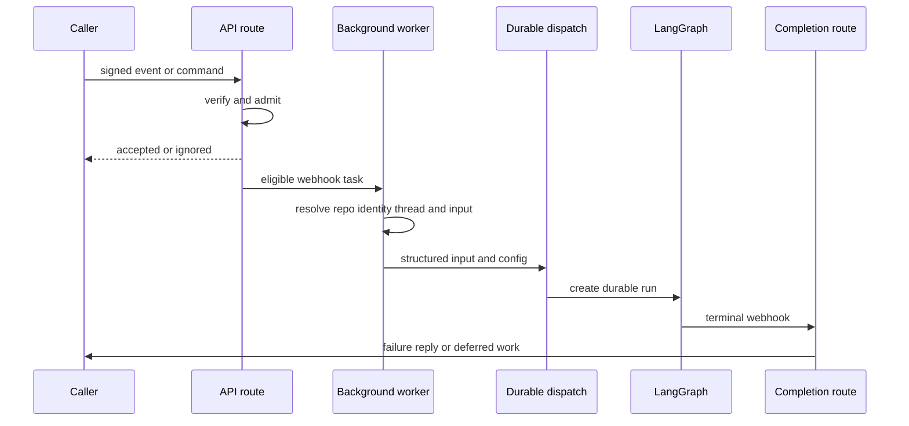
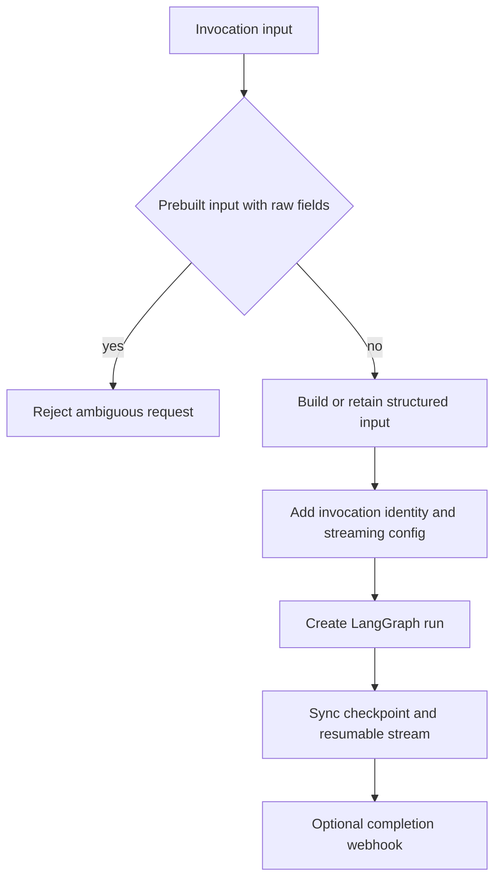

# Inbound Invocation and Durable Dispatch

Open SWE converges external work on a LangGraph thread and durable run, but does not treat every inbound payload as a prompt. Webhook routes authenticate and filter cheaply, background workers resolve repository and identity context, and dispatch serializes the resulting turn into a durable, replayable run. Thread metadata remains the bridge from a terminal run back to its originating surface. See [Auth and security](../concepts/auth-and-security.md), [Threads and state](../concepts/threads-and-state.md), and [Follow-up messages](follow-up-messages.md).

## Boundary and shared flow

This is the common path for integration work; the dashboard router is also composed into the API application, alongside plan and workflow approval endpoints. Startup pins work to one event loop, validates the GitHub-login allowlist, sandbox and local-model configuration, requires and migrates the database, and imports legacy workspace and user records. A failed workspace import leaves repository routing fail-closed, deliberately returning GitHub `503` so GitHub retries rather than dropping work. Dashboard CORS never permits `*` while credentialed requests are enabled.

## Webhook admission

GitHub, Linear, and Slack verify a signature over the **raw request body** before decoding JSON, returning `401` on failure. Slack passes its request timestamp to its verifier as part of that check. Admission then returns an accepted, ignored, or error response; expensive remote calls and dispatch are scheduled as FastAPI background work only after an eligible event has been identified.

GitHub first confirms that a repository belongs to a workspace. An unreadable ownership lookup returns `503`; an unowned repository is ignored. It multiplexes PR, push, issue, issue-comment, review-comment, review, and CI deliveries. The route filters unsupported actions, enforces allowlisting for ordinary issue/comment and CI work, and requires an Open SWE mention for ordinary issue/comment requests. PR review-finding replies bypass that mention check to reach the review workflow, while automatic review is separately gated by repository configuration and the public-repository organization gate.

Linear admits only non-bot `Comment` `create` deliveries that mention Open SWE. It selects a repository from explicit text in the comment, then the commenting user's dashboard default, then the workspace default, and rejects an absent or non-allowlisted choice. Its worker derives a stable issue thread id, resolves the triggering user's email (with creator and assignee fallbacks), writes Linear source context to thread metadata, serializes the issue and selected comments as system/human messages, and dispatches the result. Image-bearing issue content can select the configured vision fallback when the resolved model lacks image support.

Slack resolves channel eligibility before normal message admission. It blocks externally shared or unverified channels; a normal app mention in an external shared channel receives a one-time refusal only after the event claim succeeds. Slack claims accepted event ids before scheduling work, making that claim the deduplication gate. It drops its own and unapproved bot messages, verifies a message edit still belongs to the same delivered message and changes visible text, and accepts ordinary non-code-channel messages only when mentioned or sent in a DM. A code channel instead uses one session thread for the channel and treats all its turns as addressed to Open SWE.

## Thread selection and input construction

Thread IDs are persisted routing contracts. Slack locations, Linear issues, GitHub issues and PRs, and reviewer work must derive the same namespace and stable key across API processes. Changing one of these formulas can orphan live state. For PR comments, a UUID embedded in an Open SWE branch takes precedence; otherwise the canonical owner/repository/PR thread id is used. Reviewer work uses a separate `reviewer_thread_id` and `assistant_id="reviewer"`, isolating review graph state from coding-agent work.

Slack resolves a conversation thread by preferring a stored location mapping, then matching thread metadata, and finally the deterministic Slack id. Multiple metadata matches are an error: the route reports that it will not guess. The worker builds source, repository, user, Slack-thread and channel context in configurable state and produces rich typed messages from history and the current turn. An explicit tag interrupts current work; an untagged admitted follow-up uses `enqueue`. Message edits are processed through the same thread path rather than as a new standalone conversation.

Inputs at the graph boundary are structured `RunInput`, not unlabelled prompt strings. `human_input` and `system_input` enforce their corresponding kind and wrap authored text in XML-escaped `<input-message>` envelopes. Entity introductions are hashed `<dynamic-context>` blocks, allowing already-visible context to be omitted safely; Slack topic and purpose are explicitly tagged `trust="untrusted"`.

## Durable run contract

`dispatch_agent_run` is the normal agent/reviewer entry contract. It rejects an ambiguous combination of a prebuilt input and raw content or identities. Otherwise it builds structured input when necessary, records feedback activity for interactive agent sources, and calls `create_durable_run`.

This flow shows the invariants enforced at the reusable dispatch boundary.

`create_durable_run` defaults to `multitask_strategy="interrupt"`, synchronous durability, and resumable streaming. It applies the v3-compatible streaming marker, stream modes (`values`, `updates`, `messages`, `custom`, `tasks`, and `checkpoints`), and subgraph streaming. It resolves or creates one invocation UUID and stores it under both `invocation_id` and legacy `prepare_run_id` in configurable state and metadata; conflicting values are invalid. This correlation is used by terminal usage accounting and lets external runs be replayed by the dashboard.

Desktop execution is a downstream capability check, not merely a `source` label: `source="desktop"` requires a real local project directory that is either listed by `OPEN_SWE_LOCAL_PROJECTS_FILE` or is a child of `OPEN_SWE_LOCAL_WORKTREES_DIR` after realpath resolution.

## Schedules and terminal handling

Agent schedules are LangGraph crons targeting the `scheduler` assistant. On a tick, the scheduler invokes the schedule launcher. A launched scheduled-agent run creates a fresh UUID thread, writes automation metadata, sends a system-authored automation input, and uses the same durable-run primitive. Schedule creation verifies the creator's GitHub token and repository access; a schedule run is therefore isolated from prior run state even when its stored definition is reused.

A completion webhook is attached only when `RUN_COMPLETE_WEBHOOK_SECRET` is configured and `COMPLETION_WEBHOOK_URL` is absolute and not loopback. Otherwise dispatch omits it so an invalid local URL cannot poison every run creation. The `/webhooks/run-complete` route rejects missing or incorrect tokens before processing JSON.

For every terminal status, completion attempts to finalize invocation usage telemetry when a valid correlated invocation id is present. On success it settles Slack/code-channel status, schedules answer feedback except for automated wakeups, and may enqueue a deduplicated Slack session-cost refresh. On `error` or `timeout` it performs best-effort reviewer-check and Slack-session cleanup, then posts an idempotent source-specific failure reply to Slack, Linear, or GitHub. `interrupted` is intentionally not a failure reply: it is the expected outcome when a replacement turn uses the interrupt strategy.

## Operating and changing this flow

- Keep verification before JSON parsing and preserve fail-closed secrets. Test invalid signatures, external Slack channels, duplicate deliveries, bot filtering, and GitHub's retry-on-`503` ownership failure behavior.
- Treat `agent/thread_ids.py` and invocation-id aliases as persisted compatibility contracts. Add a migration rather than changing a stable key or dropping `prepare_run_id` reads.
- Route new agent or reviewer origins through `dispatch_agent_run` or `create_durable_run`; preserve sync durability, v3 stream settings, correlation metadata, and the optional-webhook fallback.
- Test `tests/agent/test_dispatch.py` for durable defaults and webhook validation, `tests/agent/test_agent_schedules.py` for scheduled dispatch, and completion paths for per-run idempotence and silence on interrupted runs.
