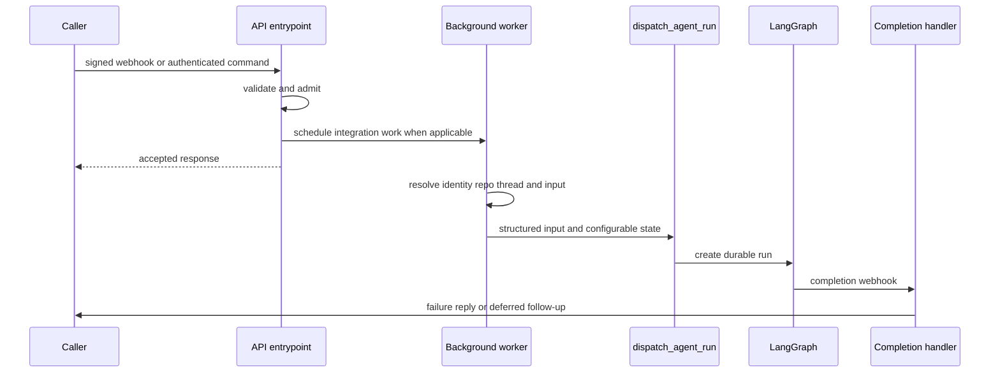

# Inbound Invocation to Durable Run

Open SWE accepts work from signed integration callbacks, an authenticated dashboard (including its desktop client path), and scheduler ticks. These sources deliberately converge at the same LangGraph thread/run boundary, but retain source context and structured sender identities so the graph can act with the right repository, user credential, response surface, and history. See [Auth and security](../concepts/auth-and-security.md) for access policy, [Threads and state](../concepts/threads-and-state.md) for persistence, and [Follow-up messages](follow-up-messages.md) for mid-run behavior.

## Common lifecycle

This shows the shared path: integration routes acknowledge after inexpensive admission checks, while dashboard commands proxy directly after enrichment.

`create_app` composes the dashboard, plan and workflow-approval routes with Linear, Slack, health/completion, and GitHub routers. It rejects a wildcard dashboard CORS origin when credentials are enabled, and its lifespan validates sandbox and local-development model configuration before serving. This makes route composition and startup validation part of the invocation boundary rather than responsibility of each webhook. 

## Admission and asynchronous webhook work

GitHub, Linear, and Slack read the raw body and verify their respective HMAC signature before parsing JSON; invalid or missing signatures receive `401`. The verifiers fail closed when the signing secret is absent, and Slack additionally rejects timestamps older than five minutes. Routes return ignored/error/accepted JSON rather than creating a run for malformed or ineligible events.

For accepted GitHub and Linear events, and the normal Slack message path, a FastAPI `BackgroundTasks` job does remote API access, metadata construction, and dispatch after the HTTP response. Slack claims an event id before scheduling to make delivery deduplication the gate to a run. It also rejects bots and self messages, validates message-update identity and content change, and only handles an ordinary non-code-channel message if it is a mention, DM, ready-plan reply, or permitted untagged two-party reply.

Slack first obtains channel context. Operations are permitted only in DMs or channels confirmed not externally shared; an app mention in an external shared channel gets one deduplicated refusal reply and no run. A code channel is different: every interaction shares the channel's session thread and is treated as directed at Open SWE. Signed slash commands, code-channel actions, and supported Block Kit actions turn into explicit code-channel turns; plan/workflow approval actions instead update their approval state or enqueue the prescribed follow-up.

## Surface-specific construction

### Slack

The route resolves the Slack location before it schedules work. `resolve_slack_thread_id` prefers an explicit stored location mapping, then matching thread metadata, then the deterministic Slack-derived id. Conflicting metadata matches raise `SlackThreadMappingError`; the route tells the user it will not guess. A Slack worker fetches profile, thread history, channel context, mappings, and optional images, then records `SourceContext.slack_thread`, repository, user, title, environment, and plan mode in thread metadata/configurable state. A first message can select an environment with `env:<name>`; later turns retain the stored environment because the sandbox has already been chosen.

Slack runs require a valid GitHub credential for the mapped triggering user unless the deployment is in bot-token-only mode, because coding work opens pull requests as that user. An unlinked or revoked credential produces an account-link/re-login prompt instead of dispatching. The worker serializes channel, people/bots, historical messages, operational context, and the current request into typed input. Explicit requests interrupt an active run; ordinary Slack follow-ups use `enqueue`. Message edits are queued rather than independently dispatched, so an edit corrects the existing conversation.

### Linear

Linear accepts only a non-bot `Comment` `create` containing an Open SWE mention. Repository selection is intentionally deterministic in priority order: an explicit repository in the comment, the author's dashboard default, team/project mapping, then team default; the result must satisfy the repository allowlist. The background worker reacts 👀, uses the issue id as the thread key, fetches issue details, and selects the author email (falling back to creator then assignee) to map GitHub identity.

It upserts thread metadata with the Linear issue source context and builds a system issue description plus per-author human comment messages. Image URLs can cause a vision-model fallback when the selected model cannot accept images. The worker dispatches and posts a trace comment linking the resulting Open SWE thread.

### GitHub and reviewer runs

The GitHub route accepts a broader event family: issue/comment work directed at Open SWE, PR state events, auto-review triggers, pushes, and CI. It filters unsupported actions, enforces the repo allowlist where applicable, applies the public-repository organization gate, and requires an Open SWE mention for normal issue/comment work. PR open/ready events can start automatic review when that repository enables it; pushes evaluate watched PRs; replies to a review finding route to the reviewer path.

A coding PR-comment run recovers an Open SWE-created branch's embedded UUID; otherwise it derives the PR-comment thread id from owner, repository, and PR number. It resolves the author's mapped email/token, retries once after a GitHub authentication failure, reacts 👀, fetches comments since the last tag, introduces each author, and dispatches the accumulated human input. Issue runs use their own deterministic issue id. Reviewer work always uses the separate `reviewer_thread_id` namespace and `assistant_id="reviewer"`, keeping review state and the coding-agent graph isolated.

## Dashboard, desktop, and automation sources

The dashboard proxies `run.start` commands to LangGraph after validating JSON, access, and thread state. A missing thread is allowed only for `run.start`, which lazily creates and stamps it as an interactive dashboard thread. It attributes the command to the authenticated GitHub user, resolves model/effort from team, profile, and request overrides, normalizes repository configuration, records participants and metadata, and replaces caller-provided raw messages with typed web input. Image input has strict type, count, size, and model-capability checks. The desktop client uses this dashboard invocation path with `source="desktop"`; downstream desktop execution permits only an allowlisted local project or a worktree under its configured worktree root.

A dashboard follow-up to an active thread is persisted in the message queue, not immediately started as another dashboard run. Stop cancels every pending/running run on the thread rather than trusting cached latest-run metadata; if messages were queued, it starts a new empty-input durable run to drain them. Interactive posting is denied on admin or automation threads to non-admins, while surfaced-source threads are readable to authenticated organization members.

Schedules are workspace records backed by LangGraph crons targeting the `scheduler` assistant. The scheduler graph fans a schedule tick into `launch_scheduled_agent_run`. Each scheduled agent execution gets a **fresh UUID thread**, schedule/automation metadata, and the creator's repository access is rechecked at launch. A schedule may establish a Slack root message/thread for status replies; failure to create that message prevents the run, rather than losing the intended notification context.

## Thread identity and structured input

Thread-id formulas are persisted routing contracts: Slack locations, Linear issues, GitHub issues/PRs, and reviewers must re-derive exactly the same identifier to find live state. Altering a namespace or its stable input string effectively orphans existing threads. `thread_id_from_branch` only extracts a UUID; if it finds none, GitHub PR comments use the canonical PR key instead.

Inputs are not arbitrary prompt strings at the graph boundary. `human_input` and `system_input` enforce role/kind alignment and serialize content into XML-escaped `<input-message>` envelopes. Identity/context introductions are `<dynamic-context>` blocks hashed with SHA-256, permitting previously injected identities to be omitted on later turns; potentially untrusted channel topic and purpose fields are explicitly marked `trust="untrusted"`. Callers normally construct these rich inputs themselves, while `dispatch_agent_run` can synthesize an identity from parsed configurable state for simpler callers.

## Durable dispatch and completion

`dispatch_agent_run` is the single agent/reviewer dispatch contract. It refuses ambiguous calls that combine prebuilt input with raw content/identity arguments, selects the graph with `assistant_id`, and delegates to `create_durable_run`. The latter defaults to `multitask_strategy="interrupt"`, `durability="sync"`, and `stream_resumable=True`; callers such as untagged Slack follow-ups can explicitly select `enqueue`. Sync durability checkpoints each step, so an interruption or process recycle can resume from a checkpoint rather than losing the run.

Every created run is marked for Protocol v2 streaming, includes the v2 stream modes and subgraphs, and receives a `prepare_run_id` in both configurable state and metadata. This preserves tools/lifecycle and nested-agent visibility for runs that the dashboard did not start, and lets a later client replay the stream.

When both `RUN_COMPLETE_WEBHOOK_SECRET` and an absolute non-loopback `COMPLETION_WEBHOOK_URL` are configured, dispatch attaches `/webhooks/run-complete?token=…`; otherwise it deliberately omits the webhook so an invalid local URL cannot make all run creation fail. The receiving route is fail-closed on that token. On `success`, completion can schedule a deduplicated Slack session-cost refresh. On `error` or `timeout`, it loads thread metadata, settles an unfinished reviewer check where relevant, restores a code-channel session only if no later run is live, and best-effort posts a source-appropriate failure reply to Slack, Linear, or GitHub. Failure replies are idempotent per run id (with a legacy thread-level fallback when an old payload has no run id); `interrupted` is intentionally not treated as a user-visible failure because it is the normal replacement behavior for an interrupting follow-up.

## Safe changes and focused verification

- Preserve raw-body verification before parsing and keep secrets fail-closed. Exercise Slack replay age, deduplication, external-channel refusal, and non-directed-message filters when changing admission.
- Treat `agent/thread_ids.py` formulas and stored source context as compatibility surfaces. Test mapping conflicts rather than adding a heuristic that guesses a Slack thread.
- Keep all new invocation paths on `dispatch_agent_run` or `create_durable_run`; test their durability, protocol-v2 marker, resumability, metadata correlation, and completion-webhook fallback in `tests/agent/test_dispatch.py`.
- Test completion statuses, source-specific replies, per-run dedupe, cost refresh, reviewer-check cleanup, and intentional silence for interrupted/wakeup runs in `tests/webhooks/test_completion_webhook.py`.
- For dashboard changes, test lazy thread creation, attribution/config construction, content/image validation, and thread-wide cancellation/queue draining in `tests/dashboard/test_dashboard_thread_api.py`.
