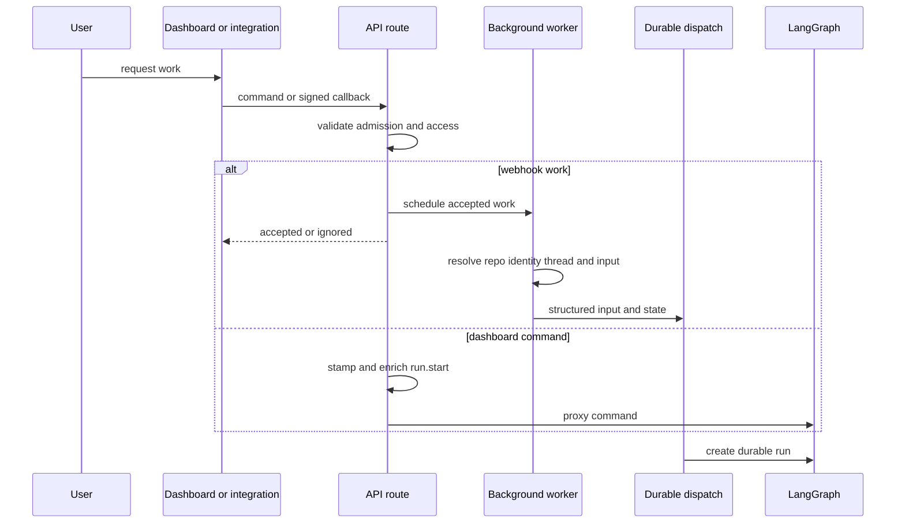
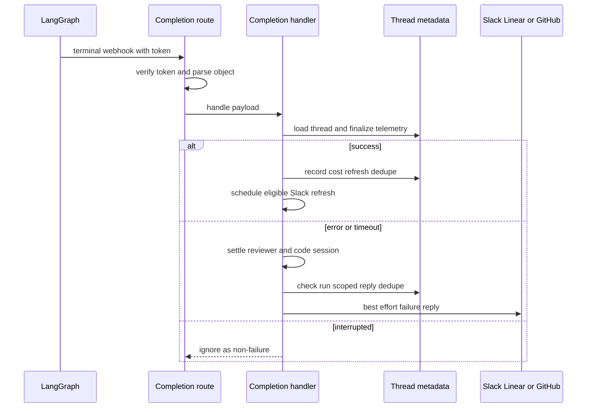

# Invoking Work Across Product Surfaces

Open SWE turns authenticated dashboard commands, signed integration callbacks, desktop requests, and cron ticks into durable LangGraph work. The surfaces have different admission and reply rules, but converge on a thread, structured input, configurable state, and a durable run. Source metadata preserves the repository, identity, and response location that later completion handling needs. See [Auth and security](../concepts/auth-and-security.md), [Threads and state](../concepts/threads-and-state.md), and [Follow-up messages](follow-up-messages.md).

## Cross-surface invocation

This sequence distinguishes fast webhook acknowledgement from the dashboard command proxy; both establish an attributed, persistent LangGraph run.

`create_app` mounts dashboard, plan, workflow-approval, Linear, Slack, health/completion, and GitHub routes. Startup pins the event loop and validates the GitHub-login allowlist, sandbox configuration, and local-development model configuration. Dashboard CORS refuses `*` because credentialed requests are enabled.

### Webhook admission

GitHub, Linear, and Slack read the raw body and verify platform signatures before parsing JSON; invalid signatures receive `401`. Slack verification also incorporates its request timestamp. Accepted GitHub and Linear events, and normal Slack requests, defer remote calls and dispatch to `BackgroundTasks`.

Slack claims an event before it schedules the normal worker, so duplicate deliveries cannot create another run. It rejects bot/self messages and admits ordinary non-code-channel messages only when directed by mention, DM, ready-plan reply, or a qualifying untagged two-party reply. It refuses external or unverified channels; an app mention in an external shared channel receives a one-time refusal rather than a dispatch. A code channel is one shared session: its messages are treated as agent-directed and route to its session thread.

## Surface-specific routing and authorization

### Slack

Slack resolves a location by stored explicit mapping, then matching thread metadata, then a deterministic Slack id. Conflicting candidates raise `SlackThreadMappingError`, which is surfaced rather than guessed. The worker gathers channel/thread context and records Slack source context, repository, triggering identity, selected environment, and plan settings before forming typed messages.

A Slack coding request requires a mapped user with a valid GitHub access token. If no valid token is available, it posts an account-link or re-login prompt and does not dispatch. A selected `env:<name>` applies to the opening request; later messages recover the thread environment. Explicit requests use `multitask_strategy="interrupt"`; ordinary follow-ups use `enqueue`. Message edits are only queued, so they amend the next turn rather than becoming standalone runs.

### Linear

Linear accepts only a non-bot `Comment` `create` that mentions Open SWE. It selects a repository from an explicit comment reference, then the author's dashboard default, then the team default, and rejects a repository outside the allowlist. The worker derives the thread from the Linear issue id, uses the comment author email (then creator, then assignee) for GitHub identity, persists Linear source context, and sends a system issue description plus typed human comments. Images can trigger a vision-model fallback.

### GitHub and review

GitHub routes multiplex issues, issue/PR comments, reviews, review-finding replies, PR lifecycle events, pushes, and CI. They reject unsupported actions, apply repository and public-organization gates, and require an Open SWE mention for ordinary issue/comment work. Enabled repositories can start auto-review for eligible PR events; pushes evaluate watched PRs; a reply to a review finding is handled by the reviewer path.

For PR comments, Open SWE reuses an embedded branch UUID when available; otherwise it derives the deterministic PR-comment id. It authorizes the GitHub thread, obtains the user token with a one-time retry after `401`, reacts with eyes, collects comments since the last tag, and serializes author-attributed input. Reviewer work uses `reviewer_thread_id` and `assistant_id="reviewer"`, keeping reviewer state and graph execution separate from coding work.

### Dashboard and desktop

The dashboard proxies JSON commands only after access checks. A missing thread is permitted only for `run.start`; that command creates and stamps the dashboard thread, verifies the authenticated user's GitHub token, resolves repository/model/environment settings, and replaces raw client content with structured web input attributed to that user. It rejects a `run.start` on a busy thread and validates images against model capability.

An active-thread dashboard follow-up is persisted in the queue. Stop enumerates both pending and running runs and interrupts all of them rather than trusting `latest_run_id`; queued messages cause an empty-input durable run to drain the queue. The desktop client identifies runs with `source="desktop"`; local shell execution then requires a real path that is allowlisted or lies beneath `OPEN_SWE_LOCAL_WORKTREES_DIR`.

### Schedules

Schedules are workspace records backed by LangGraph crons targeting the `scheduler` assistant. A tick calls `launch_scheduled_agent_run`, rechecks workspace repository access, makes a fresh UUID thread, stamps automation metadata, and creates typed system input. For `always` Slack notification mode, failure to create the root Slack message aborts the run so its reply context is not lost. See [Scheduling and baby-sit](scheduling-and-baby-sit.md).

## Thread identity, input, and durable dispatch

Thread-id formulas are persisted cross-process routing contracts. Slack locations, Linear issues, GitHub issues/PRs, and reviewer work must reproduce the exact namespaces and stable inputs; changing one can orphan live state. Branch extraction is only a UUID recovery mechanism, with PR-comment derivation as fallback.

`human_input` and `system_input` enforce their corresponding kind, serialize authored text in XML-escaped `<input-message>` envelopes, and carry structured data. Identity/context introductions are SHA-256-hashed `<dynamic-context>` blocks so already-injected context can be omitted; channel topic and purpose are explicitly marked `trust="untrusted"`.

`dispatch_agent_run` rejects a prebuilt input combined with raw content or identity arguments, builds input when necessary, and passes every agent or reviewer trigger to `create_durable_run`. Durable creation defaults to interrupt multitasking, synchronous checkpoint durability, resumable streaming, v3 stream modes/subgraphs, and an invocation id shared by configurable state and metadata. Callers may explicitly opt into `enqueue`.

## Completion path

This sequence shows why completion uses persisted thread metadata: it restores the originating surface even though the terminal event comes from LangGraph.

Dispatch attaches the completion webhook only if `RUN_COMPLETE_WEBHOOK_SECRET` exists and `COMPLETION_WEBHOOK_URL` is absolute and non-loopback. The route rejects an invalid token, malformed JSON, and non-object payloads. On terminal payloads it finalizes invocation usage telemetry. Success can schedule answer feedback and a deduplicated Slack session-cost refresh. `error` and `timeout` best-effort settle reviewer checks and code-channel state, then post a deduplicated source-specific failure reply; automated wakeups and `interrupted` runs do not receive failure replies.

## Safe changes and focused tests

- Preserve raw-body verification, platform gates, and Slack event claims before adding webhook event types.
- Treat `agent/thread_ids.py` and source metadata as compatibility interfaces; never resolve a mapping conflict by guessing.
- Route new agent/reviewer triggers through `dispatch_agent_run` or `create_durable_run`, preserving durable defaults, streaming configuration, and invocation correlation. Exercise `agent/test_dispatch.py`.
- Test completion token rejection, terminal status behavior, run-scoped idempotence, reviewer/code-channel cleanup, and source replies in `webhooks/test_completion_webhook.py`.
- Test dashboard lazy creation, structured enrichment, queueing, and thread-wide cancellation in `test_dashboard_thread_api.py`.
