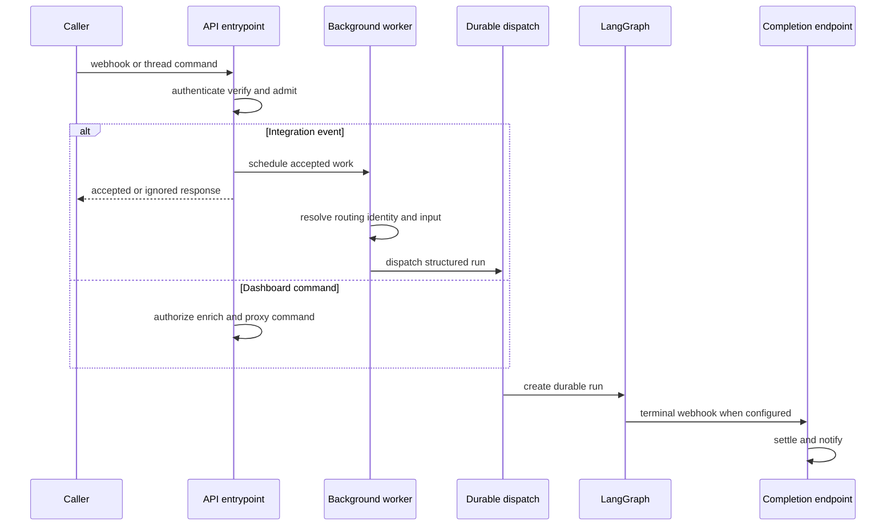
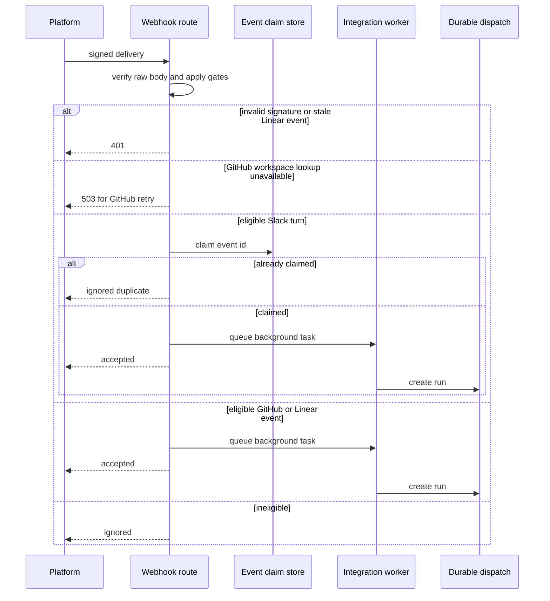
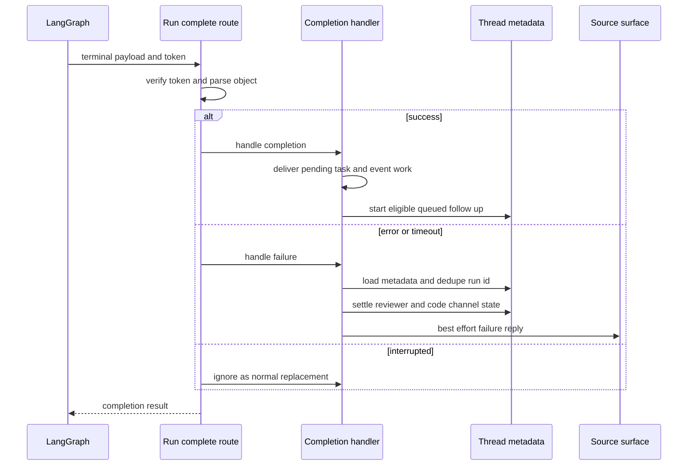

# Inbound Invocation and Durable Dispatch

Open SWE accepts interactive work through the authenticated thread-command API and integration work through signed Slack, GitHub, and Linear callbacks. These paths converge at a durable LangGraph run, but preserve the initiating surface, source context, user attribution, repository, workspace, and typed input. See [Threads and state](../concepts/threads-and-state.md), [Dashboard UI](../integrations/dashboard-ui.md), and [Follow-up messages](follow-up-messages.md) for the persistence and follow-up behavior behind this boundary.

## Shared lifecycle

```mermaid
sequenceDiagram
    participant Caller
    participant Entry as API entrypoint
    participant Worker as Background worker
    participant Dispatch as Durable dispatch
    participant Graph as LangGraph
    participant Completion as Completion endpoint

    Caller->>Entry: webhook or thread command
    Entry->>Entry: authenticate verify and admit
    alt Integration event
        Entry->>Worker: schedule accepted work
        Entry-->>Caller: accepted or ignored response
        Worker->>Worker: resolve routing identity and input
        Worker->>Dispatch: dispatch structured run
    else Dashboard command
        Entry->>Entry: authorize enrich and proxy command
    end
    Dispatch->>Graph: create durable run
    Graph->>Completion: terminal webhook when configured
    Completion->>Completion: settle and notify
```

This diagram distinguishes acknowledgement from execution: accepted integration work is normally a FastAPI background task, whereas dashboard commands are proxied after authorization and enrichment.

`create_app` installs the dashboard, plan, workflow-approval, Linear, Slack, health/completion, GitHub, sandbox-tool, and sandbox OpenAI routers. Startup validates login allowlisting, sandbox and local-development LLM configuration, configures/migrates the database, and attempts migrations/listeners whose failures are explicitly logged; dashboard CORS refuses a wildcard when credentials are enabled and allows the `open-swe://app` desktop origin.

## Admission, acknowledgement, and retry semantics

All three webhook routes read the raw body before JSON parsing and verify the platform signature. An invalid GitHub, Linear, or Slack signature produces `401`. Linear additionally rejects signed deliveries whose timestamp is over one minute from local time. GitHub records the delivery before dispatch and returns `503` when workspace ownership cannot be read: that is intentional, because GitHub retries 5xx delivery failures. Unsupported, malformed, or unauthorized events instead receive an `ignored` or error response and do not create a run.

Slack returns an accepted response only after inexpensive routing checks and schedules downstream work. It claims Slack event identifiers before starting a normal or code-channel turn, so duplicate delivery cannot create another run; a retry whose event was already seen is ignored. In an external shared or unverified channel it blocks operations; a qualifying app mention in an external channel gets a claimed, one-time refusal reply. It ignores self/bot messages except explicitly allowed bots that address Open SWE, validates that message edits retain identity and actually change visible text, and treats a code channel as one shared session where every message is directed at the agent.

```mermaid
sequenceDiagram
    participant Platform
    participant API as Webhook route
    participant Store as Event claim store
    participant Worker as Integration worker
    participant Dispatch as Durable dispatch

    Platform->>API: signed delivery
    API->>API: verify raw body and apply gates
    alt invalid signature or stale Linear event
        API-->>Platform: 401
    else GitHub workspace lookup unavailable
        API-->>Platform: 503 for GitHub retry
    else eligible Slack turn
        API->>Store: claim event id
        alt already claimed
            API-->>Platform: ignored duplicate
        else claimed
            API->>Worker: queue background task
            API-->>Platform: accepted
            Worker->>Dispatch: create run
        end
    else eligible GitHub or Linear event
        API->>Worker: queue background task
        API-->>Platform: accepted
        Worker->>Dispatch: create run
    else ineligible
        API-->>Platform: ignored
    end
```

This shows the source-specific retry boundary: GitHub gets a retriable `503` for uncertain workspace routing; Slack duplicates are claimed/ignored; Linear stale callbacks are rejected.

## Integration routing and normalization

### Slack

Slack derives a conversation location by first looking for an explicit stored mapping, then matching source metadata, then using the deterministic Slack thread id. A conflicting explicit mapping is an error rather than a guess. A normal non-code-channel message must be a mention, DM, ready-plan reply, or a permitted solo-thread follow-up to be admitted. The worker obtains profile/history/channel/repository context and builds source metadata and structured messages; it requires a mapped GitHub user token unless bot-token-only operation is enabled, responding with an account-link or reauthentication prompt instead of dispatching otherwise.

Explicitly directed Slack work uses `multitask_strategy="interrupt"`; untagged follow-ups use `enqueue`. Message edits are attached to the existing Slack conversation rather than becoming an independent conversation. Channel topic and purpose are carried as channel identity data but are untrusted input, not trusted instructions.

### Linear

Linear only dispatches a non-bot `Comment` `create` event that mentions Open SWE. Repository selection is deterministic: an explicit repository in the comment, then the commenter’s dashboard default, then the workspace default; the selected repository must be allowed. Issue create/update events are instead offered to automation matching.

The worker deterministically keys the thread from the Linear issue id, selects the triggering commenter’s email before creator and assignee for GitHub identity, records Linear issue source context in metadata, and emits a system issue description plus typed human comment messages. It can switch to the default vision model when included images are incompatible with the configured model. The completed input is passed to durable dispatch.

### GitHub and reviews

GitHub multiplexes pull-request state, push, CI, issue, issue-comment, review, and review-comment events. It filters unsupported actions, applies repository/workspace and public-repository organization gates, requires registered commenters, and requires a mention for ordinary issue/comment handling. A reply to a review finding routes to its reviewer-specific handler; an untagged comment on an Open SWE-created PR may continue that agent thread.

PR comment processing recovers an embedded Open SWE branch UUID when available, otherwise derives a stable PR thread id. Reviewer tasks instead use `reviewer_thread_id` and `assistant_id="reviewer"`, isolating review state and graph execution from coding-agent work. These formulas—and the Slack, Linear, and GitHub issue formulas—are persisted cross-process routing contracts: changing their namespaces or stable inputs strands existing threads.

## Dashboard, desktop, and schedules

`POST /threads/{thread_id}/commands` is the authenticated dashboard/API-key/federated-workflow gateway. It requires JSON, authorizes reads/posts from thread metadata, and only permits lazy creation for `run.start`; every other command against an absent thread is a 404. The gateway enriches starts with caller identity and configuration before forwarding to LangGraph. When a thread is busy, an interactive caller can choose queueing (`enqueue`) or steering; a machine caller gets `409` rather than impersonating a person.

Desktop runs use the same thread/run configuration with `source="desktop"`. Local shell execution is permitted only when `local_project_path` resolves to a directory in `OPEN_SWE_LOCAL_PROJECTS_FILE` or a worktree below `OPEN_SWE_LOCAL_WORKTREES_DIR`; artifact backends are placed outside the project tree.

Schedules are executed by the scheduler graph. A tick resolves `schedule_id` and optional trigger id, rejects missing or mismatched schedules and clears orphan crons, then launches the corresponding schedule record. Scheduler launch retries transient sandbox failures only for a bounded elapsed period; exhaustion returns `sandbox_unavailable` rather than raising a repeatedly retried sandbox error.

## Durable run contract

`dispatch_agent_run` is the common agent/reviewer entry point. It rejects combining a prebuilt `input` with raw content, context, channels, or systems; otherwise it constructs a typed run input and calls `create_durable_run`. Inputs serialize authored text into XML-escaped `<input-message>` envelopes, enforce human/system role alignment, and use canonical identity blocks. Dynamic context is content-hashed with SHA-256 so already-visible identities need not be repeated; summarization-aware visibility prevents a context block hidden behind a summary cutoff from being treated as still visible.

`create_durable_run` optionally creates/titles an owned thread, resolves the associated user for run metadata, and correlates metadata and configurable state with an invocation identifier (`invocation_id`/`prepare_run_id`) and start time. Defaults are `multitask_strategy="interrupt"`, synchronous durability, creation when absent, and resumable streaming. It requests `values`, `updates`, `messages`, `custom`, `tasks`, and `checkpoints` stream modes, subgraphs, and the `__event_streaming_v2` compatibility marker, so the dashboard can join externally initiated runs with nested tool/subagent events.

A completion webhook is attached only if `RUN_COMPLETE_WEBHOOK_SECRET` is set and `COMPLETION_WEBHOOK_URL` is absolute and non-loopback. Otherwise dispatch omits it so a local/invalid URL cannot prevent run creation. The health router fails closed on the token.

## Completion and failure behavior

```mermaid
sequenceDiagram
    participant Graph as LangGraph
    participant Endpoint as Run complete route
    participant Handler as Completion handler
    participant Thread as Thread metadata
    participant Surface as Source surface

    Graph->>Endpoint: terminal payload and token
    Endpoint->>Endpoint: verify token and parse object
    alt success
        Endpoint->>Handler: handle completion
        Handler->>Handler: deliver pending task and event work
        Handler->>Thread: start eligible queued follow up
    else error or timeout
        Endpoint->>Handler: handle failure
        Handler->>Thread: load metadata and dedupe run id
        Handler->>Thread: settle reviewer and code channel state
        Handler->>Surface: best effort failure reply
    else interrupted
        Endpoint->>Handler: ignore as normal replacement
    end
    Endpoint-->>Graph: completion result
```

This callback is deliberately best effort for notification but authoritative for completion-side bookkeeping. Successful runs deliver pending task/event work and may start a follow-up pickup run. Error and timeout runs log failure, settle reviewer checks and code-channel state when relevant, and post a source-appropriate failure reply. Replies are idempotent by run id (with a legacy per-thread fallback if no id is supplied), while repeated event-woken failures are capped. `interrupted` is not a failure reply: it is the expected result of an interrupting follow-up.

## Safe changes and focused verification

- Preserve raw-body signature verification before parsing. Test GitHub’s `503` ownership failure, Linear replay rejection, Slack event claiming/retries, and external-channel refusal when changing admission.
- Treat `openswe/thread_ids.py` formulas and source context as compatibility surfaces; favor an explicit mapping conflict over a heuristic Slack guess.
- Route new agent/reviewer triggers through `dispatch_agent_run` or `create_durable_run`. `tests/agent/test_dispatch.py` covers durable defaults, resumable v3 streaming, invocation correlation, user attribution, and completion-webhook omission.
- Exercise terminal status, token rejection, per-run reply deduplication, reviewer cleanup, queued follow-ups, and silence for interrupted/wakeup runs in `tests/webhooks/test_completion_webhook.py`.
