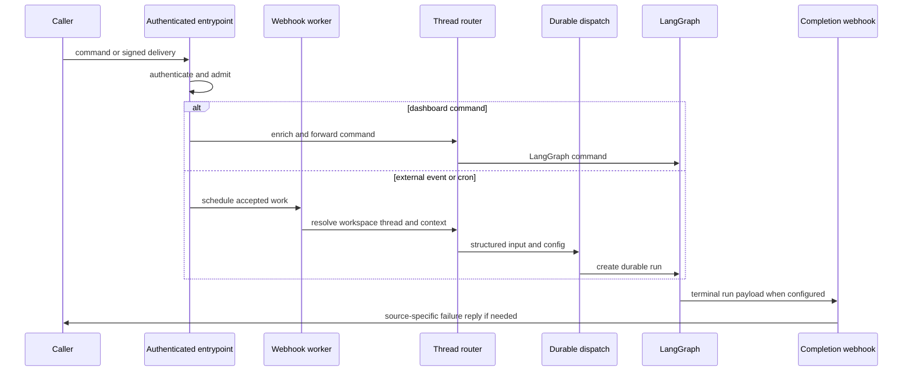

# Invocations from UI, webhooks, and schedules

Open SWE has two complementary entry paths. The authenticated dashboard forwards LangGraph-compatible commands through a policy and enrichment proxy. GitHub, Linear, Slack, and scheduler handlers first admit an external event, then do slower work in the background before using the common durable-dispatch contract. Both paths preserve the source, sender, repository/workspace, and thread identity needed for later turns and completion handling. For persistent-thread concepts, see [Threads and state](../concepts/threads-and-state.md); for individual integration setup, see [Dashboard UI](../integrations/dashboard-ui.md) and [GitHub, Slack, and Linear](../integrations/github-slack-and-linear.md).

## Common path

```mermaid
sequenceDiagram
    participant Caller
    participant Entry as Authenticated entrypoint
    participant Worker as Webhook worker
    participant Router as Thread router
    participant Dispatch as Durable dispatch
    participant Graph as LangGraph
    participant Completion as Completion webhook

    Caller->>Entry: command or signed delivery
    Entry->>Entry: authenticate and admit
    alt dashboard command
        Entry->>Router: enrich and forward command
        Router->>Graph: LangGraph command
    else external event or cron
        Entry->>Worker: schedule accepted work
        Worker->>Router: resolve workspace thread and context
        Router->>Dispatch: structured input and config
        Dispatch->>Graph: create durable run
    end
    Graph->>Completion: terminal run payload when configured
    Completion->>Caller: source-specific failure reply if needed
```

This sequence shows the shared trigger-to-run boundary. Webhook routes acknowledge after cheap validation and queue remote work; the dashboard proxy enriches and forwards the command synchronously. `create_durable_run` is the common creation contract for non-dashboard agent and reviewer triggers.

The FastAPI application mounts the dashboard, plan/workflow approval, Linear, Slack, health, GitHub, and additional service routers. It rejects `*` in `DASHBOARD_ALLOWED_ORIGINS` because credentialed CORS is enabled, also permits the `open-swe://app` desktop origin, and performs login-allowlist, sandbox, model, database, and migration startup checks before serving.

## Dashboard, desktop, and command API

The dashboard API is rooted at `/dashboard/api` and applies `require_same_origin_for_mutations`; its thread run endpoint passes the raw command body to the thread proxy under the authenticated session identity. The proxy accepts a missing thread only for `run.start`, then creates and stamps the dashboard thread. Other commands against an absent thread are `404`; existing threads are checked for posting or reading permission.

For a `run.start`, enrichment obtains the dashboard user's GitHub credential, resolves workspace/repository and model selection, validates image input against the selected model, turns client messages into attributed structured messages, and stamps source, participants, context hashes, invocation id, and activity metadata. If the thread is already active, a human dashboard request is either steered into the open turn or queued as a follow-up according to `multitask_strategy`; a machine principal instead receives a conflict. The proxy records a time-to-first-token marker after a successful start.

The desktop client uses the desktop CORS origin and submits desktop-sourced configuration through this invocation system. A downstream local shell backend only accepts `source == "desktop"` and a real local project path that resolves either to a registered allowlist entry or to a worktree below `OPEN_SWE_LOCAL_WORKTREES_DIR`. This path validation is the execution boundary; merely supplying a local path in a command does not grant filesystem access.

## Signed webhooks and admission

GitHub, Linear, and Slack read the raw request body and verify their platform signature before JSON processing, returning `401` for an invalid signature. Linear additionally rejects signed deliveries whose `webhookTimestamp` is more than one minute away. Accepted deliveries are recorded in the event log before source-specific routing.

GitHub first rejects unsupported event types and repositories that no workspace owns; a transient workspace-routing lookup returns `503` so GitHub can retry. It handles PR lifecycle/review automation, pushes, CI, issues, and comment/review events. Normal issue and comment work requires an Open SWE mention and eligible repository; replies to review findings take the separate reviewer route, while an untagged comment can be admitted only when it belongs to an already linked agent PR thread.

Linear accepts automation checks for Issue create/update events, but agent work only for a non-bot `Comment` `create` that mentions Open SWE. Repository selection prefers an explicit repository in the comment, then the author's dashboard default, then the workspace default; the chosen repository must be allowlisted. The worker derives the stable thread from the Linear issue id, records Linear source context and user/repository/workspace metadata, serializes the issue plus relevant comments as system and human input, and dispatches it.

### Slack admission and routing

Slack verifies every Events API, slash-command, and code-channel-command request before parsing it. It rejects channels that are externally shared or not verified for operations; an app mention in an external shared channel receives a one-time refusal only after the event claim succeeds. Bot/self events, invalid message updates, and unchanged text updates are ignored.

Outside special channels, a message must be an explicit mention, DM, accepted solo-thread follow-up, kitchen-channel message, permitted bot interaction, or valid update to be processed. A code channel is a single session: all of its messages use `CODE_CHANNEL_SESSION_TS` and are treated as directed to the agent. Slack claims the delivery before scheduling its normal worker, so a duplicate delivery does not create another invocation; updates are separately claimed and routed to the update handler.

`resolve_slack_thread_id` makes Slack location routing durable. It returns an explicit stored mapping when present; otherwise it searches exact source-context metadata, rejects multiple matches, derives a deterministic Slack id when there is no match, and persists the selected mapping without overwriting another thread. Thus a mapping conflict is a visible failure rather than a guess.

The Slack worker resolves the request thread, sender identity and GitHub authorization, retrieves channel/thread context, and builds structured input before dispatch. It calls `authorize_github_thread` with the mapped login, so lack of a usable identity/token prevents a coding run rather than silently acting as another user. Slack-specific context and request state remain in `SourceContext` and configurable run state for replies and follow-ups.

## Thread identity and input boundary

Deterministic ids for Slack locations, Linear issues, GitHub issues and PR comments, reviewers, and related workflows are a cross-process persistence contract. Webhooks, the dashboard, and graphs must derive the same namespace and stable key to find a live thread; changing either can disconnect existing state. GitHub PR comments reuse the UUID embedded in an Open SWE branch when available and otherwise use the canonical owner/repository/PR key. Reviewer runs deliberately use a distinct reviewer namespace.

Inputs at the graph boundary are structured messages, not unlabelled prompt strings. `human_input` and `system_input` require matching context kinds and encode authored text in XML-escaped `<input-message>` envelopes. Dynamic introductions for channels and systems are hash-deduplicated before input construction, while the dispatch fallback derives a canonical sender from source/configuration when a caller has not supplied a prebuilt input.

## Durable creation and terminal handling

`dispatch_agent_run` rejects ambiguous calls that mix prebuilt input with raw content or identities, then sends the selected `assistant_id` to `create_durable_run`. The latter can create/title a system-owned thread, records source-related metadata, resolves the run user where possible, and creates the LangGraph run with interrupt multitasking, synchronous durability, resumable streaming, the configured stream modes, and subgraph streaming. The run configuration gets an invocation id and start time in both configuration and metadata, plus the streaming compatibility marker.

A completion webhook is attached only when `RUN_COMPLETE_WEBHOOK_SECRET` is set and `COMPLETION_WEBHOOK_URL` is absolute and non-loopback; invalid local URLs disable completion delivery rather than causing every run creation to fail. `/webhooks/run-complete` verifies the token fail-closed. Successful eligible Slack runs can schedule session-cost enrichment; `error` and `timeout` can settle an unfinished reviewer check, restore a code-channel session when no later run is live, and post a best-effort source-specific failure reply. Failure replies are deduplicated per run id, and `interrupted` is intentionally not a user-facing failure because interrupting follow-ups normally produce it.

## Schedules

The scheduler graph is a one-node fan-out: it recognizes internal maintenance tasks, otherwise requires `schedule_id` and calls `launch_scheduled_agent_run`. A cron tick reloads the stored schedule, verifies that the named schedule trigger still exists (and removes orphan crons when appropriate), then launches the schedule record. This is separate from the interactive thread path but ultimately uses the same durable-run machinery. See [Scheduling and baby-sit](scheduling-and-baby-sit.md) for schedule lifecycle and watch behavior.

## Safe changes and focused verification

- Keep raw-body signature verification ahead of parsing and preserve replay, workspace-routing, allowlist, and event-claim behavior. Acknowledging a webhook must not imply that a run was created.
- Treat `openswe/thread_ids.py`, Slack location mappings, `SourceContext`, and dashboard thread metadata as persisted compatibility surfaces.
- Route new external agent or reviewer launchers through `dispatch_agent_run` or `create_durable_run` so durability, streaming, invocation correlation, and completion behavior remain uniform.
- Exercise dashboard lazy creation, permission checks, active-thread steering/queueing, model/image validation, Slack duplicate and external-channel paths, Linear repository selection, and completion behavior for success, timeout, error, and interruption.
