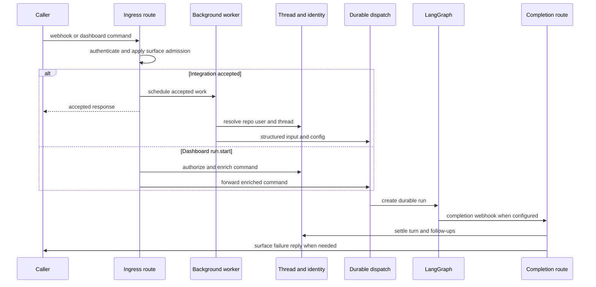

# Inbound Invocation to Durable Run

Open SWE has several ingress surfaces, but they converge on a small set of contracts: a stable LangGraph thread, attributed structured input, a run configuration, and durable run creation. The surface remains meaningful—particularly for authorization, repository credentials, reply location, and completion behavior. See [Auth and security](../concepts/auth-and-security.md), [Threads and state](../concepts/threads-and-state.md), and [Follow-up messages](follow-up-messages.md) for the complementary policies.

## End-to-end flow

```mermaid
sequenceDiagram
    participant Caller
    participant Route as Ingress route
    participant Worker as Background worker
    participant Thread as Thread and identity
    participant Dispatch as Durable dispatch
    participant Graph as LangGraph
    participant Complete as Completion route

    Caller->>Route: webhook or dashboard command
    Route->>Route: authenticate and apply surface admission
    alt Integration accepted
        Route->>Worker: schedule accepted work
        Route-->>Caller: accepted response
        Worker->>Thread: resolve repo user and thread
        Worker->>Dispatch: structured input and config
    else Dashboard run.start
        Route->>Thread: authorize and enrich command
        Route->>Dispatch: forward enriched command
    end
    Dispatch->>Graph: create durable run
    Graph->>Complete: completion webhook when configured
    Complete->>Thread: settle turn and follow-ups
    Complete->>Caller: surface failure reply when needed
```

This sequence shows the shared boundary, not identical admission. GitHub, Linear, and Slack authenticate a raw webhook body before decoding it and normally acknowledge before a background worker performs remote lookups. Dashboard commands are authenticated and authorized at the proxy, then enriched and forwarded synchronously. Schedules and GitHub-issue automations are internal launches: they create a new automation thread after workspace/repository checks rather than accepting an end-user webhook message.

`create_app` composes dashboard, plan, workflow-approval, integration, health/completion, and sandbox routers. Startup validates login, sandbox, local-model, and database configuration and runs migrations; CORS refuses a wildcard dashboard origin while credentials are enabled.

## Webhook admission

GitHub, Linear, and Slack verify their platform signature against the **raw** request bytes before JSON decoding and return `401` on failure. Slack applies the same check to command endpoints. This order is an invariant: parsing or normalizing the body before verification would change the signed material.

GitHub records deliveries, drops unsupported event/action shapes, returns `503` for a transient workspace-routing lookup so GitHub retries, and otherwise gates repositories and public-repository organization policy. Normal issue/comment work must mention Open SWE; registered users may also make untagged follow-ups on an already agent-linked PR. PR events, pushes, CI, and review-finding replies take specialized worker paths instead of all becoming coding-agent messages.

Linear admits only non-bot `Comment` `create` events that mention Open SWE. It derives a repository from an explicit reference in the comment, then the comment author's dashboard default, then the workspace default, and rejects no-result or non-allowlisted choices. The worker uses the deterministic Linear issue thread id, preserves source context and author-to-GitHub attribution, serializes the issue plus relevant comments into system/human envelopes, and dispatches the resulting input.

Slack has the most surface-specific admission policy:

- It blocks unverified or externally shared channels. A qualifying app mention in an external shared channel gets one claimed refusal reply and never reaches dispatch.
- It drops self/bot events unless a configured allowed bot is explicitly addressing Open SWE, validates message-update identity and visible text changes, and claims the event before the normal worker is scheduled. The claim is the deduplication gate for a run.
- Outside code channels, an ordinary message must be a direct mention, DM, allowed-bot message, kitchen-channel message, or an admitted solo-thread follow-up. Code channels deliberately differ: all conversation is directed to Open SWE and shares one channel-session thread.
- The route resolves a Slack thread by preferring an explicit stored mapping, then matching source metadata, then a deterministic Slack id. A conflicting mapping is an error rather than an opportunity to guess.

The Slack worker fetches user/channel/thread context, chooses a workspace only on the opening message, and stores `SourceContext.slack_thread` with repository and identity configuration. A human-triggered coding run requires a valid mapped GitHub token; without one it posts an account-link or re-authentication prompt and does not dispatch. Explicit requests interrupt current work, while ordinary follow-ups use `enqueue`; edits are handled as updates to an already delivered message rather than independent runs.

## Dashboard and desktop commands

Dashboard thread commands are a controlled proxy to LangGraph, not a transparent pass-through. They require `application/json`, parse an object command, and enforce read/post policy from thread metadata. Only `run.start` may target a missing client-minted thread; that first command creates and stamps the dashboard thread. Other commands against a missing thread return `404`.

For a human `run.start`, the proxy verifies the submitter's GitHub credential, resolves workspace/repository/model settings, validates image content against the selected or vision-fallback model, replaces raw client messages with attributed structured input, and records participants, source, invocation timing, and context hashes. On a busy thread, an interactive caller either steers the running thread or creates an attributed queued follow-up according to the requested multitask strategy; a machine principal receives `409` rather than impersonating a person. The proxy also persists the returned run as pending and observes time-to-first-text.

Desktop uses the dashboard command path with `source="desktop"`. Local shell execution is separately constrained: `local_project_path` is resolved and must be either listed in `OPEN_SWE_LOCAL_PROJECTS_FILE` or be below `OPEN_SWE_LOCAL_WORKTREES_DIR`. This prevents a desktop run configuration from selecting an arbitrary local directory.

## Scheduled and event-driven automation

The scheduler graph dispatches by task type and calls `launch_scheduled_agent_run` for a schedule tick. Each enabled schedule launch verifies that its workspace still exists and that the configured repository is accessible in that workspace, then creates a fresh UUID thread with system ownership and automation metadata. If `always` Slack notification is configured, it must first create and bind a Slack root message; failure to do so aborts the launch. The launch constructs system-authored automation input and invokes the same durable-run primitive.

A GitHub `issues` `opened` delivery may also match enabled `github_issue_opened` automations. The store claims each delivery/schedule pair with a lock thread to suppress duplicate delivery work, constrains an outsider-triggered public-repository run to that repository, and releases the claim if launch does not start. This is automation ingress, not the mention-gated interactive issue path.

## Thread routing and input boundaries

Thread-id formulas are persisted routing contracts. Slack locations, Linear issues, GitHub issues and PR comments, and reviewer PRs must derive exactly the same namespaced identifier to recover state; changing a formula or its stable input strands existing conversations. An Open SWE branch can carry its original UUID; otherwise PR comments use the canonical owner/repository/PR-derived id. Reviewer runs use the separate `reviewer_thread_id` namespace and `assistant_id="reviewer"`, isolating review state from the coding-agent graph.

Inputs at the graph boundary are structured messages, not unqualified prompt strings. `human_input` and `system_input` enforce the matching input kind and XML-escape authored text in `<input-message>` envelopes. Channel and system introductions are `<dynamic-context>` messages whose canonical content is SHA-256 hashed; already visible context is not repeated, but context hidden by summarization can be introduced again. The generic dispatcher can derive a sender from run configuration for simple callers; integration workers normally provide richer identities and source-specific context themselves.

## Durable dispatch and completion

`dispatch_agent_run` is the common agent/reviewer dispatch contract. It rejects calls that mix a prebuilt input with raw content or identity parameters, builds input when necessary, records feedback activity for interactive agent sources, and delegates to `create_durable_run`.

`create_durable_run` ensures a titled thread when the caller owns creation, resolves run-user metadata, assigns an invocation id and start time to both configurable state and metadata, and enables the event-stream compatibility marker. Its defaults are `multitask_strategy="interrupt"`, `durability="sync"`, `if_not_exists="create"`, resumable streaming, the standard values/updates/messages/custom/tasks/checkpoints stream modes, and subgraph streaming. `sync` durability checkpoints before each graph step, while an `enqueue` caller can retain an active run rather than interrupt it.

Completion delivery is optional by design. Dispatch attaches a webhook only when `RUN_COMPLETE_WEBHOOK_SECRET` is set and `COMPLETION_WEBHOOK_URL` is absolute and non-loopback; otherwise run creation still succeeds without completion callbacks. The receiving `/webhooks/run-complete` route fails closed on the query token before reading JSON.

For terminal payloads, completion finalizes invocation telemetry and settles transcript turns. On success it can dispatch pending follow-ups, enqueue event subscriptions, restore code-channel status when no later run is active, schedule feedback, and schedule a Slack session-cost refresh once per run. On `error` or `timeout`, it settles reviewer/code-channel state best-effort and posts an idempotent source-specific Slack, Linear, or GitHub failure reply when a reply location is available. `interrupted` is deliberately not a failure reply: it is the expected outcome of an interrupting follow-up.

## Safe changes and focused verification

- Keep signature verification on raw bytes and retain Slack claim-before-worker ordering. Exercise replay/deduplication, external-channel refusal, bot filtering, and directed-message admission.
- Treat `agent/thread_ids.py`, source-context metadata, and Slack mapping precedence as compatibility boundaries. Prefer an explicit conflict over a new heuristic.
- Route new agent/reviewer launchers through `dispatch_agent_run` or `create_durable_run`; cover durability defaults, streaming configuration, invocation correlation, and webhook fallback in `tests/agent/test_dispatch.py`.
- Cover success/failure status handling, per-run reply deduplication, token rejection, pending-follow-up pickup, reviewer cleanup, and intentionally silent interruptions in `tests/webhooks/test_completion_webhook.py`.
- For command-proxy changes, test lazy thread creation, principal authorization, attribution/image validation, busy-thread steer/enqueue behavior, and machine-principal conflicts. For automation changes, test disabled/unknown-workspace/unauthorized outcomes and fresh-thread launch behavior in `tests/agent/test_agent_schedules.py`.
