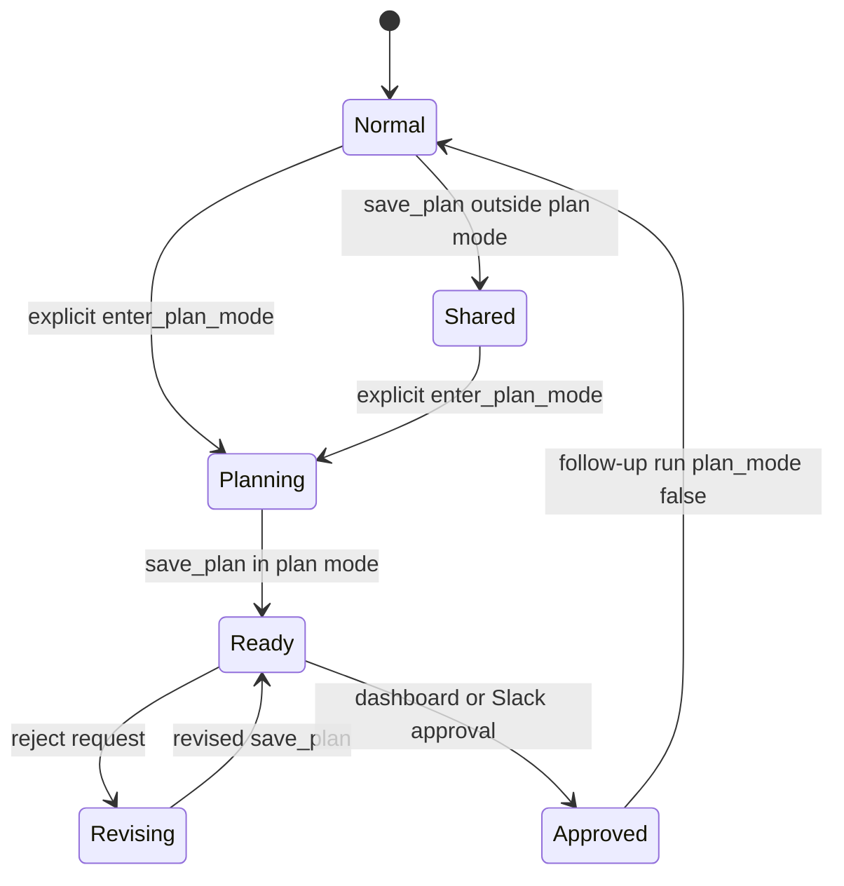
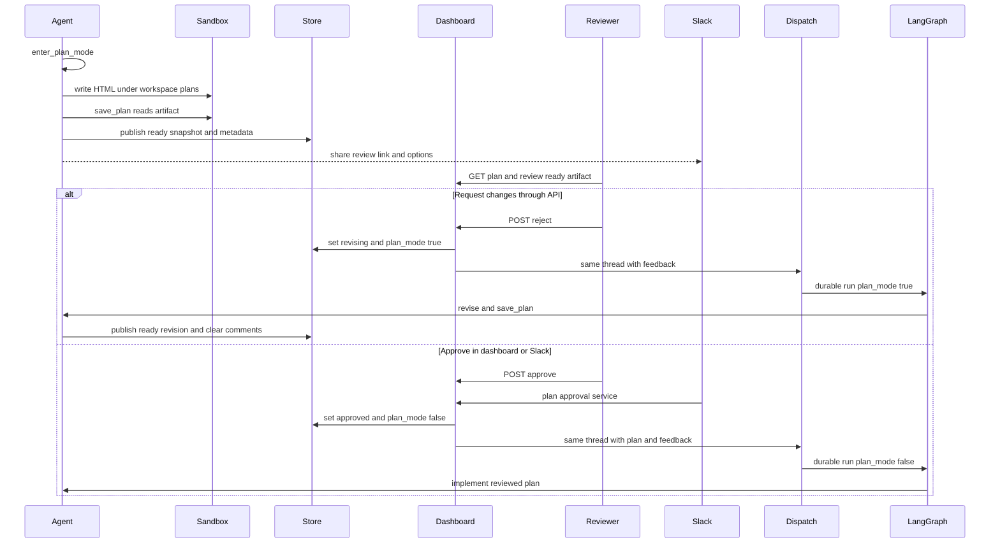

# Plan Mode, Review & Approval

Plan mode is Open SWE's explicit pause before implementation. It is not an automatic
planning heuristic: the system prompt tells the agent to call `enter_plan_mode` only
when the user expressly requests it. Once active, the target repository is a
read-only research subject and the deliverable is a reviewed, self-contained HTML
artifact outside the checkout. Approval is the boundary that restores implementation
capabilities and continues the existing LangGraph thread.

This workflow connects the [agent graph](../architecture/agent-graph.md),
[durable threads and state](../concepts/threads-and-state.md), the
[tool model](../concepts/tools.md), the [dashboard UI](../integrations/dashboard-ui.md),
normal [invocation](./invocation.md), and subsequent [PR creation](./pr-creation.md).

## Contract and entry points

There are two ways into the mode, both using the same thread-scoped state:

- **Agent entry:** `enter_plan_mode` returns a LangGraph `Command` that sets
  `plan_mode=True` in run state, records `planning` plus `plan_mode=True` in the
  persisted plan/thread records when a thread id is available, and gives the model
  instructions for producing and publishing the artifact.
- **Revising re-dispatch:** a review rejection can dispatch a follow-up on the same
  thread with `configurable["plan_mode"] = True`; a new agent factory uses that
  initial value. This is how a later planning run is intentionally re-entered.

The agent factory installs `PlanModeMiddleware` for every run. Before an agent starts,
the middleware resets the state channel to that run's initial value, preventing a
stale `True` checkpoint from trapping an approved implementation run. Before every
model call it recomputes the available tools from the state, so the *next* model turn
after `enter_plan_mode` is restricted as well.

Plan status and mode lifecycle: an implementation plan moves from planning through review to approval; an ordinary shared artifact is not approvable and is cleared when a new plan begins.

### Read-only is a combined enforcement and instruction boundary

While active, middleware removes known externally mutating or bypass-capable tools,
including `task`, background execution, `http_request`, PR and review tools, sandbox
recreation, thread management, Slack relocation/thread creation, Linear mutations,
and environment/skill mutation tools. `approve_plan`, reading tools, and plan-file
editing tools remain available. The latter is intentional: the prompt limits
`write_file` and `edit_file` to the external plan file.

This is not a complete operating-system sandbox for read-only behavior. `execute`
remains in the tool list, so the prompt explicitly prohibits state-changing shell
commands, repository edits, commits, pushes, installs, generators, and rewriting
formatters. The `task` subagent is excluded because it has its own tool graph and
would not inherit the parent restriction. Safe changes to this workflow therefore
need to preserve both parts: tool filtering for model-visible capabilities and
prompt rules for filesystem/shell discipline.

## Create and publish the review artifact

The active prompt directs the agent to research directly, choose a dated descriptive
path directly below `/workspace/plans/` such as
`/workspace/plans/YYYY-MM-DD-short-task-slug.html`, write one recommended plan, and
publish exactly that path with `save_plan`. It also supplies the review URL as
`{DASHBOARD_BASE_URL}/agents/{thread_id}/plan` (with URL-escaped thread id). Source
context controls how the link is announced: dashboard runs use the normal assistant
response; Slack runs use a concise thread reply with `Approve & implement` and
`Request changes` options.

`save_plan` is the publication gate, rather than accepting HTML as a tool argument.
It requires a run `thread_id`, reads the sandbox file, rejects empty/non-UTF-8 or
oversized content, and accepts only a single `.html` file immediately under
`/workspace/plans/`—not nested paths or arbitrary sandbox files. It wraps a fragment
in a complete HTML document (using a title derived from the filename when needed),
then publishes the snapshot as `ready` if plan mode is active. The plan authoring
contract permits inline styling and scripting but the dashboard renders the artifact
in a sandboxed iframe under a strict content policy; artifacts cannot depend on
network access or web storage.

Plan persistence deliberately has two copies:

1. The sandbox file is the editable working artifact, outside cloned repositories.
2. The LangGraph Store record under `["plan", "content"]` is the dashboard snapshot,
   containing status, HTML or legacy Markdown, and the original path. Thread metadata
   mirrors `plan_status` and normally `plan_mode`, allowing the thread list and
   review flow to find the lifecycle without reading the content record.

The dashboard's `GET /dashboard/api/plan/{thread_id}` authorizes access through the
thread readability check and returns the artifact, status, current signed-in user,
and any approval attribution. The standalone `/agents/$threadId/plan` route polls
only until content appears, then renders HTML in `PlanArtifactFrame` or legacy
Markdown. It offers approval only at `ready`; a `shared` artifact is visibly a
shared response rather than an implementation plan.

## Review, feedback, and revisions

The API exposes whole-document comment resources at
`/dashboard/api/plan/{thread_id}/comments`. Each comment is an independently stored
record under `["plan", "comments", thread_id]`, with a generated id, author/login,
body, and timestamp; listing is oldest first. Authenticated readable-thread users
can add nonblank comments, but only the comment's author can delete it. These
endpoints reject `shared` content, as do approval and rejection.

Publishing a new agent revision clears earlier comments by default: feedback on a
superseded artifact must not be accidentally presented to the agent when the new
revision is approved or rejected. A dashboard `PUT /dashboard/api/plan/{thread_id}`
performs a different operation: it rejects empty input and terminal `approved` or
`cancelled` plans, sets the artifact back to `ready`, mirrors the edit to the
sandbox path, and passes `clear_comments=False`. Thus a manual owner edit preserves
existing review feedback. Sandbox mirroring is best effort, so a missing sandbox
does not prevent publishing the dashboard copy.

A `POST /dashboard/api/plan/{thread_id}/reject` accepts only a `ready` content and
metadata pair. It first changes the status to `revising` while retaining plan mode;
by default it then dispatches the same thread with a message that formats all
comments and asks the agent to revise the existing file and republish it. Clients
can pass `{"dispatch": false}` to make only the state transition. The review page's
**Request changes** action instead returns the user to the connected conversation
with `feedback=true`, allowing the reviewer to provide a normal follow-up before
approval.

## Approve and re-dispatch

Approval can begin at the authenticated dashboard endpoint or from Slack's
`plan_approval` interactive action. Slack first resolves the Slack conversation to
its agent thread and queues the same approval service with the Slack actor identity.
Dashboard approval uses the dashboard session identity. In either case an in-process
per-thread `asyncio.Lock` serializes approvals.

Under that lock, approval requires all of the following: metadata says plan mode is
active and `ready`, the content snapshot is also `ready`, and the artifact is not
`shared`. It reads both the published HTML/Markdown and all comments with
`raise_on_error=True`, records `approved` and `plan_mode=False` in both persistence
surfaces, and records normalized approver identity plus an approval timestamp. The
follow-up instruction embeds the reviewed artifact and formatted feedback and asks
the agent to use them as an implementation guide with reasonable engineering
judgment—not as unchangeable text.

Publish, review, rejection or approval, and re-dispatch all remain keyed to the original durable thread.

Approval does not create a new conversation: `_dispatch_followup` reconstructs the
existing source, repository, user identity, and Slack context from thread metadata,
sets `plan_mode` to `False`, and calls `dispatch_agent_run` for the same `thread_id`.
On a Slack-backed thread, successful approval also attempts a concise thread reply
naming the approver and comment count; an inability to post that notice is logged
but does not undo approval.

### Failure and concurrency behavior

- If another approval wins the lock, a later caller receives the current status with
  `already_approved=True` rather than dispatching a duplicate run.
- The approval path treats plan-content/comment lookup failures as errors rather
  than silently implementing a stale plan or dropping feedback.
- If persisting approval succeeds but dispatching the implementation follow-up
  fails, the service restores `ready` and `plan_mode=True`, enabling a retry.
- Read endpoints degrade a normal Store lookup failure to missing content; critical
  approval/rejection reads opt into error propagation. Metadata updates and the
  dashboard-edit sandbox mirror are best effort, so operators should investigate
  their warnings when persistence surfaces diverge.

## Operating and extending safely

`DASHBOARD_BASE_URL` determines the externally shared review-link base (defaulting
to `https://openswe.vercel.app`). Plan mutations are mounted under
`/dashboard/api/plan` and have router-level same-origin mutation protection; the
routes also require a session and hide unreadable threads as `404`. Keep these checks
when adding a review action: thread visibility is the authorization boundary, not
knowledge of a thread id.

Do not conflate `shared` with a plan. Calling `save_plan` outside plan mode is a
long-response sharing facility: it stores `shared`, does not force plan-mode metadata,
and cannot be edited as an implementation plan or fed to approve/reject. Entering
plan mode after `shared` clears the old artifact/path from the new planning record,
which prevents a report from being approved as a plan.

Focused coverage lives in `tests/agent/test_plan_mode.py` and
`tests/agent/test_plan_review.py`: it tests explicit prompt guidance, middleware
activation/deactivation, artifact path and encoding validation, persistence and
comment semantics, authorization, approval attribution, lock-based deduplication,
and rollback after dispatch failure. `tests/e2e/tests/plan_review.spec.ts` exercises
the Slack-to-dashboard path with the real agent/dashboard integration: authenticated
owner and collaborator review, Slack approval buttons, re-entry for feedback, and
implementation delivery as a pull request.
