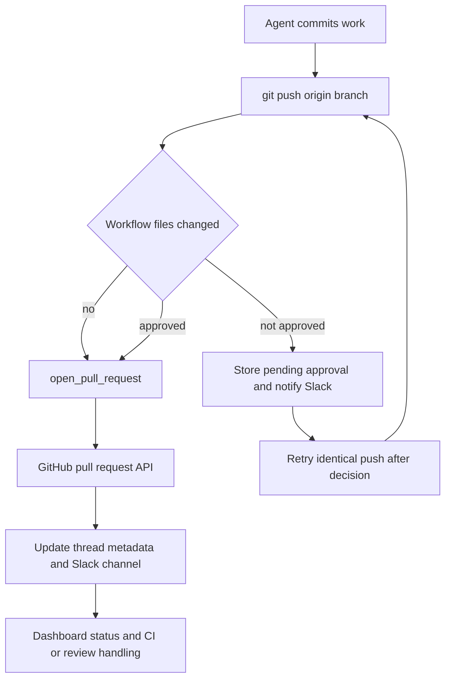

# Pull Request Delivery Workflow

The delivery path is **commit → push → open or update PR → CI and review feedback**. A newly opened PR has a dedicated attributed tool; ordinary GitHub CLI operations remain appropriate for an existing PR. Two middleware guards constrain the riskier mutations: bypassing attributed PR creation and pushing changed GitHub Actions workflows.

Caption: delivery flow; workflow approval gates the push, while PR telemetry links the delivered PR to its thread.

## Open a new attributed pull request

Call `open_pull_request(owner, repo, head, base, title, body, draft=True, resolves_thread=False)` only after `git push origin <branch>`. It creates a new PR through GitHub's API and returns `success`, URL, number, author, token kind, and `created`. The `created` flag is `False` when an open PR already exists for the head branch; in that case use `gh pr edit` to update it rather than trying to create another PR. `gh` is also the intended route for reading, commenting on, or changing an existing PR.

The tool deliberately attributes the PR to the person who started the work. For Slack, Linear, and dashboard runs with a mapped GitHub login, it freshly resolves that login's OAuth token rather than reuse shared thread metadata. GitHub-triggered runs, missing mappings or user tokens, and bot-only installations fall back to the GitHub App installation token, so the creator is `open-swe[bot]`.

Before POSTing, the tool checks repository access and the base branch, plus the head branch when it belongs to the destination owner. Failures distinguish App/repository access (`github_app_access_missing_or_repo_not_found`), a branch GitHub cannot see (`github_pr_branch_not_visible`), and other preflight failures (`github_pr_preflight_failed`). Its error reports the actual status, selected response headers, and a bounded response body, while failure logging records the failed step, token kind, and push knowledge. This makes an access or visibility problem actionable instead of encouraging a fallback.

### Drafts, references, and thread completion

`draft` is a requested default: a boolean `draft_prs` in runtime configuration overrides it for a newly created PR. The profile-level draft preference defaults to `True`. Returning a duplicate PR does not alter its draft state.

Unless the body already has `## References`, the tool can append a dashboard plan link and source references. Slack-thread, Linear-ticket, and GitHub-issue references are added only when GitHub positively confirms that the target repository is private; lookup errors or uncertain visibility omit them. This prevents a private conversation link leaking into a public PR.

Set `resolves_thread=True` on the final PR that represents a thread's work. The tool stores that field with the normalized PR record, allowing thread resolution once every resolving PR is merged or closed; threads whose PRs never opt in remain for manual resolution.

## Record successful delivery

After either a `201` creation or successful duplicate lookup, the tool best-effort fetches full PR details, records PR usage, and upserts a normalized record into the thread's `pull_requests` metadata alongside legacy single-PR fields and `pr_urls`. The normalized state is `draft`, `open`, `closed`, or `merged`. For a Slack code-channel session it also refreshes repository context, registers the PR as the agent resource, and sets a diff view only if the GitHub diff fetch succeeds with nonempty content.

This bookkeeping is non-fatal: an exception does not change a successful creation result. It is one protected sequence, however, so an earlier exception can skip later telemetry stages; it is not a transactional delivery guarantee.

## Guards on delivery mutations

### Prevent direct PR-creation fallbacks

`PullRequestCreationGuardMiddleware` wraps both `execute` and `background_execute`. It blocks shell attempts to create a PR outside `open_pull_request`: `gh pr create`, `gh api` POST/body submissions to a `/pulls` endpoint, and `curl` POST/body submissions to GitHub's pulls endpoint. It inspects nested `bash`, `dash`, `sh`, and `zsh` `-c` commands; a nesting level beyond its bounded expansion is blocked rather than trusted.

The guard returns `PullRequestCreationFallbackBlocked`, code `pr_creation_fallback_blocked`, with `recoverable_by_agent: false`. The agent must surface and address the attributed-tool failure, not silently open an unattributed PR. The server installs this guard only for non-local runs; the workflow push guard is installed for every run.

### Require approval for workflow-file pushes

`WorkflowPushGuardMiddleware` examines only tightly parsed, operator-free `git push origin <refspec>` forms (including supported `git -C`, `cd ... &&`, and `--set-upstream` forms). If it cannot safely interpret a command, it leaves it alone. For an eligible current-branch push, it compares the local head to the remote branch or merge base and detects changed `.github/workflows/` paths. No workflow change leaves the original command untouched.

For a workflow change, it collects the binary diff, bounded preview, file/addition/deletion counts, refs and SHAs, normalized remote, and a SHA-256 fingerprint. It stores approval records keyed by that fingerprint in the thread's `workflow_push_approvals` metadata. A pending record contains review data and notification state; approved and rejected records are terminal, and persistence retains the 20 newest records.

An approved fingerprint allows the push but rewrites it to an explicit `<head_sha>:refs/heads/<branch>` refspec. Any other state blocks with `WorkflowPushApprovalRequired`, records or refreshes pending approval, and—when a Slack thread is available—posts an interactive Slack request only if the record has not already been notified. It marks a record notified only after Slack returns a timestamp without an error. Changing the workflow diff or relevant refs changes the fingerprint, so it needs a new decision.

The dashboard API exposes approvals for readable threads and protects mutations with an authenticated session and same-origin requirement. Approve records the deciding subject and dispatches a follow-up telling the agent to retry the unchanged push; reject records the decision but does not resume delivery.

## Review and CI feedback

`request_pr_review` is a handoff rather than PR creation. It validates a GitHub PR URL, resolves the active Slack thread and runtime identity, then delegates to the GitHub webhook review trigger. See [PR Review](pr-review.md) for the reviewer lifecycle.

CI readers paginate current check runs and legacy commit statuses and are best effort: missing `Checks: Read` access or HTTP failures return no data rather than break webhook handling. Auto-fix considers completed checks with `failure`, `timed_out`, or `action_required` conclusions, excludes Open SWE's own review and auto-fix checks, and can compare failure names with the base SHA to skip inherited failures. The no-mention auto-fix route fails closed unless the requester has `write`, `maintain`, or `admin` permission.

Webhook helpers extract branch, SHA, and completed failure state from `check_run`, `check_suite`, `workflow_run`, and legacy `status` events. Baby-sit processes only a failing event matching an active watch by SHA or branch. See [Scheduling and baby-sit](scheduling-and-baby-sit.md).

For feedback-driven reruns, `fetch_pr_comments_since_last_tag` combines issue comments, inline review comments, and nonempty reviews chronologically. On the first configured Open SWE mention it returns all feedback for context; on repeat invocations it returns events after the preceding mention. Handle matching is boundary-aware, avoiding a match where a configured handle is merely a prefix of a longer handle. Raw comment content is sanitized and wrapped as untrusted unless its author is mapped.

## Dashboard status contract

`GET /dashboard/api/threads/{thread_id}/pull-request-status` reads the PR records tracked on an authorized thread (falling back to legacy PR metadata) and fetches each PR's live GitHub data. It reports open/closed/merged state, draft status, merge-conflict state, linked failures, pending and inconclusive check counts, and unresolved GraphQL review threads.

The status response is availability-oriented. Invalid tracked identities, missing permissions, malformed responses, and transient GitHub errors produce partial entries with `statusAvailable`, `checksAvailable`, and `commentsAvailable` flags instead of failing the entire surface. Consumers must treat unavailable fields as unknown, not healthy.

## Focused verification

`tests/github/test_open_pull_request.py` exercises token selection, preflight diagnostics, duplicate handling, reference privacy, and PR-record upsert behavior. `tests/github/test_pr_creation_guard.py` covers direct and nested fallback detection plus safe commands. `agent/test_workflow_push_guard.py` covers push parsing, workflow diff/fingerprint construction, pending notifications, and approval rewriting. GitHub CI, feedback, mention-tag, status, and baby-sit behavior are covered by the corresponding tests under `tests/github/`.
