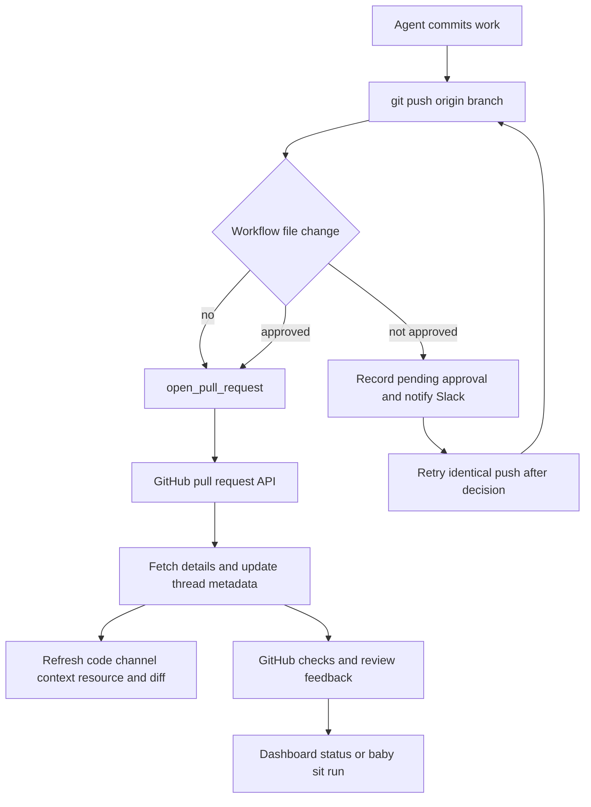

# PR Creation & GitHub Delivery

The delivery leg of an agent run is **commit → push → open or update PR → CI and review feedback**. `open_pull_request` is the sole path for opening a *new* PR because it preserves the triggering person's GitHub attribution. Middleware constrains two higher-risk mutations: creation fallbacks and pushes that alter GitHub Actions workflows. The thread's PR metadata is the bridge from creation to the dashboard and Slack code-channel surfaces.

Caption: commit-to-feedback control flow; workflow approval gates the push, while PR telemetry makes the delivered PR visible to Slack and the dashboard.

## Create a new PR through the attributed tool

The agent must push its branch to `origin` before calling `open_pull_request(owner, repo, head, base, title, body, draft=True)`. It returns a structured success result with URL, number, author, token kind, and a `created` flag. It is for new PRs only; `gh` remains the route for editing an existing PR, marking it ready, commenting, or reading status.

Attribution is deliberate. `_resolve_pr_author_token` preferentially obtains a current OAuth token by the configured GitHub login for Slack, Linear, and dashboard invocations, creating the PR as the requester. The lookup is fresh rather than sourced from shared thread metadata, since a Slack thread can have a different triggering user later. GitHub-triggered runs, unmapped users, unavailable user tokens, and bot-only deployments fall back to the GitHub App installation token, making `open-swe[bot]` the creator.

Before the POST, preflight GETs the repository and base branch and, when the head belongs to the target owner, the head branch. Failures distinguish absent App/repository access (`github_app_access_missing_or_repo_not_found`), an invisible branch (`github_pr_branch_not_visible`), and another preflight error (`github_pr_preflight_failed`). The returned diagnostic includes GitHub's status, selected useful headers, and a bounded response body; failure telemetry also records the step, token kind, and whether the head was known pushed. This gives the agent an actionable failure rather than an opaque create error.

Creation is idempotent for an open PR on the head branch. On HTTP 422, the tool queries open pulls for that branch; if one exists it returns it with `created=False` and records its telemetry. The agent should then use `gh pr edit`, not attempt another creation. If lookup cannot establish an existing PR, the original failure is returned.

### Draft choice and references

`draft` is a requested default, not an unconditional command. A boolean `draft_prs` value in run configuration overrides it for a newly created PR; the profile-level default is `True`. The duplicate-PR path does not change the existing PR's draft state.

Before creation, the tool may add a `## References` section, unless that heading is already present. A dashboard plan link is added when a plan exists. Links back to the Slack thread, Linear ticket, or GitHub issue are added only after GitHub positively confirms that the destination repository is private. Failed plan/source lookup and uncertain repository visibility fail closed: they leave the body unchanged or omit source links rather than expose a private conversation in a public PR.

## Best-effort telemetry and Slack code-channel delivery

After either a 201 create or a successful duplicate lookup, `_record_pr_telemetry` performs the delivery bookkeeping in this order:

1. Fetch full PR details, including diff statistics.
2. Record agent PR usage with thread/user identity, refs, URL, state, timestamps, and additions, deletions, and changed-file counts.
3. Normalize the PR into the thread's `pull_requests` collection, upserting by repository/number or URL. It also maintains legacy single-PR fields and `pr_urls`; normalized state is `draft`, `open`, `closed`, or `merged` via `derive_pr_state`.
4. For an active Slack code-channel session, set the repository context bar, register the PR as the agent resource, fetch the PR diff representation, and set the `diff` view when that fetch succeeds and is nonempty.

This entire telemetry routine is intentionally non-fatal: an exception—including usage recording, thread update, Slack context/resource calls, or diff retrieval—only emits debug logging and does not change the successful PR-creation result. A failed detail fetch yields an empty detail object, allowing the usage/metadata path to continue with safe defaults. Because the remaining stages share one protected sequence, an exception in an earlier stage skips its later stages; telemetry is therefore best effort, not a transactional delivery guarantee. Similarly, a non-200 or empty diff merely omits the code-channel diff view.

## Mutation guards

### PR-creation fallback guard

`PullRequestCreationGuardMiddleware` wraps `execute` and `background_execute`. It blocks shell attempts to bypass attributed creation: `gh pr create`, `gh api` creation against a `/pulls` endpoint using POST or body fields, and `curl` POST/body submission to GitHub's pulls endpoint. It tokenizes shell input and recursively inspects `bash`, `sh`, and related `-c` invocations. Bounded expansion is fail-closed: an additional nested shell command at the maximum depth is blocked too.

The returned tool error is `PullRequestCreationFallbackBlocked` with code `pr_creation_fallback_blocked` and `recoverable_by_agent: false`. Its purpose is specifically to prevent a failed `open_pull_request` call from being hidden by an unattributed fallback; surface and resolve the real failure instead. `server.py` installs this guard only outside local runs, while it always installs the workflow push guard.

### Workflow-file push approval

`WorkflowPushGuardMiddleware` inspects only conservative push shapes: an operator-free `git push origin <refspec>`, with optional `git -C`, `cd ... &&`, and upstream option handling. It declines to interpret unsafe or unrelated commands. For an eligible push it inspects the sandbox repository, verifies that the refspec is the current branch, compares it to its remote branch or merge base, and looks for changed paths under `.github/workflows/`. No such paths means the original push runs unchanged.

For workflow changes, the guard computes the exact binary diff, bounded preview, file/addition/deletion statistics, base and head SHAs, normalized remote, and a SHA-256 fingerprint over the change identity. Approval state is stored per thread under `workflow_push_approvals`, keyed by that fingerprint. Pending records retain review data and notification state; terminal approved/rejected records are preserved and the store retains the most recent 20 records.

An approved fingerprint permits the push, but the middleware replaces it with a safe explicit `<head_sha>:refs/heads/<branch>` refspec. Otherwise it returns `WorkflowPushApprovalRequired`, creates or refreshes a pending record, and posts a Slack approval request only when it has not already notified that record. The request includes interactive approval blocks, diff data, and an Open in Web link when available. Rejection remains blocked. Since the fingerprint includes the workflow diff and refs, altering workflow content produces a different fingerprint and requires a new human decision; retry the same push only after approval.

## Review handoff and CI feedback

`request_pr_review` is not PR creation. It validates a GitHub PR URL, resolves the active Slack thread and configured source/identity, and delegates the reference to the GitHub webhook review trigger. See [PR Review](../workflows/pr-review.md) for the review-agent lifecycle.

CI readers paginate the latest GitHub check runs and legacy commit statuses and are best effort: missing `Checks: Read` permission or an HTTP problem returns no result rather than breaking webhook handling. Auto-fix considers only completed check runs concluded `failure`, `timed_out`, or `action_required`; it filters Open SWE's review and auto-fix checks so it does not fix itself. It also compares failing names against the base SHA to ignore inherited failures, and the no-mention auto-fix route fails closed unless the requester has `write`, `maintain`, or `admin` repository permission.

Webhook helpers normalize head branch, head SHA, and failure across `check_run`, `check_suite`, `workflow_run`, and legacy `status` events. The baby-sit handler dispatches only completed failures that match an active watch by SHA or branch, avoiding unrelated CI events. See [Baby-sit CI](../workflows/scheduling-and-baby-sit.md).

For review feedback, `fetch_pr_comments_since_last_tag` merges issue comments, inline review comments, and reviews chronologically, returning events since the latest configured Open SWE mention. Mention matching is boundary-aware, so one deployment handle is not accidentally a prefix match for another. Comment bodies are handled as untrusted input before becoming agent context.

## Dashboard status contract

The dashboard reads tracked thread PR records and independently fetches each PR, unresolved GraphQL review threads, and check runs plus legacy statuses for the live head SHA. It reports live open/closed/merged state, draft status, merge conflict state, linked failing checks, and pending/inconclusive check counts alongside unresolved review-thread details.

This is an availability-oriented API. Invalid tracked identity, missing permissions, malformed responses, or transient GitHub failures return a partial object rather than fail the page: `statusAvailable`, `checksAvailable`, and `commentsAvailable` describe which portions are trustworthy. In particular, PR status can remain available if check or comment retrieval fails, and comments can remain available when the PR request fails. Consumers must honor these flags rather than interpret unavailable fields as clean health.

## Focused verification

`tests/github/test_open_pull_request.py` covers token selection, preflight diagnostics, duplicate handling, reference privacy, and PR record upsert behavior. `tests/github/test_pr_creation_guard.py` exercises direct and nested fallback detection. `tests/agent/test_workflow_push_guard.py` covers accepted parse shapes, non-workflow bypass, workflow diff/fingerprint construction, pending Slack notification payloads, and explicit-ref rewrite after approval. CI, feedback, and status behavior are covered under `tests/github/test_github_ci.py`, `test_github_feedback.py`, and related GitHub tests.
